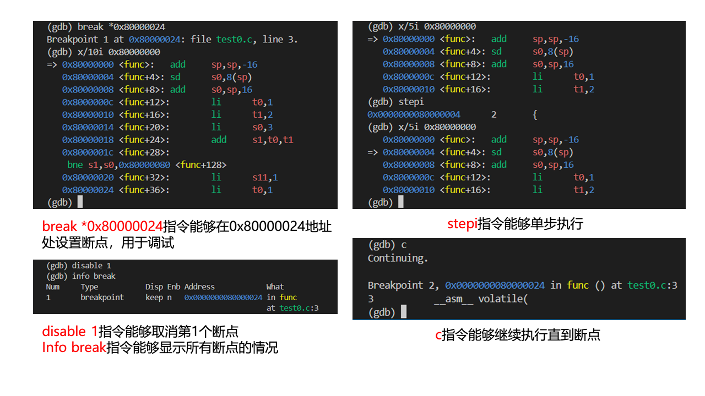

# 11. RISC-V CPU 调试

!!! tip "TLDR"

    1. 安装 [RISC-V 工具链](https://github.com/Siris-Li/RISC-V-GCC-TOOLCHAIN)。
    2. 安装 OpenOCD（选择在 [WSL](https://github.com/riscv-collab/riscv-openocd) 或 [Windows](https://github.com/openocd-org/openocd/releases/tag/v0.12.0) 安装）。
    3. 建立 OpenOCD 与 RISC-V CPU 的连接（WSL 需要额外[映射 USB 端口](https://github.com/dorssel/usbipd-win/releases)，Windows 需要额外[安装 USB 驱动](https://visualgdb.com/UsbDriverTool/)）。
    4. 使用 GDB 连接 OpenOCD。
    5. 调试程序。

    ```bash
    ## One shell to run OpenOCD
    sudo openocd -f <config file>   # step 3

    ## Another shell to run GDB
    riscv-none-elf-gdb              # step 4
    (gdb) target remote :3333
    ```

为了便于 CPU 的调试，ISA 会规定 Debug Module 的设计规范，以便于调试器（Debugger）与 CPU 之间的通信。
RISC-V 的 Debug Module 也是如此，详情可以查阅[官方设计说明文档](https://riscv.org/wp-content/uploads/2019/03/riscv-debug-release.pdf)。

??? info "调试模块的功能"
    1. 控制 CPU 的执行。
    2. 添加断点与监视点。
    3. 访问和修改寄存器与内存。
    4. 捕捉异常和中断。
    5. 提供调试通信接口。

<figure>
  
  <figcaption>RISC-V Debug System Overview</figcaption>
</figure>

与我们直接交互的软件为**调试器（Debugger）**（例如 GDB），它运行在调试主机上。
调试器与**调试转换器（Dubug Translator）**（例如 OpenOCD）通信，调试转换器与**调试传输硬件（Debug Transport Hardware）**（例如 USB-JTAG 适配器）通信。
调试传输硬件通过 JTAG 信号连接到测试平台（待测试的SoC）的调试传输模块（DTM）。DTM 使用调试模块接口（DMI）提供对调试模块（DM）的访问。

??? info "调试模块的工作流程（以设置断点为例）"

    1. **GDB 发送请求**：用户在 GDB 中设置一个断点，GDB 通过调试接口（如 JTAG）发送命令给调试模块，要求在某个地址设置断点。
    2. **调试模块处理请求**：调试模块接收 GDB 的请求后，在指定的地址处插入一个断点指令或设置一个硬件断点。这通常涉及替换程序中的一条指令，或者设置一个硬件寄存器以监控该地址。
    3. **CPU 触发断点**：当 CPU 执行到这个断点地址时，调试模块检测到断点并暂停 CPU 的执行。
    4. **通知 GDB**：调试模块将 CPU 的当前状态和触发的断点信息通过调试接口发送回 GDB，GDB 随后暂停程序，允许用户查看程序状态或执行其他调试操作。
    5. **用户调试**：用户在 GDB 中进行检查，修改寄存器或内存，或者单步执行程序。
    6. **恢复执行**：当用户在 GDB 中执行继续命令时，GDB 通知调试模块恢复 CPU 的正常执行。调试模块移除断点指令（如果是软件断点），并恢复原始指令或继续执行。

!!! tip "有关频率"
    JTAG 信号的传输频率决定了 GDB 向 Debug Module **发送命令**的速度，但这些**命令的执行**（如设置断点、单步执行）仍然是按 CPU 的主频进行的。

我们调试 RISC-V CPU 所需的工具如下：

- **Debugger**：RISC-V GDB
- **Debug Translator**：OpenOCD
- **Debug Transport Hardware**：USB-JTAG 适配器

## 11.1 安装 RISC-V Toolchain

!!! Warning
    需要在 WSL 环境中安装！
    WSL 的安装以及网络配置请参考 [13. WSL](./13_wsl.md)。

从 GitHub 上下载 RISC-V 工具链源码并进入该目录：

```bash
git clone https://github.com/Siris-Li/RISC-V-GCC-TOOLCHAIN
cd RISC-V-GCC-TOOLCHAIN
```

安装依赖：

```bash
sudo apt-get install autoconf automake autotools-dev curl git libmpc-dev libmpfr-dev libgmp-dev gawk build-essential bison flex texinfo gperf libtool bc zlib1g-dev
```

（可选）配置 CPU 核数以便多线程编译：

```bash
export NUM_JOBS=<num of processors>
```

??? tip "如何查看 CPU 核数"
    **WSL：**

    在 Terminal 中输入：
    ```bash
    nproc
    ```
    **Windows：**

    打开任务管理器，左栏中选择“性能”选项卡，右下角即可看到 CPU 核数（逻辑处理器）。

    <figure>
      
      <figcaption>Windows 查看逻辑处理器个数</figcaption>
    </figure>

    *逻辑处理器与内核的区别*：

    - **内核**：CPU 的物理核心数
    - **逻辑处理器**：CPU 的线程数，例如单个物理 CPU 内核支持双线程，则 2 个这样内核的逻辑处理器数为 4。

配置工具链安装路径：

```bash
export RISCV=<install path>
```

执行脚本安装工具链：

```bash
# Fetch the source code of the toolchain (assumes Internet access.)
sh get-toolchain.sh

# Build and install the toolchain (requires write+create permissions for $RISCV.)
sh build-toolchain.sh $RISCV
```

安装完成后，`$RISCV/bin` 目录下会有 RISC-V 工具链的可执行文件（例如 `riscv-none-elf-gcc`、`riscv-none-elf-gdb`）。

## 11.2 安装 OpenOCD


!!! Warning
    WSL 和 Windows 的安装方式有所不同，选择一个安装即可。


### WSL

!!! Warning
    WSL 可能自带 OpenOCD，以防万一，可以先尝试卸载。
    ```bash
    sudo apt-get remove openocd
    ```

GitHub 上下载 RISC-V OpenOCD 源码并进入该目录：

```bash
git clone https://github.com/riscv/riscv-openocd
cd riscv-openocd
```

安装依赖并执行安装：

```bash
sudo apt-get install libftdi-dev libusb-1.0-0 libusb-1.0-0-dev autoconf automake texinfo pkg-config
./bootstrap
./configure --enable-ftdi
make -j<number of your cpus>
sudo make install
```

??? tip "安装路径"
    OpenOCD 默认安装在 `/usr/local/bin` 目录下。
    可以使用 `--prefix=<path>` 参数指定安装路径。

如果你安装成功，执行如下指令，你会看到类似的输出：

```bash
$ which openocd
/usr/local/bin/openocd
$ openocd -v
Open On-Chip Debugger 0.12.0+dev-03598-g78a719fad (2024-01-20-05:43)
Licensed under GNU GPL v2
For bug reports, read
        http://openocd.org/doc/doxygen/bugs.html
```

### Windows

在官方 GitHub 上下载 OpenOCD 的 Windows 版本：[OpenOCD Windows](https://github.com/openocd-org/openocd/releases/tag/v0.12.0)。
解压后，在 `bin` 目录下找到 `openocd.exe`，在terminal中执行如下指令，你会看到类似的输出：

```powershell
$ .\openocd.exe -v
Open On-Chip Debugger 0.12.0 (2023-01-14-23:37)
Licensed under GNU GPL v2
For bug reports, read
        http://openocd.org/doc/doxygen/bugs.html
```

## 11.3 建立 OpenOCD 与 RISC-V CPU 的连接

物理上，OpenOCD 通过 **JTAG** 与 RISC-V CPU 连接。
OpenOCD 通过**配置文件**（`.cfg`）指定连接的硬件和软件参数。

我们所使用的 JTAG Adapter 中最关键的芯片称为 [FTDI](https://ftdichip.com/wp-content/uploads/2020/07/DS_FT232H.pdf) （Future Technology Devices International），它负责输出 JTAG 信号。

!!! Warning
    WSL 和 Windows 的连接方式有所不同，选择一个即可。

### WSL

*JTAG 驱动*

WSL 自带 FTDI 驱动，无需额外安装。

*USB 设备映射*

安装 [USB 映射驱动](https://github.com/dorssel/usbipd-win/releases)。
请注意安装**4.0.0及以上版本**。

安装之后，我们需要在管理员权限下的 PowerShell 中向该程序共享需要映射的 USB 设备（即 JTAG USB）：

```powershell
$ usbipd list
Connected:
BUSID  VID:PID    DEVICE                                                        STATE
1-4    048d:c101  USB 输入设备                                                  Not shared
2-4    0bda:4852  Realtek Bluetooth Adapter                                     Not shared
4-3    0403:6014  USB Serial Converter                                          Not shared

Persisted:
GUID                                  DEVICE

$ usbipd bind --busid 4-3
```

!!! note "注意"
    上述指令只需要在第一次安装时**执行一次**，之后无需再次执行。

??? tip "如何识别 JTAG Adapter"
    根据 VID:PID 即可识别。
    VID:PID 为 `0403:6014` 的设备即为 FTDI 芯片。

    **VID (Vendor ID, 厂商标识符)**：USB 组织分配给设备制造商的一个唯一标识符。

    **PID (Product ID, 产品标识符)**：制造商为设备分配的唯一标识符。

在 Powershell 中执行如下指令映射指定设备：

```powershell
$ usbipd attach --wsl --busid=<BUSID>
usbipd: info: Using WSL distribution 'Ubuntu' to attach; the device will be available in all WSL 2 distributions.
usbipd: info: Using IP address 172.26.80.1 to reach the host.
```

如果成功映射，我们可以在 WSL 端执行如下指令：

```bash
$ lsusb
Bus <bus id> Device <device id>: ID 0403:6014 Future Technology Devices International, Ltd FT232H Single HS USB-UART/FIFO IC
```

*配置文件编写*

配置文件一般是由我们所使用的 RISC-V CPU 的开源贡献者提供的，我们无需自己编写。
如下是一个示例配置文件：

```
adapter speed     1000

adapter driver ftdi
ftdi vid_pid 0x0403 0x6014

# Channel 1 is taken by Xilinx JTAG
ftdi channel 0

ftdi layout_init 0x0018 0x001b
ftdi layout_signal nTRST -ndata 0x0010

set _CHIPNAME riscv
jtag newtap $_CHIPNAME cpu -irlen 5

set _TARGETNAME $_CHIPNAME.cpu
target create $_TARGETNAME riscv -chain-position $_TARGETNAME -coreid 0

gdb_report_data_abort enable
gdb_report_register_access_error enable

riscv set_reset_timeout_sec 120
riscv set_command_timeout_sec 120
riscv set_mem_access progbuf sysbus abstract

init
halt
echo "Ready for Remote Connections"

```

!!! Bug "FIXME!!!"
    配置文件的详细解释。

*启动 OpenOCD*

在 WSL 端执行如下指令：

```bash
sudo openocd -f <config file>
```

如果你能成功启动 OpenOCD，终端中会输出如下信息：

```bash
Open On-Chip Debugger 0.12.0+dev-03598-g78a719fad (2024-01-20-05:43)
Licensed under GNU GPL v2
For bug reports, read
        http://openocd.org/doc/doxygen/bugs.html
Info : auto-selecting first available session transport "jtag". To override use 'transport select <transport>'.
Info : clock speed 100 kHz
Info : JTAG tap: riscv.cpu tap/device found: 0x00000001 (mfg: 0x000 (<invalid>), part: 0x0000, ver: 0x0)
Info : [riscv.cpu] datacount=2 progbufsize=8
Info : [riscv.cpu] Examined RISC-V core
Info : [riscv.cpu]  XLEN=64, misa=0x800000000014112d
[riscv.cpu] Target successfully examined.
Info : [riscv.cpu] Examination succeed
Info : starting gdb server for riscv.cpu on 3333
Info : Listening on port 3333 for gdb connections
Ready for Remote Connections
Info : Listening on port 6666 for tcl connections
Info : Listening on port 4444 for telnet connections
```

### Windows

*JTAG 驱动*

下载 [UsbDriverTool](https://visualgdb.com/UsbDriverTool/)。
打开 USB 驱动工具，在连接 JTAG 的 USB 接口上安装驱动 WinUSB。

<figure>
  
  <figcaption>USB Driver Tool 安装驱动</figcaption>
</figure>

成功安装后，设备管理器中可以看到如下设备：

<figure>
  
  <figcaption>JTAG USB 接口</figcaption>
</figure>


*配置文件编写*

Windows 端的配置文件需要额外指定 WSL 的 IP 地址，如下是一个示例配置文件：

```
bindto <WSL IP Address>

adapter speed     1000

adapter driver ftdi
ftdi vid_pid 0x0403 0x6014

# Channel 1 is taken by Xilinx JTAG
ftdi channel 0

ftdi layout_init 0x0018 0x001b
ftdi layout_signal nTRST -ndata 0x0010

set _CHIPNAME riscv
jtag newtap $_CHIPNAME cpu -irlen 5

set _TARGETNAME $_CHIPNAME.cpu
target create $_TARGETNAME riscv -chain-position $_TARGETNAME -coreid 0

gdb_report_data_abort enable
gdb_report_register_access_error enable

riscv set_reset_timeout_sec 120
riscv set_command_timeout_sec 120
riscv set_mem_access progbuf sysbus abstract

init
halt
echo "Ready for Remote Connections"

```

!!! info "获取 WSL IP 地址"
    在 Windows 端执行如下指令：
    ```powershell
    $ ipconfig
    ...
    以太网适配器 vEthernet (WSL (Hyper-V firewall)):

      连接特定的 DNS 后缀 . . . . . . . :
      本地链接 IPv6 地址. . . . . . . . : fe80::33eb:9f74:8b73:253f%49
      IPv4 地址 . . . . . . . . . . . . : 172.18.48.1
      子网掩码  . . . . . . . . . . . . : 255.255.240.0
      默认网关. . . . . . . . . . . . . :
    ```
    其中 IPv4 地址即为 WSL 的 IP 地址。

*启动 OpenOCD*

在 Windows 端执行如下指令：

```powershell
$ .\openocd.exe -f <config file>
```

如果你能成功启动 OpenOCD，终端中会输出如下信息：

```powershell
Open On-Chip Debugger 0.12.0 (2023-01-14-23:37)
Licensed under GNU GPL v2
For bug reports, read
        http://openocd.org/doc/doxygen/bugs.html
Info : auto-selecting first available session transport "jtag". To override use 'transport select <transport>'.
Info : clock speed 100 kHz
Info : JTAG tap: riscv.cpu tap/device found: 0x00000001 (mfg: 0x000 (<invalid>), part: 0x0000, ver: 0x0)
Info : [riscv.cpu] datacount=2 progbufsize=8
Info : [riscv.cpu] Examined RISC-V core
Info : [riscv.cpu]  XLEN=64, misa=0x800000000014112d
[riscv.cpu] Target successfully examined.
Info : [riscv.cpu] Examination succeed
Info : starting gdb server for riscv.cpu on 3333
Info : Listening on port 3333 for gdb connections
Ready for Remote Connections
Info : Listening on port 6666 for tcl connections
Info : Listening on port 4444 for telnet connections
```

## 11.4 使用 GDB 连接 OpenOCD

在 WSL 中执行如下指令：

```bash
$ <riscv-gcc-toolchain>/bin/riscv-none-elf-gdb
GNU gdb (GDB) 14.0.50.20230114-git
Copyright (C) 2022 Free Software Foundation, Inc.
License GPLv3+: GNU GPL version 3 or later <http://gnu.org/licenses/gpl.html>
This is free software: you are free to change and redistribute it.
There is NO WARRANTY, to the extent permitted by law.
Type "show copying" and "show warranty" for details.
This GDB was configured as "--host=x86_64-pc-linux-gnu --target=riscv-none-elf".
Type "show configuration" for configuration details.
For bug reporting instructions, please see:
<https://www.gnu.org/software/gdb/bugs/>.
Find the GDB manual and other documentation resources online at:
    <http://www.gnu.org/software/gdb/documentation/>.

For help, type "help".
Type "apropos word" to search for commands related to "word".
(gdb)
```

如果你的 OpenOCD 安装在 **WSL** 中，那么输入如下指令：

```bash
(gdb) target remote :3333
```

如果你的 OpenOCD 安装在 **Windows** 中，那么输入如下指令：

```bash
(gdb) target remote <WSL IP Address>:3333
```

## 11.5 调试程序

!!! tip "GDB 原理"
    有关 GDB 原理，请参考 [0. Linux 环境下的 EDA 工具使用：0.1 Linux 常用工具 GDB](./0_eda.md)。

接着，你就可以通过 GDB 调试程序和访问内存了。 一些常用的 GDB 指令如下：

- `x/10w 0x12345`：以字（4 字节）为单位，查看地址 0x12345 开始的 10 个字的内容。
- `x/i`：一种特殊的格式，用于将内存中的内容解释为机器指令。i 代表 “instruction”，即指令。例如，`x/i $pc` 这条命令会显示程序计数器（PC）当前指向的机器指令。
- `info registers`：列出所有寄存器的值。
- `p $t0`：查看某个（t0）寄存器的值。
- `set {int}0x54321 = 0xabcdf`：将地址 0x54321 处的 4 个字节的内容设置为 16 进制的 abcdf。
- `load a.o`：指令能将可执行文件 `a.o` 载入到主存当中，并且将 PC 的值复位。

*查看内存中的数据*

在 GDB 中，您可以使用 x 命令来查看内存中的数据。x 命令后面可以跟一个或多个参数，用于指定要查看的内存地址和格式。

以下是一些常见的使用方式：

- `x/10b 0x12345`：以字节为单位，查看地址 0x12345 开始的 10 个字节的内容。
- `x/10h 0x12345`：以半字（2 字节）为单位，查看地址 0x12345 开始的 10 个半字的内容。
- `x/10w 0x12345`：以字（4 字节）为单位，查看地址 0x12345 开始的 10 个字的内容。
- `x/10g 0x12345`：以巨字（8 字节）为单位，查看地址 0x12345 开始的 10 个巨字的内容。
- `x/i`：一种特殊的格式，用于将内存中的内容解释为机器指令。i 代表 "instruction"，即指令。例如，`x/i $pc` 这条命令会显示程序计数器（PC）当前指向的机器指令。

*查看寄存器中的数据*

- 使用 x 命令来查看寄存器中的内容。
例如，`x/1w $sp` 会显示栈指针（SP）当前指向的内存位置的内容。

- 使用 info registers 命令来查看所有寄存器的当前值。这个命令会显示所有通用寄存器和一些特殊寄存器（如程序计数器）的值。
- `info all-registers` 列出所有寄存器的值，包括通用寄存器（如x0到x31），特权模式寄存器（如mstatus、mcause等），以及其他CSR寄存器。

- 如果您只想查看某个特定寄存器的值，可以使用 print 命令。例如，`print $r0` 会显示 r0 寄存器的值（在 ARM 架构中）。

*写入内存或寄存器*

- 使用 set 命令来写入内存。例如，`set {int}0x12345 = 0` 会将地址 0x12345 处的 4 个字节的内容设置为 0，`set {int}0x54321 = 0xabcdf` 会将地址 0x54321 处的 4 个字节的内容设置为 16 进制的 abcdf。
- 使用 set 命令来写入寄存器。例如，`set $r0 = 0` 会将 r0 寄存器的值设置为 0。
- 使用 set 命令来写入特殊寄存器。例如，`set $pc = 0x12345` 会将程序计数器（PC）的值设置为 0x12345。/x 用于16进制格式，/d 用于十进制格式等

!!! Danger "危险"
    ROM（只读存储器）是一种只能读取不能写入的存储器。
    如果你试图在 GDB 中使用 set 命令写入 ROM 地址的数据，GDB 可能不会显示错误，但实际上数据并没有被写入 ROM。
    当你使用 x 命令读取该地址时，GDB 可能会显示你之前尝试写入的数据，但这只是 GDB 内部状态的一部分，不代表实际的硬件状态。
    在真实的硬件中，ROM 的内容在写入后就不能更改。

有关如何添加断点和执行指令，可以参考下图。

<figure>
  
  <figcaption>GDB 添加断点与执行指令</figcaption>
</figure>

!!! info "测试代码"
    有关如何编写测试代码，请参考 [12. C 代码编译](./12_assembly.md)。

!!! success ""
    特别感谢 Jiaqi Zhou，[Yiyang Sun](https://ieeexplore.ieee.org/author/37089999502)，Peiran Yan，Siyuan He 对本页内容的贡献和校对！