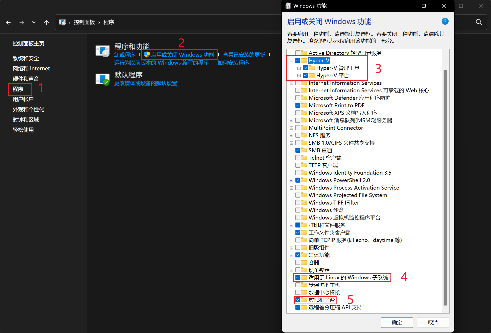
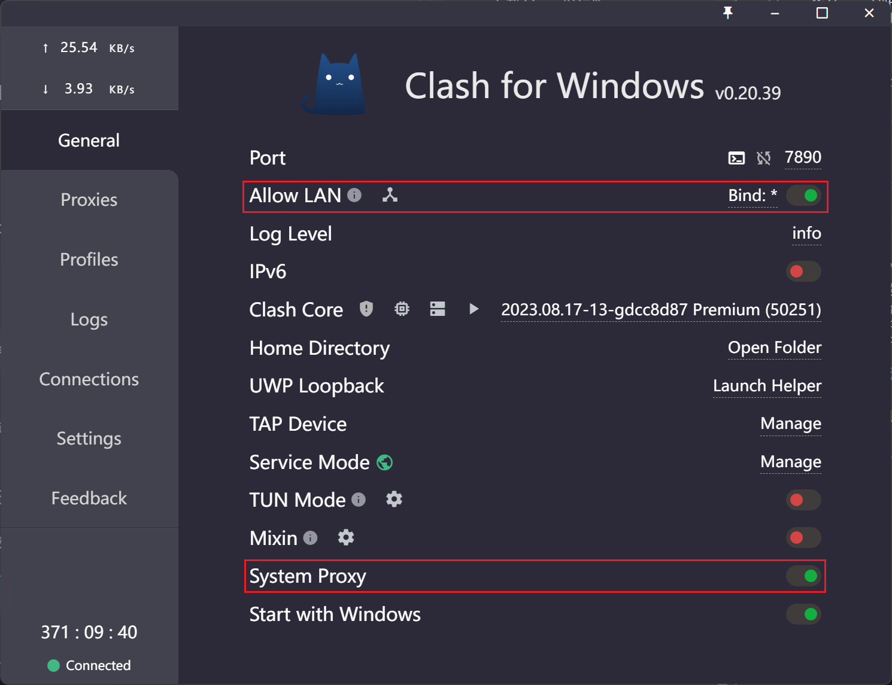

# 13. WSL

WSL（Windows Subsystem for Linux）是 Windows 提供的一个 Linux 子系统，它允许你在 Windows 上运行 Linux 程序。
简单来说，WSL 是微软提供的一个官方 **Linux 虚拟机**，具有更小的性能开销和接近原生 Linux 的体验。

## 13.1 安装 WSL

!!! Warning
    在安装 WSL 之前，请确保你没有安装过任何 Linux 发行版，否则可能会导致安装失败。
    可以使用如下命令查看已安装的 Linux 发行版：
    ```shell
    wsl --list
    ```
    如果已安装 Linux 发行版，可以使用如下命令卸载：
    ```shell
    wsl --unregister <DistributionName>
    ```

### 启动 Windows 虚拟化功能

打开控制面板，在程序中选择“启用或关闭 Windows 功能”，勾选“Hyper-V”、“虚拟机平台”和“适用于 Linux 的 Windows 子系统”，然后点击确定，你可能需要重启电脑来让配置生效。

<figure>
  
  <figcaption>启动 Windows 虚拟化功能</figcaption>
</figure>

### 下载 Linux 内核更新包

运行下载的[更新包](https://wslstorestorage.blob.core.windows.net/wslblob/wsl_update_x64.msi)。

### 将 WSL 2 设置为默认版本

打开 PowerShell，将 WSL 2 设置为默认版本。

```shell
wsl --set-default-version 2
```

### 下载 Linux 发行版

选择你所需要的 Ubuntu 版本[下载](https://learn.microsoft.com/zh-cn/windows/wsl/install-manual#downloading-distributions)，推荐安装 Ubuntu 20.04。

### 提取并安装 Linux 分发版

将下载的 `.appx` 文件移动至任意一个文件夹，然后使用 PowerShell 提取 `<DistributionName>.AppxBundle` 包的内容。

```powershell
Rename-Item .\<DistributionName>.AppxBundle .\<DistributionName>.zip
Expand-Archive .\<DistributionName>.zip .\<DistributionName>
```

进入 `<DistributionName>` 文件夹，找到 `*_x64.appx` 文件，使用 PowerShell 解压提取该文件。

```powershell
Rename-Item .\<Name>.appx .\<Name>.zip
Expand-Archive .\<Name>.zip .\<Name>
```

进入 `<Name>` 文件夹，双击运行 `ubuntu.exe` 安装 Linux 发行版。
输入用户名和密码之后，WSL 安装成功。
同时，我们可以发现，在 `ubuntu.exe` 的同级目录下，会生成一个 `.vhdx` 的文件，这个文件就是 WSL 的虚拟磁盘。

### （可选）安装第二个 Linux 发行版

从 [Ubuntu WSL 镜像](https://cloud-images.ubuntu.com/wsl/) 中下载适用于 WSL2 的 Ubuntu 镜像压缩包保存到本地。
一般选择 `ubuntu-*-server-cloudimg-amd64-wsl.rootfs.tar.gz`。

使用 PowerShell 导入镜像：

```powershell
wsl --import <Distribution Name> <Installation Folder> <Ubuntu WSL2 Image path>
```

将 `<Distribution Name>` 改成自己想要的名字，比如 `ubuntu-2204`，以后启动关闭会用到。
使用 Ubuntu 实例目标安装路径（文件夹）替换掉 `<Installation Folder>`。
最后用上一步下载的 Ubuntu 镜像存储位置替换掉 `<Ubuntu WSL2 Image path>`。

以上命令运行成功后可以使用 `wsl -l -v` 查看已安装的发行版。

使用 `wsl -d <Distribution Name>` 启动指定的发行版。

!!! tip "修改默认用户"
    参考该[博客](https://www.20001106.xyz/2024/05/11/WSL-%E5%AE%89%E8%A3%85%E5%A4%9A%E4%B8%AA%E5%AE%9E%E4%BE%8B%EF%BC%88%E5%AD%90%E7%B3%BB%E7%BB%9F%EF%BC%89/)中的第五步至第七步。

## 13.2 网络配置（代理）

为了让 WSL 能够访问外网，需要配置 WSL 的网络。

### Windows 代理配置

需要确保 Windows 处于代理的状态，并且允许局域网代理。

<figure>
  
  <figcaption>Clash 代理配置</figcaption>
</figure>

### WSL 代理配置

WSL 可以镜像 Windows 的代理设置，只需要编写 WSL 的全局配置文件即可。
在 Windows 的文件资源管理器中导航到 `%USERPROFILE%` 目录，新建一个 `.wslconfig` 文件，文件内容如下。

```shell
# Settings apply across all Linux distros running on WSL 2
# Can see memory in wsl2 with "free -m"
# Goes in windows home directory as .wslconfig
[wsl2]

# Limits VM memory to use no more than 16 GB, defaults to 50% of ram
memory=16GB

# Sets the VM to use 8 virtual processors
processors=8

# Sets the amount of swap storage space to 8GB, default is 25% of available RAM
swap=8GB

# network proxy settings
networkingMode=mirrored
dnsTunneling=true
firewall=true
autoProxy=true

# gradually reclaim WSL memory
[experimental]
autoMemoryReclaim=gradual
```

每次修改 `.wslconfig` 文件后，需要重启 WSL 才能生效。
在 PowerShell 中输入 `wsl --shutdown` 即可重启 WSL。

如果代理成功，那么在 WSL 中的命令行中输入 `curl ipinfo.io` 应该能够得到类似的输出：

```shell
{
  "ip": "152.70.124.200",
  "city": "San Jose",
  "region": "California",
  "country": "US",
  "loc": "37.2329,-121.7875",
  "org": "AS31898 Oracle Corporation",
  "postal": "95119",
  "timezone": "America/Los_Angeles",
  "readme": "https://ipinfo.io/missingauth"
^C
```

!!! Bug
    配置代理后，`curl ipinfo.io` 会出现无法终止的情况，可以使用 `Ctrl+C` 终止。

!!! tip "Tun 模式"
    如果你觉得上述配置太麻烦，可以尝试在你的代理软件中使用 Tun 模式，这样 WSL 就可以直接访问外网了。


## 13.3 Python 环境搭建

由于 Python 各个版本之间**并不兼容**，因此对于每一个 Python 项目，我们都需要创建一个**独立的虚拟环境**。
这样可以避免不同项目之间的**依赖冲突**。
我们推荐使用 **anaconda** 来管理 Python 环境。

### 安装 miniconda

根据[官方文档](https://docs.anaconda.com/miniconda/miniconda-install/)安装即可。

### 使用虚拟环境

```bash
conda env list # 查看已有环境·
conda create -n <env_name> python=3.8 # 创建一个新环境
conda activate <env_name> # 激活环境
conda list # 查看环境中已安装的包
which python # 查看当前环境的 Python 路径
```

!!! bug "Todo"
    More Details!!!