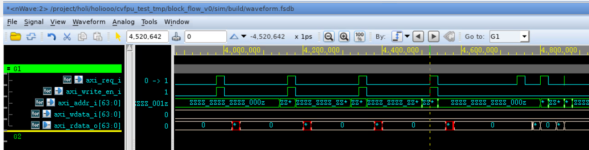
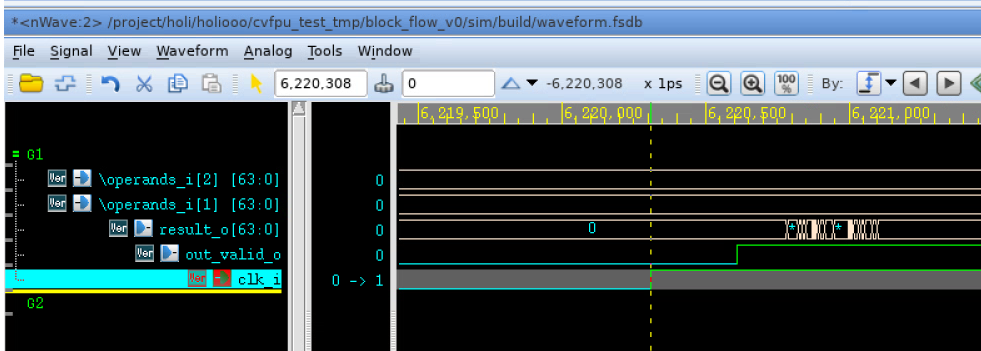
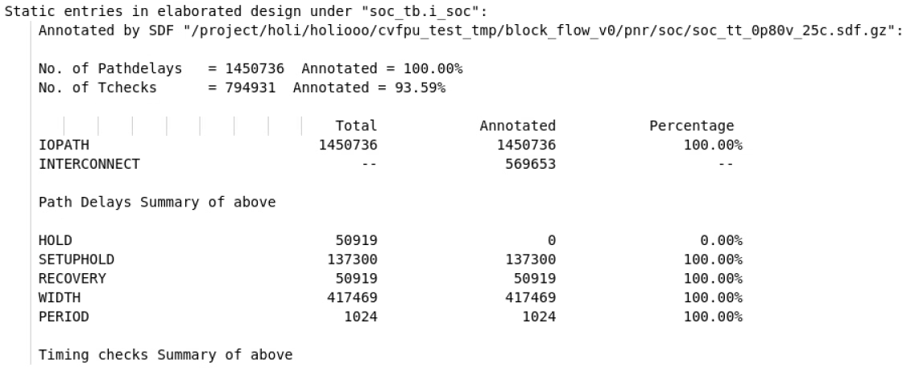
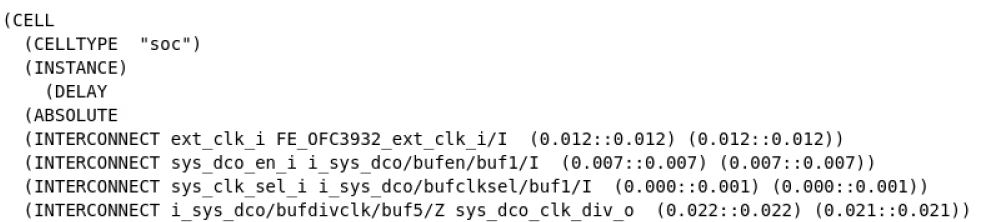

# 数字子系统仿真指南

完成RTL设计后，需要通过不同层级的仿真来验证设计的功能和时序是否符合预期。本文档将说明如何使用 Synopsys VCS 进行**行为级仿真（前仿）**以及**门级仿真（后仿）**，并使用 Verdi 查看波形。

仿真流程主要分为三个阶段：
1.  **行为级仿真 (RTL Simulation)**：验证设计的逻辑功能是否正确。
2.  **综合后仿真 (Post-synthesis Gate-level Simulation)**：验证综合后网表的功能是否与RTL一致，并进行初步的时序评估。
3.  **PNR后仿真 (Post-P&R Gate-level Simulation)**：在物理实现后，使用精确的布局布线延时信息进行最接近真实硬件行为的时序仿真。

!!! tip "TLDR"
    - **仿真脚本**: `sim/Makefile`
    - **前仿命令**: `make verdi TOP=<top_module_name>_tb SIM_MODE=RTL`
    - **后仿命令**: `make verdi TOP=<top_module_name>_tb SIM_MODE=SYN` 或 `SIM_MODE=PR`

## 1. 行为级仿真 (前仿)

行为级仿真在RTL设计完成后进行，用于验证设计的逻辑功能是否符合预期。

### 1.1 模板文件与环境

我们使用一个基于开源CPU和AXI总线的SoC作为模板示例。其文件夹结构如下：

```
$ROOT
├── src
│   ├── filelist.f                  # RTL文件列表
│   └── ...
├── sim
│   ├── soc_tb.sv                   # SoC测试平台
│   ├── init_mem.hex                # 内存初始化文件
│   └── Makefile                    # 仿真脚本
├── syn
│   └── ...                         # 综合输出目录
├── pnr
│   └── ...                         # PNR输出目录
├── Makefile                        # 顶层Makefile
└── ...
```

!!! question "集成到 SoC"
    在进行SoC级别的仿真前，请参考[系统集成](./system_integration.md)相关章节，将你的模块正确集成到SoC中。

### 1.2 添加源文件

- **RTL文件**: 在 `src/filelist.f` 中添加你的子模块源文件路径。
- **IP行为级模型**: 如果在子模块中例化了SRAM或其他IP，请在 `sim/Makefile` 中通过 `SRC_LIST += <your_ip_behavior_model>.v` 的形式添加其行为级模型。

### 1.3 编写 Testbench

通常情况下，SoC级别的 `sim/soc_tb.sv` 已经提供了时钟和复位信号。你只需关注内存初始化文件 `sim/init_mem.hex` 的内容，该文件包含了CPU需要执行的程序。如果你只想仿真子模块，可以在 testbench 中单独例化你的模块。

### 1.4 运行仿真

在 `sim/` 目录下运行如下指令，即可完成RTL编译、仿真并使用Verdi查看波形。

```bash
# 运行仿真并打开Verdi
make verdi TOP=<top_module_name>_tb SIM_MODE=RTL

# 只运行仿真，不打开Verdi
make vcs TOP=<top_module_name>_tb SIM_MODE=RTL
```
- `TOP`变量用于指定顶层testbench模块名。
- `SIM_MODE=RTL`指定进行行为级仿真。

仿真脚本会在 `sim/` 目录下创建 `build/` 文件夹，所有仿真生成的文件（如可执行文件 `simv`、日志 `compile.log`、波形文件 `waveform.fsdb` 等）都存放在此。

!!! danger "build 文件夹"
    请不要在 `build` 文件夹中保存任何重要文件！每一次重新编译都会**清空**该文件夹。

## 2. 门级仿真 (后仿)

逻辑综合或布局布线后会生成门级网表，我们需要对其进行仿真以验证其功能正确性，并结合SDF（Standard Delay Format）文件验证时序。

### 2.1 综合后仿真 (Post-synthesis)

此阶段使用综合后生成的网表和时序信息进行仿真。

在 `sim/` 目录下运行如下指令：
```bash
make verdi TOP=<top_module_name>_tb SIM_MODE=SYN
```
脚本会自动执行以下操作：
1.  在默认路径 `../syn/<top_module_name>/` 下查找综合后的网表文件 (`<top_module_name>_postsyn.v.gz`)。
2.  在相同路径下查找对应的SDF时序文件 (`<top_module_name>_<corner>.sdf.gz`)。
3.  包含标准单元库、SRAM等IP的Verilog模型。
4.  在仿真中进行SDF时序反标。

!!! warning "网表与SDF文件路径"
    脚本只会搜索默认位置的网表和SDF文件。如果你的文件位置或命名有变，请手动修改 `sim/Makefile`。
    
!!! info "综合后仿真的时序意义"
    综合后的网表没有时钟树等真实的布线信息，因此其时序仿真结果**参考意义有限**，主要用于验证网表的功能正确性。

### 2.2 PNR后仿真 (Post-P&R)

此阶段使用布局布线后生成的网表和更精确的时序信息进行仿真，其结果最接近芯片的实际表现。

在 `sim/` 目录下运行如下指令：
```bash
make verdi TOP=<top_module_name>_tb SIM_MODE=PR
```
脚本会自动在默认路径 `../pnr/<top_module_name>/` 下查找PNR后的网表 (`..._hier_postpnr.v.gz`) 和SDF文件，并进行时序反标。PNR后仿真是验证芯片时序收敛情况的重要手段。

### 2.3 后仿的关键注意事项

#### 2.3.1 内存加载时机

在后仿中，SoC的启动流程如下：上电复位后，BootROM中的固化程序会首先运行，它的一项任务是将主内存（Main Memory）的基地址处前256bit区域清零。之后，CPU才会从主内存取指执行程序。

因此，我们必须在**主内存基地址清零操作完成之后**、**CPU从主内存取第一条指令之前**，将我们的测试程序 (`init_mem.hex`) 加载到主内存中。这通过修改 `soc_tb.sv` 中的一个延迟语句实现。

```systemverilog
// sim/soc_tb.sv
...
`ifdef GATE_SIM // or POST_SIM
    ...
    rstn_i = 1'b1;
    #4515352 // Modify this! <--- 需要修改这里的延迟值
    // Load memory content after zeroing
    $sformat(hex_filename, "../build/init_mem_0.hex");
    i_soc.i_main_mem_wrapper.\gen_main_mem[0].main_mem_inst .loadmem(hex_filename);
    ...
`endif
...
```

**如何确定延迟值？**
1.  运行一次后仿，打开波形。
2.  观察AXI总线上对主内存的访问信号。你会看到在复位结束后，有连续的几次写操作（`axi_write_en_i` 为高），这就是CPU在根据BootROM里的指令清零内存。
3.  找到**最后一次写操作**完成的时刻，和**第一次读操作**发起的时刻。
4.  将`soc_tb.sv`中的延迟值修改为这两个时刻之间的一个时间点。

下图展示了这一过程：CPU发起了四次地址递增的写0操作，然后发起了第一次读操作。`loadmem` 的时机应该这两次操作之间的窗口期内（如位于4,600,000 ps）。

<figure>
  
  <figcaption>Memory Load Timing Window</figcaption>
</figure>


!!! success "内存文件自动切分"
    你只需要准备一个完整的 `sim/init_mem.hex` 文件。仿真脚本会自动调用 `split_mem.py` 脚本，根据主内存的bank数量和大小，将其切分成多个小文件供仿真时加载。

#### 2.3.2 查看后仿波形

成功的后仿（特别是带SDF反标的）波形具有以下特征，这些是时序信息被正确加载的体现：

1.  **非理想时钟边沿**：时钟信号的上升沿和下降沿不会出现在整数时间点（如10000ps, 20000ps），而是带有精确延时的小数时间点。
2.  **信号毛刺 (Glitch)**：由于不同路径的延时差异，组合逻辑的输出在稳定前可能会出现短暂的毛刺。

下图展示了一个典型的后仿波形，光标所在位置 `6,220,308 ps` 并非整数，`clk_i` 在此时刻发生跳变，且 `result_o` 在 `out_valid_o` 跳变为1后仍有密集毛刺，这表明SDF反标成功。

<figure>
  
  <figcaption>SDF Back-Annotated Waveform</figcaption>
</figure>


#### 2.3.3 检查SDF反标成功率

在运行完PNR后仿后，除了通过观察波形特征来判断外，我们还必须检查VCS生成的SDF反标报告，以量化地确认反标的成功率。

该报告位于 `sim/build/sdfAnnotateInfo` 文件中。打开该文件，你会看到类似下面的摘要信息：

<figure>
  
  <figcaption>SDF Annotation Summary Report</figcaption>
</figure>


报告中列出了路径延时（Pathdelays）和时序检查（Tchecks）的反标数量和百分比。我们需要重点关注 `Annotated` 的百分比。**通常情况下，整体反标率不应低于97%**。

反标率低的一个常见原因是SDF文件中的**时序角（corner）**与仿真脚本中请求的角不匹配。在我们的 `soc_tb.sv` 中，SDF反标任务写为：
```systemverilog
$sdf_annotate(sdf_path, i_soc, , "sdf.log", "MINIMUM");
```
最后一个参数 `"MINIMUM"` 就是指定VCS从SDF文件中读取哪个时序角的数据进行反标。该参数有四个主要的可选值：`MINIMUM`, `TYPICAL`, `MAXIMUM`, `TOOL_CONTROL`。如果不指定该参数，VCS**默认使用 `TYPICAL`**。

因此，我们需要确认innovus工具导出的SDF文件中包含了我们指定的角。SDF文件中的延时值通常以 `(MIN:TYP:MAX)` 的三元组格式表示。

<figure>
  
  <figcaption>SDF File Delay Format</figcaption>
</figure>

例如，上图中 `(INTERCONNECT ... (0.012::0.012))` 的格式代表 `(MIN::MAX)`，中间的 `TYPICAL` 值是缺失的。在这种情况下，如果仿真脚本中指定了 `TYPICAL` 或者使用默认设置，反标就会失败或反标率极低。因此，**必须确保 `soc_tb.sv` 中指定的角与SDF文件中实际存在的角一致**，才能获得有效的后仿结果。

### 2.4 Verdi 波形查看技巧

- **保存信号**: 对于需要频繁查看的信号，在Verdi中将它们添加到波形窗口后，可以使用快捷键 `Shift + s` 将当前信号列表保存为 `.rc` 文件。
- **恢复信号**: 再次打开Verdi时，点击波形区域，使用快捷键 `r` 可以快速加载上次保存的 `.rc` 文件，恢复信号列表。