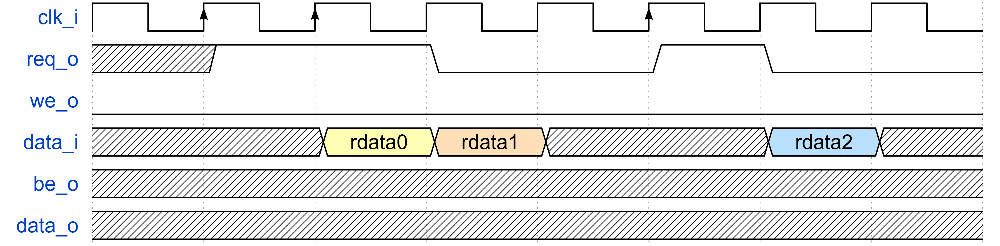
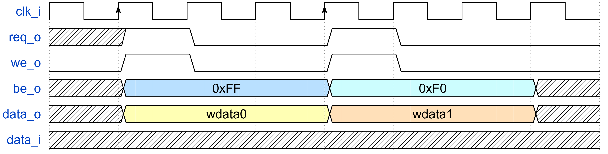

# 1. 数字系统 SoC 的集成和行为级仿真

完成 RTL 设计后需要进行**行为级仿真**，以验证设计的功能是否符合预期。
在将设计的模块集成到 SoC 之后，也需要对整个 SoC 进行仿真，通过 **CPU 指令**的方式验证整个 SoC 的功能。
我们使用 synopsys 的 **VCS** 工具进行仿真、**Verdi** 工具查看波形文件。

!!! tip "TLDR"
    1. 模板文件路径：`/work/home/limingxuan/common/SOC_CVA6/`
    2. 仿真脚本：`/work/home/limingxuan/common/SOC_CVA6/sim/Makefile`
    3. 仿真命令：`b make verdi`

## 1.1 模板文件

我们使用开源 CPU CVA6 以及 AXI 总线构成的 SoC 作为行为级仿真模板示例，其文件夹路径为：

```
/work/home/limingxuan/common/SOC_CVA6/
```

该文件夹的结构为：

```
SOC_CVA6
├── src
│   ├── cpu_cva6
│   │   ├── ...
│   │   └── cva6.sv                 # CVA6 Top Module
│   ├── soc_axi
│   │   ├── ...
│   │   ├── axi_bus
│   │   │   ├── ...
│   │   │   └── axi_dw_converter.sv # AXI Data Width Converter
│   │   ├── reg_bus
│   │   │   ├── ...
│   │   │   └── reg_intf.sv         # Reg Bus Interface
│   │   ├── bus_converter
│   │   │   ├── ...
│   │   │   ├── axi_to_reg.sv       # AXI to Reg Bus Converter
│   │   │   └── axi2mem.sv          # AXI to Memory Interface
│   │   └── bootrom.sv              # Boot ROM
│   ├── misc
│   │   ├── ...
│   │   └── tc_sram.sv              # Behavioral SRAM
│   ├── soc_pkg.sv                  # Address Mapping Definition
│   └── soc.sv                      # SoC Top Module
├── sim
│   ├── soc_tb.sv                   # SoC Testbench
│   ├── init_mem.hex                # Memory Initialization File
│   ├── filelist.f                  # Filelist for RTL
│   └── Makefile                    # Simulation Script
├── ...
...
```

## 1.2 子模块集成

### 总线接口

服务器上的 SoC 使用 AXI 总线，因此我们需要在子模块和 AXI 总线之间添加适配器（adapter），以实现子模块与 AXI 总线的通信。
有两种常见的适配方式：

- **AXI to Reg Bus Converter**：将 AXI 总线转换为寄存器总线，适用于控制、指令寄存器。
- **AXI to Memory Converter**：将 AXI 总线转换为内存接口，适用于子模块缓存（local buffer）。

*AXI to Reg Bus Converter*

该适配器适用于需要将**少量寄存器**映射到 AXI 总线的场景，例如控制寄存器、状态寄存器等。

你需要调用的模块为：

- `src/soc_axi/reg_bus/reg_intf.sv`：寄存器总线接口定义。
- `src/soc_axi/axi_bus/include/axi_intf.sv`：AXI 总线接口定义。
- `src/soc_axi/bus_converter/axi_to_reg.sv`：AXI 到寄存器总线转换器。

如果 AXI 总线的数据位宽和寄存器总线的数据位宽不一致，你还需要调用：

- `src/soc_axi/bus_converter/axi_dw_converter.sv`：AXI 数据位宽转换器。

接下来，你需要理解**寄存器总线接口**、阅读 `src/soc_axi/include/reg_*.svh` 并**自行编写**寄存器与寄存器总线之间的逻辑，如下是一个简单的例子。

```systemverilog
// soc.sv
module soc (
    ...
);
    ...

    REG_BUS #(
        .ADDR_WIDTH(64),
        .DATA_WIDTH(64)
    ) my_reg_bus;

    axi_to_reg_intf #(
        .ADDR_WIDTH(64),
        .DATA_WIDTH(64)
    ) my_axi_to_reg_intf (
        .clk_i,
        .rst_ni,
        .testmode_i,
        .in         (master[soc_pkg::REG]),
        .reg_out    (my_reg_bus)
    );

    // define reg type
    `REG_BUS_TYPEDEF_ALL(my_reg, logic[63:0], logic[63:0], logic[3:0])
    my_reg_req_t my_reg_req;
    my_reg_rsp_t my_reg_rsp;

    // assign REG_BUS.out to (req_t, rsp_t) pair
    `REG_BUS_ASSIGN_TO_REQ(my_reg_req, my_reg_bus)
    `REG_BUS_ASSIGN_FROM_RSP(my_reg_bus, my_reg_rsp)

    my_reg #(
        .reg_req_t   (my_reg_req_t),
        .reg_rsp_t   (my_reg_rsp_t)
    ) my_reg_inst (
        .clk_i,
        .rst_ni,
        .req_i    (my_reg_req),
        .rsp_o    (my_reg_rsp)
    );

    ...

endmodule
```

```systemverilog
module my_reg #(
    parameter type reg_req_t = logic,
    parameter type reg_rsp_t = logic
) (
    input  logic      clk_i,
    input  logic      rst_ni,
    input  reg_req_t  req_i,
    output reg_rsp_t  rsp_o
);

    logic [63:0] reg0_d, reg0_q, reg1_d, reg1_q;

    always_comb begin
        rsp_o.ready = 1'b1;
        rsp_o.data  = 64'b0;
        rsp_o.error = 1'b0;

        reg0_d      = reg0_q;
        reg1_d      = reg1_q;

        if (req_i.valid) begin
            unique case (req_i.addr)
                0:          reg0_d       = req_i.wdata;
                1:          reg1_d       = req_i.wdata;
                default:    rsp_o.error  = 1'b1;
            endcase
        end
        else begin
            unique case (req_i.addr)
                0:          rsp_o.rdata  = reg0_q;
                1:          rsp_o.rdata  = reg1_q;
                default:    rsp_o.error  = 1'b1;
            endcase
        end
    end

    always_ff @(posedge clk_i or negedge rst_ni) begin
        if (!rst_ni) begin
            reg0_q <= 64'b0;
            reg1_q <= 64'b0;
        end
        else begin
            reg0_q <= reg0_d;
            reg1_q <= reg1_d;
        end
    end

endmodule
```

*AXI to Memory Converter*

该适配器适用于需要将**大量数据**映射到 AXI 总线的场景，例如缓存、存储器等。

你需要调用的模块为：

- `src/soc_axi/axi_bus/include/axi_intf.sv`：AXI 总线接口定义。
- `src/soc_axi/bus_converter/axi2mem.sv`：AXI 到 memory 接口转换器。

`axi2mem` 模块 memory 接口的定义如下所示：

<div style="display: flex; justify-content: center;">

<table style="border-collapse: collapse;">
    <thead>
        <tr style="border: 2px solid black; background-color: #9a0000; color: white;">
            <th style="border: 1px solid black; padding: 8px; text-align: center; vertical-align: middle;">端口</th>
            <th style="border: 1px solid black; padding: 8px; text-align: center; vertical-align: middle;">方向</th>
            <th style="border: 1px solid black; padding: 8px; text-align: center; vertical-align: middle;">描述</th>
        </tr>
    </thead>
    <tbody>
        <tr style="border: 2px solid black; background-color: white; color: black;">
            <td style="border: 1px solid black; padding: 8px; text-align: center; vertical-align: middle;">req_o</td>
            <td style="border: 1px solid black; padding: 8px; text-align: center; vertical-align: middle;">output</td>
            <td style="border: 1px solid black; padding: 8px; text-align: center; vertical-align: middle;">读写使能</td>
        </tr>
        <tr style="border: 2px solid black; background-color: #eeeeee; color: black;">
            <td style="border: 1px solid black; padding: 8px; text-align: center; vertical-align: middle;">we_o</td>
            <td style="border: 1px solid black; padding: 8px; text-align: center; vertical-align: middle;">output</td>
            <td style="border: 1px solid black; padding: 8px; text-align: center; vertical-align: middle;">写使能</td>
        </tr>
        <tr style="border: 2px solid black; background-color: white; color: black;">
            <td style="border: 1px solid black; padding: 8px; text-align: center; vertical-align: middle;">addr_o[ADDR_WIDTH-1:0]</td>
            <td style="border: 1px solid black; padding: 8px; text-align: center; vertical-align: middle;">output</td>
            <td style="border: 1px solid black; padding: 8px; text-align: center; vertical-align: middle;">地址，行索引</td>
        </tr>
        <tr style="border: 2px solid black; background-color: #eeeeee; color: black;">
            <td style="border: 1px solid black; padding: 8px; text-align: center; vertical-align: middle;">be_o</td>
            <td style="border: 1px solid black; padding: 8px; text-align: center; vertical-align: middle;">output</td>
            <td style="border: 1px solid black; padding: 8px; text-align: center; vertical-align: middle;">写掩码，粒度为 1-byte</td>
        </tr>
        <tr style="border: 2px solid black; background-color: white; color: black;">
            <td style="border: 1px solid black; padding: 8px; text-align: center; vertical-align: middle;">user_o</td>
            <td style="border: 1px solid black; padding: 8px; text-align: center; vertical-align: middle;">output</td>
            <td style="border: 1px solid black; padding: 8px; text-align: center; vertical-align: middle;">用户自定义</td>
        </tr>
        <tr style="border: 2px solid black; background-color: #eeeeee; color: black;">
            <td style="border: 1px solid black; padding: 8px; text-align: center; vertical-align: middle;">data_o[DATA_WIDTH-1:0]</td>
            <td style="border: 1px solid black; padding: 8px; text-align: center; vertical-align: middle;">output</td>
            <td style="border: 1px solid black; padding: 8px; text-align: center; vertical-align: middle;">写数据</td>
        </tr>
        <tr style="border: 2px solid black; background-color: white; color: black;">
            <td style="border: 1px solid black; padding: 8px; text-align: center; vertical-align: middle;">user_i</td>
            <td style="border: 1px solid black; padding: 8px; text-align: center; vertical-align: middle;">input</td>
            <td style="border: 1px solid black; padding: 8px; text-align: center; vertical-align: middle;">用户自定义</td>
        </tr>
        <tr style="border: 2px solid black; background-color: #eeeeee; color: black;">
            <td style="border: 1px solid black; padding: 8px; text-align: center; vertical-align: middle;">data_i[DATA_WIDTH-1]</td>
            <td style="border: 1px solid black; padding: 8px; text-align: center; vertical-align: middle;">input</td>
            <td style="border: 1px solid black; padding: 8px; text-align: center; vertical-align: middle;">读数据</td>
        </tr>
    </tbody>
</table>

</div>

读操作的时序如下：

<figure>
  
  <figcaption>axi2mem Memory Port Read Timing Diagram</figcaption>
</figure>

写操作的时序如下：

<figure>
  
  <figcaption>axi2mem Memory Port Write Timing Diagram</figcaption>
</figure>

接下来，你需要根据上述端口和时序，**自行编写** 子模块 memory 接口，如下是一个简单的例子。

```systemverilog
// soc.sv
module soc (
    ...
);
    ...

    logic req;
    logic we;
    logic [63:0] addr;
    logic [7:0] be;
    logic [63:0] wdata;
    logic [63:0] rdata;

    axi2mem #(
        .ADDR_WIDTH(64),
        .DATA_WIDTH(64)
    ) my_axi2mem (
        .clk_i,
        .rst_ni,
        .slave      (master[soc_pkg::MEM]),
        .req_o      (req),
        .we_o       (we),
        .addr_o     (addr),
        .be_o       (be),
        .data_o     (wdata),
        .user_o     (),
        .user_i     (64'b0),
        .data_i     (rdata)
    );

    YOUR_SUBMODULE your_submodule (
        .clk_i,
        .rst_ni,
        .req_i      (req),
        .we_i       (we),
        .addr_i     (addr),
        .be_i       (be),
        .data_i     (wdata),
        .data_o     (rdata),
        ...        // other ports
    );

    ...

endmodule
```

### 地址映射

CPU 通过地址访问外围设备，因此需要给每个设备**分配地址空间**，这个过程称为**地址映射（memory mapping）**。

你需要修改的文件为：

- `src/soc_axi/soc_pkg.sv`：地址映射定义。
- `src/soc_axi/soc.sv`：SoC 顶层模块。

在 `soc_pkg.sv` 中，**仿照**其他模块的地址分配，你需要定义每个子模块的**名称、起始地址、空间大小**。

!!! warning "Peripheral 数量"
    在修改地址映射时，注意 `NB_PERIPHERAL` 变量的正确性，否则会导致总线接口数目异常。

在 `soc.sv` 中，你需要在 `addr_map` 变量中**添加**你的子模块地址映射，如下所示。

```systemverilog
assign addr_map = '{
    '{ idx: soc_pkg::Debug,    start_addr: soc_pkg::DebugBase,    end_addr: soc_pkg::DebugBase + soc_pkg::DebugLength },
    '{ idx: soc_pkg::ROM,      start_addr: soc_pkg::ROMBase,      end_addr: soc_pkg::ROMBase   + soc_pkg::ROMLength   },
    '{ idx: soc_pkg::CLINT,    start_addr: soc_pkg::CLINTBase,    end_addr: soc_pkg::CLINTBase + soc_pkg::CLINTLength },
    '{ idx: soc_pkg::PLIC,     start_addr: soc_pkg::PLICBase,     end_addr: soc_pkg::PLICBase  + soc_pkg::PLICLength  },
    '{ idx: soc_pkg::Timer,    start_addr: soc_pkg::TimerBase,    end_addr: soc_pkg::TimerBase + soc_pkg::TimerLength },
	'{ idx: soc_pkg::DCO,	   start_addr: soc_pkg::DCOBase, 	  end_addr: soc_pkg::DCOBase   + soc_pkg::DCOLength	  },
	'{ idx: soc_pkg::CIM,	   start_addr: soc_pkg::CIMBase, 	  end_addr: soc_pkg::CIMBase   + soc_pkg::CIMLength	  },
    '{ idx: soc_pkg::SRAM,     start_addr: soc_pkg::SRAMBase,     end_addr: soc_pkg::SRAMBase  + soc_pkg::SRAMLength  }
};
```

## 1.3 系统行为级仿真

### 添加源文件

在 `filelist.f` 中添加你的子模块源文件。

### 初始化内存

CPU 的程序存储在主存中，因此需要在仿真开始前**初始化内存**。
我们提供如下的 Python 脚本，用于将反汇编文件 `*.d` 转化为内存初始化文件 `init_mem.hex`。

```python
import re
import os

class Dis2Hex:
    def __init__(self, input_file, output_file):
        self.input_file = input_file
        self.output_file = output_file

    def dis2hex(self):
        input_file = self.input_file
        output_file = "temp.hex"
        pattern = re.compile(r"\s+([0-9a-fA-F]+):\s+([0-9a-fA-F]+)\s+.*$")
        with open(input_file, "r") as fin, open(output_file, "w") as fout:
            for line in fin:
                match = pattern.match(line)
                if match:
                    address = match.group(1)
                    data = match.group(2)
                    fout.write(data + "\n")

    def reshape(self):
        input_file = "temp.hex"
        output_file = "init_mem.hex"
        with open(input_file, "r") as fin, open(output_file, "w") as fout:
            lines = fin.readlines()
            for i in range(0, len(lines), 2):
                hex_num1 = lines[i].strip()
                hex_num2 = lines[i+1].strip() if i+1 < len(lines) else "00000000"
                merged_line = hex_num2 + hex_num1
                fout.write(merged_line + "\n")


input_file  = "test_code.d"
output_file = "init_mem.hex"

print("Reading disassembly file:", input_file)
print("Output hex file         :", output_file)

dis2hex = Dis2Hex(input_file, output_file)
dis2hex.dis2hex()
dis2hex.reshape()

os.remove("temp.hex")
```

!!! question "编译"
    由于服务器上没有 RISC-V 编译链，因此你需要在**本地**编译代码。
    如果你不会编译，可以参考 [12. C 代码编译](./12_assembly.md)。

### 编写 testbench

在 `soc_tb.sv` 中编写 testbench。
对于系统仿真来说，testbench 只需要提供时钟、复位信号以及**仿真时长**。
如果你只想仿真子模块，在 testbench 中实例化需要仿真的子模块即可。


### 运行仿真

在 `Makefile` 所在的目录下运行如下指令即可完成编译以及查看生成波形文件。

```bash
b make verdi
```

如果你不想使用 Verdi 查看波形文件，可以使用如下指令。

```bash
b make compile
```

运行仿真时，脚本会创建 `build/` 文件夹，所有运行仿真生成的文件都会放在这个文件夹中。

在 Verdi 中，点击波形区域，使用快捷键 `r` 可以**恢复波形**，加载 `sim/soc_signal.rc` 文件可以查看 CPU 指令波形。

!!! tip "Top Module 选择"
    该模板也可用于其他模块仿真，只需要将你的模块和 testbench 都加入 `filelist.f`，执行 `make TOP=<your testbench top module name>` 即可。

!!! tip "Makefile 内容"
    非常建议你**阅读** Makefile 脚本，以便更好地理解仿真的过程。