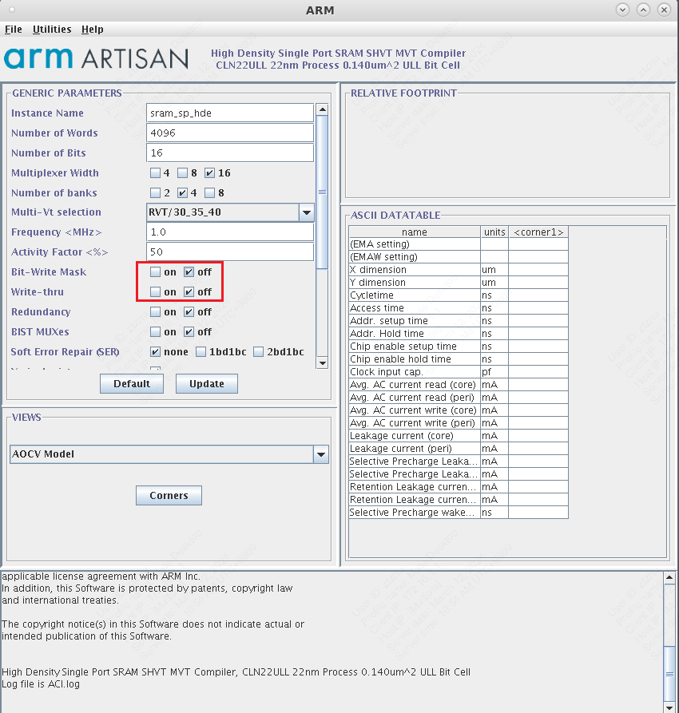
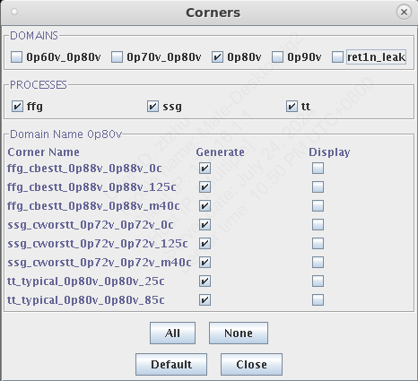
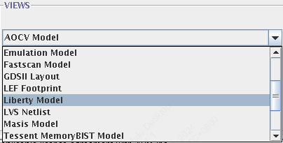
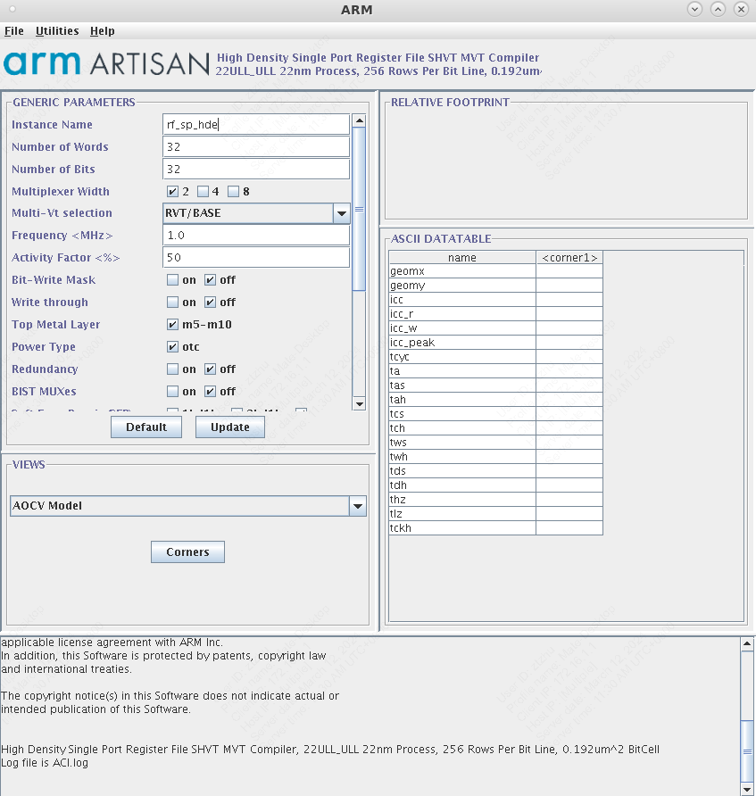

# 数字子系统的逻辑综合

在数字芯片的设计流程中，后端设计是在逻辑综合的基础上进行的。在我们的模板文件中，逻辑综合和后端设计均会调用部分相同的脚本文件，因此先对数字子系统的逻辑综合流程做简要说明。

[逻辑综合](https://en.wikipedia.org/wiki/Logic_synthesis) (Logic Synthesis) 主要目的是将RTL级的设计进行优化，并映射到特定的工艺库中。此外，逻辑综合器也可以进行静态时序分析。

电路的逻辑综合一般由三个步骤组成：**转化、逻辑优化、映射**。在综合过程中，优化进程尝试完成标准单元的组合，使得组合能够最好满足设计的功能、时序和面积的要求。综合为约束驱动，给定的约束是优化目标。

## 逻辑综合流程介绍

> **注意**：数字子系统的逻辑综合使用`/work/home/ztzhu/tapeout_templates/submodule/`文件夹。

> 若未做额外说明，**我们默认处于该文件夹路径下**。

逻辑综合的输入主要用到模板文件中的以下内容：

* `./rtl/`：包含数字子系统的RTL代码；
* `./scripts/`：存放：Genus工具调用的脚本；
* `Makefile`：用于启动Cadence Genus工具；
* `./sram/`（_可选_）：数字子系统中例化的SRAM高速缓存或寄存器堆的专用IP核；
* `./asic_ip/`（_可选_）：数字子系统中例化的其他IP核（例如CiM Macro），或者更低层级的数字子系统。

该工程模板中使用`b make genus_syn`即可进行自动化的逻辑综合，观察`Makefile`文件的结构，首先执行Cadence Genus工具初始化并启动，读入`./scripts/genus_synthesis.tcl`脚本文件，并将逻辑综合的日志输出到`./logs/genus_synthesis.log`中。

查看`./scripts/genus_synthesis.tcl`可以观察逻辑综合的大致流程。首先读入`./scripts/core_config.tcl`, `./scripts/tech.tcl`, `./scripts/init_syn.tcl`等工艺库、工程定义等相关文件，之后读入MMMC配置文件，进行逻辑综合，迭代优化时序，最终将逻辑综合的报告写入`./reports/genus/`文件夹下。

以下按照顺序介绍进行逻辑综合的准备工作的几个关键步骤。

### SRAM/Register File替换 _（可选）_

> 该步骤虽然不是必须的流程，但却可能造成较大的困惑，因此在此先进行说明。

主要用到的是ARM提供的`SRAM Compiler`和`Register File Compiler`（[工具路径](./1_index.md#arm-sram-compiler)）

在`./sram/`路径下新建文件夹，并在该文件夹下启动`SRAM Compiler`/`Register File Compiler`，用于存放生成的文件。


*ARM SRAM Compiler*

<!-- <figure>
  
  <figcaption>ARM SRAM Compiler</figcaption>
</figure> -->

> **注意**：`./sram/`路径下新建的**文件夹名称**与SRAM模块的`Instance Name`需保持一致！

#### SRAM Compiler使用说明

`SRAM Compiler`部分常用的设置选项如下：

* `Number of Words`: SRAM的深度。
* `Number of Bits`: SRAM的宽度。
* `Multiplexer Width`, `Number of Banks`会影响最终SRAM的形状，也受到数据深度与宽度的影响。在某些深度与宽度的组合下，可能无法找到一个合法的MUX与Bank数组合，在这种情况下可以考虑将SRAM的宽度减半，分开生成。
* `Frequency`保持与整体设计的时钟周期一致。
* `Bit Write Mask`允许你在写入数据时选择性地更新特定的位，而不用更新整个字（Word）。为此我们需要生成单独的掩码（Mask）信号来控制在每次写入SRAM时想要对哪几位进行操作。

在我们自己的数字子系统中使用SRAM Compiler生成的单元，需要生成相应的文件。

在`Corners`菜单中勾选所有的DOMAINS与PROCESSES，以保证生成综合报告的完整性。

<figure>
  
  <figcaption>SRAM Compiler Available Corners </figcaption>
</figure>

在`views`部分依次选择`LEF Footprint`, `LVS Netlist`, `Liberty Model`, `Verilog Model`，点击`Generate`生成相应的文件，这些文件的用途大致如下：

* `Liberty Model`：用于逻辑综合与后端设计的时序分析与优化，包含SRAM的时序信息；
* `Verilog Model`：SRAM的Verilog代码，用于功能仿真；
* `LEF Footprint`：包含SRAM的版图信息（使用的金属层、IO位置等），为逻辑综合和后端设计提供SRAM的面积信息；
* `LVS Netlist`：用于后端设计的LVS检查，在逻辑综合阶段暂不需要。

<figure>
  
  <figcaption>SRAM Compiler Available Views </figcaption>
</figure>

#### Register File Compiler使用说明

与`SRAM Compiler`流程类似。

<figure>
  
  <figcaption>ARM Register File Compiler</figcaption>
</figure>

### 添加RTL代码

将数字子系统的RTL代码放在`./rtl/`目录下，并在`./rtl/srcs.tcl`中添加所有RTL代码的文件名称，`srcs.tcl`的示例如下。

```tcl
set_db hdl_unconnected_value 0
set_db hdl_max_loop_limit 8192
set_db hdl_trak_filename_row_col true
set_db init_hdl_search_path /work/home/ztzhu/tapeout_templates/submodule/rtl/

read_hdl -language sv { \
    /work/home/ztzhu/tapeout_templates/submodule/rtl/MUDULE_1.sv \
    /work/home/ztzhu/tapeout_templates/submodule/rtl/MUDULE_2.sv \
}
```

### 修改`core_config.tcl`

在`./scripts/core_config.tcl`中定义了数字系统的**顶层模块名称**、**时钟信号名称**等信息，需要根据情况进行调整。

```tcl
set rm_core_top MY_TOP_MODULE

set rm_clock_pin clk
```

### 修改`design_inputs_macro.tcl`

#### 选择逻辑综合和后端设计使用的**标准单元库**

```tcl
set std_lib MY_STD_LIB
```

标准单元库可以选择：

* `tcbn22ullbwp30p140lvt`
* `tcbn22ullbwp30p140hvt`
* `tcbn22ullbwp7t30p140lvt`
* `tcbn22ullbwp7t30p140hvt`
* `tcbn22ullbwp7t40p140ehvt`
* `tcbn22ullbwp7t40p140hvt`

选择后端设计中使用的，和选择不使用的标准单元，此处`cell_ext`需和上述的`std_lib`保持一直。

```tcl
set cell_ext [list BWP7T30P140HVT]
```

#### 添加SRAM IP

添加SRAM Compiler，Register File Compiler生成的IP文件。

```tcl
set sram_insts [concat $MACROname_rams \
    "sram_128x128" \
    "other_sram_name" \
]
```

此处，`sram_128x128`，`other_sram_name`与SRAM Compiler或Register File Compiler中`Instance Name`选项保持一致，也和`./sram/`路径下的文件夹名称保持一致。

#### 添加子模块所需的`LEF`文件

子模块（例如CIM，eDRAM等定制单元）作为完整的一个设计，在这一层级通过`LIB`, `LEF`等文件体现时序、面积、布局等信息。
`LEF`文件包括一个模块各层金属的尺寸，以及各个管脚的大小和位置。

```tcl
set rm_lef_reflib [concat ${rm_lef_tech_file} ${rm_foundry_lib_dirs}/Back_End/lef/${std_lib}_110a/lef/${std_lib}.lef \
    /path/to/foundry/lef/files \ # not shown for simplicity
    /work/home/tapeout_templates/submodule/macro/lef_files/CIM.lef \ # add lef file here
]
```

#### 设置时钟周期

设置逻辑综合、布局布线的时钟周期，时钟周期越小，则对时序要求越高，所需要的优化迭代时间越长。时钟周期单位为纳秒。

```tcl
set rm_clock_period 5
```

### 修改`tech.tcl`

#### 添加子模块所需的`LIB`文件

`LIB`文件包含时序信息，对于Genus逻辑综合是必须的。对于不同的Corner都会有相应的`LIB`文件。
对于`ff_0p88v_m40c`，添加`LIB`文件的示例如下：

```tcl
# FFGNP 0p88V m40C Libs
set ff_0p88v_m40c_libs [list ${base_lib_dir}/${base_ff_0p88v_m40c_lib}.lib ${io_lib}ffg08ppv2p75vm40c.lib \ 
    /work/home/tapeout_templates/submodule/macro/lib_files/CIM_ff_0p88v_m40c.lib \
]

foreach sram ${sram_insts} { \
    set ff_0p88v_m40c_libs [concat $ff_0p88v_m40c_libs \
    ${rm_sram_lib_dirs}/${sram}/${ram_ff_0p88v_m40c_opcond}.lib ] \ 
}
```

可以看到，除了标准单元和子模块的`LIB`文件，此处也自动添加了Compiler生成的SRAM IP的`LIB`文件。

一个较完整的例子如下：
TODO： ADD FIG

### 启动Genus综合

```bash
b make genus_syn
```

### 查看综合报告

* `./data/MY_TOP_MODULE-genus.v`：生成的门级网表，用于后续Innovus的后端设计
* `./logs/genus_synthesis.log`：逻辑综合的日志文件，可以查找`Error`, `Warning`等关键词检查流程是否有误。
* `./reports/genus/func_tt_0p90v_025c_timing.rpt`：tt Corner的时序报告，可以查找`VIOLATED`关键词检查时序是否满足，类似地，可以查看ss Corner，ff Corner的时序报告。
* `./reports/genus/area.rpt`：该模块的面积报告

### 门级仿真

> Under development!