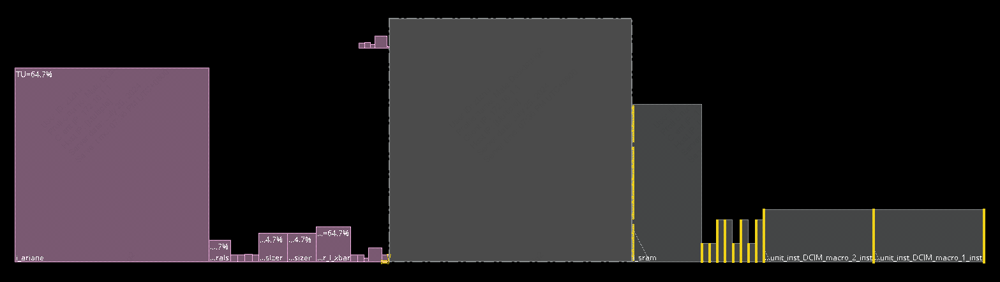
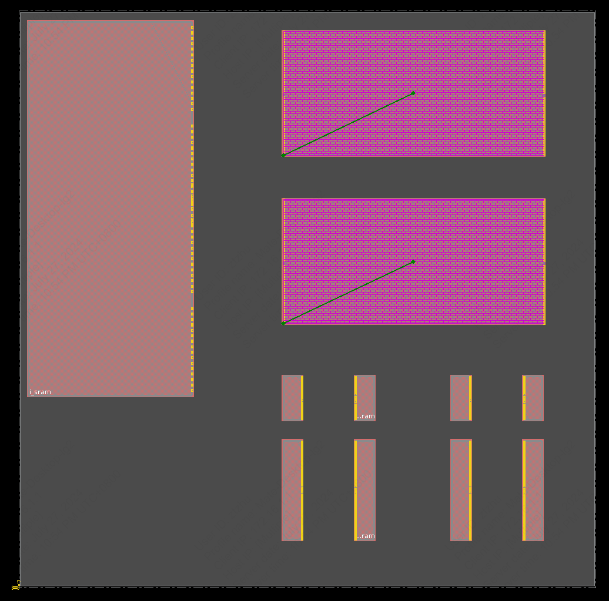
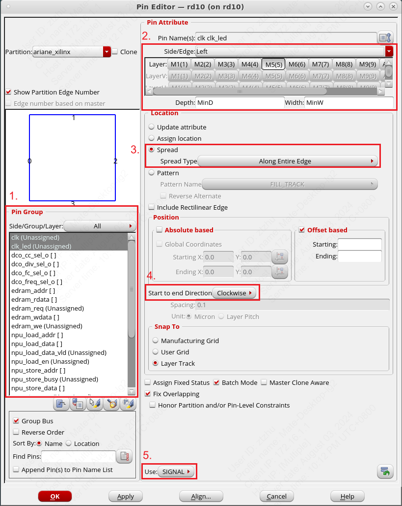
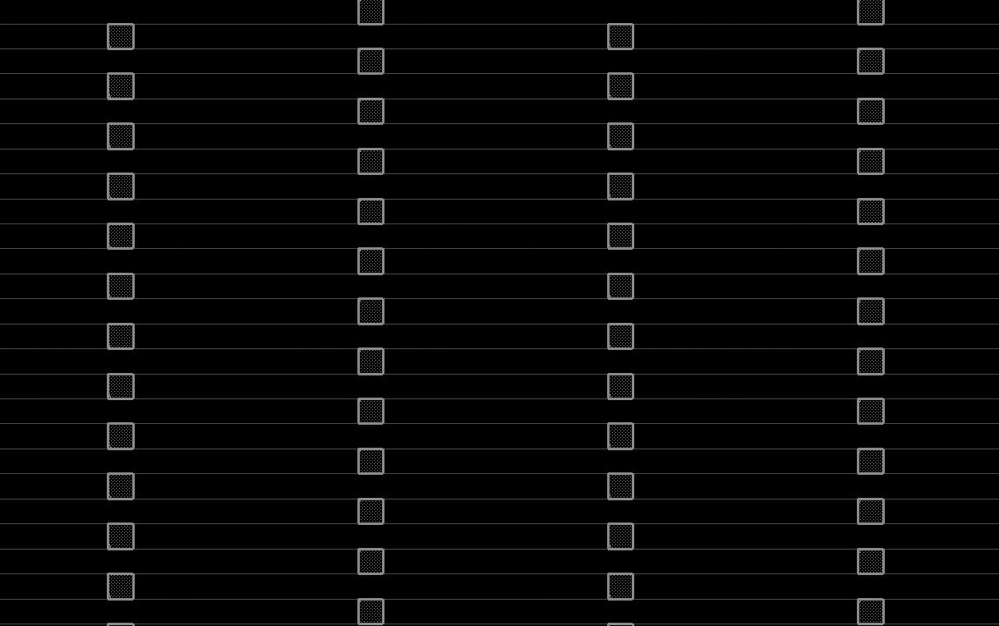

# 4. 数字子系统的物理设计

!!! Warning
    Under Development!

在完成数字模块的逻辑综合之后得到门级网表。以此为基础使用 Cadence Innovus 进行数字子系统的物理设计（后端设计）。

在后端设计中，许多脚本参数设置，例如电源网络的 Width，Spacing，以及 Macro 的摆放位置需要根据版图大小和布局布线情况来设定，需要多次的迭代优化。

## 物理设计模板文件说明

!!! Warning "注意"
    同[数字子系统的逻辑综合](./2_submodule_synthesis.md)一样，在后端设计中，我们继续使用 `/work/home/ztzhu/tapeout_templates/submodule_tapeout/` 文件夹。

物理设计的输入主要用到模板文件中的以下内容：

* `./work/`：Innovus 的启动目录，存放 Innovus 的执行日志（包括用户输入命令和工具输出信息）；
* `./data/`：存放 Genus 逻辑综合得到的门级网表文件，也用于存放Innovus的输出文件（包括 `GDSII`, `LEF`, `SDF`等） ；
* `./scripts/`：存放 Innovus 工具调用的脚本；
* `./my_scripts/`：存放用户进行物理设计各个阶段的命令脚本；
* `./sram/`（_可选_）：数字子系统中例化的SRAM高速缓存或寄存器堆的专用 IP 核（`CDL`, `LEF`, `LIB`, `Verilog`等）；
* `./asic_ip/`（_可选_）：数字子系统中例化的其他 IP 核（例如 CIM Macro），或者更低层级的数字子系统的相关文件（`CDL`, `LEF`, `LIB`, `Verilog`等）。

## 物理设计流程介绍

该模板文件以 **CVA6 RISC-V CPU** 的后端设计流程作为示例。
在这个 CPU 中，包括用 SRAM Compiler 生成的主存储器、I-Cache 和 D-Cache，以及定制设计的 CIM 模块。
我们将按照顺序逐一介绍数字子模块物理设计的流程。

### 4.1 修改 `init_invs.tcl`

在使用 Innovus 进行后端设计前，需要对工程脚本进行一些修改。

!!! tip "注意"
    在此，我们默认已经在逻辑综合之前修改了 `./scripts/core_config.tcl`, `./scripts/design_inputs_macro.tcl`, `./scripts/tech.tcl`中部分内容（包括时钟周期、标准工艺库，添加了 SRAM IP 文件、ASIC IP 文件等）。

在 `./scripts/init_invs.tcl` 中，定义了数字子系统的 Power 与 Ground 信号名称。

``` tcl
set init_gnd_net {VSS}
set init_pwr_net {VDD VDD_CIM}
```

在这个设计中，定制设计的CIM有单独的供电 `VDD_CIM` ，其余 SRAM IP 和标准单元共用 `VDD`。

### 4.2 启动 Cadence Innovus

打开一个终端，进入到 `./work/` 文件夹中，并启动 Innovus。Innovus 的日志文件位于 `innovus.log`，用户通过终端命令行和 GUI 界面操作所对应执行的命令记录在 `innovus.cmd`，均在 `./work/` 文件夹中。

``` shell
cd /work/home/ztzhu/tapeout_templates/submodule_tapeout/work/
rm -rf innovus.cmd* innovus.log* # clear previous innovus output files
b innovus
```

!!! tip "提示"
    每次启动 Innovus 都会生成一个新的日志文件，所以我们建议经常清理，以免文件过多影响后续操作。

在终端中启动 Innovus 之后，可以在该终端中输入 `TCL` 脚本命令，也可以在弹出的 Innovus GUI 进行操作。
在我们的模板文件中主要依赖于命令行脚本进行后端设计。使用 Innovus 进行后端设计所用到的 `TCL` 命令均存放在 `./my_scripts/` 中。
使用文本编辑器打开 `./my_scripts/innovus_script.tcl` （推荐使用 GVIM ）。

``` shell
gvim /work/home/ztzhu/tapeout_templates/submodule_tapeout/my_scripts/innovus_script.tcl
```

观察 `./my_scripts/innovus_script.tcl`，可以看到 Innovus 的物理设计流程大致分成了几个阶段，在 Innovus 终端中读入相应的命令即可（例如 `source ../my_scripts/add_pin.tcl`）。
接下来按照顺序对物理设计流程中的关键命令进行说明。

### 4.3 执行 `invs_init_setting.tcl`

观察 `./my_scripts/invs_init_setting.tcl` 中包含的命令。

#### 导入设计到 Innovus

``` tcl
setMultiCpuUsage -localCpu 32
```

`setMultiCpuUsage` 设置 Innovus 可以使用的 CPU 核数。对于现有的服务器，选择 `-localCpu 32` 可以保证 Innovus 稳定运行。

!!! Warning "警告"
    若使用 `setMultiCpuUsage -localCpu max -cpuAutoAdjust true -verbose`，可能会导致 Innovus 闪退。

```tcl
source -verbose ../scripts/core_config.tcl
source -verbose ../scripts/tech.tcl
source -verbose ../scripts/init_invs.tcl
source -verbose ../scripts/invs_setting.tcl
```

将此前修改过的4个脚本文件读入到 Innovus 中，包括数字子系统顶层模块名称（`$rm_core_top`）、各个文件的路径、标准工艺库的选择等内容。
此时我们经过逻辑综合的数字子系统已经导入到 Innovus 中。

``` tcl
saveDesign ${rm_core_top}.design_planning_init.enc
```

`saveDesign` 命令在后端设计流程的各个步骤均会出现，用于保存目前后端设计的进度。

!!! bug "FIXME!!!"
    在后续的物理设计流程中，若出现错误或者需要回溯到之前的设计进度，可以使用`restoreDesign`命令载入之前保存的设计。
    例如(bug here)：`restoreDesign ${rm_core_top}.design_planning_init.enc`


#### 设置后端不使用的标准单元

```tcl

set_dont_use [get_lib_cellls FA1D0BWP7T30P140HVT]
set_dont_use [get_lib_cellls FA1D1BWP7T30P140HVT]
set_dont_use [get_lib_cellls FA1D2BWP7T30P140HVT]
```

上述三个全加器标准单元在后续 DRC 检查时会报错，因此在布局布线之前设置不使用这些标准单元。

#### 设置版图大小

``` tcl
set cell_height 0.7
set macro_halo_spc [expr 1 * $cell_height]
set macro_halo_spc_2 [expr 2 * $cell_height]
set macro_halo_spc_4 [expr 4 * $cell_height]
set die_sizex 1200
set die_sizey 1200
```

以上命令设置了几个物理设计中所使用到的变量大小：

* `$cell_height` 是标准单元的高度；
* `$macro_halo_spc` 用于设置 Macro Routing Blockage 的宽度。
* `$die_sizex`, `$die_sizey` 分别是该模块版图的物理宽度与物理高度。

``` tcl
floorPlan -d $die_sizex $die_sizey 3.5 3.5 3.5 3.5
uiSetTool select
getIoFlowFlag
```

一个初始的版图类似下图所示。

<figure>
  
  <figcaption>Example Floorplan</figcaption>
</figure>

中央带有横条纹的区域称为 Core box，用于摆放 Macro 和标准单元。所有标准单元的宽度各不相同，但是高度均为 `$cell_height`（对于22nm工艺，即为0.7um）。
在 Core box 的四周到 I/O 管脚之间通常留有一定的间距，用于摆放 Core Ring 和 I/O 管脚布线。

`floorPlan` 命令用于指定版图的大小。

`floorPlan -d {<W H Left Bottom Right Top>}`，使用该命令设置版图大小总共需要6个参数，分别代表：

* 完整版图 (Die box) 的宽度
* 完整版图 的高度
* Core box（用于摆放标准单元的版图部分）到I/O左侧边界的距离
* Core box 到 I/O 底部边界的距离
* Core box 到 I/O 右侧边界的距离
* Core box 到 I/O 上方边界的距离

因此，设置上述版图大小的命令为：`floorPlan -d 100 100 10 10 10 10`。

### 4.4 执行 `place_macro.tcl`

查看 `./my_scripts/place_macro.tcl` 中包含的命令。

#### 查看 Macro

在 Innovus GUI 界面右上角选择 `Floorplan View`，如下图所示。

<figure>
  
  <figcaption>Check Floorplan View</figcaption>
</figure>

可以看到初始的版图如下所示。

<figure>
  
  <figcaption>Initial Floorplan View</figcaption>
</figure>

除去 Die Box 之外，左侧的粉色正方形为 RTL 代码中的模块层次，正方形的大小表示了模块的预估面积。

??? Tip "TU & EU"
    正方形左上角 `TU=64.7%` 为 Target Utilization (TU)，是指所有的标准单元和 Macro 的面积除以版图的面积。
    此外，还有 Effective Utilization (EU)，在整体版图面积的基础上除掉了 Placement，Routing Blockage 等其他阻碍物的面积，Innovus 默认不会显示EU。

Die Box 右侧为该数字模块中例化的 IP 核，在该案例中包括若干 SRAM 和2个 CIM Macro。

!!! Tip "检查 Macro"
    在这个时候可以检查此前例化的 SRAM 等 IP 是否有成功导入 Innovus。
    有时因为文件路径设置错误，会出现没有成功例化的情况。

#### 给 Macro 设置别名

``` tcl
# Main Memory
set mainmem i_sram

# D$
set dcache_tag0 i_ariane/i_cva6/gen_cache_wt.i_cache_subsystem/i_wt_dcache_i_wt_dcache_mem/gen_tag_srams[0].i_tag_sram
set dcache_tag1 i_ariane/i_cva6/gen_cache_wt.i_cache_subsystem/i_wt_dcache_i_wt_dcache_mem/gen_tag_srams[1].i_tag_sram
set dcache_data0 i_ariane/i_cva6/gen_cache_wt.i_cache_subsystem/i_wt_dcache_i_wt_dcache_mem/gen_data_banks[0].i_data_sram
set dcache_data1 i_ariane/i_cva6/gen_cache_wt.i_cache_subsystem/i_wt_dcache_i_wt_dcache_mem/gen_data_banks[1].i_data_sram

# I$
set icache_tag0 i_ariane/i_cva6/gen_cache_wt.i_cache_subsystem/i_cva6_icache/gen_sram[0].i_tag_sram
set icache_tag1 i_ariane/i_cva6/gen_cache_wt.i_cache_subsystem/i_cva6_icache/gen_sram[1].i_tag_sram
set icache_data0 i_ariane/i_cva6/gen_cache_wt.i_cache_subsystem/i_cva6_icache/gen_sram[0].i_data_sram
set icache_data1 i_ariane/i_cva6/gen_cache_wt.i_cache_subsystem/i_cva6_icache/gen_sram[1].i_data_sram

# CIM Macro
set dcim_macro0 i_ariane/gen_coprocessor.i_in_pipeline_coprocessor/u_CIM_block_wrapper/CIM_core_unit_inst_DCIM_macro_1_inst
set dcim_macro1 i_ariane/gen_coprocessor.i_in_pipeline_coprocessor/u_CIM_block_wrapper/CIM_core_unit_inst_DCIM_macro_2_inst
```

鼠标左键单击某一个 Macro，并按 `Q` 查看该 Macro 的属性，可以看到该 Macro 的名称，通常由 RTL 模块名称和 IP 名称组合而成。
如上所示，Macro 的名称通常比较长，为了后续脚本简洁，给 Macro 设置简短的别名。（例如 `icache_data0`, `icache_data1`）

#### 摆放 Macro

``` tcl
# place Main Memory
placeInstance [set mainmem] 20 400 R180

# place CIM Macro
set basex 500
set basey 500
set deltay 350
placeInstance [set dcim_macro0] $basex [expr $basey + $deltay * 0]
placeInstance [set dcim_macro1] $basex [expr $basey + $deltay * 1]

# place I$
set basex 500
set basey 350
set deltax 150
set deltay 250
placeInstance [set icache_tag0] [expr $basex + $deltax * 0] [expr $basey - $deltay * 0] R180
placeInstance [set icache_tag1] [expr $basex + $deltax * 1] [expr $basey - $deltay * 0]
placeInstance [set icache_data0] [expr $basex + $deltax * 0] [expr $basey - $deltay * 1] R180
placeInstance [set icache_data1] [expr $basex + $deltax * 1] [expr $basey - $deltay * 1]

# place D$
# not shown for simplicity
```

命令格式为：`placeInstance instance_name <location> <orientation>`

* `instance_name`：想要摆放的 Macro 名称。可以使用别名，例如：`[set icache_data0]`或`$icache_data0`；
* `<location>`：有 X 和 Y 两个数值，分别表示 Macro 左下角的宽度方向和高度方向的坐标；
* `<orientation>`：设置 Macro 的摆放方向，可以选择 `R0`, `R90`, `R180`, `R270`, `MX`, `MX90`, `MY`, `MY90`。

!!! Warning "Macro 摆放方向"
    由于 22nm 工艺中栅极必须纵向摆放，所以在摆放 Macro 时只能选择 `R0`, `R180`,`MX`, `MY`。

#### 设置 Macro 摆放状态

``` tcl
setInstancePlacementStatus -allHardMacros -status -fixed
```

该命令作用于所有此前摆放的 Macro，将其状态设置为 `fixed`，即使用自动化工具（例如自动化布局、布线）不会改变其位置。

摆放好所有 Macro 之后的版图如下所示。

<figure>
  
  <figcaption>Layout after placing macros</figcaption>
</figure>

### 4.5 执行 `add_halo_routeblk.tcl`

#### 在 Macro 四周添加 Halo

``` tcl
addHaloToBlock [list $macro_halo_spc_4 $macro_halo_spc_4 $macro_halo_spc_4 $macro_halo_spc_4] -allMacro
```

该命令作用于所有此前摆放的 Macro，在每个 Macro 的周围添加一圈 Halo。Halo 的区域内**不能摆放标准单元**，用于减少 Macro 周围的走线密度。
观察该命令可知，Halo 的宽度为 `$macro_halo_spc_4`。

!!! Tip "删除 Halo"
    使用 `deleteHaloFromBlock` 命令可以删除此前摆放的 Halo。

#### 添加 Routing Blockage

``` tcl
createRouteBlk -cover -inst $dcim_macro0 -exceptpgnet -layer {M1 M2 M3 M4 M5 M6 M7} -spacing $macro_halo_spc
createRouteBlk -cover -inst $dcim_macro1 -exceptpgnet -layer {M1 M2 M3 M4 M5 M6 M7} -spacing $macro_halo_spc
```

`createRouteBlk` 用于在指定的单元周围设置一圈 Routing Blockage，即**禁止走线的区域**。在此简要说明该命令几个选项的作用：

* `-cover`：指定将在实例顶部创建与指定块实例（`-inst <name>`）大小相同的 Routing Blockage 区域；
* `-exceptpgnet`：指定该 Routing Blockage 不适用于 Power/Ground 的走线，仅适用于信号走线；
* `-layer {M1 M2 M3 M4 M5 M6 M7}`：指定该 Routing Blockage 适用于哪几层的金属走线；
* `-spacing $macro_halo_spc`：指定该 Routing Blockage 与周围最近的金属走线之间的最小间距，单位为微米。

在此步骤之后的版图如下所示。可以看到所有的 Macro 均有一层浅棕色，为一圈 Halo，而两个 CIM Macro 周围还有 Routing Blockage。

!!! Bug "FIXME!!!"
    Route Blockage vs. OBS

<figure>
  
  <figcaption>Layout after adding halo and routing blockage</figcaption>
</figure>


### 4.6 执行 `global_net_connect.tcl`

``` tcl
# connect std cells
globalNetConnect VDD -type pgpin -pin VDD -all -override
globalNetConnect VSS -type pgpin -pin VSS -all -override

# connect dcim_macro0
globalNetConnect VDD_CIM -type pgpin -pin VDDC -sinst $dcim_macro0 -override
globalNetConnect VSS -type pgpin -pin VSSC -sinst $dcim_macro0 -override

# connect $mainmem
globalNetConnect VDD -type pgpin -pin VDDCE -sinst $mainmem -override
globalNetConnect VDD -type pgpin -pin VDDPE -sinst $mainmem -override
globalNetConnect VSS -type pgpin -pin VSSE -sinst $mainmem -override

# connect $dcim_macro1, $dcache_tag0, $dcache_tag1, $dcache_data0,
# $dcache_data1, $icache_tag0, $icache_tag1, $icache_data0, $icache_data1
# not shown for simplicity

# connect tiehi and tielo
globalNetConnect VDD -type tiehi
globalNetConnect VSS -type tielo
```

`globalNetConnect` 连接 Power/Ground 管脚和 1'b1/1'b0 管脚到指定的一个全局网络。

该命令的基本格式为 `globalNetConnect <globalNetName> {-type pgpin -pin <pinNamePattern> | -type tiehi -pin <pinNamePattern> | -type tielo -pin <pinNamePattern>} {-sinst <instName> | -all} [-override]`

* `<globalNetNet>` ：指定要连接到指定管脚的全局网络的名称，也就是我们在 `init_invs.tcl` 定义的 `init_pwr_net` 和 `init_gnd_net`；
* `-type` 我们会用到三个选项：`pgpin`, `tiehi`, `tielo`，分别是 Power/Ground，1'b1，1'b0；
* `-pin <pinNamePattern>` 是指定的 Instance 中 Power/Ground 管脚的名称。对于标准工艺库中的元件，是 `VDD` 和 `VSS`；对于 CIM Macro，是 `VDDC` 和 `VSSC`；对于 SRAM/Register File Compiler 生成的 IP，是 `VDDCE`, `VDDPE` 和 `VSSE`；
* `-sinst <instName>` 选择指定的 Instance 名称，与 `placeMacro` 命令中的用法类似；
* `-all` 指该命令适用于该设计中所有的 Instance，包括标准单元和 Macro。
* `-override` 指定使用 `globalNetConnect` 命令的值覆盖先前设置的全局网络连接值。

!!! tip "关于 `VDDPE` 和 `VDDCE`"
    SRAM/Register File Compiler 生成的 IP 有两个 Power 管脚，其具体区别详见 Compiler 的用户手册。
    在我们的设计和常规的学术流片中，可以都连接到全局的 Power 网络上，不做特别区分。

### 4.7 执行 `add_pin.tcl`

对于大规模的数字模块，信号 I/O 管脚数量可能是成百上千的，手动编写命令设置每个管脚的摆放过于繁琐。
因此，我们使用 Innovus GUI 界面添加数字子系统的信号 I/O 管脚。

* 在上方工具栏选择 `Edit -> Pin Editor` 添加相应的管脚（详见下方 Pin Editor GUI 界面）。
* 打开 `./work/innovus.cmd` （Innovus 生成的日志文件）查看我们在 GUI 界面每一步操作所对应的命令，其中就有我们所需要的 `editPin` 命令。

<figure>
  
  <figcaption>Innovus Pin Editor</figcaption>
</figure>

因为模板文件中设计较为复杂，在此以 **2-bit 加法器的 I/O 管脚**为例，脚本命令如下。

``` tcl
setPinAssignMode -pinEditInBatch true

editPin -pinWidth 0.05 -pinDepth 0.34 -fixOverlap 1 -unit MICRON -spreadDirection clockwise -side Left -layer 5 -spreadType center -spacing 20.0 -pin {clk rst_n}

editPin -pinWidth 0.05 -pinDepth 0.34 -fixOverlap 1 -unit MICRON -spreadDirection clockwise -side Top -layer 6 -spreadType range -start 10.0 100.0 -end 90.0 100.0 -pin {cin {a_in[0]} {a_in[1]} {b_in[0]} {b_in[1]}}

editPin -pinWidth 0.05 -pinDepth 0.34 -fixOverlap 1 -unit MICRON -spreadDirection clockwise -side Bottom -layer 6 -spreadType range -start 10.0 0.0 -end 90.0 0.0 -pin {cout {c_out[0]} {c_out[1]}}

setPinAssignMode -pinEditInBatch false
```

可以设想，如果管脚数量增加，例如有2组 64-bit 输入信号和1组 64-bit 输出信号，手写脚本命令过于繁琐，这也是我们在此使用 GUI 界面的原因。

!!! tip "关于 I/O 管脚金属层数的选择"
    在常规的数字芯片中，奇数层的为横向金属，偶数层为纵向金属（常称为**奇横偶纵**），因此对于 Top/Bottom 可以选择 M4/M6 等金属，Left/Right 选择 M3/M5 等金属。在上面 2-bit 加法器的例子中，每一边（Left/Top/Bottom）仅仅用到了一层金属，在管脚较多的情况下，可以将不同的管脚分配到同一条边的不同金属层。

!!! tip "关于数字子系统的 Power/Ground 的 I/O 管脚"
    数字子系统的 Power/Ground 管脚和不同信号线的管脚有所区别，往往是以顶层1-2层的电源网格的形式给数字子系统进行供电，因此在布局布线完成之后使用 `createPGPin` 命令生成，在[后续步骤](./4_submodule_implementation.md#416-执行-add_pg_pintcl)做进一步介绍。

在执行 `add_pin.tcl` 之后，版图如下图所示，每一个黄色的三角形代表一个 I/O 管脚，Zoom In 可以进一步看到每个管脚的名称，所在的金属层，以及管脚的具体形状 (Pin Width, Pin Depth)。

<figure>
  
  <figcaption>Layout after adding I/O pins</figcaption>
</figure>

### 4.8 执行 `add_endcap_welltap.tcl`

??? tip "关于 Endcap Cells， Welltap Cells 和 Decap Cells"
    **Endcap Cells**（端帽单元）：在数字集成电路设计中，特别是使用自动布局布线工具时，标准单元在整个硅片区域内按行排列。这些标准单元是设计的构建模块，包含逻辑门、触发器和其他数字电路。当最后一个标准单元不能完美地适应行的长度时，Endcap Cells用于**填充标准单元行末端的剩余空间**。它们提供电气和物理隔离，将硅片的活动区域与周围结构（如划片线或芯片边缘）隔离开来。

    **Welltap Cells**（接地单元）：为制造晶体管的衬底或阱提供低阻抗的接地或 VDD 路径，用于在 CMOS 工艺中确保适当的电气连接并防止闩锁效应。Welltap Cells 在整个 IC 布局中被有规律地摆放，特别是在电源和接地连接附近。它们的放置通常由代工厂指定的设计规则所规定。

    **Decap Cells**（去耦电容单元）：主要用于减少电源噪声和稳定电源电压。它们通过提供额外的电容来平滑电源电压的波动，防止电源噪声影响电路性能。Decap Cells 常放置在电源网络中，以确保电源电压的稳定性，特别是在高频信号和快速开关电路中。Decap Cells 主要关注电源电压的稳定性，而 Welltap Cells 主要关注衬底电位的稳定性。

#### 添加 Endcap Cells

``` tcl
set itx $rm_tap_cell_distance
set tap_rule [expr $itx / 4]

setPlaceMode -place_detail_legalization_inst_gap 2
setPlaceMode -place_detail_use_no_diffusion_one_site_filler false
setEndCapMode -rightEdge $endcap_left -leftEdge $endcap_right
addEndCap
```

在此对上述几条命令做些说明：

* `setPlaceMode`：控制 Innovus 布局工具如何排放标准单元，可以使用 `getPlaceMode` 命令查看目前 `setPlaceMode` 所设置的摆放规则。该命令会影响后续 `place_design` 和 `refinePlace` 的命令；
* `setPlaceMode -place_detail_legalization_inst_gap <numberOfSites>`：指定两个 Instance 之间所允许的最小横向间距（是 Site 的整数倍）；
* `setPlaceMode -place_detail_use_no_diffusion_one_site_filler {true|false}`：指定所有的 one-site Fillers 没有 Diffusion OBS。
* `setEndCapMode`：用于控制 `addEndCap` 命令的行为；
* `setEndCapMode -leftEdge <cellName> -rightEdge <cellName>`
* `addEndCap`：用于添加 Endcap Cells 填充标准单元行末端的剩余空间。

添加 Endcap Cells 之后的部分版图如下所示，可以看见在 Macro 的左侧和右侧，以及 Core box 的左侧和右侧（也就是标准单元行末端的剩余空间添加了 Endcap Cells。

<figure>
  
  <figcaption>Partial layout after adding endcap cells</figcaption>
</figure>

#### 添加 Welltap Cells

``` tcl
addWellTap -cell ${rm_tap_cell} -cellInterval $rm_tap_cell_distance -checkerboard
```

* `-cell <cellName>` 指定所使用的 Welltap Cells 的名称；
* `-cellInterval <microns>`：指定每一行之间相邻两个 Welltap Cells 的最大距离；
* `-checkerBoard`：指定 Welltap Cells 以棋盘格模式放置，即每隔一行偏移半个间距。

添加 Welltap Cells 之后的部分版图如下所示。可以看到在每个标准单元行，以棋盘形式交替摆放着 Welltap Cells。

<figure>
  
  <figcaption>Partial layout after adding welltap cells</figcaption>
</figure>

#### 添加 Decap Cells

``` tcl
addWellTap -prefix -DECAP -cellInterval $rm_tap_cell_distance -cell ${dcap_cell} -skipRow 1
```

* `addWellTap -prefix DECAP -cellInterval $rm_tap_cell_distance -cell ${dcap_cell} -skipRow 1`：用于放置 Decap Cells。

放置 Decap Cells 之后的部分版图如下所示，可以看见每隔一行（因为指定了 `-skipRow 1`）在 Welltap Cells 旁边添加了 Decap Cells。

<figure>
  
  <figcaption>Partial layout after adding decap cells</figcaption>
</figure>

### 4.9 执行 `add_power_ring.tcl`

#### 添加 Core Rings

``` tcl
setAddRingMode -avoid_short true
addRing -nets [list VDD VDD_CIM VSS] \
        -type core_rings \
        -follow core \
        -layer {top M5 bottom M5 left M6 right M6} \
        -width 0.35 \
        -spacing 0.35 \
        -center 0
```

* `-type core_rings`：指定生成的 Power rings 为 Core rings，即在 Core box 和 I/O boundary 之间的空隙生成我们指定的 Power rings（回忆在[设置版图大小](./4_submodule_implementation.md#43-执行-invs_init_settingtcl)的时候，我们指定了在 Core box 与 I/O boundary 之间设置 3.5um 的空隙）；
* `-nets [list VDD VDD_CIM VSS]`：指定生成的 Power rings 的信号名称。对于 Core rings，该数字子模块中所有的 P/G 信号至少需要生成一条 Core ring；
* `-follow core`：指定生成的 Core rings 以 Core boundary 为基准，如果设置 `-follow io`，则以 I/O boundary 为基准；
* `-layer {top M5 bottom M5 left M6 right M6}`：字面意思，设置 Core rings 在每个方向所在的金属层；
* `-width 0.35`：设置每一条 Core ring 的宽度；
* `-spacing 0.35`：设置两条相邻 Core rings 之间的间距；
* `-center 0`：设置 Core rings 是否在 I/O boundary 和 Core boundary 之间的中央，在此我们不指定 Core rings 位于间隙中央，因此需要通过 `-offset` 手动设置偏移量，在没有指定 `offset <value>` 的情况下，Innovus 工具会自动设置偏移量。

添加 Core rings 之后的部分版图如下所示.

<figure>
  
  <figcaption>Partial layout after adding core rings</figcaption>
</figure>

#### 添加 Block Rings

``` tcl
# add power ring around SRAM IP
selectInst $mainmem
addRing -nets {VDD VSS} \
        -type block_rings \
        -around selected \
        -layer {top M5 bottom M5 left M6 right M6} \
        -width {top 0.14 bottom 0.14 left 0.7 right 0.7} \
        -spacing {top 0.14 bottom 0.14 left 0.35 right 0.35} \
        -offset {top 0.04 bottom 0.04 left 0.7 right 0.7} \
        -center 0 \
        -threshold 0 \
        -jog_distance 0 \
        -snap_wire_center_to_grid None

selectInst $dcache_tag0
addRing -nets {VDD VSS} \
        -type block_rings \
        -around selected \
        -layer {top M5 bottom M5 left M6 right M6} \
        -width {top 0.14 bottom 0.14 left 0.7 right 0.7} \
        -spacing {top 0.14 bottom 0.14 left 0.35 right 0.35} \
        -offset {top 0.04 bottom 0.04 left 0.7 right 0.7} \
        -center 0 \
        -threshold 0 \
        -jog_distance 0 \
        -snap_wire_center_to_grid None

selectInst $dcache_tag1
addRing -nets {VDD VSS} \
        -type block_rings \
        -around selected \
        -layer {top M5 bottom M5 left M6 right M6} \
        -width {top 0.14 bottom 0.14 left 0.7 right 0.7} \
        -spacing {top 0.14 bottom 0.14 left 0.35 right 0.35} \
        -offset {top 0.04 bottom 0.04 left 0.7 right 0.7} \
        -center 0 \
        -threshold 0 \
        -jog_distance 0 \
        -snap_wire_center_to_grid None

# add block rings around $dcache_data0, $dcache_data1, $icache_tag0, $icache_tag1, $icache_data0 and $icache_data1
# not shown for simplicity
```

* `-type block_rings`：指定我们在指定的 Macro 周围生成 Block rings，而非 Core rings；
* `-nets {VDD VSS}`：指定生成的 Block rings 包括 VDD 和 VSS，而不包括 VDD_CIM，因为 **Block rings 用于给 Macro 周围的标准单元供电**，而不用于给 Macro（例如 CIM 或 SRAM IP）供电；
* `-around selected`：指定生成的 Block rings 在选中的 Macro 周围，使用 `selectInst <instName>` 指定选中的 Macro；
* `-threshold 0`：指定相邻 Macros 周围相同 P/G 信号的 Block rings 之间所允许的最小距离，如果 Block rings 之间的距离小于这个值，两条 Block rings 会融合为一条 Block ring。在此该阈值设置为 0um，也就是 Block rings 不会自动融合。
* `-jog_distance 0`
* `-snap_wire_center_to_grid None`
* `-layer`, `-spacing`, `-width`, `-offset`, `-center` 选项的意义和作用与 Core rings 相同，不再赘述。

一个 SRAM IP 周围的 Block rings 如下所示。

<figure>
  
  <figcaption>Partial layout after adding block rings</figcaption>
</figure>

### 4.10 执行 `add_power_stripe.tcl`

#### 添加 P/G 网格

``` tcl
# add M6 power stripes
addStripe -nets { VSS VDD } \
          -layer M6 \
          -direction vertical \
          -width 2 \
          -spacing 15 \
          -start_offset 5 \
          -set_to_set_distance 34 \
          -block_ring_bottom_layer_limit M1 \
          -block_ring_top_layer_limit M6 \
          -padcore_ring_bottom_layer_limit M1 \
          -padcore_ring_top_layer_limit M6 \
          -stacked_via_bottom_layer M1 \
          -stacked_via_top_layer M6 

# add M7 power stripes
addStripe -nets { VSS VDD } \
          -layer M7 \
          -direction horizontal \
          -width 2 \
          -spacing 10 \
          -start_offset 0.7 \
          -set_to_set_distance 24 \
          -block_ring_bottom_layer_limit M6 \
          -block_ring_top_layer_limit M7 \
          -padcore_ring_bottom_layer_limit M6 \
          -padcore_ring_top_layer_limit M7 \
          -stacked_via_bottom_layer M6 \
          -stacked_via_top_layer M7 

# add M8 power stripes, serve as P/G pins
addStripe -nets { VSS VDD VDD_CIM } \
          -layer M8 \
          -direction vertical \
          -width 2 \
          -spacing 10 \
          -start_offset 10 \
          -set_to_set_distance 36 \
          -block_ring_bottom_layer_limit M6 \
          -block_ring_top_layer_limit M8 \
          -padcore_ring_bottom_layer_limit M6 \
          -padcore_ring_top_layer_limit M8 \
          -stacked_via_bottom_layer M6 \
          -stacked_via_top_layer M8 
```

如此前[全局 P/G 网络设置](./4_submodule_implementation.md#46-执行-global_net_connecttcl)，CIM macro 由 `VDD_CIM` 供电，其余 SRAM IP 和标准单元用 `VDD` 供电。因此，最顶层的 P/G 网络中（M8层），包含所有的 P/G 网络，通过 Vias 和低层的 Power stripes 给各个 Macro 和标准单元供电。

**为 CIM macros 供电**：在该数字子系统中，CIM macro 最顶层的 P/G 网络是 **M6 横向排布**的 `VDDC` 和 `VSSC` Power stripes。
因此，M8 的 `VDD_CIM` 通过 VIA6 和 VIA7 连接到 CIM macro 内部的 P/G Pin，如下图所示。

<figure>
  
  <figcaption>P/G connections for CIM macros</figcaption>
</figure>

**为 SRAM IP 供电**：SRAM IP 内部最顶层的 P/G 网络是 **M5 横向排布**的 `VDDPE`, `VDDCE` 和 `VSSE`。
因此，M6 的 `VDD` 通过 VIA5 连接到 SRAM macro 内部的 P/G Pin，如下图所示。

<figure>
  
  <figcaption>P/G connections for SRAM macros</figcaption>
</figure>

添加全局 P/G 网络之后的版图如下所示。

<figure>
  
  <figcaption>Layout after adding power stripes</figcaption>
</figure>

#### 进行 Special Route

``` tcl
sroute -connect { corePin } \
       -nets { VSS VDD }
       -layerChangeRange { M1 M6 } \
       -blockPinTarget { nearestRingStripe nearestTarget } \
       -padPinPortConnect { allPort oneGeom } \
       -checkAlignedSecondaryPin 1 \
       -blockPin useLef \
       -allowJogging 0 \
       -allowLayerChange 1 \
       -targetViaBottomLayer M1 \
       -targetViaTopLayer M6 \
       -crossoverViaBottomLayer M1 \
       -crossoverViaTopLayer M6 \

editPowerVia -skip_via_on_pin Standardcell \
             -bottom_layer M1 \
             -top_layer M6 \
             -add_vias 1
```

M1 的 Special route 将处于 Core rings 和各个 Block rings 的相同 P/G 网络连接到一起，用于给标准单元行进行供电，相邻行为 `VDD` 和 `VSS` 交替。

添加 Special route 之后的版图如下所示。

<figure>
  
  <figcaption>Partial layout after sroute</figcaption>
</figure>

!!! tip "检查 Global Net Connection"
    在添加全局的 P/G 网络后，需要注意检查最顶层 (M8) 的 P/G 有没有通过 VIA 正确连接到最底层 (M1) 以及各个 Macro 内部的 P/G 网络中。
    
    如果发现连接有误，需要及时修改 `global_net_connect.tcl` 和 `add_power_stripe.tcl` 中的相关命令，并通过查看 `LEF` 文件或者 Innovus GUI 界面查看 各个 Macro 内部 P/G Pin 所在的金属层。

### 4.11 执行 `place.tcl`

``` tcl
createPlaceBlockage -name setdensity_blk1 -box 300 50 1000 500 -type Partial -density 75

setTieHiLoMode -cell $rm_tie_hi_lo_list -maxFanout 8
deleteTieHiLo

setPlaceMode -reset
setPlaceMode -place_detail_legalization_inst_gap 2
setPlaceMode -place_detail_use_no_diffusion_one_site_filler false
setPlaceMode -place_detail_preroute_as_obs {6}
setPlaceMode -fp false
setAnalysisMmode -aocv false

placeDesign
addTieHiLo

place_opt_design -incremental -out_dir ../reports/layout/INNOVUS_RPT -prefix place
timeDesign -preCTS -outDir ../reports/layout/INNOVUS_RPT

optDesign -preCTS -drv
optDesign -preCTS -incr
optDesign -preCTS -hold

set myOption "preCTS"
source ../my_scripts/intermediate_reporting.tcl

saveDesign ${rm_core_top}.place_opt.enc
```

### 4.12 执行 `cts.tcl`

``` tcl
set_ccopt_property -update_io_latency true
set_ccopt_property -force_update_io_latency true
set_ccopt_property -enable_all_views_for_io_letency_update true
set_ccopt_property -max_fanout ${rm_cts_max_fanout}
set_ccopt_property -effort high
set_ccopt_property buffer_cells ${rm_clock_buf_cap_cell}
set_ccopt_property inverter_cells ${rm_clock_inv_cap_cell}
set_ccopt_property clock_gating_cells ${rm_clock_icg_cell}
set_ccopt_mode -cts_use_min_max_gate_delay false \
               -cts_target_slew ${rm_max_clock_transition} \
               -cts_target_skew 0.15 \
               -modify_clock_latency false

create_ccopt_clock_tree_spec -file ../data/${rm_core_top}-ccopt_cts.spec
create_ccopt_clock_tree_spec

ccopt_design -check_prerequisites
ccopt_design -outDir ../reports/layout/INNOVUS_RPT -prefix ccopt

optDesign -postCTS -setup -hold -prefix POSTCTS_HOLD

saveDesign ${rm_core_top}.clock_opt.enc

set myOption "clocks"
source ../my_scripts/intermediate_reporting.tcl
```

### 4.13 执行 `route.tcl`

``` tcl
setNanoRouteMode -routeTopRoutingLayer 7 \
                 -routeBottomRoutingLayer 2
setNanoRouteMode -routeWithTimingDriven true \
                 -routeWithSiDriven true \
                 -routeWithLithoDriven false \
                 -routeDesignRouteClockNetsFirst true \
                 -routeReserveSpaceForMultiCut false \
                 -drouteUseMultiCutViaEffort low \
                 -drouteFixAntenna true

routeDesign

setExtractRCMode -engine postRoute \
                 -effortLevel medium \
                 -tQuantusForPostRoute true
setOptMode -verbose true
setOptMode -highEffortOptCells $hold_fixing_cells
setOptMode -holdFixingCells $hold_fixing_cells

optDesign -postRoute -drv
optDesign -postRoute -incr
optDesign -postRoute -hold

timeDesign -postRoute -outDir ../reports/layout/INNOVUS_RPT
timeDesign -postRoute -hold -outDir ../reports/layout/INNOVUS_RPT

set myOption "postRoute"
source ../my_scripts/intermediate_reporting.tcl

addTieHiLo

setNanoRouteMode -routeWithEco true \
                 -drouteFixAntenna true \
                 -routeInsertAntennaDiode true
globalDetailRoute

ecoRoute -fix_drc

saveDesign ${rm_core_top}.route_opt.enc
```

### 4.14 修 DRC 报错

``` tcl
deleteRouteBlk -all
verify_drc
ecoRoute -fix_drc

globalDetailRoute
verify_drc
ecoRoute -fix_drc

verify_drc
```

### 4.15 执行 `add_core_filler.tcl`

``` tcl
setFillerMode -scheme locationFirst \
              -minHole true \
              -fitGap true \
              -diffCellViol true

addFiller -cell $rm_fill_cells

ecoRoute -fix_drc

setFillerMode -ecoMode true
addFiller -fixDRC -fitGap -cell $rm_fill_cells

verify_drc
```

### 4.16 执行 `add_PG_pin.tcl`

``` tcl
for { set i 0 } { $i <= 32 } { incr i } {
    set initX [expr 13.5 + $i *36]
    set initY 0.75
    set stripeHeight 1198.3
    set stripeWidth 2
    createPGPin VSS -geom M8 $initX $initY [expr $initX + $stripeWidth] [expr $initY + $stripeHeight]
}

for { set i 0 } { $i <= 32 } { incr i } {
    set initX [expr 25.5 + $i *36]
    set initY 2.15
    set stripeHeight 1195.5
    set stripeWidth 2
    createPGPin VDD -geom M8 $initX $initY [expr $initX + $stripeWidth] [expr $initY + $stripeHeight]
}

for { set i 0 } { $i <= 32 } { incr i } {
    set initX [expr 37.5 + $i *36]
    set initY 1.45
    set stripeHeight 1196.9
    set stripeWidth 2
    createPGPin VDD_CIM -geom M8 $initX $initY [expr $initX + $stripeWidth] [expr $initY + $stripeHeight]
}

saveDesign ${rm_core_top}.signoff.enc
```

### 4.17 执行 `gen_files.tcl`

``` tcl
write_lef_abstract -5.8 \
                   -specifyTopLayer M8 \
                   -PGpinLayers {M8} \
                   -stripePin \
                   -cutObsMinSpacing \
                   ../models/lef/${rm_core_top}.lef

write_sdf -min_view ff_0p88v_125c_view \
          -typ_view tt_0p80v_25c_view \
          -max_view ss_0p72v_m40c_view \
          -recompute_parallel_arcs \
          ../models/sdf/${rm_core_top}.sdf

write_sdc ../models/sdc/${rm_core_top}.sdc

do_extract_model -view tt_0p80v_25c_view ../models/lib/${rm_core_top}_tt_0p80v_25c.lib

streamOut -mapFile ${rm_lef_layer_map} ../data/${rm_core_top}.gds2 -mode ALL \
          -merge " " \
                 " " \ 
                 " " \
                 " " 

saveNetlist ../data/${rm_core_top}.pg.flat.v -flat -phys -excludeLeafCell -exclueCellInst $lvs_exclude_cells
```