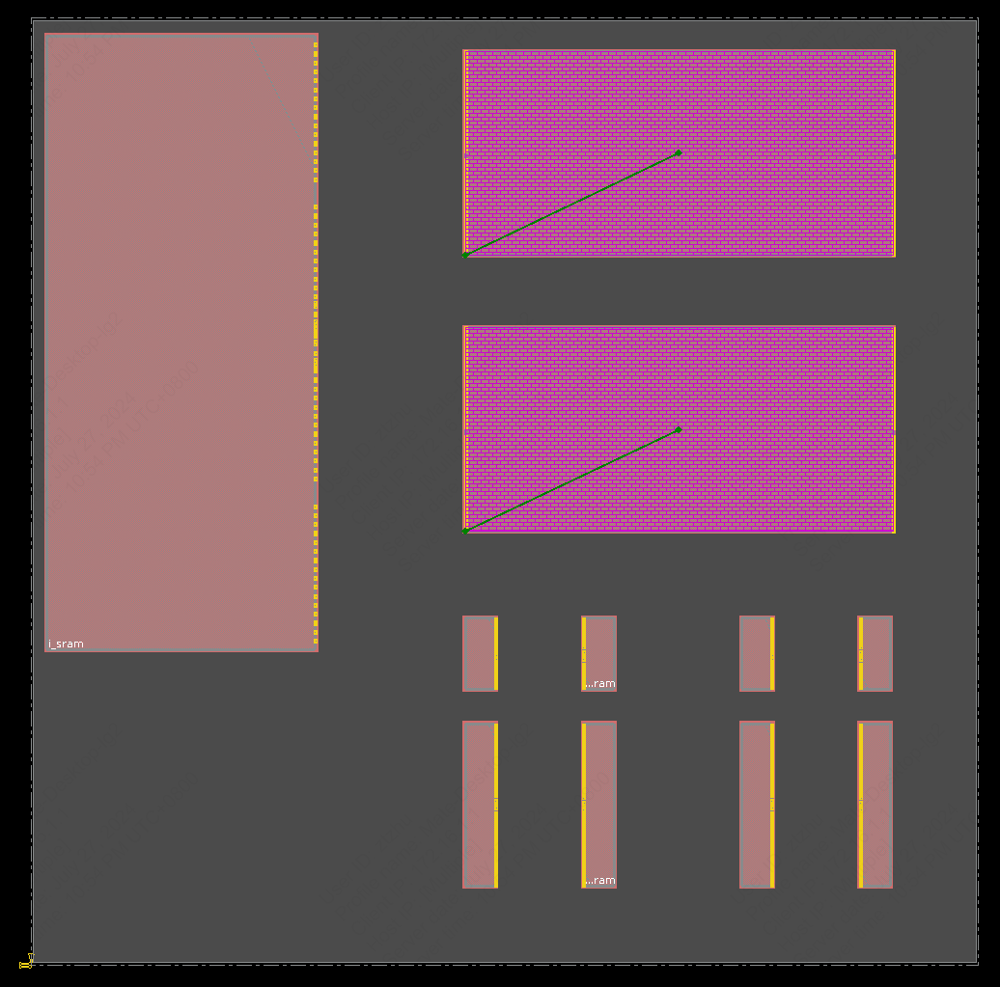

# 4. 数字子系统的物理设计

在完成数字模块的逻辑综合之后得到门级网表。以此为基础使用 Cadence Innovus 进行数字子系统的物理设计（后端设计）。

在后端设计中，许多脚本参数设置，例如电源网络的 Width，Spacing，以及 Macro 的摆放位置需要根据版图大小和布局布线情况来设定，需要多次的迭代优化。

## 物理设计流程介绍

!!! Warning "注意"
    同[数字子系统的逻辑综合](./2_submodule_synthesis.md)，在后端设计中，我们继续使用 `/work/home/ztzhu/tapeout_templates/submodule_tapeout/` 文件夹。

物理设计的输入主要用到模板文件中的以下内容：

* `./work/`：Innovus 的启动目录，存放 Innovus 的执行日志（包括用户输入命令和工具输出信息）；
* `./data/`：存放 Genus 逻辑综合得到的门级网表文件，也用于存放Innovus的输出文件（包括 `GDSII`, `LEF`, `SDF`等） ；
* `./scripts/`：存放 Innovus 工具调用的脚本；
* `./my_scripts/`：存放用户进行物理设计各个阶段的命令脚本；
* `./sram/`（_可选_）：数字子系统中例化的SRAM高速缓存或寄存器堆的专用 IP 核（`CDL`, `LEF`, `LIB`, `Verilog`等）；
* `./asic_ip/`（_可选_）：数字子系统中例化的其他 IP 核（例如 CIM Macro），或者更低层级的数字子系统的相关文件（`CDL`, `LEF`, `LIB`, `Verilog`等）。

该模板文件以一个 **CVA6 RISC-V CPU** 的后端设计流程作为一个示例。
在这个 CPU 中，包括用 SRAM Compiler 生成的 Main Memory，I-Cache和D-Cache，以及定制设计的 CIM 模块。
我们按照顺序逐一介绍数字子模块物理设计的流程。

### 4.1 修改 `init_invs.tcl`

在使用 Innovus 进行后端设计前，需要对工程脚本进行一些修改。

!!! tip "注意"
    在此，我们默认已经在逻辑综合之前修改了 `./scripts/core_config.tcl`, `./scripts/design_inputs_macro.tcl`, `./scripts/tech.tcl`中部分内容（包括时钟周期、标准工艺库，添加了 SRAM IP 文件、ASIC IP 文件等）。

在 `./scripts/init_invs.tcl` 中，定义了数字子系统的 Power 与 Ground 信号名称。

``` tcl
set init_gnd_net {VSS}
set init_pwr_net {VDD VDD_CIM}
```

在这个设计中，定制设计的CIM有单独的供电 `VDD_CIM` ，其余 SRAM IP 和标准单元共用 `VDD`。

### 4.2 启动 Cadence Innovus

打开一个终端，进入到 `./work/` 文件夹中，并启动 Innovus。Innovus 的日志文件位于 `innovus.log`，用户通过终端命令行和 GUI 界面操作所对应执行的命令记录在 `innovus.cmd`，均在 `./work/` 文件夹中。

``` shell
cd /work/home/ztzhu/tapeout_templates/submodule_tapeout/work/
rm -rf innovus.cmd* innovus.log* # clear previous innovus output files
b innovus
```

!!! tip "提示"
    每次启动 Innovus 都会生成一个新的日志文件，所以我们建议经常清理，以免文件过多影响后续操作。

在终端中启动 Innovus 之后，可以在该终端中输入 `TCL` 脚本命令，也可以在弹出的 Innovus GUI 进行操作。
在我们的模板文件中主要依赖于命令行脚本进行后端设计。使用 Innovus 进行后端设计所用到的 `TCL` 命令均存放在 `./my_scripts/` 中。
使用文本编辑器打开 `./my_scripts/innovus_script.tcl` （推荐使用 GVIM ）。

``` shell
gvim /work/home/ztzhu/tapeout_templates/submodule_tapeout/my_scripts/innovus_script.tcl
```

观察 `./my_scripts/innovus_script.tcl`，可以看到 Innovus 的物理设计流程大致分成了几个阶段，在 Innovus 终端中读入相应的命令即可（例如 `source ../my_scripts/add_pin.tcl`）。
接下来按照顺序对物理设计流程中的关键命令进行说明。

### 4.3 执行 `invs_init_setting.tcl`

观察 `./my_scripts/invs_init_setting.tcl` 中包含的命令。

#### 导入设计到 Innovus

``` tcl
setMultiCpuUsage -localCpu 32
```

`setMultiCpuUsage` 设置 Innovus 可以使用的 CPU 核数。对于现有的服务器，选择 `-localCpu 32` 可以保证 Innovus 稳定运行。

!!! Warning "警告"
    若使用 `setMultiCpuUsage -localCpu max -cpuAutoAdjust true -verbose`，可能会导致 Innovus 闪退。

```tcl
source -verbose ../scripts/core_config.tcl
source -verbose ../scripts/tech.tcl
source -verbose ../scripts/init_invs.tcl
source -verbose ../scripts/invs_setting.tcl
```

将此前修改过的4个脚本文件读入到 Innovus 中，包括数字子系统顶层模块名称（`$rm_core_top`）、各个文件的路径、标准工艺库的选择等内容。
此时我们经过逻辑综合的数字子系统已经导入到 Innovus 中。

``` tcl
saveDesign ${rm_core_top}.design_planning_init.enc
```

`saveDesign` 命令在后端设计流程的各个步骤均会出现，用于保存目前后端设计的进度。

!!! bug "FIXME!!!"
    在后续的物理设计流程中，若出现错误或者需要回溯到之前的设计进度，可以使用`restoreDesign`命令载入之前保存的设计。
    例如(bug here)：`restoreDesign ${rm_core_top}.design_planning_init.enc`


#### 设置后端不使用的标准单元

```tcl

set_dont_use [get_lib_cellls FA1D0BWP7T30P140HVT]
set_dont_use [get_lib_cellls FA1D1BWP7T30P140HVT]
set_dont_use [get_lib_cellls FA1D2BWP7T30P140HVT]
```

上述三个全加器标准单元在后续 DRC 检查时会报错，因此在布局布线之前设置不使用这些标准单元。

#### 设置版图大小

``` tcl
set cell_height 0.7
set macro_halo_spc [expr 1 * $cell_height]
set macro_halo_spc_2 [expr 2 * $cell_height]
set macro_halo_spc_4 [expr 4 * $cell_height]
set die_sizex 1200
set die_sizey 1200
```

以上命令设置了几个物理设计中所使用到的变量大小：

* `$cell_height` 是标准单元的高度；
* `$macro_halo_spc` 用于设置 Macro Routing Blockage 的宽度。
* `$die_sizex`, `$die_sizey` 分别是该模块版图的物理宽度与物理高度。

``` tcl
floorPlan -d $die_sizex $die_sizey 3.5 3.5 3.5 3.5
uiSetTool select
getIoFlowFlag
```

一个初始的版图类似下图所示。

<figure>
  
  <figcaption>Example Floorplan</figcaption>
</figure>

中央带有横条纹的区域称为 Core box，用于摆放 Macro 和标准单元。所有标准单元的宽度各不相同，但是高度均为 `$cell_height`（对于22nm工艺，即为0.7um）。
在 Core box 的四周到 I/O 管脚之间通常留有一定的间距，用于摆放 Core Ring 和 I/O 管脚布线。

`floorPlan` 命令用于指定版图的大小。

`floorPlan -d {<W H Left Bottom Right Top>}`，使用该命令设置版图大小总共需要6个参数，分别代表：

* 完整版图 (Die box) 的宽度
* 完整版图 的高度
* Core box（用于摆放标准单元的版图部分）到I/O左侧边界的距离
* Core box 到 I/O 底部边界的距离
* Core box 到 I/O 右侧边界的距离
* Core box 到 I/O 上方边界的距离

因此，设置上述版图大小的命令为：`floorPlan -d 100 100 10 10 10 10`。

### 4.4 执行 `place_macro.tcl`

查看 `./my_scripts/place_macro.tcl` 中包含的命令。

#### 查看 Macro

在 Innovus GUI 界面右上角选择 `Floorplan View`，如下图所示。

<figure>
  
  <figcaption>Check Floorplan View</figcaption>
</figure>

可以看到初始的版图如下所示。

<figure>
  
  <figcaption>Initial Floorplan View</figcaption>
</figure>

除去 Die Box 之外，左侧的粉色正方形为 RTL 代码中的模块层次，正方形的大小表示了模块的预估面积。

??? Tip "TU & EU"
    正方形左上角 `TU=64.7%` 为 Target Utilization (TU)，是指所有的标准单元和 Macro 的面积除以版图的面积。
    此外，还有 Effective Utilization (EU)，在整体版图面积的基础上除掉了 Placement，Routing Blockage 等其他阻碍物的面积，Innovus 默认不会显示EU。

Die Box 右侧为该数字模块中例化的 IP 核，在该案例中包括若干 SRAM 和2个 CIM Macro。

!!! Tip "检查 Macro"
    在这个时候可以检查此前例化的 SRAM 等 IP 是否有成功导入 Innovus。
    有时因为文件路径设置错误，会出现没有成功例化的情况。

#### 给 Macro 设置别名

``` tcl
# Main Memory
set mainmem i_sram

# D$
set dcache_tag0 i_ariane/i_cva6/gen_cache_wt.i_cache_subsystem/i_wt_dcache_i_wt_dcache_mem/gen_tag_srams[0].i_tag_sram
set dcache_tag1 i_ariane/i_cva6/gen_cache_wt.i_cache_subsystem/i_wt_dcache_i_wt_dcache_mem/gen_tag_srams[1].i_tag_sram
set dcache_data0 i_ariane/i_cva6/gen_cache_wt.i_cache_subsystem/i_wt_dcache_i_wt_dcache_mem/gen_data_banks[0].i_data_sram
set dcache_data1 i_ariane/i_cva6/gen_cache_wt.i_cache_subsystem/i_wt_dcache_i_wt_dcache_mem/gen_data_banks[1].i_data_sram

# I$
set icache_tag0 i_ariane/i_cva6/gen_cache_wt.i_cache_subsystem/i_cva6_icache/gen_sram[0].i_tag_sram
set icache_tag1 i_ariane/i_cva6/gen_cache_wt.i_cache_subsystem/i_cva6_icache/gen_sram[1].i_tag_sram
set icache_data0 i_ariane/i_cva6/gen_cache_wt.i_cache_subsystem/i_cva6_icache/gen_sram[0].i_data_sram
set icache_data1 i_ariane/i_cva6/gen_cache_wt.i_cache_subsystem/i_cva6_icache/gen_sram[1].i_data_sram

# CIM Macro
set dcim_macro0 i_ariane/gen_coprocessor.i_in_pipeline_coprocessor/u_CIM_block_wrapper/CIM_core_unit_inst_DCIM_macro_1_inst
set dcim_macro1 i_ariane/gen_coprocessor.i_in_pipeline_coprocessor/u_CIM_block_wrapper/CIM_core_unit_inst_DCIM_macro_2_inst
```

鼠标左键单击某一个 Macro，并按 `Q` 查看该 Macro 的属性，可以看到该 Macro 的名称，通常由 RTL 模块名称和 IP 名称组合而成。
如上所示，Macro 的名称通常比较长，为了后续脚本简洁，给 Macro 设置简短的别名。（例如 `icache_data0`, `icache_data1`）

#### 摆放 Macro

``` tcl
# place Main Memory
placeInstance [set mainmem] 20 400 R180

# place CIM Macro
set basex 500
set basey 500
set deltay 350
placeInstance [set dcim_macro0] $basex [expr $basey + $deltay * 0]
placeInstance [set dcim_macro1] $basex [expr $basey + $deltay * 1]

# place I$
set basex 500
set basey 350
set deltax 150
set deltay 250
placeInstance [set icache_tag0] [expr $basex + $deltax * 0] [expr $basey - $deltay * 0] R180
placeInstance [set icache_tag1] [expr $basex + $deltax * 1] [expr $basey - $deltay * 0]
placeInstance [set icache_data0] [expr $basex + $deltax * 0] [expr $basey - $deltay * 1] R180
placeInstance [set icache_data1] [expr $basex + $deltax * 1] [expr $basey - $deltay * 1]

# place D$
# not shown for simplicity
```

命令格式为：`placeInstance instance_name <location> <orientation>`

* `instance_name`：想要摆放的 Macro 名称。可以使用别名，例如：`[set icache_data0]`或`$icache_data0`；
* `<location>`：有 X 和 Y 两个数值，分别表示 Macro 左下角的宽度方向和高度方向的坐标；
* `<orientation>`：设置 Macro 的摆放方向，可以选择 `R0`, `R90`, `R180`, `R270`, `MX`, `MX90`, `MY`, `MY90`。

!!! Warning "Macro 摆放方向"
    由于 22nm 工艺中栅极必须纵向摆放，所以在摆放 Macro 时只能选择 `R0`, `R180`,`MX`, `MY`。

#### 设置 Macro 摆放状态

``` tcl
setInstancePlacementStatus -allHardMacros -status -fixed
```

该命令作用于所有此前摆放的 Macro，将其状态设置为 `fixed`，即使用自动化工具（例如自动化布局、布线）不会改变其位置。

摆放好所有 Macro 之后的版图如下所示。

<figure>
  
  <figcaption>Layout after placing macros</figcaption>
</figure>

### 4.5 执行 `add_halo_routeblk.tcl`

#### 在 Macro 四周添加 Halo

``` tcl
addHaloToBlock [list $macro_halo_spc_4 $macro_halo_spc_4 $macro_halo_spc_4 $macro_halo_spc_4] -allMacro
```

该命令作用于所有此前摆放的 Macro，在每个 Macro 的周围添加一圈 Halo。Halo 的区域内**不能摆放标准单元**，用于减少 Macro 周围的走线密度。
观察该命令可知，Halo 的宽度为 `$macro_halo_spc_4`。

!!! Tip "删除 Halo"
    使用 `deleteHaloFromBlock` 命令可以删除此前摆放的 Halo。

#### 添加 Routing Blockage

``` tcl
createRouteBlk -cover -inst $dcim_macro0 -exceptpgnet -layer {M1 M2 M3 M4 M5 M6 M7} -spacing $macro_halo_spc
createRouteBlk -cover -inst $dcim_macro1 -exceptpgnet -layer {M1 M2 M3 M4 M5 M6 M7} -spacing $macro_halo_spc
```

`createRouteBlk` 用于在指定的单元周围设置一圈 Routing Blockage，即**禁止走线的区域**。在此简要说明该命令几个选项的作用：

* `-cover`：指定将在实例顶部创建与指定块实例（`-inst <name>`）大小相同的 Routing Blockage 区域；
* `-exceptpgnet`：指定该 Routing Blockage 不适用于 Power/Ground 的走线，仅适用于信号走线；
* `-layer {M1 M2 M3 M4 M5 M6 M7}`：指定该 Routing Blockage 适用于哪几层的金属走线；
* `-spacing $macro_halo_spc`：指定该 Routing Blockage 与周围最近的金属走线之间的最小间距，单位为微米。

在此步骤之后的版图如下所示。可以看到所有的 Macro 均有一层浅棕色，为一圈 Halo，而两个 CIM Macro 周围还有 Routing Blockage。

!!! Bug "FIXME!!!"
    Route Blockage vs. OBS

<figure>
  
  <figcaption>Layout after adding halo and routing blockage</figcaption>
</figure>


### 4.6 执行 `global_net_connect.tcl`

``` tcl
# connect std cells
globalNetConnect VDD -type pgpin -pin VDD -all -override
globalNetConnect VSS -type pgpin -pin VSS -all -override

# connect dcim_macro0
globalNetConnect VDD_CIM -type pgpin -pin VDDC -sinst $dcim_macro0 -override
globalNetConnect VSS -type pgpin -pin VSSC -sinst $dcim_macro0 -override

# connect $mainmem
globalNetConnect VDD -type pgpin -pin VDDCE -sinst $mainmem -override
globalNetConnect VDD -type pgpin -pin VDDPE -sinst $mainmem -override
globalNetConnect VSS -type pgpin -pin VSSE -sinst $mainmem -override

# connect $dcim_macro1, $dcache_tag0, $dcache_tag1, $dcache_data0,
# $dcache_data1, $icache_tag0, $icache_tag1, $icache_data0, $icache_data1
# not shown for simplicity

# connect tiehi and tielo
globalNetConnect VDD -type tiehi
globalNetConnect VSS -type tielo
```

`globalNetConnect` 连接 Power/Ground 管脚和 1'b1/1'b0 管脚到指定的一个全局网络。

该命令的基本格式为 `globalNetConnect <globalNetName> {-type pgpin -pin <pinNamePattern> | -type tiehi -pin <pinNamePattern> | -type tielo -pin <pinNamePattern>} {-sinst <instName> | -all} [-override]`

* `<globalNetNet>` ：指定要连接到指定管脚的全局网络的名称，也就是我们在 `init_invs.tcl` 定义的 `init_pwr_net` 和 `init_gnd_net`；
* `-type` 我们会用到三个选项：`pgpin`, `tiehi`, `tielo`，分别是 Power/Ground，1'b1，1'b0；
* `-pin <pinNamePattern>` 是指定的 Instance 中 Power/Ground 管脚的名称。对于标准工艺库中的元件，是 `VDD` 和 `VSS`；对于 CIM Macro，是 `VDDC` 和 `VSSC`；对于 SRAM/Register File Compiler 生成的 IP，是 `VDDCE`, `VDDPE` 和 `VSSE`；
* `-sinst <instName>` 选择指定的 Instance 名称，与 `placeMacro` 命令中的用法类似；
* `-all` 指该命令适用于该设计中所有的 Instance，包括标准单元和 Macro。
* `-override` 指定使用 `globalNetConnect` 命令的值覆盖先前设置的全局网络连接值。

!!! tip "关于 `VDDPE` 和 `VDDCE`"
    SRAM/Register File Compiler 生成的 IP 有两个 Power 管脚，其具体区别详见 Compiler 的用户手册。
    在我们的设计和常规的学术流片中，可以都连接到全局的 Power 网络上，不做特别区分。

### 4.7 执行 `add_pin.tcl`

### 4.8 执行 `add_endcap_wellcap.tcl`

### 4.9 执行 `add_power_ring.tcl`

### 4.10 执行 `add_power_stripe.tcl`

### 4.11 执行 `place.tcl`

### 4.12 执行 `cts.tcl`

### 4.13 执行 `route.tcl`

### 4.14 修 DRC 报错

### 4.15 执行 `add_core_filler.tcl`

### 4.16 执行 `add_PG_pin.tcl`

### 4.17 执行 `gen_files.tcl`

!!! Warning
    Under Development!