# 4. 数字子系统的物理设计（重构版）

!!! tip "TLDR（太长不看）"
    1. 模板文件路径：`/work/home/limingxuan/common/SOC_CVA6/`
    2. 修改配置文件：`config/user_define.tcl`
    3. 编写时序约束：`config/constraints_<top_module_name>.sdc, cts_constraints_<top_module_name>.sdc`
    4. 启动物理实现：`b make innovus TOP=<top_module_name>`
    5. 修改并运行脚本：`pnr/scripts/innovus_implementation.tcl`
    6. 查看结果文件夹：`pnr/<top_module_name>`

## 4.1 模板文件

我们使用开源 RISC-V CPU CVA6 作为物理实现模板示例，其文件夹路径为：

```
/work/home/limingxuan/common/SOC_CVA6/
```

其文件夹结构为：

```
SOC_CVA6
├── src                                          # Source Files
│   ├── macro                                    # Manually drawn layout or smaller submodules
│   │   ├── <macro_name_1>
│   │   │   ├── <macro_name_1>.lef               # Macro physical abstract
│   │   │   ├── <macro_name_1>.cdl               # Macro netlist
│   │   │   ├── <macro_name_1>.gds               # Macro layout
│   │   │   └── <macro_name_1>_tt_0p80v_25c.lib  # Macro timing library
│   │   └── <macro_name_2>
│   │       └── ...
│   ├── sram                                     # Compiler Generated SRAM
│   │   ├── sram128x46
│   │   │   ├── sram128x46.lef                   # SRAM physical abstract
│   │   │   ├── sram128x46.cdl                   # SRAM netlist
│   │   │   ├── sram128x46.gds2                  # SRAM layout
│   │   │   └── ...
│   │   ├── sram128x128
│   │   │   └── ...
│   │   └── ...                                  # other sram instances
│   └── ...                                      # other source files
├── pnr
│   ├── scripts
│   │   ├── floorplan                            # floorplan stage script
│   │   │   └── ...
│   │   ├── powerplan                            # powerplan stage script
│   │   │   └── ...
│   │   ├── placement                            # placement stage script
│   │   │   └── ...
│   │   ├── clock_tree                           # CTS stage script
│   │   │   └── ...
│   │   ├── routing                              # routing stage script
│   │   │   └── ...
│   │   ├── signoff                              # signoff stage script
│   │   │   └── ...
│   │   ├── innovus_implementation.tcl           # main implementation script
│   │   ├── init_pnr_express.tcl                 # init implementation script
│   │   ├── init_pnr_standard.tcl                # init implementation script
│   │   └── pnr_mmmc.tcl                         # define MMMC constraints
│   └── Makefile
├── config
│   ├── constraints_<top_module_name>.sdc        # define pre-CTS timing constraints
│   ├── cts_constraints_<top_module_name>.sdc    # define post-CTS timing constraints
│   ├── global_define.tcl                        # define global parameters
│   └── user_define.tcl                          # user-specific parameters
├── Makefile                                     # Top-level Makefile
├── ...
...                                              # Other Folders/Files
```

`<macro_name_1>`, `<macro_name_2>` 是更低层级的子系统。`<top_module_name>` 是该数字子系统的顶层模块名称，例如 `soc`。

### 4.1.1 修改配置文件

根据注释修改 `config/user_define.tcl` 中的物理设计参数。你需要定义的参数如下：

- `rm_core_top`：数字子系统的顶层模块名称。
- `rm_clock_pin`：顶层模块的时钟端口名称。
- `rm_clock_period`：时钟周期，单位 ns。
- `sram_insts`：SRAM 实例的名称，请在 `src/sram` 文件夹中使用 `sram_compiler` 生成对应名称的 sram 实例。
- `macro_insts`：宏单元的名称，请将对应文件（`.v`，`.lib`，`.lef`，`.cdl`）放在 `src/macro/<name>` 文件夹中，分别命名为 `<name>.v` `<name>_[ss|tt|ff]_*v_*c.lib` `<name>.lef, <name>.cdl`。
- `std_lib, cell_ext`：选择标准单元库的阈值电压。
- `proj(analysis_view,[setup|hold])`：选择时序分析的 PVT，学术片考虑 `tt` 的两个选项即可。
- `init_pwr_net`：电源端口名称。
- `init_gnd_net`：接地端口名称。

### 4.1.2 编写时序约束

每个子模块的时序约束都需要**自行编写** `sdc` 文件，一共需要编写两个文件，分别用于时钟树综合前的阶段和时钟树综合后的阶段。
可以分别参考 `config/constraints_soc.sdc, config/cts_constraints_soc.sdc,`。其中 `config/constraints_soc.sdc` 也会在数字子系统的逻辑综合阶段用到。 

`sdc` 文件的更多信息详见逻辑综合中的[相关章节](./2_submodule_synthesis_new.md#修改时序约束)。请将你编写的 `sdc` 文件命名为 `constraints_<top_module_name>.sdc, cts_constraints_<top_module_name>.sdc`，并放在 `config/` 文件夹中。

### 4.1.3 启动 Innovus

在 `SOC_CVA6` 文件夹下，运行如下命令启动 Innovus。

```shell
b make innovus TOP=<top_module_name>
```

其中 `<top_module_name>` 为数字子系统的顶层模块名称，例如 `soc`。

!!! warning "顶层模块名称"
    <top_module_name> 必须和 `config/user_define.tcl` 中的 `rm_core_top` **完全一致**。

该命令会在 `pnr` 文件夹下生成 `logs` 文件夹，并在此目录下启动 Innovus。
默认读取的网表路径为 `syn/<top_module_name>/<top_module_name>_postsyn.v`。
如果成功运行，会弹出 Innovus GUI 界面，并且终端处于 Innvous 命令行模式，如下图所示。

<figure>
  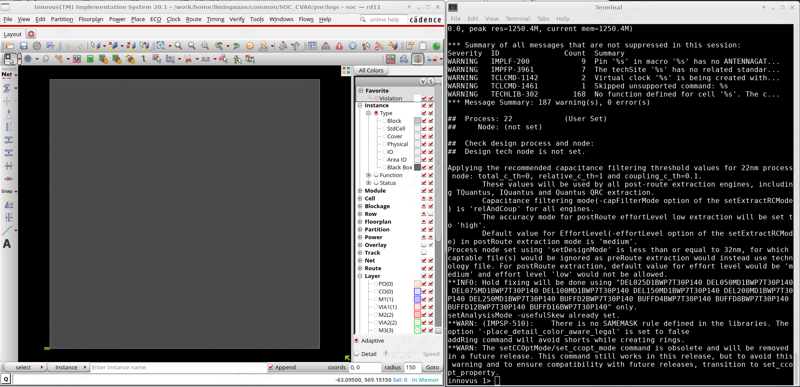
  <figcaption>Innovus Startup</figcaption>
</figure>

!!! warning "检查 Warning/Error"
    检查 terminal 或者 `pnr/logs/<top_module_name>.log` 中的 Warning 和 Error，确保初始化没有问题。

### 4.1.4 修改并运行脚本

按照 `pnr/scripts/innovus_implementation.tcl` 中的注释，依次修改对应的子脚本并手动运行，直到该父脚本中的所有子脚本均被运行完毕。

### 4.1.5 结果文件

物理实现完成后，会在 `pnr` 文件夹下生成 `<top_module_name>` 文件夹，其中包含了 Innovus 的结果文件，包括如下几个文件：

- `<top_module_name>_flat_postpnr.v`：物理实现后带有电源的 flatten 网表，用于 **LVS 检查**。
- `<top_module_name>_hier_postpnr.v`：物理实现后没有电源的层次化网表，用于**后仿**。
- `<top_module_name>_tt0p8v25c.lib`：物理实现后的时序信息库，用于**顶层模块集成**。
- `<top_module_name>_tt0p8v25c.sdf`：物理实现后的标准延迟表，用于**后仿**。
- `<top_module_name>.lef`：物理实现后的版图信息，用于**顶层模块集成**。
- `<top_module_name>.cdl`；物理实现后的电路描述文件，用于 **LVS 检查**。
- `<top_module_name>.gds2`：物理实现后的**版图文件**。

另外，每个阶段还会生成对应的**时序报告**，位于 `pnr/<top_module_name>/reports` 文件夹中。

### 4.1.6 恢复设计

`pnr/scripts/innovus_implementation.tcl` 中在每一阶段结束后有 `saveDesign` 命令，可以将当前阶段的设计保存到 `pnr/<top_module_name>/backup` 文件夹中，以便后续恢复设计。

如果需要恢复某一阶段的设计，在 `SOC_CVA6` 文件夹下，运行如下命令。

```shell
b make restore_innovus TOP=<top_module_name> STAGE=<stage_name>
```

其中 `<stage_name>` 为需要恢复的阶段名称，一共有 6 种选择：`Floorplan, Powerplan, Place, CTS, Route, Signoff`，注意**大小写**。

## 4.2 物理设计流程

物理实现（后端）主要分为如下几个步骤：

- Floorplan
- Powerplan
- Placement
- Clock Tree Synthesis (CTS)
- Routing
- Signoff

<figure>
  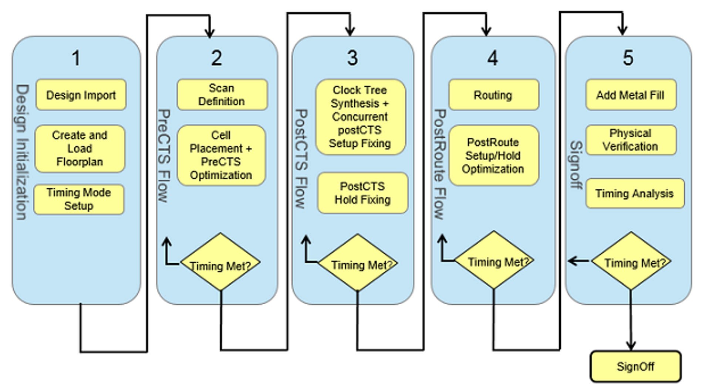
  <figcaption>Recommended Timing Closure Flow</figcaption>
</figure>

后端流程需要的数据如下：

- Timing Libaraies：`.lib` 文件，所有单元的时序信息。
- Physical Abstract：`.lef` 文件，所有单元的物理信息。
- Verilog Netlist：`.v` 文件，逻辑综合后的网表。
- Timing Constraints：`.sdc` 文件，时序约束。
- Multi-Mode Multi-Corner (MMMC) Setup for Timing：`.tcl` 文件，多模式多角约束。

Innovus 拥有全局 TCL 变量，这些变量都形如 `init_*`，可以通过 `set` 命令修改。
`saveDesign` 命令会将这些全局变量保存到 `.globals` 文件中。

!!! Tip "GUI 操作与脚本命令"
    所有的 GUI 操作都有对应的脚本命令，可以通过 GUI 操作后查看 `pnr/logs/<top_module_name>.cmd` 得到对应的脚本命令。

### 4.2.1 Floorplan

布局规划（Floorplan）决定了**数字逻辑模块（soft module）**的位置、尺寸和形状以及**硬宏（hard macro）**的放置。
布局规划包括确定整体尺寸、I/O 引脚布局、凸块（bump）分配（倒装芯片，flip chip）等。
布局规划与布局（placement）、早期全局布线（early global routing）相结合，是一个**迭代设计**过程。

#### 查看 Floorplan

在 Innovus GUI 界面右上角选择 `Floorplan View`，如下图所示。

<figure>
  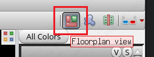
  <figcaption>Check Floorplan View</figcaption>
</figure>

可以看到初始的版图如下所示。

<figure>
  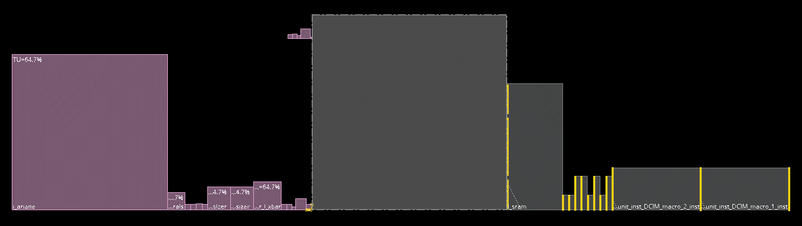
  <figcaption>Initial Floorplan View</figcaption>
</figure>

中央为整个芯片的版图，分为 Core Box，IO Box 和 Die Box，如下图所示。

<figure>
  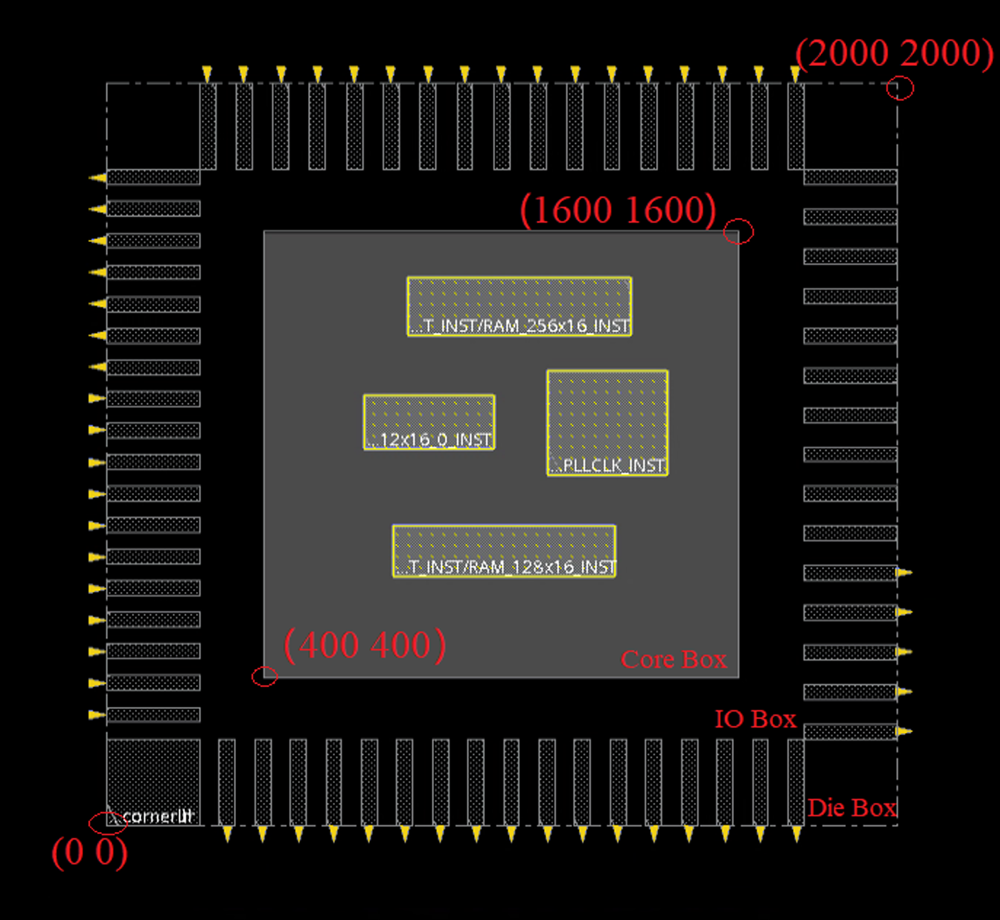
  <figcaption>Floorplan Box Definition</figcaption>
</figure>

所有标准单元的宽度各不相同，但是高度均为 `$cell_height`（对于22nm工艺，即为0.7um，pre-shrink）。
在 Core box 的四周到 I/O 管脚之间通常留有一定的间距，用于摆放 Core Ring 和 I/O 管脚布线。

除去中央的 Die Box 之外，左侧的粉色正方形为 RTL 代码中的数字顶层模块，正方形的大小表示了模块的预估面积。

??? question "TU & EU"
    正方形左上角 `TU=64.7%` 为 Target Utilization (TU)，是指所有的标准单元和 Macro 的面积除以版图的面积。
    此外，还有 Effective Utilization (EU)，在整体版图面积的基础上除掉了 Placement，Routing Blockage 等其他阻碍物的面积，Innovus 默认不会显示EU。

Die Box 右侧为该数字模块中例化的 IP 硬核（SRAM、Macro）。

!!! warning "检查 Macro"
    在这个时候可以检查此前例化的 SRAM 等 IP 是否有成功导入 Innovus。
    有时因为文件路径设置错误，会出现没有成功例化的情况。

Floorplan 左侧所有 RTL 模块都拥有各自的 Floorplan 约束，可以通过在 GUI 上右键点击模块选择 `Attrbite Editor -> Constraint Type`（快捷键 Q）查看或者修改。
约束一共有如下几种：

- `None`：该模块未被预放置（pre-placed）。模块的放置不受任何限制。
- `Guide`：该模块被预放置，用以引导该模块中的标准单元的摆放。
- `Fence`：该模块的标准单元必须摆放在指定的位置。
- `Region`：同 Fence 约束，同时其他模块的标准单元也可以摆放在该区域内。
- `Soft Guide/Cluster`：约束相比 Guide 更加宽松。

和左侧的 RTL 模块类似，右侧的 IP 硬核也有各自的 Floorplan 约束，可以通过右键点击 Macro 选择 `Attrbite Editor -> Constraint Type`（快捷键 Q）查看或者修改。
约束一共有如下几种：

- `unplaced`：该硬核未被预放置。
- `fixed`：该硬核被预放置，不能通过自动化工具移动，但是可以通过交互指令移动。
- `placed`：该硬核被预放置，但是可以通过自动化工具或者交互指令移动。
- `cover`：该硬核被预放置，但是不能移动。
- `softFixed`：该硬核被预放置，只能在合法化的过程中被移动。

#### 设置 Floorplan（`pnr/scripts/floorplan/floorplan.tcl`）

一般情况下，我们使用如下命令设置 Floorplan。

```tcl
floorPlan -d {W H Left Bottom Right Top}
```

使用该命令设置版图大小总共需要6个参数，分别代表：

* 完整版图 (Die box) 的宽度。
* 完整版图的高度。
* Core box（用于摆放标准单元的版图部分）到I/O左侧边界的距离。
* Core box 到 I/O 底部边界的距离。
* Core box 到 I/O 右侧边界的距离。
* Core box 到 I/O 上方边界的距离。

一个初始的版图类似下图所示，设置该版图大小的命令为：`floorPlan -d 100 100 10 10 10 10`。

<figure>
  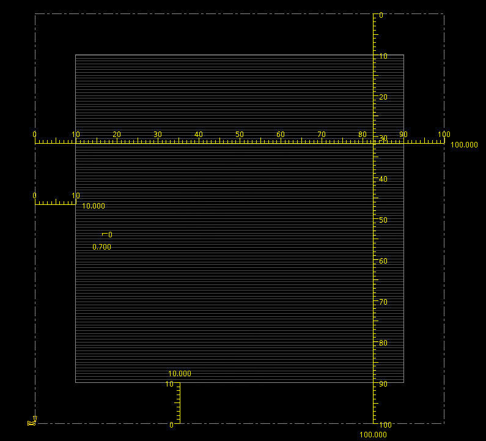
  <figcaption>Example Floorplan</figcaption>
</figure>

??? Tip "根据标准单元密度自动设置版图大小"

    ```tcl
    floorPlan -su {aspectRatio [stdCellDensity [Left Bottom Right Top]]}
    ```

    - aspectRatio：版图的高宽比（高/宽）。
    - stdCellDensity：标准单元密度，即标准单元的个数。
    - Left Bottom Right Top：Core box 到 I/O 四个边界的距离。

    版图的面积会由如下公式计算得到：coreArea = stdCellArea ÷ stdCellDensity + macroArea。

#### 摆放 Macro（`pnr/scripts/floorplan/macro_preplace.tcl`）

*脚本命令*

Macro 的名称可以在 `Floorplan View` 中右键点击 Macro 选择 `Attrbite Editor -> Name`（快捷键 Q）查看。
Macro 的名称通常比较长，为了后续脚本简洁，建议使用 TCL 命令 `set nickName realName` 给 Macro 设置简短的别名，例如 `set icache_data0 i_wt_dcache_i_wt_dcache_mem/gen_data_banks[0].i_data_sram`。

我们使用如下命令摆放 Macro。

```tcl
placeInstance instance_name location [orientation]
```

* `instance_name`：想要摆放的 Macro 名称。可以使用别名，例如：`$icache_data0`。
* `location`：有 X 和 Y 两个数值，分别表示 Macro 左下角的宽度方向和高度方向的坐标。
* `[orientation]`：（可选）设置 Macro 的摆放方向，可以选择 `R0`, `R90`, `R180`, `R270`, `MX`, `MX90`, `MY`, `MY90`，默认为 `R0`。

!!! danger "Macro 摆放方向"
    由于 22nm 工艺中栅极必须纵向摆放，所以在摆放 Macro 时只能选择 `R0`, `R180`, `MX`, `MY`。

*GUI 操作*

点击工具栏中的 `Move/Resize/Reshape` 图标（快捷键 Shift+R），然后单击需要移动的 Macro（使用 Shift 多选），拖动到指定位置，再单击一次即可摆放。
该图标的次级菜单可以选择是否只能水平垂直移动。

<figure>
  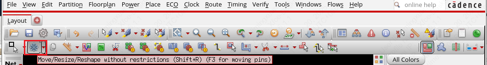
  <figcaption>Move/Resize/Reshape Widget</figcaption>
</figure>

<figure>
  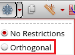
  <figcaption>Move Restriction</figcaption>
</figure>

在摆放多个 Macro 时，可以使用工具栏中的 `Floorplan Toolbox`。
按照下图中的步骤 1，可以看到在中央视图的左上角会出现一个工具箱，选中需要操作的多个 Macro，然后点击该工具箱即可对选中的 Macro 进行对齐、等间距排列等操作。

<figure>
  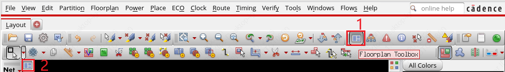
  <figcaption>Floorplan Toolbox</figcaption>
</figure>

摆放完 Macro 之后，可以使用如下命令修改所有 Macro 的摆放属性。

```tcl
setInstancePlacementStatus -allHardMacros -status {fixed | placed | cover | softFixed}
```

摆放好所有 Macro 之后的版图如下所示。

<figure>
  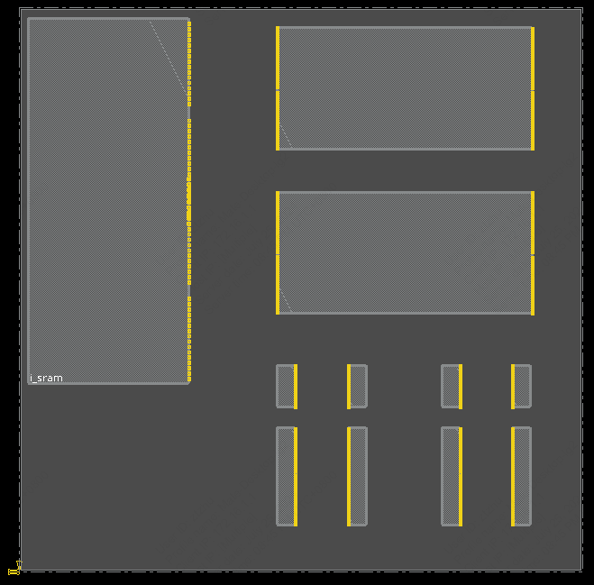
  <figcaption>Layout after placing macros</figcaption>
</figure>

#### 设置 Macro Halo 和 _（可选）_ Placement/Routing blockage（`pnr/scripts/floorplan/halo_blockage.tcl`）

Halo 用于**防止 Macro 四周**摆放标准单元，可以减缓**布线阻塞**。

``` tcl
addHaloToBlock [list $macro_halo_spc_4 $macro_halo_spc_4 $macro_halo_spc_4 $macro_halo_spc_4] -allMacro
```

观察该命令可知，Halo 的宽度为 `$macro_halo_spc_4`。

!!! question "删除 Halo"
    使用 `deleteHaloFromBlock` 命令可以删除此前摆放的 Halo。

在后端设计迭代优化时，我们往往会发现在**某个区域**内会出现较多 DRC 报错，布局布线**密度较高**。
在这种情况下，我们可以考虑手动添加 Cell placement blockage，从而**限制**该局部区域的布局布线密度，减少 DRC 报错。

``` tcl
createPlaceBlockage -name     setdensity_blk1 \
                    -box      300 50 1000 500 \
                    -type     partial \
                    -density  75
```

* `createPlaceBlockage`：设置 Cell placement blockage，用于**阻碍**在特定区域内标准单元的摆放。
  * `-type partial`：指定该 Placement blockage 的类型，总共有4种类型，包括 `hard`（默认选项，**不能**在指定区域摆放任何标准单元），`soft`（不能在**布局阶段**摆放标准单元，但可以在后续布局优化、时钟树综合等阶段摆放标准单元），`partial`（设定指定区域内标准单元的**最大密度**），还有`macroOnly`（允许摆放标准单元，但**不允许**摆放 Macro）。
  * `-density 75`：指定了该 Partial placement blockage 所允许的最大密度，该选项一定需要和 `-type Partial` 一起使用。
  * `-box 300 50 1000 500`：如下图所示，设置了该 Placement blockage 的具体范围（粉色方格区域），使用左下角和右上角的横纵坐标表示。

<figure>
  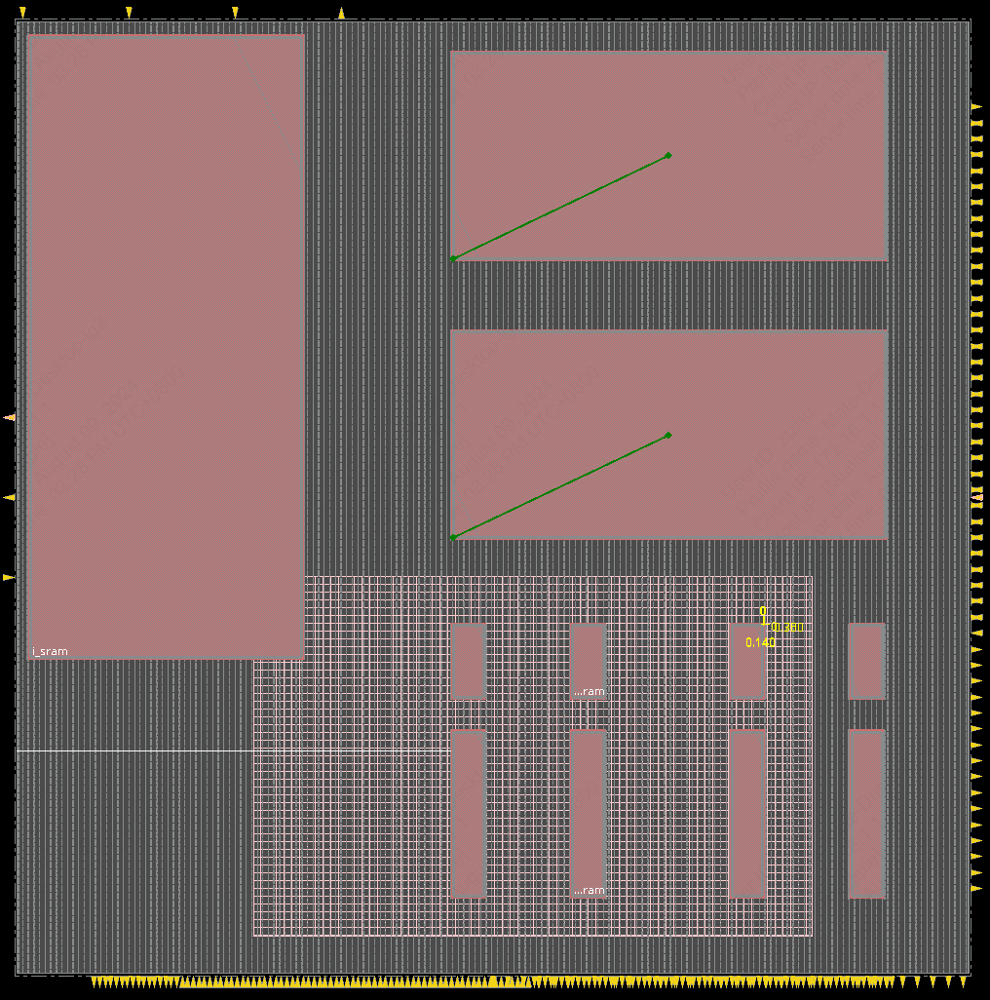
  <figcaption>Layout after setting placement blockage</figcaption>
</figure>

后端工具对 Macro 内部的连线情况是**不清楚**的，如果该模块的 `.lef` 文件中没有定义 OBS 层，那么就需要对该模块添加 Routing blockage，防止后端工具在该区域的布线与模块内部的走线短路。

!!! tip "OBS 层"
    OBS（Obstruction，阻挡区域）是一种用于限制布局（Placement）和布线（Routing）工具在特定区域内操作的设计约束。
    其核心目的是通过人为定义“禁区”，优化芯片的物理结构、满足制造规则（DRC）、提升信号完整性或保护关键模块。

``` tcl
createRouteBlk  -cover \
                -inst $main_sram \
                -exceptpgnet \
                -layer {M1 M2 M3 M4} \
                -spacing $macro_halo_spc
```

`createRouteBlk` 用于在指定的单元周围设置一圈 Routing Blockage，即**禁止走线的区域**。在此简要说明该命令几个选项的作用：

* `-cover`：指定将在实例顶部创建与指定块实例（`-inst <name>`）大小相同的 Routing Blockage 区域。
* `-exceptpgnet`：指定该 Routing Blockage 不适用于 Power/Ground 的走线，仅适用于信号走线。
* `-layer {M1 M2 M3 M4 M5 M6 M7}`：指定该 Routing Blockage 适用于哪几层的金属走线。
* `-spacing $macro_halo_spc`：指定该 Routing Blockage 与周围最近的金属走线之间的最小间距，单位为微米。

!!! tip "Route Blockage `-layer` 参数"
    参数的设定一般为最底层金属层到 Macro 的最高层电源金属层，例如 SRAM 为 M1-M4。

#### 添加 Pin（`pnr/scripts/floorplan/pin_add.tcl`）

对于大规模的数字模块，信号 I/O 管脚数量可能是成百上千的，手动编写命令设置每个管脚的摆放过于繁琐。
因此，我们使用 Innovus GUI 界面添加数字子系统的信号 I/O 管脚。

* 在上方工具栏选择 `Edit -> Pin Editor` 添加相应的管脚（详见下方 Pin Editor GUI 界面）。
* 打开 `pnr/logs/<top_module_name>.cmd` （Innovus 生成的日志文件）查看我们在 GUI 界面每一步操作所对应的命令，其中就有我们所需要的 `editPin` 命令。

<figure>
  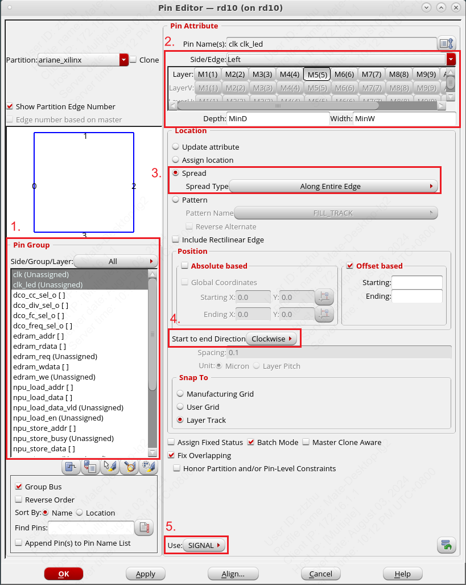
  <figcaption>Innovus Pin Editor</figcaption>
</figure>

可以设想，如果管脚数量增加，例如有 2 组 64-bit 输入信号和 1 组 64-bit 输出信号，手写脚本命令过于繁琐，这也是我们在此使用 GUI 界面的原因。

!!! tip "关于 Pin 金属层数的选择"
    在常规的数字芯片中，奇数层的为横向金属，偶数层为纵向金属（常称为**奇横偶纵**），因此对于 Top/Bottom 可以选择 M4/M6 等金属，Left/Right 选择 M3/M5 等金属。
    在管脚较多的情况下，可以将不同的管脚分配到同一条边的不同金属层。

!!! question "关于数字子系统的 Power/Ground 的 Pin 管脚"
    数字子系统的 Power/Ground 管脚和不同信号线的管脚有所区别，往往是以顶层1-2层的电源网格的形式给数字子系统进行供电，因此在布局布线完成之后使用 `createPGPin` 命令生成，在后续步骤做进一步介绍。

添加完 Pin 后的版图如下图所示，每一个黄色的三角形代表一个 Pin 管脚，Zoom In 可以进一步看到每个管脚的名称，所在的金属层，以及管脚的具体形状 (Pin Width, Pin Depth)。

<figure>
  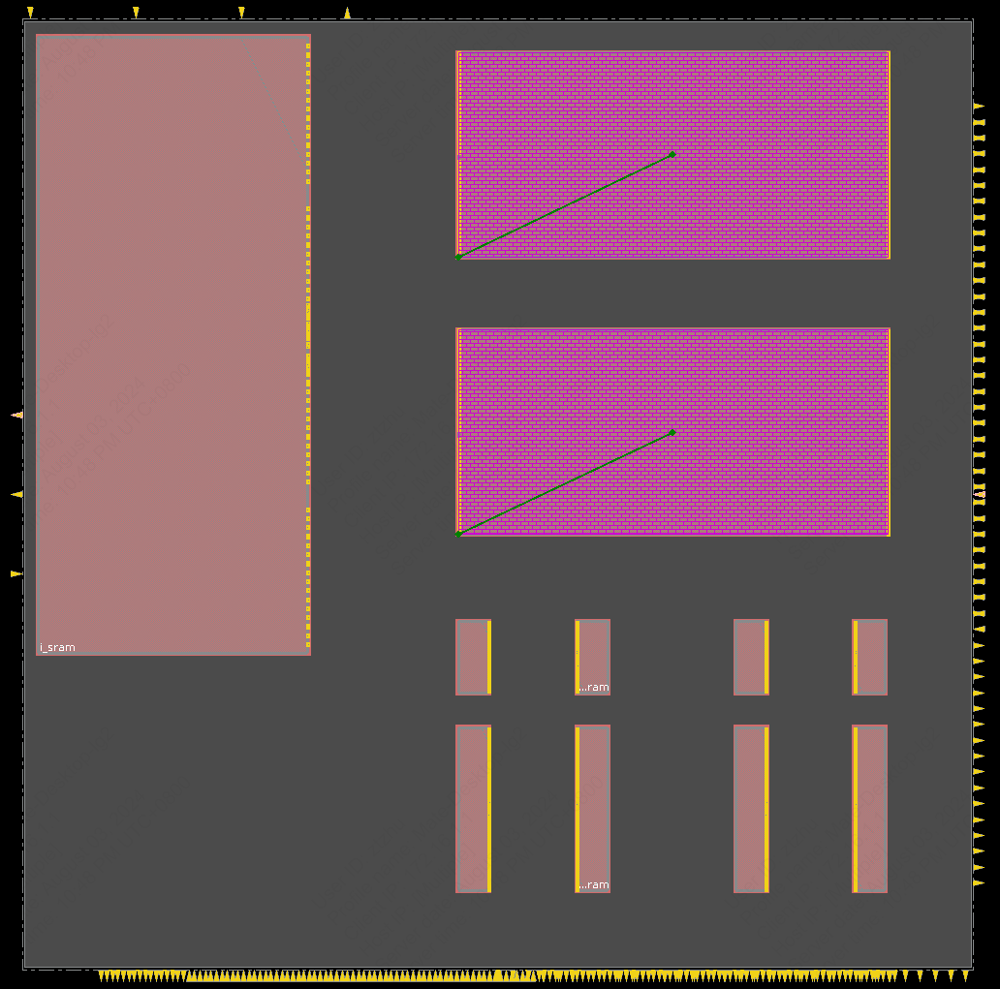
  <figcaption>Layout after adding I/O pins</figcaption>
</figure>

### 4.2.2 Powerplan

电源规划（Powerplan）是指在版图中规划**电源和接地网络**，以确保数字模块的稳定供电。
主要包括定义电源线地线（Power/Ground net）、电源格栅（Power Stripe）、电源环（Power Ring）等。

#### 定义电源信号和接地信号（`pnr/scripts/powerplan/global_net_connect.tcl`）

我们需要定义电源信号和接地信号的名称（已经在 `config/user_define.tcl` 中定义），并且将其与所有标准单元、Macro 的电源和接地端口连接起来。
使用的命令如下所示：

```tcl
globalNetConnect <globalNetName> {-type pgpin -pin <pinNamePattern> | -type tiehi [-pin <pinNamePattern>] | -type tielo [-pin <pinNamePattern>]} {-sinst <instName> | -all} [-override]
```

* `<globalNetName>` ：指定全局网络的名称，也就是我们在 `config/user_define.tcl` 定义的 `init_pwr_net` 和 `init_gnd_net`。
* `-type` 我们会用到三个选项：`pgpin`, `tiehi`, `tielo`，分别是 Power/Ground，1'b1，1'b0。
* `-pin <pinNamePattern>` 是指定的 Instance 中 Power/Ground 管脚的名称。对于标准工艺库中的元件，是 `VDD` 和 `VSS`；对于 SRAM/Register File Compiler 生成的 IP，是 `VDDCE`, `VDDPE` 和 `VSSE`。
* `-sinst <instName>`：选择指定的 Instance 名称，与 `placeMacro` 命令中的用法类似。
* `-all`：指该命令适用于该设计中所有的 Instance，包括标准单元和 Macro。
* `-override`：指定使用 `globalNetConnect` 命令的值覆盖先前设置的全局网络连接值。

一般的数字电路中，主要包括标准单元、Macro 和上拉下拉（Tie-high，Tie-low）三种类型的电源接地连接，因此需要分别对这三类进行电源和地的连接。

1. 标准单元。

    ```tcl
    globalNetConnect VDD -type pgpin -pin VDD -all -override
    globalNetConnect VSS -type pgpin -pin VSS -all -override
    ```

2. Macro，以 SRAM IP 为例。

    ```tcl
    globalNetConnect VDD_SRAM -type pgpin -pin VDDCE -sinst $mainmem -override
    globalNetConnect VDD_SRAM -type pgpin -pin VDDPE -sinst $mainmem -override
    globalNetConnect VSS -type pgpin -pin VSSE  -sinst $mainmem -override
    ```

3. 上拉下拉。

    ```tcl
    globalNetConnect VDD -type tiehi
    globalNetConnect VSS -type tielo
    ```

!!! question "关于 Tie-high 与 Tie-low 标准单元"
    在数字模块中，我们有时会有类似于 `assign a = 1'b1` 的赋值语句。在后端流程时，这些 `1'b1` 与 `1'b0` 会转化成 Tie-high 和 Tie-low 标准单元。在定义电源信号和接地信号时，我们需要指明这些 Tie-high 和 Tie-low 标准单元和哪些电源信号和接地信号相连。

#### 添加 Power ring（`pnr/scripts/powerplan/power_ring.tcl`）

Power ring 用来确保电源信号的**稳定供电**，通常是在 Core box、Macro 的四周摆放一圈电源线，一般包括 Core ring 和 Block ring。

添加 Core ring 的示例命令如下所示：

```tcl
addRing -nets [list VDD VDD_SRAM VSS] \
        -type core_rings \
        -follow core \
        -layer {top M5 bottom M5 left M6 right M6} \
        -width 0.35 \
        -spacing 0.35 \
        -center 0
```

* `-type core_rings`：指定生成的 Power rings 为 Core rings，即在 Core box 和 I/O boundary 之间的空隙生成我们指定的 Power rings（回忆在设置版图大小的时候，我们指定了在 Core box 与 I/O boundary 之间设置 3.5um 的空隙）；
* `-nets [list VDD VDD_SRAM VSS]`：指定生成的 Power rings 的信号名称。对于 Core rings，该数字子系统中**所有的 P/G 信号**至少需要生成一条 Core ring；
* `-follow core`：指定生成的 Core rings 以 Core boundary 为基准，如果设置 `-follow io`，则以 I/O boundary 为基准；
* `-layer {top M5 bottom M5 left M6 right M6}`：字面意思，设置 Core rings 在每个方向所在的金属层；
* `-width 0.35`：设置每一条 Core ring 的宽度；
* `-spacing 0.35`：设置两条相邻 Core rings 之间的间距；
* `-center 0`：设置 Core rings 是否在 I/O boundary 和 Core boundary 之间的中央，在此我们不指定 Core rings 位于间隙中央，因此需要通过 `-offset` 手动设置偏移量，在没有指定 `offset <value>` 的情况下，Innovus 工具会自动设置偏移量。

添加 Core rings 之后的部分版图如下所示.

<figure>
  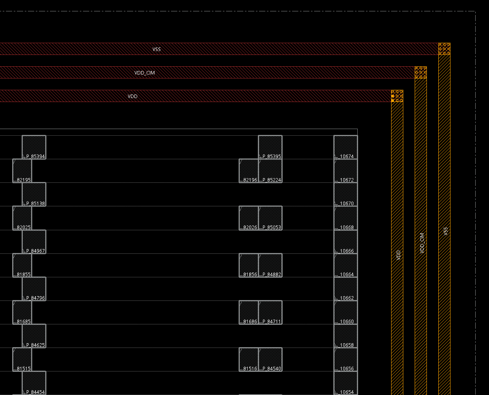
  <figcaption>Partial layout after adding core rings</figcaption>
</figure>

添加 Block ring 的示例命令如下所示：

```tcl
addRing -nets {VDD VSS} \
        -type block_rings \
        -around each_block \
        -layer {top M5 bottom M5 left M6 right M6} \
        -width {top 0.14 bottom 0.14 left 0.7 right 0.7} \
        -spacing {top 0.14 bottom 0.14 left 0.35 right 0.35} \
        -offset {top 0.04 bottom 0.04 left 0.7 right 0.7} \
        -center 0 \
        -threshold 0 \
        -jog_distance 0 \
        -snap_wire_center_to_grid None
```

* `-type block_rings`：指定我们在指定的 Macro 周围生成 Block rings，而非 Core rings；
* `-nets {VDD VSS}`：指定生成的 Block rings 包括 VDD 和 VSS，而不包括 VDD_CIM，因为 **Block rings 用于给 Macro 周围的标准单元供电**，而不用于给 Macro（例如 CIM 或 SRAM IP）供电；
* `-around selected`：指定生成的 Block rings 在选中的 Macro 周围，使用 `selectInst <instName>` 指定选中的 Macro；
* `-threshold 0`：指定相邻 Macros 周围相同 P/G 信号的 Block rings 之间所允许的最小距离，如果 Block rings 之间的距离小于这个值，两条 Block rings 会融合为一条 Block ring。在此该阈值设置为 0um，也就是 Block rings 不会自动融合。
* `-jog_distance 0`：指定 block ring 的最小微调距离，设定为 0um，即接受任意位置微调。
* `-snap_wire_center_to_grid None`：是否将 Block ring 的中心对齐到网格，设定为 None，即不对齐。
* `-layer`, `-spacing`, `-width`, `-offset`, `-center` 选项的意义和作用与 Core rings 相同，不再赘述。

??? question "给特定 Macro 添加 Block ring"
    使用 `selectInst <instName>` 指定选中的 Macro，并在执行 `addRing` 命令时添加 `-around selected` 选项。

一个 SRAM IP 周围的 Block rings 如下所示。

<figure>
  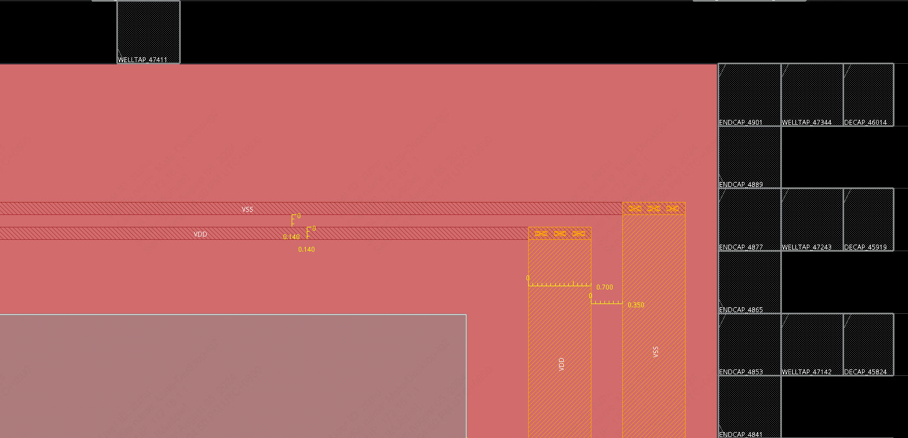
  <figcaption>Partial layout after adding block rings</figcaption>
</figure>

!!! Warning "Block Ring 的作用"
    Block ring 的作用是为了加强环周围**标准单元**的电源稳定性，因此在布局布线资源紧张的时候，可以考虑**删除** block ring。

#### 添加电源格栅（`pnr/scripts/powerplan/power_stripe.tcl`）

电源格栅（Power Stripe）是指在版图中规划**电源线**，一般情况下是高层金属。
Power Stripe 一次只能添加一层金属，指令如下所示。

```tcl
# add M6 power stripes
setAddStripeMode  -stacked_via_bottom_layer         M1 \
                  -stacked_via_top_layer            M6
addStripe         -nets                             { VSS VDD VDD_SRAM } \
                  -layer                            M6 \
                  -direction                        vertical \
                  -width                            2 \
                  -spacing                          15 \
                  -start_offset                     5 \
                  -set_to_set_distance              34 \
                  -block_ring_bottom_layer_limit    M1 \
                  -block_ring_top_layer_limit       M8 \
                  -padcore_ring_bottom_layer_limit  M1 \
                  -padcore_ring_top_layer_limit     M8

# add M7 power stripes
setAddStripeMode  -stacked_via_bottom_layer         M6 \
                  -stacked_via_top_layer            M7
addStripe         -nets                             { VSS VDD VDD_SRAM } \
                  -layer                            M7 \
                  -direction                        horizontal \
                  -width                            2 \
                  -spacing                          10 \
                  -start_offset                     0.7 \
                  -set_to_set_distance              24 \
                  -block_ring_bottom_layer_limit    M1 \
                  -block_ring_top_layer_limit       M8 \
                  -padcore_ring_bottom_layer_limit  M1 \
                  -padcore_ring_top_layer_limit     M8
```

* `-stacked_via_bottom_layer M1`：指定 stripe 能通过通孔连接到的最底层金属层。对于**最底层**的 Stripe，该值设定为 **M1**；对于**其他**的 stripe，该值一般设定为**更低的一层**。
* `-stacked_via_top_layer M6`：指定 stripe 能通过通孔连接到的最高层金属层。一般设定为当前层。
* `-nets { VSS VDD VDD_SRAM }`：指定 Power Stripe 的信号名称，同时这些电源/地信号会被认为是**一个组（set）**。
* `-layer M6`：指定 Power Stripe 的金属层。
* `-direction vertical`：指定 Power Stripe 的方向，可以选择 `horizontal` 或 `vertical`。
* `-width 2`：指定 Power Stripe 的宽度。
* `-spacing 15`：指定一组 Power Stripe 之间的间距，即相邻电源线最相近的两条边之间的距离。
* `-start_offset 5`：指定 Power Stripe 距离版图边界的距离。
* `-set_to_set_distance 34`：指定组与组之间的间距，相邻两组对应位置之间的距离。
* `-block_ring_bottom_layer_limit M1`：指定 Power Stripe 在遇到 Block ring 时可以切换到的最底层金属层。
* `-block_ring_top_layer_limit M8`：指定 Power Stripe 在遇到 Block ring 时可以切换到的最高层金属层。
* `-padcore_ring_bottom_layer_limit M1`：指定 Power Stripe 在遇到 Pad/Core ring 时可以切换到的最底层金属层。
* `-padcore_ring_top_layer_limit M8`：指定 Power Stripe 在遇到 Pad/Core ring 时可以切换到的最高层金属层。

在实际的数字子系统中，需要根据需求灵活调整 `setAddStripeMode` 中的 `-stacked_via_bottom_layer` 参数，如下是两个实例。

*为 CIM macros 供电*

在该数字子系统中，CIM macro 最顶层的 P/G 网络是 **M6 横向排布**的 `VDDC` 和 `VSSC` Power stripes。
因此， M8 的 `VDD_CIM` 通过 VIA6 和 VIA7 连接到 CIM macro 内部的 P/G Pin，如下图所示。

<figure>
  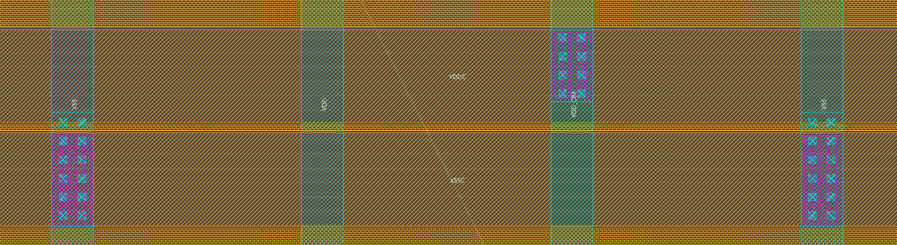
  <figcaption>P/G connections for CIM macros</figcaption>
</figure>

设置的指令如下。

```tcl
setAddStripeMode  -stacked_via_bottom_layer         M6 \
                  -stacked_via_top_layer            M8
addStripe         -layer                            M8 \
                  ...
```

*为 SRAM IP 供电*

SRAM IP 内部最顶层的 P/G 网络是 **M5 横向排布**的 `VDDPE`, `VDDCE` 和 `VSSE`。
因此，最底层的电源金属层 M6 的 `VDD` 通过 VIA5 连接到 SRAM macro 内部的 P/G Pin，如下图所示。

<figure>
  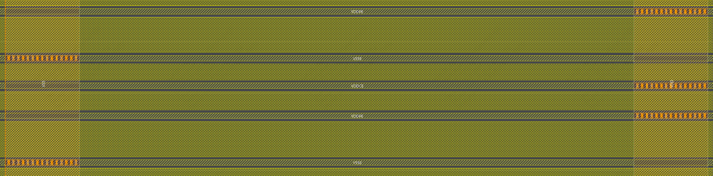
  <figcaption>P/G connections for SRAM macros</figcaption>
</figure>

设置的指令如下。

```tcl
setAddStripeMode  -stacked_via_bottom_layer         M1 \
                  -stacked_via_top_layer            M6
addStripe         -layer                            M6 \
                  ...
```

添加全局电源格栅之后的版图如下所示。

<figure>
  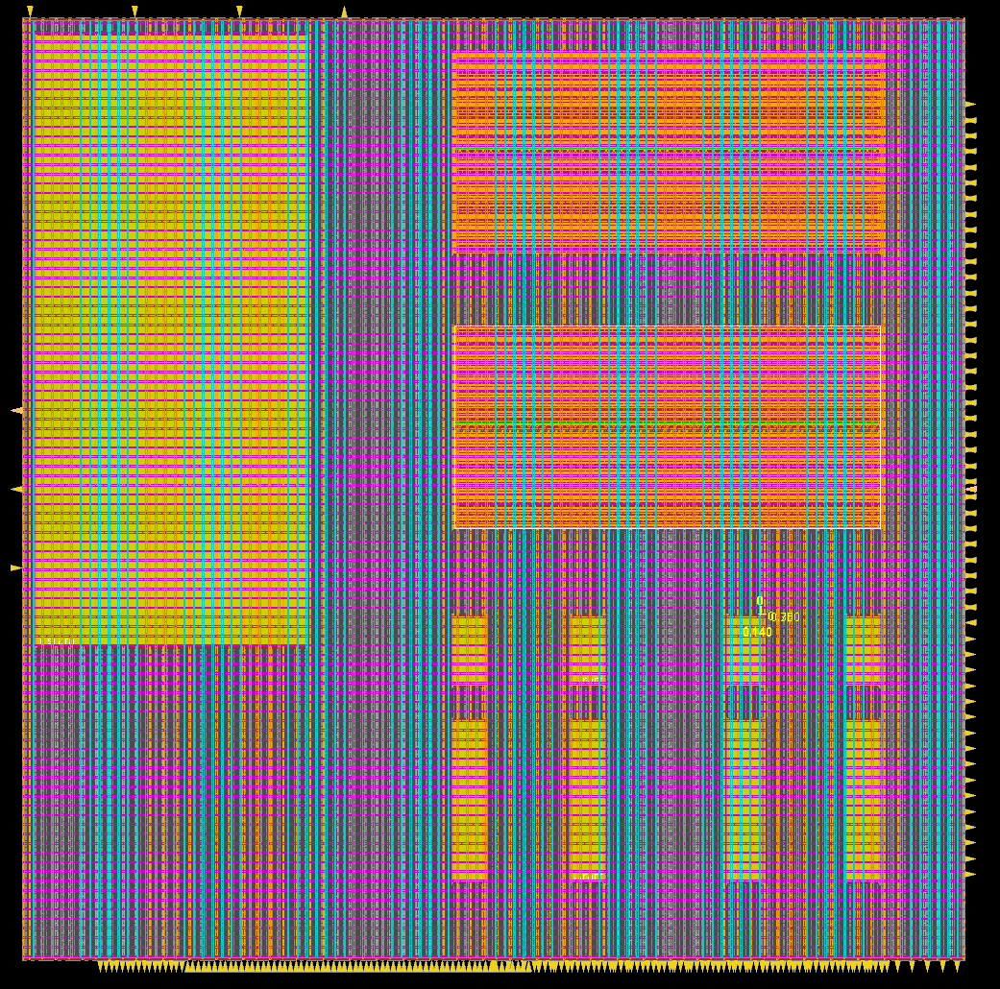
  <figcaption>Layout after adding power stripes</figcaption>
</figure>

#### 电源布线（`pnr/scripts/powerplan/power_route.tcl`）

**标准单元**通过 **M1** 金属层供电/接地，这些供电/接地的 M1 金属被称为**电源轨道（Power rail）**。
需要将高层金属层的 Power Stripe 与 M1 金属层的 Power Stripe 通过贯穿多层金属的 VIA 连接起来。

```tcl
sroute -connect                { corePin } \
       -nets                   { VSS VDD }
       -layerChangeRange       { M1 M6 } \
       -crossoverViaLayerRange { M1 M6 } \
       -targetViaLayerRange    { M1 M6 } \
       -allowJogging           0 \
       -allowLayerChange       1 \
       -deleteExistingRoutes
```

* `-connect { corePin }`：指定连接的对象，这里是 Core Pin，即 Core box 的边界上的管脚。
* `-nets { VSS VDD }`：指定连接的信号名称。
* `-layerChangeRange { M1 M6 }`：指定可以改变的金属层范围。
* `-crossoverViaLayerRange { M1 M6 }`：指定可以穿越的金属层范围。
* `-targetViaLayerRange { M1 M6 }`：指定目标金属层范围。
* `-allowJogging 0`：是否允许走线时的弯曲。
* `-allowLayerChange 1`：是否允许金属层的改变。
* `-deleteExistingRoutes`：是否删除已有的走线。

在设置 `-*LayerRange` 时，需要注意**顶层金属层** 应为 Power stripe 中的**最底层金属层**。

!!! danger "`sroute` 之后 GUI 中 Macro 周围的 Violation"
    在执行 `sroute` 之后，会出现 Macro 周围的 Violation，在 GUI 中表现为白色的叉号，如下图所示。

    <figure>
      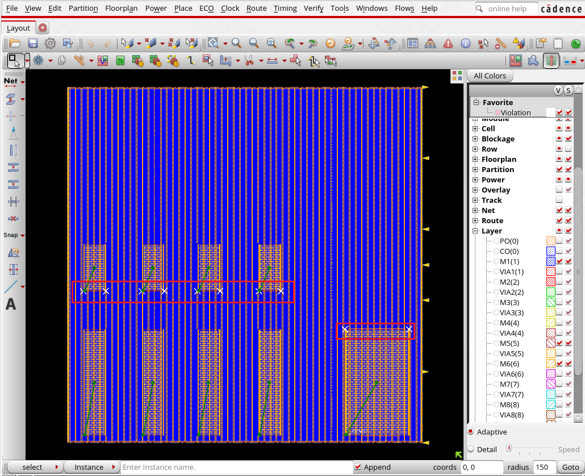
      <figcaption>Power Rail Violation</figcaption>
    </figure>

    出现这种违例的原因是 M1 金属线的两端没有连接到 Power Ring 上，属于开路（open）违例。

    <figure>
      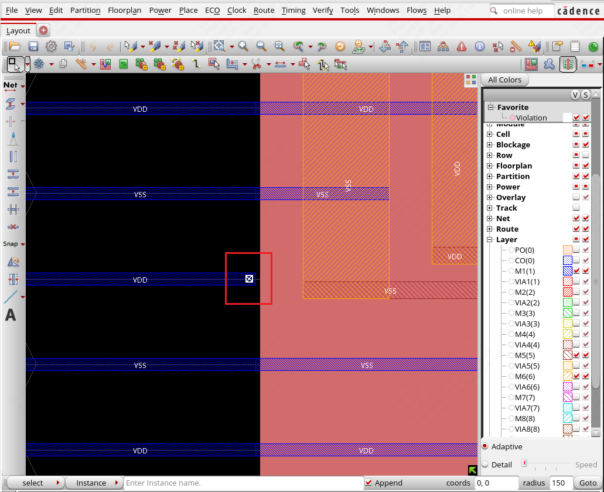
      <figcaption>Power Rail Open Circuit</figcaption>
    </figure>

    此时需要检查该 M1 金属线是否连接到了对应的纵向 VDD/VSS Power Stripe 上。
    如果没有，则该金属线处于**悬空状态**，需要**重新添加** Power Stripe。


??? question "`editPowerVia` 的作用"
    在执行 `addRing, addStripe, sroute` 的时候会**自动插入** Via，因此单独执行 `editPowerVia` 在大多数情况下**不会有任何效果**。

电源布线之后的版图如下所示。

<figure>
  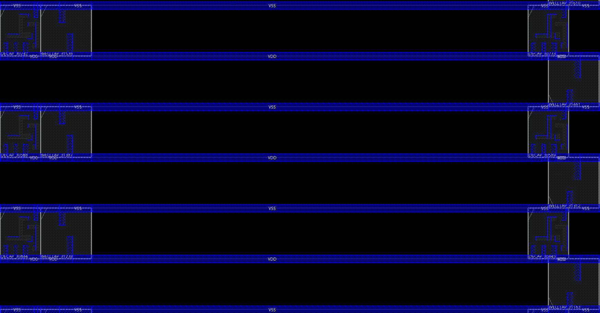
  <figcaption>Partial layout after sroute</figcaption>
</figure>

!!! danger "检查 Global Net Connection"
    在添加全局的 P/G 网络后，请**务必注意检查**最顶层 (M8) 的 P/G 有没有通过 VIA 正确连接到最底层 (M1) 以及各个 Macro 内部的 P/G 网络中。
    确保**每一个** Macro 的电源和地线都**正确连接**。

    如果发现连接有误，需要及时修改 `pnr/scripts/floorplan/global_net_connect.tcl` 和 `pnr/scripts/powerplan/power_stripe.tcl` 中的相关命令，并通过查看 `LEF` 文件或者 Innovus GUI 界面查看 各个 Macro 内部 P/G Pin 所在的金属层。

### 4.2.3 Placement

布局遵循**布局规划约束**，完成标准单元、Macro 等的所有模块的摆放。

#### 摆放 Physical-only Cell（`pnr/scripts/placement/physical_cell_insert.tcl`）

Physical-only Cell 是一种**不包含任何逻辑功能**的标准单元，用于**填充**版图中的空白区域，以满足物理特性的要求，包括 End-Cap、Well-Tap、Decap 和 Filler。

End-Cap 是预先放置的纯物理单元，用于满足某些设计规则。
在数字集成电路设计中，特别是使用自动布局布线工具时，标准单元在整个硅片区域内按行排列。
这些标准单元是设计的构建模块，包含逻辑门、触发器和其他数字电路。
当最后一个标准单元不能完美地适应行的长度时，Endcap Cells用于**填充标准单元行末端的剩余空间**。
它们提供电气和物理隔离，将硅片的活动区域与周围结构（如划片线或芯片边缘）隔离开来。

``` tcl
addEndCap
```

添加 End-Cap Cells 之后的部分版图如下所示，可以看见在 Macro 的左侧和右侧，以及 Core box 的左侧和右侧（也就是标准单元行末端的剩余空间添加了 Endcap Cells。

<figure>
  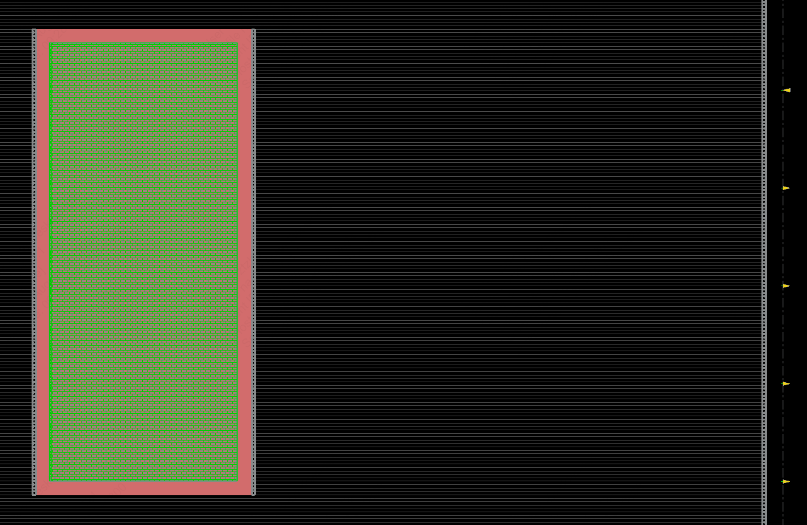
  <figcaption>Partial layout after adding endcap cells</figcaption>
</figure>

Well-Tap 为制造晶体管的衬底或阱提供低阻抗的接地或 VDD 路径，用于在 CMOS 工艺中确保适当的电气连接并防止闩锁效应。
Well-Tap Cells 在整个 IC 布局中被有规律地摆放，特别是在电源和接地连接附近。
它们的放置通常由代工厂指定的设计规则所规定。

``` tcl
addWellTap  -cell         ${rm_tap_cell} \
            -cellInterval $rm_tap_cell_distance \
            -checkerboard
```

* `-cell <cellName>` 指定所使用的 Well-Tap Cells 的名称；
* `-cellInterval <microns>`：指定每一行之间相邻两个 Well-Tap Cells 的最大距离；
* `-checkerBoard`：指定 Well-Tap Cells 以棋盘格模式放置，即每隔一行偏移半个间距。

添加 Well-Tap Cells 之后的部分版图如下所示。
可以看到在每个标准单元行，以棋盘形式交替摆放着 Well-Tap Cells。

<figure>
  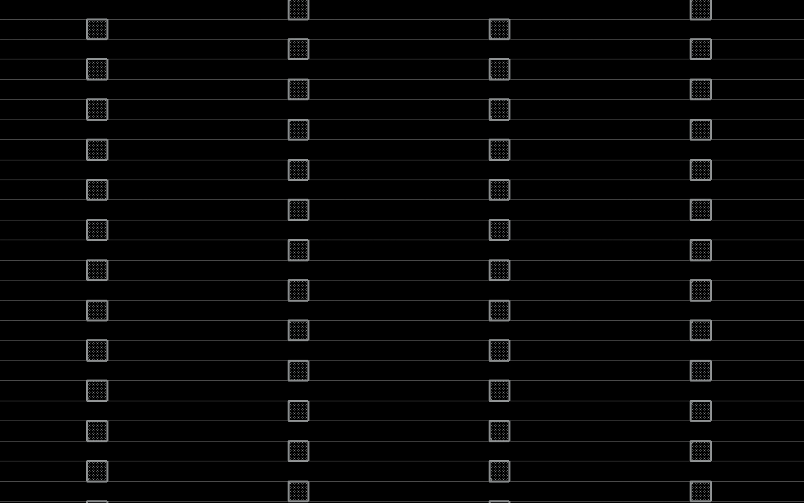
  <figcaption>Partial layout after adding Well-Tap cells</figcaption>
</figure>

Decap Cells（去耦电容单元）主要用于减少电源噪声和稳定电源电压。
它们通过提供额外的电容来平滑电源电压的波动，防止电源噪声影响电路性能。
Decap Cells 常放置在电源网络中，以确保电源电压的稳定性，特别是在高频信号和快速开关电路中。
Decap Cells 主要关注电源电压的稳定性，而 Welltap Cells 主要关注衬底电位的稳定性。

我们使用添加 Well-Tap 的方式添加 Decap Cells，即替换 `-cell` 选项为 Decap 标准单元。

``` tcl
addWellTap  -prefix       DECAP \
            -cellInterval $rm_tap_cell_distance \
            -cell         ${dcap_cell} \
            -skipRow      1
```

放置 Decap Cells 之后的部分版图如下所示，可以看见每隔一行（因为指定了 `-skipRow 1`）在 Well-Tap Cells 旁边添加了 Decap Cells。

<figure>
  
  <figcaption>Partial layout after adding decap cells</figcaption>
</figure>

!!! question "删除 End-Cap、Well-Tap 和 Decap"
    使用 `deleteFiller -prefix ENDCAP; deleteFiller -prefix WELLTAP; deleteFiller -prefix DECAP` 即可删除全部的 End-Cap、Well-Tap 和 Decap。

!!! Warning "摆放顺序"
    End-Cap 应该**先于** Well-Tap 和 Decap 摆放。

#### 摆放标准单元（`pnr/scripts/placement/stdcell_place.tcl`）

``` tcl
deleteTieHiLo
setPlaceMode -place_detail_preroute_as_obs {6}
place_opt_design
addTieHiLo
```

* `deleteTieHiLo`：从门级网表中删除目前摆放的 Tie-high 和 Tie-low 标准单元，将相应信号重新连接到逻辑高电平和逻辑低电平。此处可以理解为初始化操作。
* `setPlaceMode -place_detail_preroute_as_obs {6}`：限制标准单元不能摆放在已有的 M6 金属线之下。
* `place_opt_design`：基于标准单元的布局设置和相关时序分析的设置，摆放标准单元。
* `addTieHiLo`：添加 Tie-high 和 Tie-low 标准单元，**在放置标准单元之后使用该命令**。

在 Innovus GUI 界面右上角选择 `Physical View`，即可查看摆放完标准单元之后的版图。

<figure>
  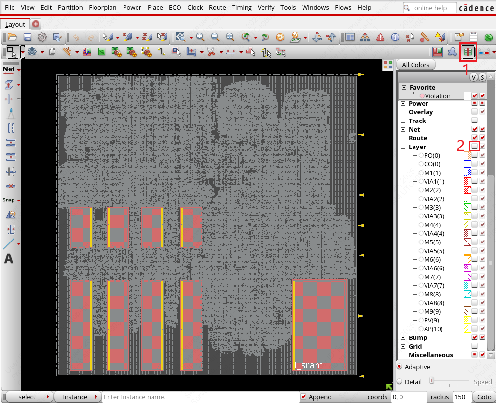
  <figcaption>Layout after adding standard cells</figcaption>
</figure>

!!! question "Layout 中的金属信号线"
    如果在 GUI 中打开各个金属层的显示，可以发现上述命令不仅仅完成了标准单元的放置，还完成了信号线的互联。
    这是因为 Innovus 在进行 `place_opt_design` 时会自动进行**预布线（preroute）**，将标准单元的输入输出端口连接起来。

!!! tip "`place_detail_preroute_as_obs` 作用"
    该选项通常选择**纵向** Power Stripe 的**最底层**，防止最底层的 Power Stripe 通过 stacked VIA 连接到 M1 金属层时，和标准单元发生 DRC 违例。

完成标准单元的摆放之后，需要进行**布局优化**，以减少布局布线的阻塞、优化时序。

``` tcl
place_opt_design  -incremental
```

运行完成后，可以在 Terminal 的输出或者 `pnr/<top_module_name>/postPlace/<top_module_name>_preCTS.summary` 中查看时序优化的结果，请尽可能使得 **裕度（slack）不为负数**的情况下再进行之后的步骤。
此处的 DRC 错误可以**暂时忽略**，在之后的步骤中会一并修复。

??? question "修复时序"
    当时序不满足要求，可以依次做以下尝试：

    * 多次使用 `place_opt_design -incremental` 命令进行布局优化。
    * 调整时序约束，减小时钟频率。
    * 调整初始 Floorplan。
    * 修改 RTL 中关键路径的逻辑。

### 4.2.4 Clock Tree Synthesis（`pnr/scripts/clock_tree/cts.tcl`）

时钟树综合（Clock Tree Synthesis，CTS）是指在版图中规划**时钟网络**，以确保时钟信号的**稳定传输**。
所有的触发器都由时钟信号驱动，时钟信号的传输质量直接影响到整个数字系统的稳定性和功耗。
在 CTS 之前，所有的时钟都是**理想**的，在引入时钟树之后，需要考虑时钟的**偏移、抖动**等问题。

``` tcl
set_interactivate_constraint_mode [all_constraint_modes -active]
source <path>/cts_constraints_<top_module_name>.sdc
set_interactivate_constraint_mode {}

create_ccopt_clock_tree_spec

ccopt_design

set_interactivate_constraint_mode [all_constraint_modes -active]
set_propagated_clock [list clk]
set_interactivate_constraint_mode {}

optDesign -postCTS -drv
optDesign -postCTS -incr
optDesign -postCTS -hold
```

* `set_interactivate_constraint_mode`：用于更新 CTS 后所需的时序约束。
* `create_ccopt_clock_tree_spec`：用于自动生成时钟树。
* `ccopt_design`：对时钟树进行布局布线，并优化时序。
* `set_propagated_clock`：设置时钟信号为传播模式（propagated），用于反映时钟树的影响。
* `optDesign`：根据时序约束进行优化。`-drv, -incr, -hold` 分别表示优化设计规则冲突（design rule violation，扇出、电容等）、渐进优化 setup（incremental）、优化 hold。

运行完成后，可以在 Terminal 的输出或者 `pnr/<top_module_name>/postCTS/<top_module_name>_postCTS.summary, pnr/<top_module_name>/postCTS/<top_module_name>_hold_postCTS.summary` 中查看时序（setup 和 hold）优化的结果。
此处的 setup 和 hold 可以有**一定程度**的违例，但还是推荐尽量减少违例（没必要确保 slack = 0）。
此处的 DRC 错误可以**暂时忽略**，在之后的步骤中会一并修复。

!!! warning "setup 和 hold"
    请务必确保 hold 的时序要**尽可能**满足要求！
    如果设计过于复杂，**优先满足** hold，再尽可能减少 setup 违例。
    hold 如果违例，那么最终芯片**不能工作**。
    setup 如果过差，会导致最终芯片的**频率低**。

??? question "修复时序"
    当时序不满足要求，可以依次做以下尝试：

    * 多次使用 `optDesign` 命令进行优化。
    * 调整时序约束，减小时钟频率。
    * 调整初始 floorplan（减少布局密度）。
    * 修改 RTL 中关键路径的逻辑。

在 GUI 中可以通过 `Clock Tree Debugger` 看到生成的时钟树。

<figure>
  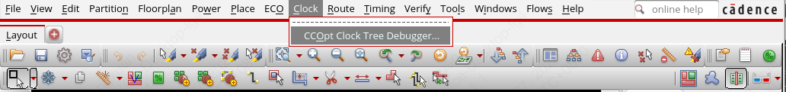
  <figcaption>Clock Tree Debugger Navigation</figcaption>
</figure>

一个时钟树的实例如下。

<figure>
  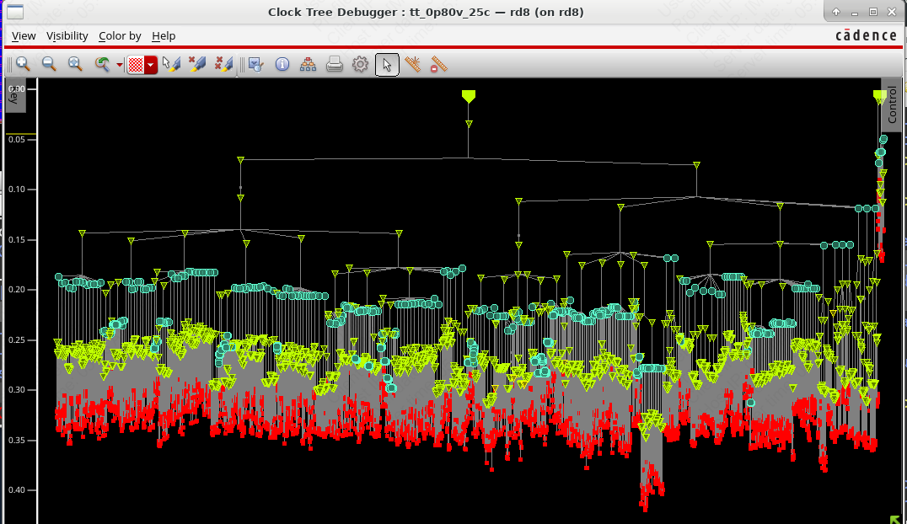
  <figcaption>Clock Tree Debugger Example</figcaption>
</figure>

### 4.2.5 Routing

布线分为两步：全局布线（Global Route）和局部布线（Detail Route）。
另一个重要的概念是 ECO Route (Engineering Change Order)，用于在布线之后对设计进行修改，用于**修复 DRC 违例**。
ECO 布线包括增量式的全局和局部。
在 ECO 布线期间，会尽量保持整体布线不变，进行最小程度的更改。
除了布线，在这一阶段还需要满足时序约束、无 DRC 违例。

#### 布线并收敛时序（`pnr/scripts/routing/route.tcl`）

``` tcl
setExtractRCMode -engine postRoute \
                 -effortLevel medium

routeDesign

optDesign -postRoute -setup -hold
optDesign -postRoute -drv
optDesign -postRoute -incr
optDesign -postRoute -hold
```

* `setExtractRCMode`：设置提取 RC 模型的引擎和级别。
* `routeDesign`：进行布线，首先进行全局布线，再进行局部布线。
* `optDesign`：根据时序约束进行优化。

运行完成后，可以在 Terminal 的输出或者 `pnr/<top_module_name>/postRoute/<top_module_name>_postRoute.summary, pnr/<top_module_name>/postRoute/<top_module_name>_hold_postRoute.summary` 中查看布线的时序结果。

!!! danger "时序收敛"
    请**确保**此处的 setup 和 hold **不要违例**。如果违例，请确保违例保证在 **10ps 以内**。

??? question "修复时序"
    当时序不满足要求，可以依次做以下尝试：

    * 多次使用 `optDesign` 命令进行优化。
    * 调整时序约束，减小时钟频率。
    * 调整初始 Floorplan（减少布局密度）。
    * 修改 RTL 中关键路径的逻辑。

#### DRC 修复并检查（`pnr/scripts/routing/drc_fix.tcl`）

``` tcl
deleteRouteBlk -all

setNanoRouteMode -routeWithEco true
globalDetailRoute

verify_drc
```

* `deleteRouteBlk`：删除之前的布线 Blockage，以便进行 DRC 检查。
* `setNanoRouteMode -routeWithECO true`：设置 NanoRoute 的模式为 ECO。
* `globalDetailRoute`：在 ECO 模式下重新布线。
* `verify_drc`：检查 DRC 违例。

上述指令运行完成后，如果 DRC 的数量在 100 以上，说明布局布线的资源非常紧张，可以尝试需要考虑**重新调整布局布线**。

如果 DRC 的数量在 20-100 的区间内，可以尝试**反复运行**上述指令，直到 DRC 的数量少于 20。

如果 DRC 的数量在 20 以下，且都为 M1-M3 的错误，大概率这些错误是由于标准单元之间**摆放地过于紧密**导致。
我们可以**手动调整**有 DRC 违例的标准单元。

如下图所示，两个标注单元之间的 Via1 距离过近导致了 DRC，选择图中红框所示的移动工具（快捷键 Shift+R），将左侧的标准单元向左移动**至少 2 格**，确保标准单元之间的间隔**至少为 2 格**。

<figure>
  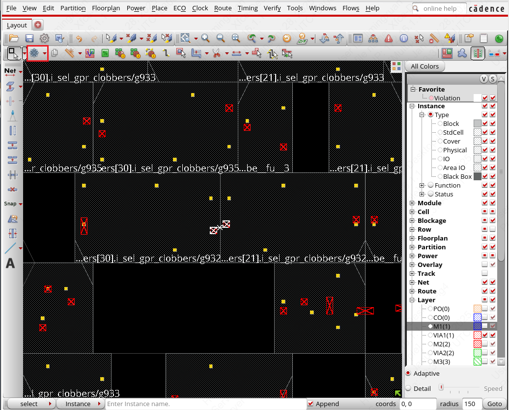
  <figcaption>Via1 DRC</figcaption>
</figure>

移动后的效果如下图所示。

<figure>
  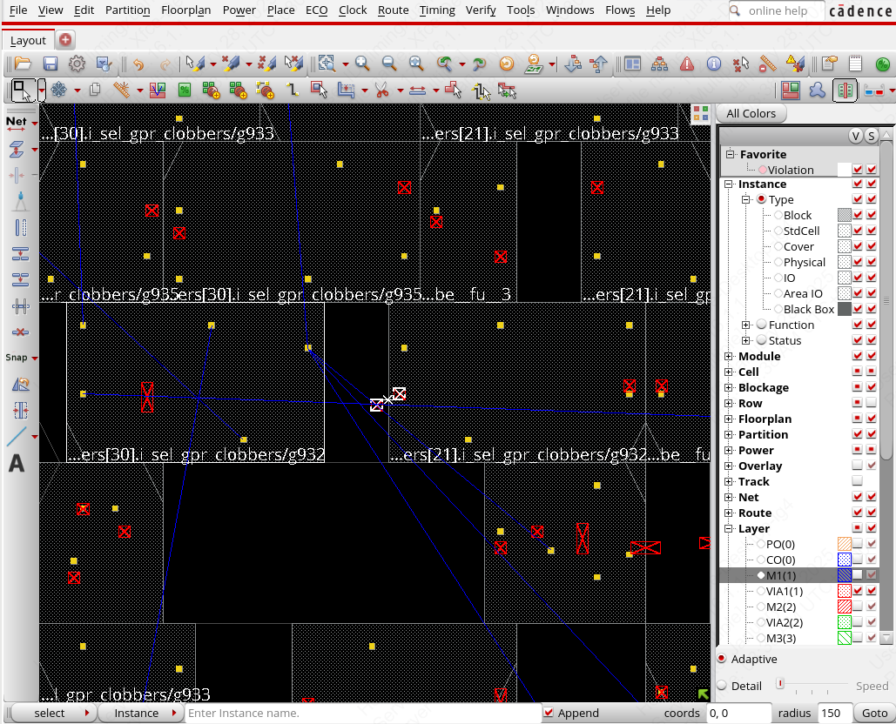
  <figcaption>Move Stdcell to fix DRC</figcaption>
</figure>

此时重新运行一遍上述的 ECO 布线命令，即可修复 DRC 违例。

!!! danger "DRC 约束"
    请**确保**此处的 DRC 违例**数目为 0**。

!!! question "标准单元的移动距离"
    在移动标准单元时，**至少**需要移动**2 格**，留下**足够的空间**为后续填充标准单元之间的间隙。

### 4.2.6 Signoff

在完成布局布线并且满足时序和 DRC 约束之后，需要进行版图填充、添加电源端口、导出文件等收尾操作。

#### 版图填充（`pnr/scripts/signoff/filler_decap.tcl`）

整个版图中没有摆放标准单元的区域称为**空白区域**，需要通过版图填充（Filler）填充，以保证版图的**平衡性**和**均匀性**。
我们使用 Decap 作为填充单元，进一步增强电源的稳定性。

``` tcl
addFiller
ecoRoute -fix_drc
verify_drc
```

* `addFiller`：填充空白区域。
* `ecoRoute -fix_drc`：在填充 Filler 之后修复 DRC 违例。
* `verify_drc`：检查 DRC 违例，确保没有引入新的 DRC。

#### 添加电源端口（`pnr/scripts/signoff/pg_pin.tcl`）

之前使用的 `globalNetConnect` 命令只是定义了**逻辑**上的电源端口，但是在版图中并没有实际的电源端口。
在 Signoff 阶段，需要添加实际的电源端口。
我们一般把**最高层**的 Power Stripe 作为**物理**电源端口。

``` tcl
for { set i 0 } { $i <= 32 } { incr i } {
    set initX [expr 13.5 + $i *36]
    set initY 0.75
    set stripeHeight 1198.3
    set stripeWidth 2
    createPGPin VSS -geom M8 $initX $initY [expr $initX + $stripeWidth] [expr $initY + $stripeHeight]
}

for { set i 0 } { $i <= 32 } { incr i } {
    set initX [expr 25.5 + $i *36]
    set initY 2.15
    set stripeHeight 1195.5
    set stripeWidth 2
    createPGPin VDD -geom M8 $initX $initY [expr $initX + $stripeWidth] [expr $initY + $stripeHeight]
}

for { set i 0 } { $i <= 32 } { incr i } {
    set initX [expr 37.5 + $i *36]
    set initY 1.45
    set stripeHeight 1196.9
    set stripeWidth 2
    createPGPin VDD_SRAM -geom M8 $initX $initY [expr $initX + $stripeWidth] [expr $initY + $stripeHeight]
}
```

命令格式为 `createPGPin <netName> -geom <layer> <x1> <y1> <x2> <y2>`，其中 `<x1> <y1>` 和 `<x2> <y2>` 分别表示电源端口的左下角和右上角的坐标。
请确保电源端口的位置和大小与 Power Stripe 的**位置和大小一致**。

可以通过 GUI 查看最高层 Power Stripe 的位置和大小，如下图所示。

<figure>
  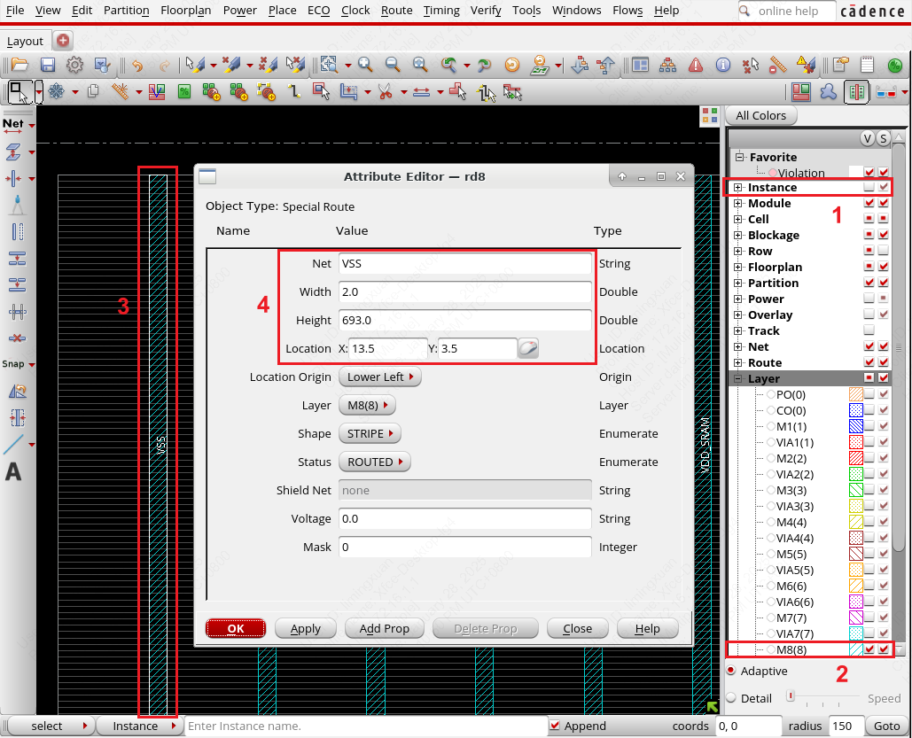
  <figcaption>Power Stripe Attribute</figcaption>
</figure>

请确保所有的 Power Stripe 都添加了对应的电源端口，添加后的结果如下图所示。

<figure>
  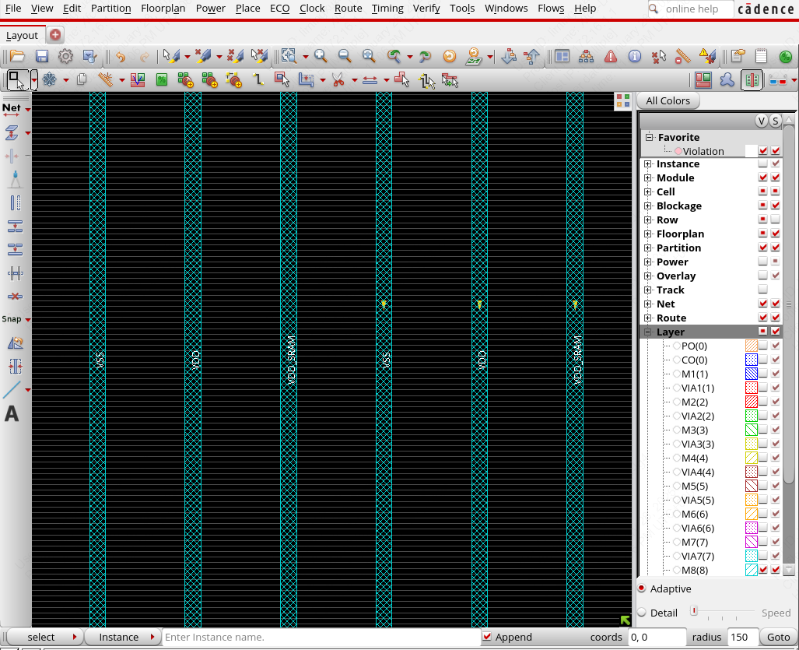
  <figcaption>Power/Ground Pin</figcaption>
</figure>

#### 结果文件导出（`pnr/scripts/signoff/file_gen.tcl`）

**直接运行**`pnr/scripts/signoff/file_gen.tcl` 脚本即可导出 Innovus 的结果文件。
该脚本会在 `pnr/<top_module_name>` 文件夹下生成 Innovus 的结果文件，包括如下几个文件：

- `<top_module_name>_flat_postpnr.v`：物理实现后带有电源（VDD, VSS 等）的 Flatten 网表，用于 **LVS 检查**。
- `<top_module_name>_hier_postpnr.v`：物理实现后没有电源的层次化网表，用于**后仿**。
- `<top_module_name>_tt0p8v25c.lib`：物理实现后的时序信息库，用于**顶层模块集成**。
- `<top_module_name>_tt0p8v25c.sdf`：物理实现后的标准延迟表，用于**后仿**。
- `<top_module_name>.lef`：物理实现后的版图信息，用于**顶层模块集成**。
- `<top_module_name>.gds2`：物理实现后的**版图文件**。

#### 网表格式转换（`pnr/scripts/signoff/netlist2cdl.tcl`）

为了便于后续的 **LVS 物理验证**，需要将网表转换为 CDL（Circuit Description Language）格式。

**直接运行** `pnr/scripts/signoff/netlist2cdl.tcl`，会在 `pnr/scripts/signoff` 文件夹下生成 `v2lvs_run.csh` 脚本文件并运行，将 Verilog 网表转换为 CDL 格式并保存为 `pnr/<top_module_name>/<top_module_name>.cdl`。在后续使用 Cadence Virtuoso 进行 LVS 物理验证时会用到该文件。

!!! success ""
    特别感谢 Zhantong Zhu 对本页内容的贡献和校对！