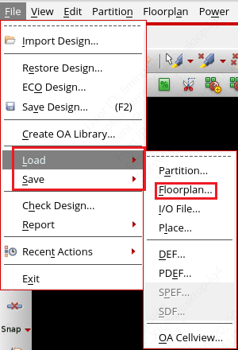

# 4. 数字子系统的物理设计（重构版）

!!! Warning
    Under development!

!!! tip "TLDR"
    1. 模板文件路径：`/work/home/limingxuan/common/SOC_CVA6/`

## 4.1 模板文件

## 4.2 物理设计流程

物理实现（后端）主要分为如下几个步骤：

- Floorplan
- Powerplan
- Place
- Clock Tree Synthesis (CTS)
- Route
- Metal Fill

<figure>
  
  <figcaption>Recommended Timing Closure Flow</figcaption>
</figure>

后端流程需要的数据如下：

- Timing Libaraies：`.lib` 文件，所有单元的时序信息。
- Physical Libraries：`.lef` 文件，所有单元的物理信息。
- Verilog Netlist：`.v` 文件，逻辑综合后的网表。
- Timing Constraints：`.sdc` 文件，时序约束。
- Multi-Mode Multi-Corner (MMMC) Setup for Timing：`.tcl` 文件，多模式多角约束。

Innovus 拥有全局 TCL 变量，这些变量都形如 `init_*`，可以通过 `set` 命令修改。
`saveDesign` 命令会将这些全局变量保存到 `.globals` 文件中。

!!! Tip "GUI 操作与脚本命令"
    所有的 GUI 操作都有对应的脚本命令，可以通过 GUI 操作后查看 `pnr/logs/<top_module_name>.cmd` 得到对应的脚本命令。

### 4.2.1 Floorplan

布局规划（Floorplan）决定了**数字逻辑模块（soft module）**的位置、尺寸和形状以及**硬宏（hard macro）**的放置。
布局规划包括确定整体尺寸、I/O 引脚布局、凸块（bump）分配（倒装芯片，flip chip）等。
布局规划与布局（placement）、早期全局布线（early global routing）相结合，是一个**迭代设计**过程。

#### 查看 Floorplan

在 Innovus GUI 界面右上角选择 `Floorplan View`，如下图所示。

<figure>
  
  <figcaption>Check Floorplan View</figcaption>
</figure>

可以看到初始的版图如下所示。

<figure>
  
  <figcaption>Initial Floorplan View</figcaption>
</figure>

中央为整个芯片的版图，分为 Core Box，IO Box 和 Die Box，如下图所示。

<figure>
  
  <figcaption>Floorplan Box Definition</figcaption>
</figure>

所有标准单元的宽度各不相同，但是高度均为 `$cell_height`（对于22nm工艺，即为0.7um，pre-shrink）。
在 Core box 的四周到 I/O 管脚之间通常留有一定的间距，用于摆放 Core Ring 和 I/O 管脚布线。

除去中央的 Die Box 之外，左侧的粉色正方形为 RTL 代码中的数字顶层模块，正方形的大小表示了模块的预估面积。

??? Tip "TU & EU"
    正方形左上角 `TU=64.7%` 为 Target Utilization (TU)，是指所有的标准单元和 Macro 的面积除以版图的面积。
    此外，还有 Effective Utilization (EU)，在整体版图面积的基础上除掉了 Placement，Routing Blockage 等其他阻碍物的面积，Innovus 默认不会显示EU。

Die Box 右侧为该数字模块中例化的 IP 硬核，在该案例中包括若干 SRAM 和2个 CIM Macro。

!!! Tip "检查 Macro"
    在这个时候可以检查此前例化的 SRAM 等 IP 是否有成功导入 Innovus。
    有时因为文件路径设置错误，会出现没有成功例化的情况。

Floorplan 左侧所有 RTL 模块都拥有各自的 Floorplan 约束，可以通过在 GUI 上右键点击模块选择 `Attrbite Editor -> Constraint Type`（快捷键 Q）查看或者修改。
约束一共有如下几种：

- `None`：该模块未被预放置（pre-placed）。模块的放置不受任何限制。
- `Guide`：该模块被预放置，用以引导该模块中的标准单元的摆放。
- `Fence`：该模块的标准单元必须摆放在指定的位置。
- `Region`：同 Fence 约束，同时其他模块的标准单元也可以摆放在该区域内。
- `Soft Guide/Cluster`：约束相比 Guide 更加宽松。

和左侧的 RTL 模块类似，右侧的 IP 硬核也有各自的 Floorplan 约束，可以通过右键点击 Macro 选择 `Attrbite Editor -> Constraint Type`（快捷键 Q）查看或者修改。
约束一共有如下几种：

- `unplaced`：该硬核未被预放置。
- `fixed`：该硬核被预放置，不能通过自动化工具移动，但是可以通过交互指令移动。
- `placed`：该硬核被预放置，但是可以通过自动化工具或者交互指令移动。
- `cover`：该硬核被预放置，但是不能移动。
- `softFixed`：该硬核被预放置，只能在合法化的过程中被移动。

#### 设置 Floorplan

一般情况下，我们使用如下命令设置 Floorplan。

```tcl
floorPlan -d {W H Left Bottom Right Top}
```

使用该命令设置版图大小总共需要6个参数，分别代表：

* 完整版图 (Die box) 的宽度。
* 完整版图的高度。
* Core box（用于摆放标准单元的版图部分）到I/O左侧边界的距离。
* Core box 到 I/O 底部边界的距离。
* Core box 到 I/O 右侧边界的距离。
* Core box 到 I/O 上方边界的距离。

一个初始的版图类似下图所示，设置该版图大小的命令为：`floorPlan -d 100 100 10 10 10 10`。

<figure>
  
  <figcaption>Example Floorplan</figcaption>
</figure>

??? Tip "根据标准单元密度自动设置版图大小"

    ```tcl
    floorPlan -su {aspectRatio [stdCellDensity [Left Bottom Right Top]]}
    ```

    - aspectRatio：版图的高宽比（高/宽）。
    - stdCellDensity：标准单元密度，即标准单元的个数。
    - Left Bottom Right Top：Core box 到 I/O 四个边界的距离。

    版图的面积会由如下公式计算得到：coreArea = stdCellArea ÷ stdCellDensity + macroArea。

#### 摆放 Macro

*脚本命令*

Macro 的名称可以在 `Floorplan View` 中右键点击 Macro 选择 `Attrbite Editor -> Name`（快捷键 Q）查看。
Macro 的名称通常比较长，为了后续脚本简洁，建议使用 TCL 命令 `set nickName realName` 给 Macro 设置简短的别名，例如 `set icache_data0 i_wt_dcache_i_wt_dcache_mem/gen_data_banks[0].i_data_sram`。

我们使用如下命令摆放 Macro。

```tcl
placeInstance instance_name location [orientation]
```

* `instance_name`：想要摆放的 Macro 名称。可以使用别名，例如：`$icache_data0`。
* `location`：有 X 和 Y 两个数值，分别表示 Macro 左下角的宽度方向和高度方向的坐标。
* `[orientation]`：（可选）设置 Macro 的摆放方向，可以选择 `R0`, `R90`, `R180`, `R270`, `MX`, `MX90`, `MY`, `MY90`，默认为 `R0`。

!!! Warning "Macro 摆放方向"
    由于 22nm 工艺中栅极必须纵向摆放，所以在摆放 Macro 时只能选择 `R0`, `R180`,`MX`, `MY`。

*GUI 操作*

点击工具栏中的 `Move/Resize/Reshape` 图标（快捷键 Shift+R），然后单击需要移动的 Macro（使用 Shift 多选），拖动到指定位置，再单击一次即可摆放。
该图标的次级菜单可以选择是否只能水平垂直移动。

<figure>
  
  <figcaption>Move/Resize/Reshape Widget</figcaption>
</figure>

<figure>
  
  <figcaption>Move Restriction</figcaption>
</figure>

在摆放多个 Macro 时，可以使用工具栏中的 `Floorplan Toolbox`。
按照下图中的步骤 1，可以看到在中央视图的左上角会出现一个工具箱，选中需要操作的多个 Macro，然后点击该工具箱即可对选中的 Macro 进行对齐、等间距排列等操作。

<figure>
  
  <figcaption>Floorplan Toolbox</figcaption>
</figure>

摆放完 Macro 之后，可以使用如下命令修改所有 Macro 的摆放属性。

```tcl
setInstancePlacementStatus -allHardMacros -status {fixed | placed | cover | softFixed}
```

摆放好所有 Macro 之后的版图如下所示。

<figure>
  
  <figcaption>Layout after placing macros</figcaption>
</figure>

#### 添加 Pin

对于大规模的数字模块，信号 I/O 管脚数量可能是成百上千的，手动编写命令设置每个管脚的摆放过于繁琐。
因此，我们使用 Innovus GUI 界面添加数字子系统的信号 I/O 管脚。

* 在上方工具栏选择 `Edit -> Pin Editor` 添加相应的管脚（详见下方 Pin Editor GUI 界面）。
* 打开 `pnr/logs/<top_module_name>.cmd` （Innovus 生成的日志文件）查看我们在 GUI 界面每一步操作所对应的命令，其中就有我们所需要的 `editPin` 命令。

<figure>
  
  <figcaption>Innovus Pin Editor</figcaption>
</figure>

可以设想，如果管脚数量增加，例如有2组 64-bit 输入信号和1组 64-bit 输出信号，手写脚本命令过于繁琐，这也是我们在此使用 GUI 界面的原因。

!!! tip "关于 I/O 管脚金属层数的选择"
    在常规的数字芯片中，奇数层的为横向金属，偶数层为纵向金属（常称为**奇横偶纵**），因此对于 Top/Bottom 可以选择 M4/M6 等金属，Left/Right 选择 M3/M5 等金属。在上面 2-bit 加法器的例子中，每一边（Left/Top/Bottom）仅仅用到了一层金属，在管脚较多的情况下，可以将不同的管脚分配到同一条边的不同金属层。

!!! tip "关于数字子系统的 Power/Ground 的 I/O 管脚"
    数字子系统的 Power/Ground 管脚和不同信号线的管脚有所区别，往往是以顶层1-2层的电源网格的形式给数字子系统进行供电，因此在布局布线完成之后使用 `createPGPin` 命令生成，在[后续步骤](./4_submodule_implementation_deprecated.md#416-执行-add_pg_pintcl)做进一步介绍。

添加完 pin 后的版图如下图所示，每一个黄色的三角形代表一个 I/O 管脚，Zoom In 可以进一步看到每个管脚的名称，所在的金属层，以及管脚的具体形状 (Pin Width, Pin Depth)。

<figure>
  
  <figcaption>Layout after adding I/O pins</figcaption>
</figure>

#### 保存/恢复 Floorplan

*脚本命令*

```tcl
saveFPlan <design_name>.fp
loadFPlan <design_name>.fp
```

*GUI 操作*

<figure>
  
  <figcaption>Save and Load Floorplan</figcaption>
</figure>

### 4.2.2 Powerplan

电源规划（Powerplan）是指在版图中规划**电源和接地网络**，以确保数字模块的稳定供电。
主要包括定义电源线地线（power net）、电源格栅（power stripe）、电源环（power ring）等。

#### 定义电源信号和接地信号

我们需要定义电源信号和接地信号的名称（已经在 `config/user_define.tcl` 中定义），并且将其与所有标准单元、Macro 的电源和接地端口连接起来。
使用的命令如下所示：

```tcl
globalNetConnect <globalNetName> {-type pgpin -pin <pinNamePattern> | -type tiehi [-pin <pinNamePattern>] | -type tielo [-pin <pinNamePattern>]} {-sinst <instName> | -all} [-override]
```

* `<globalNetName>` ：指定全局网络的名称，也就是我们在 `config/user_define.tcl` 定义的 `init_pwr_net` 和 `init_gnd_net`。
* `-type` 我们会用到三个选项：`pgpin`, `tiehi`, `tielo`，分别是 Power/Ground，1'b1，1'b0。
* `-pin <pinNamePattern>` 是指定的 Instance 中 Power/Ground 管脚的名称。对于标准工艺库中的元件，是 `VDD` 和 `VSS`；对于 SRAM/Register File Compiler 生成的 IP，是 `VDDCE`, `VDDPE` 和 `VSSE`。
* `-sinst <instName>`：选择指定的 Instance 名称，与 `placeMacro` 命令中的用法类似。
* `-all`：指该命令适用于该设计中所有的 Instance，包括标准单元和 Macro。
* `-override`：指定使用 `globalNetConnect` 命令的值覆盖先前设置的全局网络连接值。

一般的数字电路中，主要包括标准单元、Macro 和上拉下拉（tie high，tie low）三种类型的电源接地连接，因此需要分别对这三类进行电源和地的连接。

1. 标准单元。

```tcl
globalNetConnect VDD -type pgpin -pin VDD -all -override
globalNetConnect VSS -type pgpin -pin VSS -all -override
```

2. Macro，以 SRAM IP 为例。

```tcl
globalNetConnect VDD_SRAM -type pgpin -pin VDDCE -sinst $mainmem -override
globalNetConnect VDD_SRAM -type pgpin -pin VDDPE -sinst $mainmem -override
globalNetConnect VSS -type pgpin -pin VSSE  -sinst $mainmem -override
```

3. 上拉下拉。

```tcl
globalNetConnect VDD -type tiehi
globalNetConnect VSS -type tielo
```

#### 添加 power ring

Power Ring 用来确保电源信号的**稳定供电**，通常是在 Core Box、Macro 的四周摆放一圈电源线，一般包括 core ring 和 block ring。

添加 core ring 的示例命令如下所示：

```tcl
setAddRingMode -avoid_short true
addRing -nets [list VDD VDD_CIM VSS] \
        -type core_rings \
        -follow core \
        -layer {top M5 bottom M5 left M6 right M6} \
        -width 0.35 \
        -spacing 0.35 \
        -center 0
```

* `-type core_rings`：指定生成的 Power rings 为 Core rings，即在 Core box 和 I/O boundary 之间的空隙生成我们指定的 Power rings（回忆在设置版图大小的时候，我们指定了在 Core box 与 I/O boundary 之间设置 3.5um 的空隙）；
* `-nets [list VDD VDD_CIM VSS]`：指定生成的 Power rings 的信号名称。对于 Core rings，该数字子模块中**所有的 P/G 信号**至少需要生成一条 Core ring；
* `-follow core`：指定生成的 Core rings 以 Core boundary 为基准，如果设置 `-follow io`，则以 I/O boundary 为基准；
* `-layer {top M5 bottom M5 left M6 right M6}`：字面意思，设置 Core rings 在每个方向所在的金属层；
* `-width 0.35`：设置每一条 Core ring 的宽度；
* `-spacing 0.35`：设置两条相邻 Core rings 之间的间距；
* `-center 0`：设置 Core rings 是否在 I/O boundary 和 Core boundary 之间的中央，在此我们不指定 Core rings 位于间隙中央，因此需要通过 `-offset` 手动设置偏移量，在没有指定 `offset <value>` 的情况下，Innovus 工具会自动设置偏移量。

添加 Core rings 之后的部分版图如下所示.

<figure>
  
  <figcaption>Partial layout after adding core rings</figcaption>
</figure>

添加 Block ring 的示例命令如下所示：

```tcl
addRing -nets {VDD VSS} \
        -type block_rings \
        -around each_block \
        -layer {top M5 bottom M5 left M6 right M6} \
        -width {top 0.14 bottom 0.14 left 0.7 right 0.7} \
        -spacing {top 0.14 bottom 0.14 left 0.35 right 0.35} \
        -offset {top 0.04 bottom 0.04 left 0.7 right 0.7} \
        -center 0 \
        -threshold 0 \
        -jog_distance 0 \
        -snap_wire_center_to_grid None
```

* `-type block_rings`：指定我们在指定的 Macro 周围生成 Block rings，而非 Core rings；
* `-nets {VDD VSS}`：指定生成的 Block rings 包括 VDD 和 VSS，而不包括 VDD_CIM，因为 **Block rings 用于给 Macro 周围的标准单元供电**，而不用于给 Macro（例如 CIM 或 SRAM IP）供电；
* `-around selected`：指定生成的 Block rings 在选中的 Macro 周围，使用 `selectInst <instName>` 指定选中的 Macro；
* `-threshold 0`：指定相邻 Macros 周围相同 P/G 信号的 Block rings 之间所允许的最小距离，如果 Block rings 之间的距离小于这个值，两条 Block rings 会融合为一条 Block ring。在此该阈值设置为 0um，也就是 Block rings 不会自动融合。
* `-jog_distance 0`：指定 block ring 的最小微调距离，设定为 0um，即接受任意位置微调。
* `-snap_wire_center_to_grid None`：是否将 Block ring 的中心对齐到网格，设定为 None，即不对齐。
* `-layer`, `-spacing`, `-width`, `-offset`, `-center` 选项的意义和作用与 Core rings 相同，不再赘述。

??? tip "给特定 Macro 添加 Block ring"
    使用 `selectInst <instName>` 指定选中的 Macro，并在执行 `addRing` 命令时添加 `-around selected` 选项。

一个 SRAM IP 周围的 Block rings 如下所示。

<figure>
  
  <figcaption>Partial layout after adding block rings</figcaption>
</figure>

!!! Warning "Block Ring 的作用"
    Block ring 的作用是为了加强环周围**标准单元**的电源稳定性，因此在布局布线资源紧张的时候，可以考虑**删除** block ring。

#### 添加电源格栅（power stripe）

电源格栅（Power Stripe）是指在版图中规划**电源线**，一般情况下是高层金属。
Power Stripe 一次只能添加一层金属，指令如下所示。

```tcl
# add M6 power stripes
setAddStripeMode  -stacked_via_bottom_layer         M1 \
                  -stacked_via_top_layer            M6
addStripe         -nets                             { VSS VDD VDD_SRAM } \
                  -layer                            M6 \
                  -direction                        vertical \
                  -width                            2 \
                  -spacing                          15 \
                  -start_offset                     5 \
                  -set_to_set_distance              34 \
                  -block_ring_bottom_layer_limit    M1 \
                  -block_ring_top_layer_limit       M8 \
                  -padcore_ring_bottom_layer_limit  M1 \
                  -padcore_ring_top_layer_limit     M8

# add M7 power stripes
setAddStripeMode  -stacked_via_bottom_layer         M6 \
                  -stacked_via_top_layer            M7
addStripe         -nets                             { VSS VDD VDD_SRAM } \
                  -layer                            M7 \
                  -direction                        horizontal \
                  -width                            2 \
                  -spacing                          10 \
                  -start_offset                     0.7 \
                  -set_to_set_distance              24 \
                  -block_ring_bottom_layer_limit    M1 \
                  -block_ring_top_layer_limit       M8 \
                  -padcore_ring_bottom_layer_limit  M1 \
                  -padcore_ring_top_layer_limit     M8
```

* `-stacked_via_bottom_layer M1`：指定 stripe 能通过通孔连接到的最底层金属层。对于**最底层**的 stripe，该值设定为 **M1**；对于**其他**的 stripe，该值设定为**更低的一层**。
* `-stacked_via_top_layer M6`：指定 stripe 能通过通孔连接到的最高层金属层。一般设定为当前层。
* `-nets { VSS VDD VDD_SRAM }`：指定 Power Stripe 的信号名称，同时这些电源/地信号会被认为是**一个组（set）**。
* `-layer M6`：指定 Power Stripe 的金属层。
* `-direction vertical`：指定 Power Stripe 的方向，可以选择 `horizontal` 或 `vertical`。
* `-width 2`：指定 Power Stripe 的宽度。
* `-spacing 15`：指定一组 Power Stripe 之间的间距，即相邻电源线最相近的两条边之间的距离。
* `-start_offset 5`：指定 Power Stripe 距离版图边界的距离。
* `-set_to_set_distance 34`：指定组与组之间的间距，相邻两组对应位置之间的距离。
* `-block_ring_bottom_layer_limit M1`：指定 Power Stripe 在遇到 Block ring 时可以切换到的最底层金属层。
* `-block_ring_top_layer_limit M8`：指定 Power Stripe 在遇到 Block ring 时可以切换到的最高层金属层。
* `-padcore_ring_bottom_layer_limit M1`：指定 Power Stripe 在遇到 Pad/Core ring 时可以切换到的最底层金属层。
* `-padcore_ring_top_layer_limit M8`：指定 Power Stripe 在遇到 Pad/Core ring 时可以切换到的最高层金属层。

在实际的数字子系统中，需要根据需求灵活调整 `setAddStripeMode` 中的 `-stacked_via_bottom_layer` 参数，如下是两个实例。

*为 CIM macros 供电*

在该数字子系统中，CIM macro 最顶层的 P/G 网络是 **M6 横向排布**的 `VDDC` 和 `VSSC` Power stripes。
因此， M8 的 `VDD_CIM` 通过 VIA6 和 VIA7 连接到 CIM macro 内部的 P/G Pin，如下图所示。

<figure>
  
  <figcaption>P/G connections for CIM macros</figcaption>
</figure>

设置的指令如下。

```tcl
setAddStripeMode  -stacked_via_bottom_layer         M6 \
                  -stacked_via_top_layer            M8
addStripe         -layer                            M8 \
                  ...
```

*为 SRAM IP 供电*

SRAM IP 内部最顶层的 P/G 网络是 **M5 横向排布**的 `VDDPE`, `VDDCE` 和 `VSSE`。
因此，最底层的电源金属层 M6 的 `VDD` 通过 VIA5 连接到 SRAM macro 内部的 P/G Pin，如下图所示。

<figure>
  
  <figcaption>P/G connections for SRAM macros</figcaption>
</figure>

设置的指令如下。

```tcl
setAddStripeMode  -stacked_via_bottom_layer         M1 \
                  -stacked_via_top_layer            M6
addStripe         -layer                            M6 \
                  ...
```

添加全局电源格栅之后的版图如下所示。

<figure>
  
  <figcaption>Layout after adding power stripes</figcaption>
</figure>

#### 电源布线（power routing）

**标准单元**通过 **M1** 金属层供电/接地，这些供电/接地的 M1 金属被称为**电源轨道（power rail）**。
需要将高层金属层的 Power Stripe 与 M1 金属层的 Power Stripe 连接起来。

```tcl
sroute -connect                { corePin } \
       -nets                   { VSS VDD }
       -layerChangeRange       { M1 M6 } \
       -crossoverViaLayerRange { M1 M6 } \
       -targetViaLayerRange    { M1 M6 } \
       -allowJogging           0 \
       -allowLayerChange       1 \
       -deleteExistingRoutes
```

* `-connect { corePin }`：指定连接的对象，这里是 Core Pin，即 Core box 的边界上的管脚。
* `-nets { VSS VDD }`：指定连接的信号名称。
* `-layerChangeRange { M1 M6 }`：指定可以改变的金属层范围。
* `-crossoverViaLayerRange { M1 M6 }`：指定可以穿越的金属层范围。
* `-targetViaLayerRange { M1 M6 }`：指定目标金属层范围。
* `-allowJogging 0`：是否允许走线时的弯曲。
* `-allowLayerChange 1`：是否允许金属层的改变。
* `-deleteExistingRoutes`：是否删除已有的走线。

在设置 `-*LayerRange` 时，需要注意**顶层金属层** 应为 power stripe 中的**最底层金属层**。


!!! question "`sroute` 之后 GUI 中 Macro 周围的 Violation"

    在执行 `sroute` 之后，会出现 Macro 周围的 Violation，在 GUI 中表现为白色的叉号。
    这些违例并不是 DRC 错误，在之后的布局布线中会进行微调，可以忽略。

??? Warning "`editPowerVia` 的作用"
    在执行 `addRing, addStripe, sroute` 的时候会**自动插入** Via，因此单独执行 `editPowerVia` 在大多数情况下**不会有任何效果**。

电源布线之后的版图如下所示。

<figure>
  
  <figcaption>Partial layout after sroute</figcaption>
</figure>

!!! tip "检查 Global Net Connection"
    在添加全局的 P/G 网络后，需要注意检查最顶层 (M8) 的 P/G 有没有通过 VIA 正确连接到最底层 (M1) 以及各个 Macro 内部的 P/G 网络中。

    如果发现连接有误，需要及时修改 `pnr/scripts/floorplan/global_net_connect.tcl` 和 `pnr/scripts/powerplan/power_stripe.tcl` 中的相关命令，并通过查看 `LEF` 文件或者 Innovus GUI 界面查看 各个 Macro 内部 P/G Pin 所在的金属层。


#### 添加 Halo 和 Route Blockage

Halo 用于防止 Macro 四周摆放标准单元，Route Blockage 用于防止布线进入指定区域，两者都可以减缓布线阻塞。

