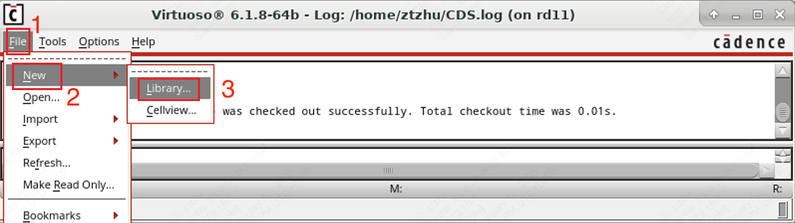
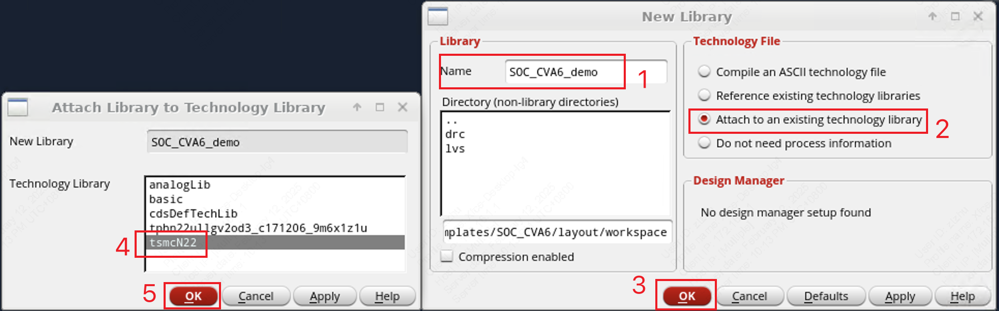
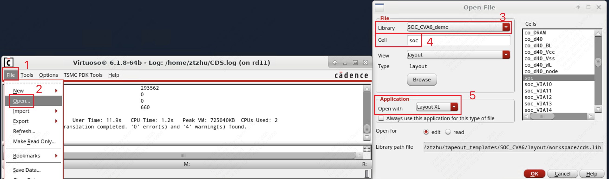

# 6. LVS/DRC 物理验证

!!! tip "TLDR（太长不看）"
    1. 模板文件路径：`/work/home/limingxuan/common/SOC_CVA6/`
    2. 启动 Cadence Virtuoso：
    3. 查看 LVS 验证结果：
    4. 查看 DRC 验证结果：

## 6.1 模板文件

在 Cadence Innovus 中完成[数字子系统的物理设计](./4_submodule_implementation_new.md)或者[顶层系统的物理设计](./5_io.md)之后，需要在 Cadence Virtuoso 中进行 LVS 和 DRC 物理验证。

??? 什么是 LVS 与 DRC 物理验证
    LVS（Layout Versus Schematic）物理验证用于确保集成电路的版图（Layout）与其原理图（Schematic）一致。LVS 检查的内容包括：电路网络一致性、器件匹配。
    在逻辑综合、物理实现的流程正确的情况下，数字子系统的 LVS 的准确性基本是由 EDA 工具保障的；而手动绘制的版图正确性则有更大概率出现人为的错误。
    
    DRC（Design Rule Check）用于确保集成电路的版图符合代工厂（例如 TSMC、SMIC）制造工艺的设计规则。DRC 检查内容包括：最小间距、最小宽度、重叠与对准等。
    在 Innovus 物理设计过程中，有可能因为布局布线的密度过高，导致走线距离小于最小距离，从而导致 DRC 错误。

我们沿用[数字子系统的物理设计](./4_submodule_implementation_new.md)中使用的模板文件，进行 LVS 和 DRC 物理验证的流程，其文件夹路径为：

```
/work/home/limingxuan/common/SOC_CVA6/
```

```
SOC_CVA6
├── src                                          # Source Files
│   ├── macro                                    # Manually drawn layout o
```

### 6.1.1 修改配置文件

### 6.1.2 启动 Virtuoso

在 `SOC_CVA6` 文件夹下，运行如下命令启动 Virtuoso。

```shell
b make virtuoso
```

### 6.1.3 导入设计（初次使用）

若**首次打开** Virtuoso，需要将 Innovus 完成的设计导入到 Virtuoso 中。

首先，在 Virtuoso 中新建一个 Library 用于存放我们的设计。在弹出的 Virtuoso Terminal 中选择 `File -> New -> Library`，如下所示。

<figure>
  
  <figcaption>Create new library in Virtuoso</figcaption>
</figure>

随后，输入该 Library 的名字，并选择 `Attach to an existing technology library`。对于 TSMC 22nm 的流片，选择 `tsmcN22`，如下所示。

<figure>
  
  <figcaption>Attach to an existing technology library</figcaption>
</figure>

新建一个 Library 之后，回到 Virtuoso Terminal，并选择 `File -> Import -> Stream`，如下所示。

<figure>
  
  <figcaption>Import existing design to Virtuoso (1)</figcaption>
</figure>

随后，在弹出的 `XStream In` 窗口中导入我们设计的 `<top_module_name>.gds2` 文件。文件在 `pnr/<top_module_name>` 文件夹下生成。之后，选择将设计导入到之前新建的 Library 中，最后点击 `Translate`。

<figure>
  
  <figcaption>Import existing design to Virtuoso (2)</figcaption>
</figure>

<figure>
  
  <figcaption>Import existing design to Virtuoso (3)</figcaption>
</figure>

??? tip "StreamIn 报错"
    在 Virtuoso 导入设计之后，可能会出现类似下面这样的报错，可以不予理会。
    <figure>
      
      <figcaption>Virtuoso StreamIn Warning</figcaption>
    </figure>

### 6.1.4 打开设计

如果之前已经把设计导入到 Virtuoso 中，则可以在 Virtuoso Terminal 中选择 `Open` 打开设计，具体步骤如下所示。

<figure>
  
  <figcaption>Open design layout in Virtuoso</figcaption>
</figure>

## 6.2 LVS 检查

## 6.3 DRC 检查

### Submodule

### Top (w/ Dummy)

### PAD

### Antenna

!!! Warning "Under development!"