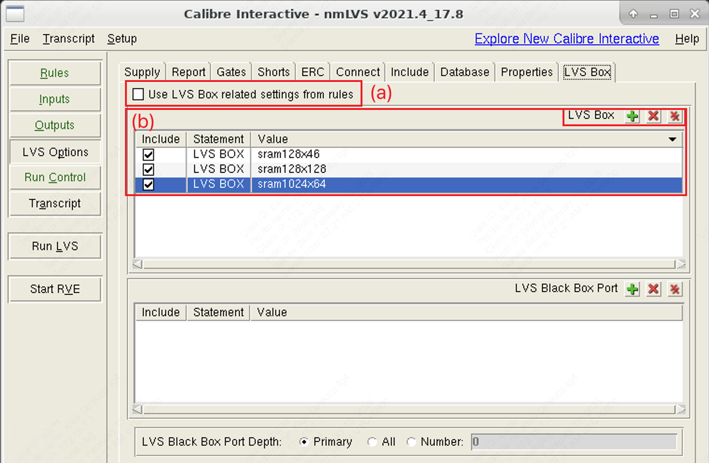

# 6. LVS/DRC 物理验证

!!! tip "TLDR（太长不看）"
    1. 模板文件路径：`/work/home/limingxuan/common/SOC_CVA6/`
    2. 启动 Cadence Virtuoso：
    3. 查看 LVS 验证结果：
    4. 查看 DRC 验证结果：

## 6.1 模板文件

在 Cadence Innovus 中完成[数字子系统的物理设计](./4_submodule_implementation_new.md)或者[顶层系统的物理设计](./5_io.md)之后，需要在 Cadence Virtuoso 中进行 LVS 和 DRC 物理验证。

??? info "什么是 LVS 与 DRC 物理验证"
    LVS（Layout Versus Schematic）物理验证用于确保集成电路的版图（Layout）与其原理图（Schematic）一致。LVS 检查的内容包括：电路网络一致性、器件匹配。
    在逻辑综合、物理实现的流程正确的情况下，数字子系统的 LVS 的准确性基本是由 EDA 工具保障的；而手动绘制的版图正确性则有更大概率出现人为的错误。
    
    DRC（Design Rule Check）用于确保集成电路的版图符合代工厂（例如 TSMC、SMIC）制造工艺的设计规则。DRC 检查内容包括：最小间距、最小宽度、重叠与对准等。
    在 Innovus 物理设计过程中，有可能因为布局布线的密度过高，导致走线距离小于最小距离，从而导致 DRC 错误。

我们沿用[数字子系统的物理设计](./4_submodule_implementation_new.md)中使用的模板文件，进行 LVS 和 DRC 物理验证的流程，其文件夹路径为：

```
/work/home/limingxuan/common/SOC_CVA6/
```

其文件夹结构为：

```
SOC_CVA6
├── layout
│   ├── Makefile
│   ├── dummy                                    # Files for Dummy Fill
│   │   ├── Dummy_BEOL_Calibre_22nm_001.13a
│   │   ├── Dummy_FEOL_Calibre_22nm_001.13a
│   │   └── run_Dummy
│   ├── rule                                     # Design rules and constraints for LVS and DRC
│   │   ├── CLN22ULP_9M_001_ANT.15a
│   │   ├── CN22_WIRE_BOND_9M_6X1Z1U_001.11a
│   │   ├── calibre.drc
│   │   ├── calibre_IP.drc
│   │   └── calibre.lvs
│   ├── runset                                   # Configuration of the verification tools (i.e., Calibre)
│   │   ├── drcAntenna.runset
│   │   ├── drcChip.runset
│   │   ├── drcIP.runset
│   │   └── lvs.runset
│   ├── workspace                                # Main folder for storing Virtuoso-generated files
│   │   ├── .cdsinit                             # Initialization file for Calibre verfication tools
│   │   ├── cds.lib                              # Index file storing the technology library paths
│   │   ├── drc                                  # DRC reports generated by Virtuoso
│   │   │   └── ...
│   │   ├── lvs                                  # LVS reports generated by Virtuoso
│   │   │   └── ...
│   │   └── ...
├── pnr                                          # Main folder for Innovus physical implementation
│   ├── Makefile
│   ├── logs                                     # Log files generated by Innovus
│   │   └── ...
│   ├── scripts                                  # PnR scripts for Innovus
│   │   └── ...
│   └── <top_module_name>                        # Files generated by Innovus during physical implementation
│       ├── backup
│       │   └── ...
│       ├── reports
│       │   └── ...
│       ├── <top_module_name>.gds2               # Top module layout
│       ├── <top_module_name>.lef                # Top module physical layout
│       ├── <top_module_name>_flat_postpnr.v     # Flattened netlist w/ P/G pins
│       ├── <top_module_name>_hier_postpnr.v     # Hierarchical netlist w/o P/G pins for post-implementation simulation
│       ├── <top_module_name>_tt_0p88v_25c.lib   # Top module timing library
│       └── <top_module_name>_tt_0p88v_25c.sdf   # Top module standard delay format
└── ...
```

### 6.1.1 修改配置文件

在 `layout/

### 6.1.2 启动 Virtuoso

在 `SOC_CVA6` 文件夹下，运行如下命令启动 Virtuoso。

```shell
b make virtuoso
```

### 6.1.3 导入设计（初次使用）

若**首次打开** Virtuoso，需要将 Innovus 完成的设计导入到 Virtuoso 中。

首先，在 Virtuoso 中新建一个 Library 用于存放我们的设计。在弹出的 Virtuoso Terminal 中选择 `File -> New -> Library`，如下所示。

<figure>
  
  <figcaption>Create new library in Virtuoso</figcaption>
</figure>

随后，输入该 Library 的名字，并选择 `Attach to an existing technology library`。对于 TSMC 22nm 的流片，选择 `tsmcN22`，如下所示。

<figure>
  
  <figcaption>Attach to an existing technology library</figcaption>
</figure>

新建一个 Library 之后，回到 Virtuoso Terminal，并选择 `File -> Import -> Stream`，如下所示。

<figure>
  
  <figcaption>Import existing design to Virtuoso (1)</figcaption>
</figure>

随后，在弹出的 `XStream In` 窗口中导入我们设计的 `<top_module_name>.gds2` 文件。文件在 `pnr/<top_module_name>` 文件夹下生成。之后，选择将设计导入到之前新建的 Library 中，最后点击 `Translate`。

<figure>
  
  <figcaption>Import existing design to Virtuoso (2)</figcaption>
</figure>

<figure>
  
  <figcaption>Import existing design to Virtuoso (3)</figcaption>
</figure>

??? tip "StreamIn 报错"
    在 Virtuoso 导入设计之后，可能会出现类似下面这样的报错，可以不予理会。
    <figure>
      
      <figcaption>Virtuoso StreamIn Warning</figcaption>
    </figure>

### 6.1.4 打开设计

如果之前已经把设计导入到 Virtuoso 中，则可以在 Virtuoso Terminal 中选择 `Open` 打开设计，具体步骤如下所示。

<figure>
  
  <figcaption>Open design layout in Virtuoso</figcaption>
</figure>

??? tip "调整 Virtuoso Display Settings"
    Virtuoso 的熟练使用涉及到很多快捷键和高阶功能，值得单独开辟一个章节详述，但是调整显示设置对于基本使用有还是有必要的。

    设置最小格点：在 Virtuoso Layout Suite L 上方菜单栏中选择 `Options -> Display`，把 `X Snap Spacing` 和 `Y Snap Spacing` 改成 0.005

## 6.2 LVS 物理验证

### 6.2.1 导入 LVS Rule 与 CDL 网表文件

在 Virtuoso Layout Suite L 上方菜单栏中选择 `Calibre -> Run nmLVS`，如下所示。

<figure>
  
  <figcaption>Open Calibre options in Virtuoso</figcaption>
</figure>

??? bug "菜单栏中没有 `Calibre` 选项"
    如果使用文档提供的模板文件，原则上应该不会出现这个情况。这是因为在启动 Virtuoso 的时候缺少一个初始化文件。
    可以将 `/work/home/limingxuan/common/SOC_CVA6/layout/workspace/.cdsinit` 复制到自己项目下的 `layout/workspace/` 路径下面。
    或者也可以将上述 `.cdsinit` 复制到 `/work/home/<your_name>` 目录下，这样在任何位置打开 Virtuoso 都可以使用 Calibre 工具了 :)

随后，按照如下操作步骤导入 LVS Rules，文件位于 `/layout/rule/calibre.lvs` 路径。

<figure>
  
  <figcaption>Import LVS rules in Calibre</figcaption>
</figure>

为了保持工作目录规整，我们指定将 LVS 输出文件放在 `layout/workspace/lvs` 路径下，如下所示。

<figure>
  
  <figcaption>Choose LVS directory in Calibre</figcaption>
</figure>

随后，在 Calibre Interactive 窗口中选择 `Inputs`，并在 `Netlist` 中导入 Innovus 生成的 CDL 网表文件，步骤如下。

<figure>
  
  <figcaption>Import CDL netlist in Calibre</figcaption>
</figure>

此外，可以在 `Inputs` 界面选择 `Hierarchical（层次化）` 或者 `Flat（扁平化）` 选项。这是两种不同的验证方式，但是原则上来讲，两种验证方法对于 LVS 正确性没有影响。

* 层次化验证保留了设计的层次结构，每个模块在验证过程中都作为一个独立的单元进行检查。层次化验证速度更快，可以减少相同子模块的重复验证计算。
* 扁平化验证将设计的所有模块展开为一个平面结构，即所有模块的内部细节都被展开并作为一个整体进行检查。检查会更加全民啊，但是速度较慢、内存占用更高。

### 6.2.2 设置 LVS 运行选项

导入了 LVS 所需的输入文件之后，在 `LVS Options` 设置 LVS 物理验证的运行选项，主要有 `Supply`, `Connect`, `LVS Box` 三个需要选择。

!!! tip "Calibre Interactive 中没有 `LVS Options` 选项"
    在 Calibre Interactive 上方菜单点击 `Setup`（如下图 `1` 所示），并勾选 `LVS Options`，然后就可以看到具体的选项了 :)

* 在 `Supply` 中添加 `Power nets` 与 `Ground nets`，与 Innovus 物理实现的设置保持一致。

<figure>
  
  <figcaption>Configure P/G nets in LVS options</figcaption>
</figure>

* 在 `Connect` 中勾选 `Connect nets with colon`，以及 `Don't connect nets by name`，如下所示。

<figure>
  
  <figcaption>Configure connections in LVS options</figcaption>
</figure>

* 在 `LVS Box` 可以选择 (a) 不处理特定的模块或者子电路，进行常规的 LVS 流程；(b) 根据设计的情况选择添加 LVS Box，需要在 GUI 界面中手动添加想添加 Box 的**子模块名称**，名称需要和 Virtuoso 设计中 Cell 名称保持一致。下图所示，给 CVA6 CPU 中的 3 种 SRAM IP 添加了 LVS Box。

<figure>
  
  <figcaption>Configure LVS box in LVS options</figcaption>
</figure>

??? info "什么是 LVS Box"
    LVS Box 可以帮助用户在进行版图与原理图对比时，将某些模块视为一个“黑盒子”，即**不展开其内部结构**进行详细检查，而是只检查其**外部连接**是否正确。使用 LVS Box 可以简化和加速 LVS 检查过程，特别是在处理复杂设计时，但是同时可以确保这些模块的外部连接是正确的。

### 6.2.3 保存 LVS 相关设置

在 Calibre Interactive 上方菜单栏选择 `File -> Save Runset As` 可以将 以上对于 LVS 物理验证的配置（包括输入读取文件路径、LVS Options 选项等）统一写入到一个 Runset 文件中。
为了保持工作目录规整，建议将 Runset 保存至 `layout/workspace/runset/lvs.runset` 路径。
在之后进行相同设计的版本迭代时，可以直接选择 `File -> Load Runset` 读取之前保存的 Runset 文件，加速工作流。

### 6.2.4 查看 LVS 物理验证结果

在 Calibre Interactive 左侧选择 `Run LVS`，即可开始 LVS 物理验证。按照此前的设置，LVS 输出文件在 `layout/workspace/lvs` 路径下。

## 6.3 DRC 物理验证

### 6.3.1 设置 DRC 运行选项

### 6.3.2 数字子系统的 DRC 流程

### 6.3.3 顶层模块 (w/ Dummy) 的 DRC 流程

### 6.3.4 PAD

### 6.3.5 Antenna

!!! Warning "Under development!"