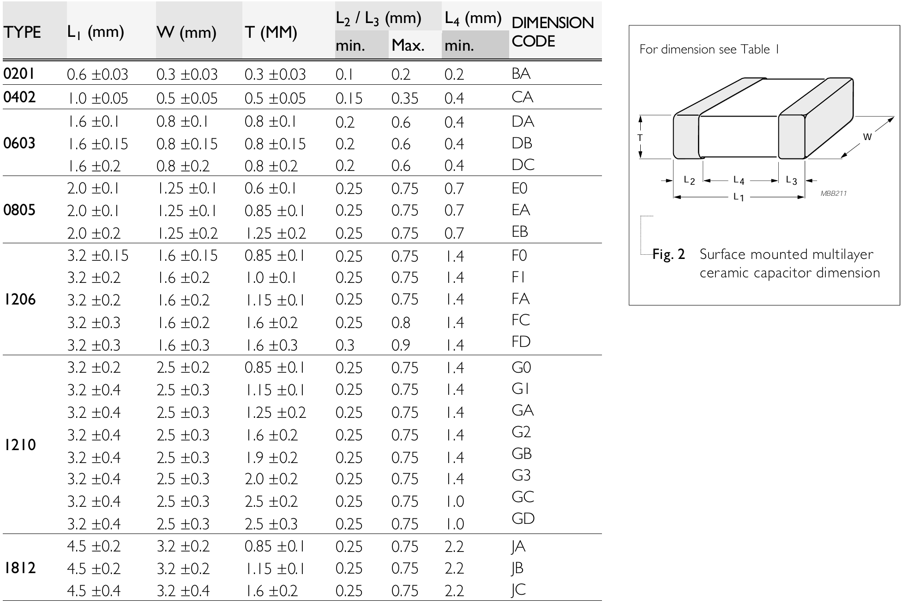

# 8. PCB 绘制

板级电路在测试过程中为芯片提供电源、时钟、GPIO配置接口等。

## 整体流程

**原理图设计 —— PCB绘制 —— DRC检查 —— PCB下单 ——（SMT下单）**

原理图设计：设计电路板的原理图，这个过程中需要对调用的元器件进行选型。  
PCB绘制：电路板真实的物理实现，包括电路板的大小边界、元器件位置摆放、走线链接。  
DRC: 检查设计的PCB是否符合Design Rule、PCB是否与原理图一致。   
PCB下单：完成原理图PCB设计后，将设计好的PCB压缩可以通过嘉立创下单助手下单安排生产。 （空PCB无元器件）     
SMT下单：SMT是PCB厂家根据提供的PCB信息将所需要的元器件通过回流焊方式焊接。（PCB+元器件）

### 8.1 元器件与EDA工具

#### 元器件分类

为测试芯片绘制的PCB所用到的元器件通常可以分为三类：有源器件、无源器件、连接器。

有源器件：芯片、二极管、LED等需要供电的器件。  
无源器件：R、C、开关等无需供电的器件。  
连接器：排针，电源接口等传递电源和信号的接口。

!!! tip "提示"
    对于数字芯片测试来说，如果使用外部稳压源来供电的话，通常无需使用板级LDO/BUCK来产生电源，因此只需要用到无源器件和连接器。

#### 元器件封装

封装从结构上可以分为插件与贴片两种，插件是通过通孔焊接在PCB上，贴片则是通过PCB的焊盘进行焊接。插件的机械稳定性更好，贴片的寄生参数更小。

- 有源器件的封装种类繁多，不一一赘述，可以在立创商城自行选型。

- 无源器件封装  
RC通常使用贴片封装0402、0603、0805、1206。器件的尺寸与数字大小成正相关
<figure>
  
  <figcaption>RC Package</figcaption>
</figure>

- 连接器封装  
    - 2.54 - 1(2) - 2/3/4/8P 排针, 常用为GPIO配置引脚，低频低电流下也可以作为信号IO和电源输入。
        - 2.54：排针pin间距为2.54mm  
        - 1(2)：单排(双排)   
        - 2/3/4/8P：2/3/4/8个pin

    - 5557 - 2P 电源接口
    - SMA，可用作高频信号传输，例如时钟

#### EDA工具

常用的PCB设计EDA工具主要是Altimu Designer，嘉立创EDA。Altimu Designer在北大软件中心中没有提供，需要从其他途径下载，嘉立创EDA可以免费试用。下面教程主要是基于Altimu Designer，但两者的操作是很类似的。

### 8.2 原理图绘制

!!! Warning "Under development!"