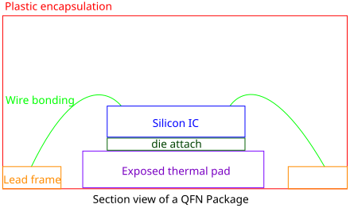
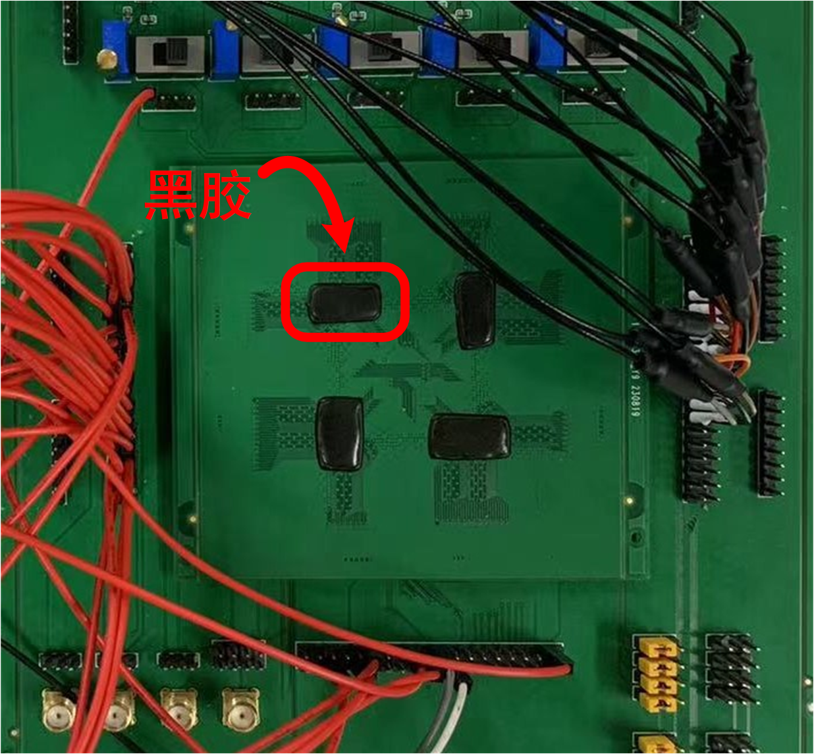

# 9. 划片与封装

## 9.1 划片

[芯片分割](https://en.wikipedia.org/wiki/Die_singulation)（Die singulation），也称为晶圆切割（wafer dicing）。
在这个过程中，一个大的硅晶圆被切割成许多小的，独立的半导体芯片或集成电路。
每个小芯片都包含了一个完整的电路。
划片过程的主要目的是**将硅晶圆上的多个集成电路分离开来，以便于后续的封装和测试**。

??? info "扩展：划片机"
    划片通常是通过一个高精度的划片机完成的，这个机器可以根据预设的模式和尺寸切割硅晶圆。划片机使用一种高速旋转的刀片（通常是金刚石或其他硬质材料）在硅晶圆上进行切割。这个过程需要非常精确，以确保每个芯片都被正确地切割，而不会损坏芯片上的电路。

划片需要提供的资料如下：

- **划片数量**
- **划片示意图**

<figure>
  
  <figcaption>划片图示例</figcaption>
</figure>

划片所需的时间大约为**1-2天**，20颗50颗划片时间基本一样。

## 9.2 封装

[芯片封装](https://en.wikipedia.org/wiki/Integrated_circuit_packaging)（Integrated circuit packaging，chip packaging）发生在硅晶圆划片之后。封装的主要目的是保护微小、脆弱的半导体芯片，同时提供交互接口，**使芯片可以和电子设备的其他部分进行电气连接**。

我们使用的封装方式主要有两种：

- 插座封装（Socketed Packaging）
- COB（Chip on Board）

### 插座封装

这种封装方式的主要特点是将芯片封装在一个管壳（package）中，并通过插座（socket）将其连接到电路板上。这种方法的优点是**便于更换、升级和维护芯片**，缺点是**电气性能稍差**。

<figure>
  
  <figcaption>插座封装示例</figcaption>
</figure>

??? info "拓展：封装过程"
    1. **芯片装载（Die Attachment）**：切割后的芯片（也称为“die”）被安装到封装的载体（通常是金属或塑料）上。这个过程通常使用导热材料（例如银胶或锡膏）来确保良好的热接触，帮助散热。

    2. **线引封装（Wire Bonding）**：芯片上的电路通过极细的金属线（通常是金或铝）连接到封装的引脚上。这些金属线非常细小，通常需要使用高精度的自动设备来进行操作。

    3. **封装封闭（Encapsulation）**：芯片和金属线被一个保护层覆盖，通常是塑料或陶瓷。这个保护层可以防止芯片受到物理损伤，同时也防止环境因素（如湿气、灰尘、化学物质等）对芯片造成损害。

    完成封装后的芯片可以被焊接到电路板上，与电子设备的其他部分进行电气连接。

芯片封装有很多种类型，我们使用的封装类型为[QFN](https://en.wikipedia.org/wiki/Flat_no-leads_package)（Quad Flat No-leads）封装。
QFN（Quad Flat No-leads）封装是一种四面平无引脚封装。
它的特点是四个边都是平的，没有传统意义上的引脚，而是采用周边的pad（电接触垫）来实现电路的连接。
QFN封装体积小、高度低，因此对于需要小型化的电子设备来说，非常适合。

<figure>
  
  <figcaption>QFN 封装侧视图</figcaption>
</figure>

QFN后面的数字（如QFN64、QFN88 10\*10）通常指的是封装上的pad的数量。
例如，QFN64的封装就有64个pad，而QFN88的封装则有88个pad。"10\*10"则通常指的是封装的物理尺寸，单位通常是毫米(mm)。

我们需要将芯片的IO与QFN封装的pad进行对应，以便在封装过程中正确连接芯片的电路。

<figure>
  
  <figcaption>打线图示例</figcaption>
</figure>

插座封装需要提供的资料如下：

- **打线图**：封装厂商需要根据该图完成引线
- **封装类型和尺寸**：即 QFN64 8\*8、QFN88 10\*10等
- **QFN插座**：需要淘宝自行购买与封装类型相匹配的socket，直接邮寄给PCB厂商焊接

!!! Warning "注意"
    留意封装厂商提供的封装类型和尺寸信息，以确保购买正确的插座！
    有些封装尺寸不支持快封，支持快封的类型和尺寸如下：

    

    <table style="border-collapse: collapse;">
        <thead>
            <tr style="border: 2px solid black; background-color: #9a0000; color: white;">
                <th style="border: 1px solid black; padding: 8px; text-align: center; vertical-align: middle;">封装类型</th>
                <th style="border: 1px solid black; padding: 8px; text-align: center; vertical-align: middle;">芯片长度（mm）</th>
                <th style="border: 1px solid black; padding: 8px; text-align: center; vertical-align: middle;">芯片宽度（mm）</th>
                <th style="border: 1px solid black; padding: 8px; text-align: center; vertical-align: middle;">封装尺寸（mm x mm x mm）</th>
            </tr>
        </thead>
        <tbody>
            <tr style="border: 2px solid black; background-color: white; color: black;">
                <td style="border: 1px solid black; padding: 8px; text-align: center; vertical-align: middle;">QFN28</td>
                <td style="border: 1px solid black; padding: 8px; text-align: center; vertical-align: middle;">2.40</td>
                <td style="border: 1px solid black; padding: 8px; text-align: center; vertical-align: middle;">2.40</td>
                <td style="border: 1px solid black; padding: 8px; text-align: center; vertical-align: middle;">4 x 4 x 0.4</td>
            </tr>
            <tr style="border: 2px solid black; background-color: #eeeeee; color: black;">
                <td style="border: 1px solid black; padding: 8px; text-align: center; vertical-align: middle;">QFN32</td>
                <td style="border: 1px solid black; padding: 8px; text-align: center; vertical-align: middle;">3.30</td>
                <td style="border: 1px solid black; padding: 8px; text-align: center; vertical-align: middle;">3.30</td>
                <td style="border: 1px solid black; padding: 8px; text-align: center; vertical-align: middle;">5 x 5 x 0.5</td>
            </tr>
            <tr style="border: 2px solid black; background-color: white; color: black;">
                <td style="border: 1px solid black; padding: 8px; text-align: center; vertical-align: middle;">QFN40</td>
                <td style="border: 1px solid black; padding: 8px; text-align: center; vertical-align: middle;">4.24</td>
                <td style="border: 1px solid black; padding: 8px; text-align: center; vertical-align: middle;">4.24</td>
                <td style="border: 1px solid black; padding: 8px; text-align: center; vertical-align: middle;">6 x 6 x 0.5</td>
            </tr>
            <tr style="border: 2px solid black; background-color: #eeeeee; color: black;">
                <td style="border: 1px solid black; padding: 8px; text-align: center; vertical-align: middle;">QFN40</td>
                <td style="border: 1px solid black; padding: 8px; text-align: center; vertical-align: middle;">4.40</td>
                <td style="border: 1px solid black; padding: 8px; text-align: center; vertical-align: middle;">4.40</td>
                <td style="border: 1px solid black; padding: 8px; text-align: center; vertical-align: middle;">6 x 6 x 0.4</td>
            </tr>
            <tr style="border: 2px solid black; background-color: white; color: black;">
                <td style="border: 1px solid black; padding: 8px; text-align: center; vertical-align: middle;">QFN48</td>
                <td style="border: 1px solid black; padding: 8px; text-align: center; vertical-align: middle;">4.40</td>
                <td style="border: 1px solid black; padding: 8px; text-align: center; vertical-align: middle;">4.40</td>
                <td style="border: 1px solid black; padding: 8px; text-align: center; vertical-align: middle;">6 x 6 x 0.4</td>
            </tr>
            <tr style="border: 2px solid black; background-color: #eeeeee; color: black;">
                <td style="border: 1px solid black; padding: 8px; text-align: center; vertical-align: middle;">QFN48</td>
                <td style="border: 1px solid black; padding: 8px; text-align: center; vertical-align: middle;">5.20</td>
                <td style="border: 1px solid black; padding: 8px; text-align: center; vertical-align: middle;">5.20</td>
                <td style="border: 1px solid black; padding: 8px; text-align: center; vertical-align: middle;">7 x 7 x 0.5</td>
            </tr>
            <tr style="border: 2px solid black; background-color: white; color: black;">
                <td style="border: 1px solid black; padding: 8px; text-align: center; vertical-align: middle;">QFN56</td>
                <td style="border: 1px solid black; padding: 8px; text-align: center; vertical-align: middle;">6.00</td>
                <td style="border: 1px solid black; padding: 8px; text-align: center; vertical-align: middle;">6.00</td>
                <td style="border: 1px solid black; padding: 8px; text-align: center; vertical-align: middle;">8 x 8 x 0.5</td>
            </tr>
            <tr style="border: 2px solid black; background-color: #eeeeee; color: black;">
                <td style="border: 1px solid black; padding: 8px; text-align: center; vertical-align: middle;">QFN56</td>
                <td style="border: 1px solid black; padding: 8px; text-align: center; vertical-align: middle;">6.40</td>
                <td style="border: 1px solid black; padding: 8px; text-align: center; vertical-align: middle;">6.40</td>
                <td style="border: 1px solid black; padding: 8px; text-align: center; vertical-align: middle;">8 x 8 x 0.5</td>
            </tr>
            <tr style="border: 2px solid black; background-color: white; color: black;">
                <td style="border: 1px solid black; padding: 8px; text-align: center; vertical-align: middle;">QFN64</td>
                <td style="border: 1px solid black; padding: 8px; text-align: center; vertical-align: middle;">7.00</td>
                <td style="border: 1px solid black; padding: 8px; text-align: center; vertical-align: middle;">7.00</td>
                <td style="border: 1px solid black; padding: 8px; text-align: center; vertical-align: middle;">9 x 9 x 0.5</td>
            </tr>
            <tr style="border: 2px solid black; background-color: #eeeeee; color: black;">
                <td style="border: 1px solid black; padding: 8px; text-align: center; vertical-align: middle;">QFN68</td>
                <td style="border: 1px solid black; padding: 8px; text-align: center; vertical-align: middle;">6.40</td>
                <td style="border: 1px solid black; padding: 8px; text-align: center; vertical-align: middle;">6.40</td>
                <td style="border: 1px solid black; padding: 8px; text-align: center; vertical-align: middle;">8 x 8 x 0.4</td>
            </tr>
            <tr style="border: 2px solid black; background-color: white; color: black;">
                <td style="border: 1px solid black; padding: 8px; text-align: center; vertical-align: middle;">QFN72</td>
                <td style="border: 1px solid black; padding: 8px; text-align: center; vertical-align: middle;">8.40</td>
                <td style="border: 1px solid black; padding: 8px; text-align: center; vertical-align: middle;">8.40</td>
                <td style="border: 1px solid black; padding: 8px; text-align: center; vertical-align: middle;">10 x 10 x 0.5</td>
            </tr>
            <tr style="border: 2px solid black; background-color: #eeeeee; color: black;">
                <td style="border: 1px solid black; padding: 8px; text-align: center; vertical-align: middle;">QFN88</td>
                <td style="border: 1px solid black; padding: 8px; text-align: center; vertical-align: middle;">8.40</td>
                <td style="border: 1px solid black; padding: 8px; text-align: center; vertical-align: middle;">8.40</td>
                <td style="border: 1px solid black; padding: 8px; text-align: center; vertical-align: middle;">10 x 10 x 0.4</td>
            </tr>
            <tr style="border: 2px solid black; background-color: white; color: black;">
                <td style="border: 1px solid black; padding: 8px; text-align: center; vertical-align: middle;">QFN100</td>
                <td style="border: 1px solid black; padding: 8px; text-align: center; vertical-align: middle;">10.00</td>
                <td style="border: 1px solid black; padding: 8px; text-align: center; vertical-align: middle;">10.00</td>
                <td style="border: 1px solid black; padding: 8px; text-align: center; vertical-align: middle;">12 x 12 x 0.4</td>
            </tr>
        </tbody>
    </table>

    

封装厂商一般会提供**快封**和**塑封**两种管壳封装形式。
快封划片后大概**1-2天**封好；塑封要等芯片划片完成后大概**一周**左右出货。
二者性能上面没有什么区别，外观和常规量产芯片有些不一样，表面塑封料颜色不一样。

### COB

COB，全称Chip On Board，即直接将芯片安装在电路板上的封装技术。
这种技术中，裸芯片被放置在电路板上，然后通过金线或铜线进行键合，与电路板上的其他组件进行电气连接。
然后，芯片和键合线会被一种特殊的环氧树脂（通常被称为"**黑胶**"）覆盖，以保护它们免受物理损伤和环境影响。

相比插座封装，COB技术由于减少了连接点，**电气性能更好**，信号传输更稳定，电阻更低。相应的，一旦芯片安装到PCB上，**维修和更换芯片非常困难**。

<figure>
  
  <figcaption>COB封装示例</figcaption>
</figure>

COB封装**不需要**提供打线图和插座，只需要将芯片寄给封装厂商即可，划片后大概需要**1-2天**完成。

!!! success ""
    特别感谢 [Yanchi Dong](https://ieeexplore.ieee.org/author/37089975778)，[Yiyang Sun](https://ieeexplore.ieee.org/author/37089999502)，[Yiqi Jing](https://ieeexplore.ieee.org/author/37089916688) 对本页内容的贡献和校对！