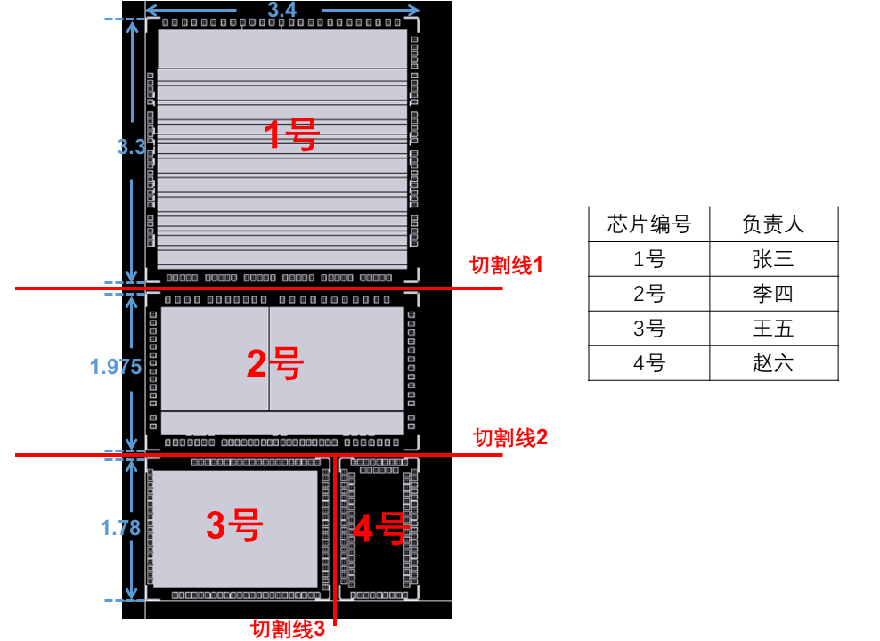
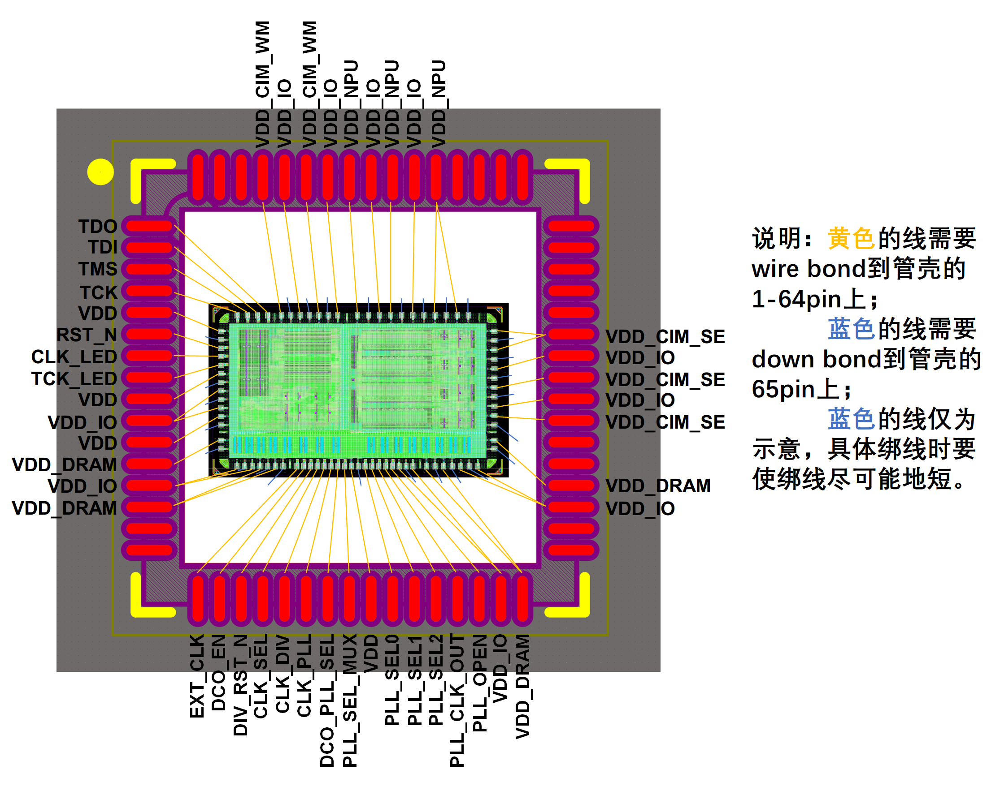

# 9. 划片与封装

## 9.1 划片

[芯片分割](https://en.wikipedia.org/wiki/Die_singulation)（Die singulation），也称为晶圆切割（wafer dicing）。
在这个过程中，一个大的硅晶圆被切割成许多小的，独立的半导体芯片或集成电路。
每个小芯片都包含了一个完整的电路。
划片过程的主要目的是**将硅晶圆上的多个集成电路分离开来，以便于后续的封装和测试**。

??? info "扩展：划片机"
    划片通常是通过一个高精度的划片机完成的，这个机器可以根据预设的模式和尺寸切割硅晶圆。划片机使用一种高速旋转的刀片（通常是金刚石或其他硬质材料）在硅晶圆上进行切割。这个过程需要非常精确，以确保每个芯片都被正确地切割，而不会损坏芯片上的电路。

划片需要提供的资料如下：

- **划片数量**
- **划片示意图**

<figure>
  
  <figcaption>划片图示例</figcaption>
</figure>

## 9.2 封装

[芯片封装](https://en.wikipedia.org/wiki/Integrated_circuit_packaging)（Integrated circuit packaging，chip packaging）发生在硅晶圆划片之后。封装的主要目的是保护微小、脆弱的半导体芯片，同时提供交互接口，**使芯片可以和电子设备的其他部分进行电气连接**。

以下是芯片封装过程的基本步骤：

1. **芯片装载（Die Attachment）**：切割后的芯片（也称为“die”）被安装到封装的载体（通常是金属或塑料）上。这个过程通常使用导热材料（例如银胶或锡膏）来确保良好的热接触，帮助散热。

2. **线引封装（Wire Bonding）**：芯片上的电路通过极细的金属线（通常是金或铝）连接到封装的引脚上。这些金属线非常细小，通常需要使用高精度的自动设备来进行操作。

3. **封装封闭（Encapsulation）**：芯片和金属线被一个保护层覆盖，通常是塑料或陶瓷。这个保护层可以防止芯片受到物理损伤，同时也防止环境因素（如湿气、灰尘、化学物质等）对芯片造成损害。

完成封装后的芯片可以被焊接到电路板上，与电子设备的其他部分进行电气连接。

芯片封装有很多种类型，我们使用的封装类型为[QFN](https://en.wikipedia.org/wiki/Flat_no-leads_package)（Quad Flat No-leads）封装。
QFN（Quad Flat No-leads）封装是一种四面平无引脚封装。
它的特点是四个边都是平的，没有传统意义上的引脚，而是采用周边的pad（电接触垫）来实现电路的连接。
QFN封装体积小、高度低，因此对于需要小型化的电子设备来说，非常适合。

<figure>
  
  <figcaption>QFN 封装侧视图</figcaption>
</figure>

QFN后面的数字（如QFN64、QFN88 10\*10）通常指的是封装上的pad的数量。
例如，QFN64的封装就有64个pad，而QFN88的封装则有88个pad。"10\*10"则通常指的是封装的物理尺寸，单位通常是毫米(mm)。

我们需要将芯片的IO与QFN封装的pad进行对应，以便在封装过程中正确连接芯片的电路。

<figure>
  
  <figcaption>管脚对应示例</figcaption>
</figure>

??? info "扩展：COB"
    COB，全称Chip On Board，即直接将芯片安装在电路板上的封装技术。这种技术中，裸芯片被放置在电路板上，然后通过金线或铜线进行键合，与电路板上的其他组件进行电气连接。然后，芯片和键合线会被一种特殊的环氧树脂（通常被称为"黑胶"）覆盖，以保护它们免受物理损伤和环境影响。相比QFN，COB技术的寄生电阻电容更小，因此适合性能、功耗敏感的芯片。

!!! Warning "Under development!"
