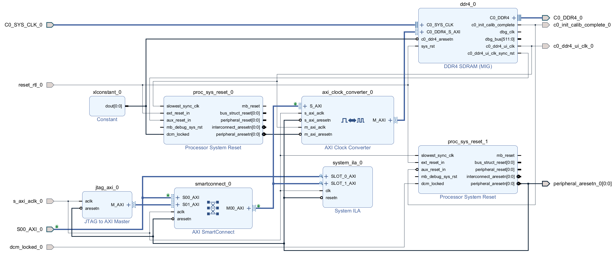
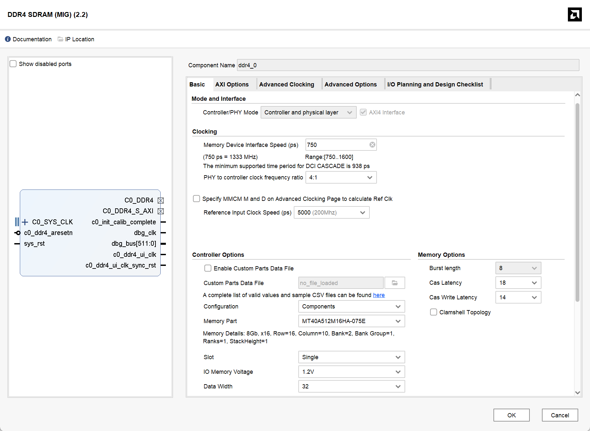
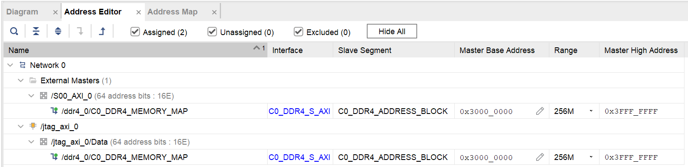

# 使用 FPGA 上的 DRAM

!!! Warning "注意"
    本教程涉及的 Block Design 配置、物理引脚约束及 DDR4 时序参数仅适用于 Vivado 2024.2 下的 ALINX AXU15EG (ZU15EG) 开发板 PL 端 2GB DDR4 硬件资源，非同构硬件环境请谨慎复用。

## 1. 简介
本文档旨在解析基于 Vivado 2024.2 环境的 PL 端 DDR4 访问工程。该工程以 Archived .zip 文件形式提供，已完成针对 ALINX AXU15EG 开发板的硬件适配。设计核心在于通过 PL 逻辑直接控制板载 2GB DDR4 资源，而非利用 PS 端系统内存。
文档将首先概述顶层数据链路架构，随后深入解析 DDR4 子系统 Block Design 内部的 IP 配置、时钟域划分及互联逻辑，指导理解并复用该设计。

!!! Warning "注意"
    当前的顶层设计是一个**单芯片环回验证方案**。SoC、Serial Link 逻辑以及 DDR4 子系统均部署在同一片 FPGA (AXU15EG) 上。真实应用场景下，SoC 将位于独立的芯片（ASIC Tape-out 或另一片 FPGA）上，本 FPGA 仅作为独立的 DDR4 扩展卡，通过板间物理 Serial Link 接口提供存储服务。未来版本将同步更新以支持板间通信模式。

## 2. 工程环境配置与启动

本设计已归档为 Vivado 工程压缩包。由于 Vivado 版本差异及 License 限制，请按以下步骤操作。

### 2.1 工程获取与 License 配置
1.  **获取源码**：
    工程路径：`/project/holi/common/FPGA_DRAM.xpr.zip`
    请将该文件复制到个人目录并解压：
    ```bash
    unzip FPGA_DRAM.xpr.zip
    ```
2.  **配置 License**：
    Vivado 自带的 WebPack License 不支持 **xczu15eg-ffvb1156-2-i** Device。需加载我的 License：
    ```bash
    cp -r /project/holi/common/.Xilinx ~/
    ```

### 2.2 版本兼容性处理
由于原工程版本高于当前服务器使用的 Vivado 版本（或版本不一致），直接打开会导致 IP 锁定或综合失败。请执行以下清理步骤：

1.  **清理旧版缓存**：
    在打开工程前，进入工程目录下的 `.runs` 文件夹，**删除所有 `.dcp` (Design Checkpoint) 文件**。
2.  **升级 IP 核**：
    打开 Vivado 工程后，进入 `Reports` -> `Report IP Status`，全选所有 IP 并点击 `Upgrade Selected`。
3.  **禁用增量编译**：
    为避免版本差异导致的 Checkpoint 校验错误，请在 Synthesis 和 Implementation 设置中，将 **Incremental Synthesis/Implementation** 选项暂时设置为 `Disable`。

## 3. 系统顶层架构

本设计属于完整的板级通信链路的一部分。数据流自 SoC 发起，经由串行链路传输并转换至 DDR4 Subsystem，最终写入 DDR4 存储器。整体架构分为三个层级：

1.  **请求发起端 (SoC)**：负责产生读写请求。
2.  **传输与协议转换 (Serial Link Layer)**：
    *   负责将 SoC 发出的请求通过私有 DDR 信号传输至下述 Block Design。
    *   在 FPGA 内将私有串行协议转换成标准的 **AXI4 Master** 接口信号。
3.  **存储子系统 (DDR Subsystem / Block Design)**：
    *   本教程的核心部分。
    *   作为 **AXI4 Slave** 接收来自 Serial Link 的读写指令。
    *   负责 AXI 协议到 DDR4 物理层接口 (PHY) 的转换、时序控制及数据存取。

## 4. DDR4 子系统 Block Design 详解

本章节详细拆解存储子系统的内部构造。该 Block Design 模块化地集成了物理接口、时钟跨域处理、总线互联及硬件调试功能。

<figure>
  
  <figcaption>DDR4 Subsystem Block Design Diagram</figcaption>
</figure>

### 4.1 核心模块：DDR4 Memory Interface Generator (MIG)

该模块是设计中连接 AXI 总线与物理 DDR4 颗粒的桥梁。在 Block Design 中双击 IP 核进行配置时，需关注以下关键参数以匹配 AXU15EG 硬件特性。

#### 4.1.1 Basic 选项卡配置
*   **Controller/PHY Mode**: 保持默认的 `Controller and physical layer`，即同时实例化内存控制器和物理层接口。
*   **Interface**: 勾选 `AXI4 Interface`。
*   **Memory Part (颗粒型号)**:
    *   选择 **MT40A512M16HA-075E**。
    *   **选型依据**: 前缀 `MT40A512M16` 表明这是 Micron 生产的 **x16** 位宽颗粒，只需选择前缀相同的颗粒即可。后缀 `-075E` 代表该颗粒支持的最高时序参数（750ps 周期，即 1333MHz 时钟频率 / 2666 MT/s 数据速率）。即便实际运行频率较低，型号也必须与物理颗粒一致以保证时序参数正确。
*   **Data Width (位宽)**: 设置为 **32**。
    *   **硬件拓扑**: AXU15EG 开发板 PL 端板载了两颗 16-bit 的 DDR4 颗粒并联，共同构成了 32-bit 的物理数据总线。
*   **Input Clock Period (参考时钟)**:
    *   目标值为 **5000 ps (200 MHz)**，这是板载差分时钟的频率。
    *   **PLL 限制说明**: 该选项受 `Memory Device Interface Speed` 影响。MIG 内部 PLL 需根据目标 DDR 运行速率（如 1200 MHz / 833 ps）和输入时钟计算倍频/分频系数（M/D）。若无法整除，IP 核列表可能不显示精确的 5000ps 选项。此时选择**最接近**的值（例如 4998 ps / 200.08 MHz）即可，这在 PLL 锁相环允许的误差范围内。

<figure>
  
  <figcaption>DDR4 Subsystem MIG Basic Configurations</figcaption>
</figure>

#### 4.1.2 AXI Options 选项卡
*   **Data Width**: 设置为 **256**。
*   **Address Width / ID Width**: 保持默认（如 31 / 4）即可，工具会自动计算地址空间。

#### 4.1.3 Advanced Clocking 选项卡
*   **System Clock Option**: 设置为 **Differential** (差分)，PL 端 DDR 参考时钟源为差分晶振。
*   **UI Clock (用户接口时钟)**:
    *   这是 MIG 输出给用户逻辑的主时钟 `c0_ddr4_ui_clk`。这里构成了除板载差分时钟外的第一个时钟（即 MIG 时钟域），它与 MIG 时钟域的 AXI 总线（即 MIG 的输入）相关联。你也可以在 Additional Clock Output 选项卡中配置所需的其他时钟。

!!! question "初始化与校准信号 (`c0_init_calib_complete`)"
    DDR4 SDRAM 上电后不能立即进行读写，必须经过复杂的**初始化与训练**过程。上电后，MIG 控制器会自动执行 ZQ 校准、Write Leveling（写平衡）和 Read Centering（读对中/DQS 训练），以补偿 PCB 走线延迟和信号完整性问题。此过程通常耗时几毫秒至几十毫秒。该信号行为如下：

    *   **低电平 (0)**: 训练中，物理层不稳定，禁止读写。
    *   **高电平 (1)**: 校准完成，DDR4 可用。
    *   **系统复位中的作用**: 本设计将 `c0_init_calib_complete` 作为**系统逻辑复位解除的必要条件**。只有当此信号拉高后，`proc_sys_reset_1` 才会释放 AXI 总线复位 (`peripheral_aresetn`)，从而从杜绝了在 DDR4 未就绪时发起访问的风险。

### 4.2 跨时钟域处理：AXI Clock Converter

由于系统逻辑与 MIG 运行在不同频率，必须进行跨时钟域 (CDC) 处理以避免亚稳态。

*   **S_AXI (Slave) 侧**：关联至 `s_axi_aclk_0`，运行于 **系统时钟域**（100 MHz，这个时钟之后会讲）。此接口面向 Serial Link 模块及外部系统逻辑。
*   **M_AXI (Master) 侧**：关联至 `c0_ddr4_ui_clk`，运行于 **MIG 时钟域**（即 333.25 MHz）。此接口直连 DDR4 控制器。

### 4.3 总线互联：AXI SmartConnect

*   **模块功能**：作为 AXI 总线交换矩阵，负责多主设备 (Master) 访问单一从设备 (Slave) 的仲裁与路由。
*   **连接拓扑**：
    *   **Slave 00**：连接外部输入的 `S00_AXI_0` (来自 Serial Link 的数据流)。
    *   **Slave 01**：连接内部的 `JTAG to AXI Master` (用于调试)。
    *   **Master 00**：输出至 `AXI Clock Converter`。
*   **作用**：将系统逻辑和 JTAG to AXI Master 连接至 DDR4 控制器的 AXI 总线。

### 4.4 地址空间分配 (Address Editor)
**关键配置**：打开 Block Design 的 **Address Editor** 选项卡，必须确保所有模块 (包括 `S00_AXI_0` 和 `jtag_axi_0`) 的地址映射符合 `soc_pkg.sv` 定义。

*   **对齐规则**：映射的 **Range** 大小必须与 **Offset Address** 对齐。
    *   *示例*：若起始地址为 `0x30000000`，最大映射 Range 只能为 **256M** (因为 `0x30000000` 能被 `0x10000000` 整除，但不能被 `0x40000000` 整除)。

<figure>
  
  <figcaption>DDR4 Subsystem MIG Basic Configurations</figcaption>
</figure>

!!! Bug "待修改地址分配"
    这里为简便占用了原 NPU 的 `0x30000000` 地址空间，后续会替换掉 Hyperbus，并使用原 Hyperbus 地址空间。

<!-- 
### 4.4 硬件调试链路：JTAG to AXI Master & System ILA

为验证链路完整性，设计集成了非侵入式的硬件调试模块：

*   **JTAG to AXI Master**：
    *   允许通过 Vivado Tcl 控制台直接向 AXI 总线发起读写事务，避免在 CPU 或 SoC BUS 不工作时无法调试 MIG 功能正确性。
*   **System ILA (Integrated Logic Analyzer)** -->

### 4.5 外部端口配置 (Interface Properties)
**关键配置**：为避免 Hardware Wrapper 导出报错，需手动配置外部时钟端口关联。

1.  选中外部时钟输入端口 (如 `s_axi_aclk_0`)。
2.  在属性窗口 (External Interface Properties) -> **Properties** -> **CONFIG** 中找到 `ASSOCIATED_BUSIF`。
3.  填入该时钟驱动的总线接口名称 (如 `S00_AXI_0`)。

### 4.6 复位架构与极性管理

本设计涉及多级复位逻辑，由于部分 IP 核的复位极性参数不便配置（灰色锁定），必须严格区分各级信号的有效电平。

*   **输入硬复位 (`reset_rtl_0`)**：**高电平有效 (Active High)**。若开发板物理按键或上级系统提供的是低电平复位信号（如 `rst_n`），在顶层实例化 `design_1` 时必须取反接入（即 `~rstn_i`）。
*   **时钟域复位划分**：
    1.  **MIG 时钟域 (`proc_sys_reset_0`)**：由 MIG 输出的同步复位驱动，负责复位 AXI Clock Converter 的高速侧接口。
    2.  **系统时钟域 (`proc_sys_reset_1`)**：由校准完成信号 `c0_init_calib_complete` 触发。产生的 `peripheral_aresetn` 为**低电平有效**，用于复位 SmartConnect、JTAG AXI 及 Clock Converter 的低速侧接口。
*   **关键依赖**：系统设计强制要求 DDR4 完成初始化校准后，低速域的 AXI 总线复位才会被释放。这种跨时钟域的复位链结构确保了总线事务的安全性。

## 5. 顶层集成与仿真 (Top-Level Integration)

为了验证 PL 端 DDR4 访问链路的可行性，本工程提供了一个完整的 FPGA 顶层参考设计。该顶层模块模拟了一个片上 SoC 通过高速串行链路访问 DDR4 的场景。

### 5.1 顶层时钟架构 (Clocking Architecture)

由于 DDR4 控制器是系统中时序最严格的部分，顶层时钟架构围绕 MIG 的输出来构建：

1.  **输入源**：
    *   `sys_clk_p/n`：板载 200 MHz 差分时钟，驱动 DDR4 MIG IP。
2.  **MIG 时钟域 (`ddr_ui_clk`)**：
    *   由 MIG IP 核输出，频率约 **333.25 MHz**。作为 PLL 的参考时钟源，它是全局时钟的第一来源。
3.  **系统时钟域 (`clk_100m`)**：
    *   通过 `clk_wiz_0` 从 333.25 MHz 分频产生 **100 MHz**。注意，当每次调整了 MIG 和时钟有关的设定后，应查看 `c0_ddr4_ui_clk` 的频率，并将 `clk_wiz_0` 的输入时钟修改至与之一致。
    *   确保 `clk_wiz_0` 输出时钟的 **Drives** 设置为 **BUFG**，以保证全局时钟质量。
    *   PLL 复位连接至 `c0_init_calib_complete`，确保时钟仅在内存就绪后启动。
    *   驱动 SoC 逻辑、Serial Link 控制器以及 Block Design 中的 AXI SmartConnect 等任何非 MIG 的用户侧接口。

### 5.2 数据链路实例化

顶层模块按数据流向依次实例化了以下关键组件：

1.  **SoC (模拟源)**：
    *   实例化 `soc` 模块产生读写流量。
2.  **Serial Link Wrapper**: 执行 Loopback (FPGA 内部短接发送与接收)，将私有协议转换为 **AXI4 Master**。
3.  **DDR4 Subsystem**: 实例化 `design_1_wrapper`，将 SV `struct` 信号展平为 `wire` 接入 AXI 端口。将 `C0_DDR4` 端口映射至 FPGA 顶层 IO，连接开发板的物理 DDR4 引脚。

### 5.3 状态指示
LED (`clk_led_o`) 闪烁代表：
1.  DDR4 初始化校准通过。
2.  MIG 时钟及 PLL 分频后的系统时钟均正常工作。

## 6. 约束文件 (XDC) 配置

本章节仅涵盖 DDR4 子系统的物理层约束以及硬件调试核心（Debug Hub）的时钟连接配置。

### 6.1 DDR4 物理接口约束

DDR4 SDRAM 的引脚分配依赖于 AXU15EG 开发板的硬件设计。对于 Zynq UltraScale+ 的 HP Bank，除了物理管脚位置 (`PACKAGE_PIN`) 外，必须严格约束电平标准 (`IOSTANDARD`) 和内部参考电压 (`INTERNAL_VREF`)。

以下代码包含地址/控制总线（SSTL12_DCI）、数据总线（POD12_DCI）及 Bank 65 参考电压的完整约束。

<details>
<summary><strong>点击展开查看完整 DDR4 XDC 约束代码</strong></summary>

```xdc
# ============================================================================
# 6. DDR4 SDRAM 物理接口约束
# ============================================================================

# --- 地址线 (Address) : SSTL12_DCI ---
set_property PACKAGE_PIN AN9  [get_ports {c0_ddr4_adr[0]}]
set_property PACKAGE_PIN AN6  [get_ports {c0_ddr4_adr[1]}]
set_property PACKAGE_PIN AN7  [get_ports {c0_ddr4_adr[2]}]
set_property PACKAGE_PIN AP5  [get_ports {c0_ddr4_adr[3]}]
set_property PACKAGE_PIN AK8  [get_ports {c0_ddr4_adr[4]}]
set_property PACKAGE_PIN AP7  [get_ports {c0_ddr4_adr[5]}]
set_property PACKAGE_PIN AM10 [get_ports {c0_ddr4_adr[6]}]
set_property PACKAGE_PIN AN8  [get_ports {c0_ddr4_adr[7]}]
set_property PACKAGE_PIN AK7  [get_ports {c0_ddr4_adr[8]}]
set_property PACKAGE_PIN AP10 [get_ports {c0_ddr4_adr[9]}]
set_property PACKAGE_PIN AM6  [get_ports {c0_ddr4_adr[10]}]
set_property PACKAGE_PIN AM8  [get_ports {c0_ddr4_adr[11]}]
set_property PACKAGE_PIN AP4  [get_ports {c0_ddr4_adr[12]}]
set_property PACKAGE_PIN AP8  [get_ports {c0_ddr4_adr[13]}]
set_property PACKAGE_PIN AJ9  [get_ports {c0_ddr4_adr[14]}]
set_property PACKAGE_PIN AP6  [get_ports {c0_ddr4_adr[15]}]
set_property PACKAGE_PIN AP11 [get_ports {c0_ddr4_adr[16]}]

# --- 控制线 (Control/Command) : SSTL12_DCI ---
set_property PACKAGE_PIN AJ10 [get_ports {c0_ddr4_ba[0]}]
set_property PACKAGE_PIN AP9  [get_ports {c0_ddr4_ba[1]}]
set_property PACKAGE_PIN AL10 [get_ports {c0_ddr4_bg[0]}]
set_property PACKAGE_PIN AK10 [get_ports {c0_ddr4_cke[0]}]
set_property PACKAGE_PIN AN4  [get_ports {c0_ddr4_cs_n[0]}]
set_property PACKAGE_PIN AK9  [get_ports {c0_ddr4_odt[0]}]
set_property PACKAGE_PIN AM9  [get_ports c0_ddr4_act_n]

# --- 差分时钟 (CK) : DIFF_SSTL12_DCI ---
set_property PACKAGE_PIN AL6  [get_ports {c0_ddr4_ck_t[0]}]
set_property PACKAGE_PIN AL5  [get_ports {c0_ddr4_ck_c[0]}]

# --- 复位 (Reset) : LVCMOS12 ---
set_property PACKAGE_PIN AM5  [get_ports c0_ddr4_reset_n]
set_property IOSTANDARD LVCMOS12 [get_ports c0_ddr4_reset_n]

# --- 统一设置 ADDR/CMD/CLK 的电平标准 ---
set_property IOSTANDARD SSTL12_DCI [get_ports {c0_ddr4_adr[*]}]
set_property IOSTANDARD SSTL12_DCI [get_ports {c0_ddr4_ba[*]}]
set_property IOSTANDARD SSTL12_DCI [get_ports {c0_ddr4_bg[*]}]
set_property IOSTANDARD SSTL12_DCI [get_ports {c0_ddr4_cke[*]}]
set_property IOSTANDARD SSTL12_DCI [get_ports {c0_ddr4_cs_n[*]}]
set_property IOSTANDARD SSTL12_DCI [get_ports {c0_ddr4_odt[*]}]
set_property IOSTANDARD SSTL12_DCI [get_ports c0_ddr4_act_n]
set_property IOSTANDARD DIFF_SSTL12_DCI [get_ports {c0_ddr4_ck_t[*]}]
set_property IOSTANDARD DIFF_SSTL12_DCI [get_ports {c0_ddr4_ck_c[*]}]

# --- 数据线 (DQ) : POD12_DCI ---
# Byte 0
set_property PACKAGE_PIN AE2 [get_ports {c0_ddr4_dq[0]}]
set_property PACKAGE_PIN AG3 [get_ports {c0_ddr4_dq[1]}]
set_property PACKAGE_PIN AD1 [get_ports {c0_ddr4_dq[2]}]
set_property PACKAGE_PIN AF2 [get_ports {c0_ddr4_dq[3]}]
set_property PACKAGE_PIN AD2 [get_ports {c0_ddr4_dq[4]}]
set_property PACKAGE_PIN AH3 [get_ports {c0_ddr4_dq[5]}]
set_property PACKAGE_PIN AE1 [get_ports {c0_ddr4_dq[6]}]
set_property PACKAGE_PIN AF1 [get_ports {c0_ddr4_dq[7]}]
set_property PACKAGE_PIN AH2 [get_ports {c0_ddr4_dm_n[0]}]
set_property PACKAGE_PIN AH1 [get_ports {c0_ddr4_dqs_t[0]}]
set_property PACKAGE_PIN AJ1 [get_ports {c0_ddr4_dqs_c[0]}]

# Byte 1
set_property PACKAGE_PIN AE3 [get_ports {c0_ddr4_dq[8]}]
set_property PACKAGE_PIN AH4 [get_ports {c0_ddr4_dq[9]}]
set_property PACKAGE_PIN AD4 [get_ports {c0_ddr4_dq[10]}]
set_property PACKAGE_PIN AG4 [get_ports {c0_ddr4_dq[11]}]
set_property PACKAGE_PIN AE4 [get_ports {c0_ddr4_dq[12]}]
set_property PACKAGE_PIN AG5 [get_ports {c0_ddr4_dq[13]}]
set_property PACKAGE_PIN AF3 [get_ports {c0_ddr4_dq[14]}]
set_property PACKAGE_PIN AJ4 [get_ports {c0_ddr4_dq[15]}]
set_property PACKAGE_PIN AE5 [get_ports {c0_ddr4_dm_n[1]}]
set_property PACKAGE_PIN AJ6 [get_ports {c0_ddr4_dqs_t[1]}]
set_property PACKAGE_PIN AJ5 [get_ports {c0_ddr4_dqs_c[1]}]

# Byte 2
set_property PACKAGE_PIN AD6 [get_ports {c0_ddr4_dq[16]}]
set_property PACKAGE_PIN AG8 [get_ports {c0_ddr4_dq[17]}]
set_property PACKAGE_PIN AF6 [get_ports {c0_ddr4_dq[18]}]
set_property PACKAGE_PIN AF7 [get_ports {c0_ddr4_dq[19]}]
set_property PACKAGE_PIN AD7 [get_ports {c0_ddr4_dq[20]}]
set_property PACKAGE_PIN AH8 [get_ports {c0_ddr4_dq[21]}]
set_property PACKAGE_PIN AE7 [get_ports {c0_ddr4_dq[22]}]
set_property PACKAGE_PIN AG6 [get_ports {c0_ddr4_dq[23]}]
set_property PACKAGE_PIN AH7 [get_ports {c0_ddr4_dm_n[2]}]
set_property PACKAGE_PIN AE8 [get_ports {c0_ddr4_dqs_t[2]}]
set_property PACKAGE_PIN AF8 [get_ports {c0_ddr4_dqs_c[2]}]

# Byte 3
set_property PACKAGE_PIN AE12 [get_ports {c0_ddr4_dq[24]}]
set_property PACKAGE_PIN AG9  [get_ports {c0_ddr4_dq[25]}]
set_property PACKAGE_PIN AH11 [get_ports {c0_ddr4_dq[26]}]
set_property PACKAGE_PIN AE9  [get_ports {c0_ddr4_dq[27]}]
set_property PACKAGE_PIN AH12 [get_ports {c0_ddr4_dq[28]}]
set_property PACKAGE_PIN AG10 [get_ports {c0_ddr4_dq[29]}]
set_property PACKAGE_PIN AF12 [get_ports {c0_ddr4_dq[30]}]
set_property PACKAGE_PIN AD10 [get_ports {c0_ddr4_dq[31]}]
set_property PACKAGE_PIN AE10 [get_ports {c0_ddr4_dm_n[3]}]
set_property PACKAGE_PIN AF11 [get_ports {c0_ddr4_dqs_t[3]}]
set_property PACKAGE_PIN AG11 [get_ports {c0_ddr4_dqs_c[3]}]

# --- 统一设置 DQ/DQS/DM 的电平标准 ---
set_property IOSTANDARD POD12_DCI [get_ports {c0_ddr4_dq[*]}]
set_property IOSTANDARD POD12_DCI [get_ports {c0_ddr4_dm_n[*]}]
set_property IOSTANDARD DIFF_POD12_DCI [get_ports {c0_ddr4_dqs_t[*]}]
set_property IOSTANDARD DIFF_POD12_DCI [get_ports {c0_ddr4_dqs_c[*]}]

# ============================================================================
# 7. Bank 65 VREF 设置 (关键!)
# ============================================================================
# 因为 Bank 65 包含了部分 DDR4 数据线，必须启用内部参考电压
set_property INTERNAL_VREF 0.6 [get_iobanks 65]
```
</details>

### 6.2 Debug Hub 时钟连接

Vivado 的 `dbg_hub` 负责管理所有的 ILA，它需要连接到自由运行 (Free-running) 的时钟。由于 MIG UI Clock 上电初期不可用，必须将 Debug Hub 强制连接到板载 200MHz 输入缓冲器输出。它会自动处理跨时钟域的问题。如让其自动配置，`dbg_hub` 可能会被连接到任意时钟上（尤其是在 ILA 较多，且在 debug 多个时钟域的信号时），这会导致 Vivado 无法检测到 Debug Hub，报错 `WARNING: [Labtools 27-3361] The debug hub core was not detected`，进而在 Hardware Manager 里无法找到你应有的 ILA。

请使用以下 Tcl 脚本定位网络名称并添加至 XDC 末尾：

!!! Bug "FIXME!!!"
    待添加

!!! Warning "注意"
    若增加过多 ILA 或多个时钟域的 ILA 可能导致时序违例，请适当减少探针数量。

## 7. JTAG 硬件回环验证

在不依赖 CPU 的情况下，通过 Vivado Tcl Console 直接控制 `jtag_axi_0` 验证 DDR4 读写链路。


### 7.1 初始化总线
防止死锁：
```tcl
reset_hw_axi [get_hw_axis hw_axi_1]
```

### 7.2 单次写测试
向地址 `0x30000000` 写入数据：
```tcl
create_hw_axi_txn write_cmd [get_hw_axis hw_axi_1] -address 30000000 -data 1122334455667788 -len 1 -type write -force
run_hw_axi write_cmd
```

### 7.3 单次读测试
```tcl
create_hw_axi_txn read_cmd [get_hw_axis hw_axi_1] -address 30000000 -len 1 -type read -force
run_hw_axi read_cmd
```
*检查输出数据是否匹配。*

### 7.4 批量突发读取 (Dump Memory)
读取 16 个 64-bit 数据：
```tcl
create_hw_axi_txn dump_mem [get_hw_axis hw_axi_1] -address 30000000 -len 16 -type read -force
run_hw_axi dump_mem
```
如果没有 Error，且输出数据与写入时相同，则测试通过。
---

## 附录 A: 常见问题与排查 (FAQ)

### A.1 时序违例：Pulse Width (TPWS) 失败
**现象**：Implementation 后 MIG PLL 输出出现 Pulse Width 违例。
**解决方案**：在 **Implementation Settings** -> **Strategy** 中，选择 `Performance_ExplorePostRoutePhysOpt`，这有一定可能解决。

### A.2 AXI 频率报错
**现象**：`[BD 41-237] Bus Interface property FREQ_HZ does not match...`
**解决方案**：检查 **4.5 节** 提到的 `ASSOCIATED_BUSIF` 及 Block Design 端口上的 `FREQ_HZ` 属性，确保与实际物理时钟频率一致。

## 附录 B: 参考资料

*   **官方例程**: [GitHub - alinxalinx/AXU9EG_AXU15EG](https://github.com/alinxalinx/AXU9EG_AXU15EG)
*   **开发板手册**: [AXU15EG User Guide (PDF)](https://alinx.com/public/upload/file/AXU15EG_UG.pdf)