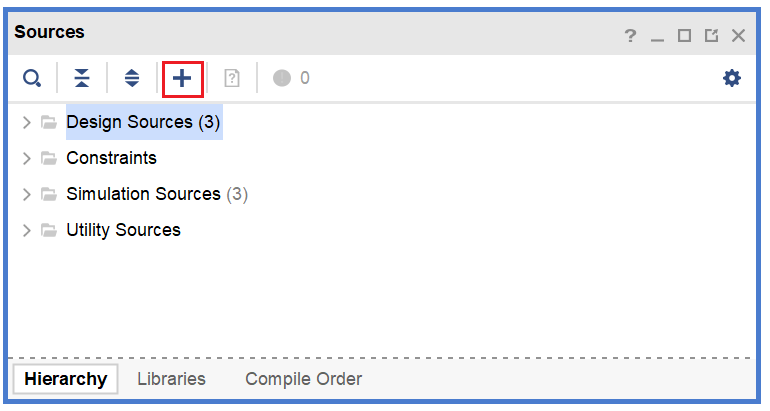
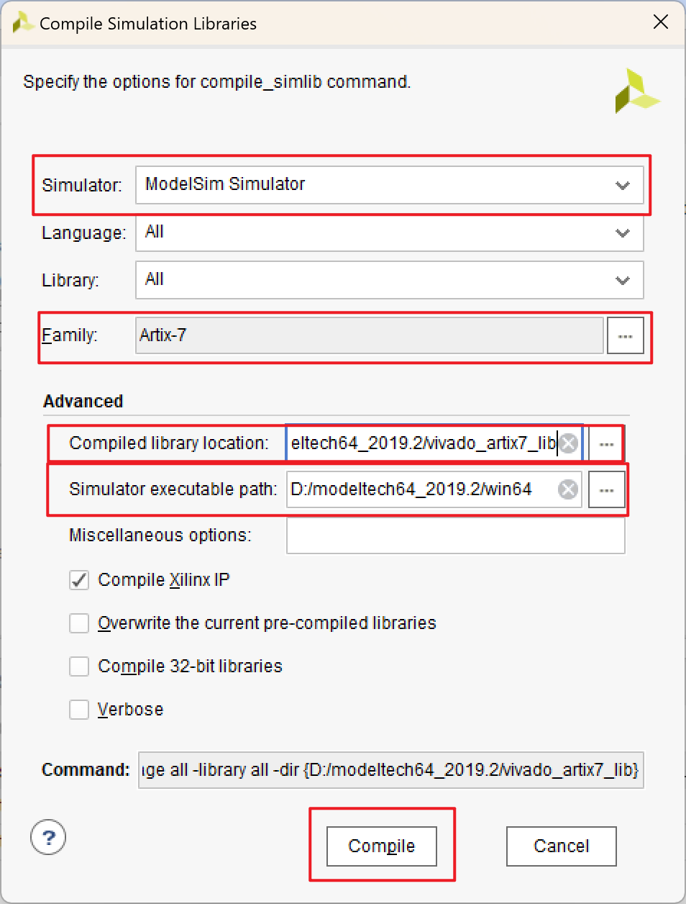
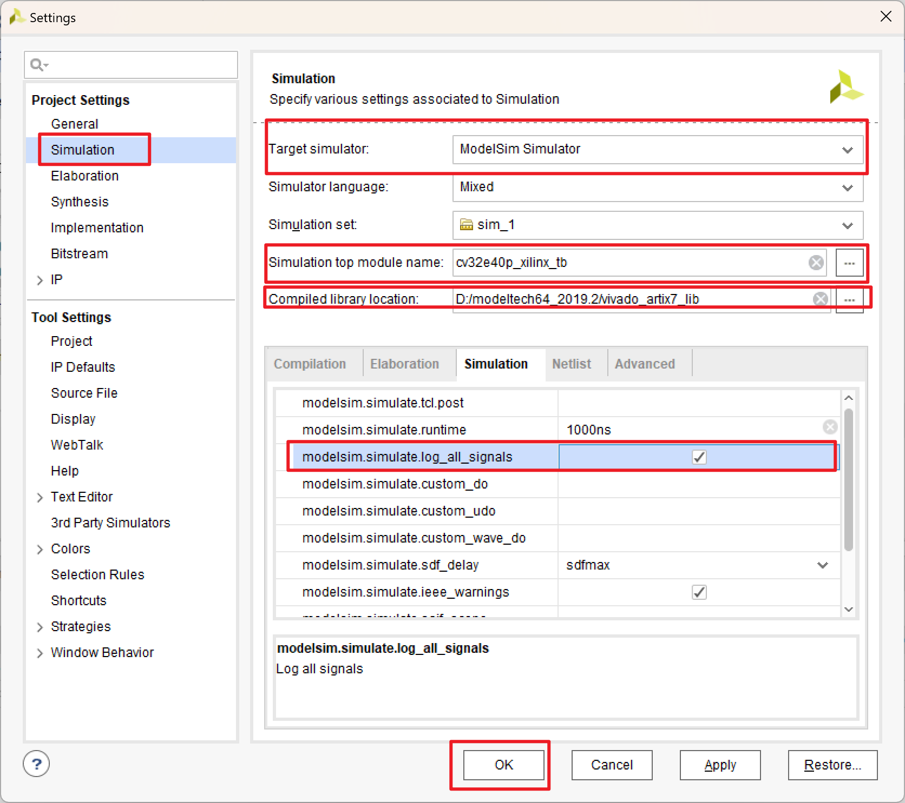
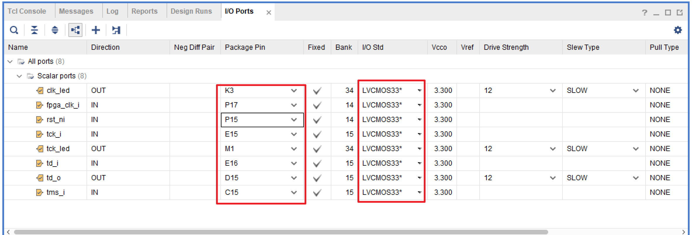
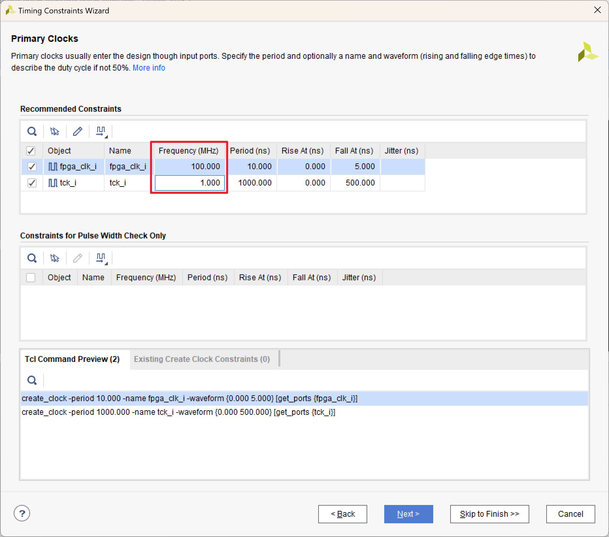
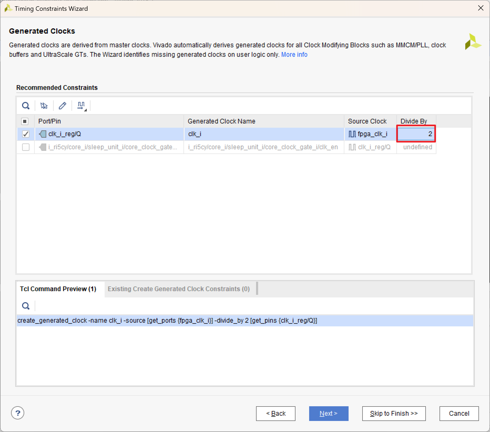
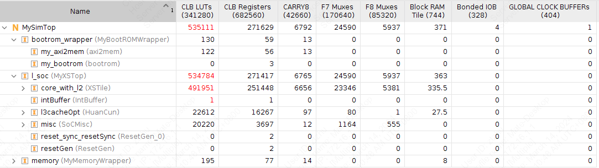

# 13. FPGA 验证

!!! Warning "Under development!"

在实际流片之前，我们需要在 FPGA 平台上实现我们**可综合的**数字系统设计，从而验证功能正确性。
我们使用 Xilinx Vivado 2019.1 进行 FPGA 验证。

## FPGA 验证流程简介

在完成 RTL 代码设计之后，我们就可以进入 FPGA 验证流程（可以与流片流程同步进行），大致分为以下几个阶段。

### 导入设计

打开 Vivado，选择 `Create Project`，选择合适的工程名字和路径。

!!! warning "关于路径名称"
    如果是在本地运行（在Windows 系统或者 WSL 中），尽量避免中文路径，否则 Vivado 后续可能会报错。

选择 `RTL Project`，连续选择 `Next`，在 `Default Part` 选择验证所使用的 FPGA 核心板型号。

??? info "FPGA 核心板与开发板"
    **FPGA 核心板**：通常是一个小型的模块，包括了 FPGA 芯片以及其必要的外围电路，主要用于嵌入到更大的系统中，作为系统的一部分。核心板上一般包括 FPGA 芯片、必要的电源管理电路、时钟电路、基本的 I/O 接口等。它们通常没有太多的扩展接口和调试功能。

    **FPGA 开发板**：是一个**完整的开发平台**，包含了核心板以及更多的外围设备和接口，用于 FPGA 的开发、调试和验证。它适合于开发者进行 FPGA 设计的原型验证和测试。开发板除了包含核心板的所有功能外，还包括更多的扩展接口（例如 USB 、以太网、HDMI 等）、调试接口（如 JTAG ）、存储器（如 SD 卡插槽）、显示器（如 LCD 屏幕）等，具体有哪些扩展接口取决于开发板的型号。

完成工程创建向导之后即可进入 Vivado 主界面。在 `PROJECT MANAGER` -> `Sources` 添加 RTL 代码。


<figure>
  
  <figcaption>Adding Vivado source files</figcaption>
</figure>

在弹出界面中选择 `Add or create design sources` -> `Add Files` 即可导入设计。

??? info "关于Verilog/SystemVerilog头文件"
    在一些设计中会使用到 .vh / .svh 等RTL头文件，一般来说将头文件直接一起添加到RTL代码中Vivado就能自动分析调用头文件。

    但有时在非常复杂的设计中有时会出现类似于 ``include "axi/typedef.svh"` 的头文件引用方式，这时需要向Vivado指定头文件的搜索路径，编译器才能通过相对路径正确分析头文件。

    在 `PROJECT MANAGER` -> `Settings` -> `General` -> `Verilog Options` 中将头文件的搜索路径加入到 `Verilog Include Files Search Paths` 中。

### 编写仿真程序

为了验证 RTL 代码是否正确，需要用 Verilog 或 SystemVerilog 编写一个 Testbench，通过观察波形验证设计是否符合需求。

一个简单的 Testbench 大致如下。
``` verilog
module tb_top();

reg clock;
reg reset;

initial begin
    clock = 0;
    reset = 1
    #100 reset = 0;
    #2000000 $finish;
end
always begin
    #1 clock <= ~clock;
end 

MySimTop dut(
    .clock(clock),
    .reset(reset)
);

endmodule
```

### Behavioral Simulation 行为仿真

对 RTL 代码编译之后即可进行的仿真，用于验证逻辑功能的正确性。
在逻辑综合前需要进行功能仿真，以便尽早发现设计中的缺陷。

#### 调用 ModelSim 进行仿真

由于Vivado自带的仿真器(XSIM)速度非常慢，因此我们通过调用ModelSim仿真器来进行仿真。

Modelism的库文件中不包含Vivado生成的一些IP的信息，我们需要提前把Vivado IP的库文件编译
出来。

Vivado窗口中选择 `Tools` -> `Compile Simulation Libraries`

<figure>
  
  <figcaption>Compile simulation libraries</figcaption>
</figure>

其中 `Family` 选择开发板对应的系列；`Compiled library location` 可以选择在ModelSim安装目录下新建一个文件夹；`Simulator executable path` 指定ModelSim的安装路径。

在仿真设置 `PROJECT MANAGER` -> `Settings` -> `Simulation` 中将仿真器指定为ModelSim，并链接之前编译的库文件。

<figure>
  
  <figcaption>Simulation settings</figcaption>
</figure>

勾选 `Simulation` 栏中的 `log_all_signals` 以记录所有信号的波形。

!!! warning "关于Top Module"
    在 `Settings` 中的 `General` 和 `Simulation` 栏中都能指定 `Top module`，其中 `General` 对应的 `Top module` 为后续综合以及物理实现的顶层模块，`Simulation` 对应的 `Top module` 为仿真中的testbench文件，两者往往不是同一个module。

### Logic Synthesis 逻辑综合

在进行逻辑综合之前，需要预先选定目标的 FPGA 平台。综合工具会根据 FPGA 核心所包含的 LUT、BRAM 等资源对硬件设计进行逻辑综合。

#### 添加管脚约束

RTL设计中的IO端口需要映射到FPGA的管脚上，通过查阅开发板的用户手册，可以了解开发板上时钟、按键、LED等资源的具体管脚。

Vivado界面中选择 `RTL Analysis` -> `Open Elaborated Design` 

打开后上方选项栏选择 `Window` -> `IO Ports` 

<figure>
  
  <figcaption>IO ports</figcaption>
</figure>

我们需要将每个IO端口映射到FPGA上的某个管脚并且在 `IO Std` 一栏规定管脚的供电方式。

#### 添加时序约束

在进行第一次综合之后，Vivado会根据综合的结果自动识别设计中的输入时钟信号，在复杂的设计中，时序要求比较高，在综合时需要添加额外的时序约束以满足时钟频率的要求。

综合后选择 `Synthesis` -> `Open Synthesized Design` -> `Constraints Wizard` 
Vivado会根据综合结果识别出设计中的输入时钟信号：

<figure>
  
  <figcaption>Primary clocks</figcaption>
</figure>

其中我们需要根据设计需求以及FPGA内置时钟的频率来设置每个时钟信号的频率。

有时由于FPGA内置时钟的频率不满足我们的需求，可能需要分频器产生其它频率的时钟，Vivado也会识别出这些生成的时钟：

<figure>
  
  <figcaption>Generated clocks</figcaption>
</figure>

我们需要通过指定分频的倍数来规定生成时钟的频率。

!!! Bug "FIXME!!!"
    添加输入输出延迟等其它约束。

在完成逻辑综合之后，会给出门级网表的各类信息，包括硬件设计所使用的 FPGA 资源。

以下图为例，该设计所需要的硬件资源超过了 FPGA 核心的限制，无法在单个 FPGA 芯片中实现。

<figure>
  
  <figcaption>FPGA hardware resource usage after Vivado synthesis</figcaption>
</figure>

### 替换 Block RAM

在出现 LUT 的资源占用过多的情况下，可以考虑将硬件设计中大块的缓存和存储单元用 Vivado 工具提供的 Block RAM IP 核替换，可以避免用 LUT 直接综合，从而减少 LUT 的利用率。

??? info "Block RAM IP"
    FPGA 的 Block RAM（BRAM）是一种嵌入在 FPGA 芯片内部的存储资源，通常以块的形式存在，每个块具有固定的大小（如18Kb或36Kb）。
    由于 BRAM 位于 FPGA 内部，访问速度非常快，适合用于需要快速存取的应用场景。
    BRAM 可以配置为不同的存储结构，如单端口 RAM、双端口 RAM、FIFO 等，满足不同的设计需求。
    BRAM 的使用可以显著提高 FPGA 设计的性能和效率，特别是在需要大量数据存储和快速访问的应用中。

### Implementation 物理实现

在逻辑综合之后，需要基于门级网表进行布局布线，得到硬件设计在 FPGA 芯片上的物理实现。

布局布线完成之后，FPGA 资源利用率会有所变化，这是因为在布局布线的过程中会改变逻辑单元的位置，导致 LUT 等资源的使用产生变化。

### Generate Bitstream

在布局布线完成之后，需要生成比特流，连接 FPGA 板，并把相应的代码录入到 FPGA 核心之中，实现硬件逻辑的重构。