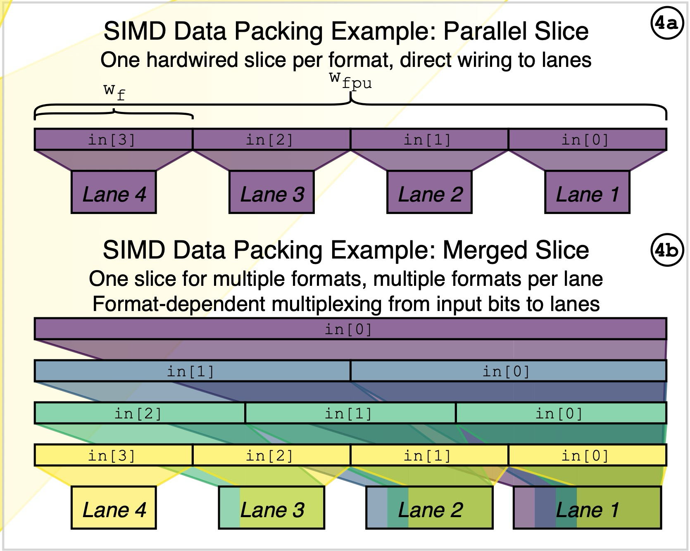

# FPnew 使用规范

## 概述

FPnew 是一个开源的、高度可配置的**跨精度浮点单元**，支持多种标准与非标准浮点格式，并具备标量与向量运算能力，实现精度与能耗之间的动态权衡。

FPnew 采用 SystemVerilog 编写，遵循 IEEE 754-2008 标准，支持多种浮点格式、多格式融合乘加、转换与打包操作等，具备高度可配置的流水线结构。

FPnew 的架构分为四个主要功能块，每个块处理一类指令：

1. **ADDMUL**：融合乘加 (a*b)+c 、加法(a=1)、乘法(c=0)
2. **DIVSQRT**：除法、平方根（迭代实现）
3. **COMP**：比较、分类、位操作
4. **CONV**：格式转换（FP↔FP、FP↔整数）


每个功能块可配置为**并行**或**合并**格式切片，支持不同精度的独立或共享数据通路。

<figure>
  
  <figcaption>Merge vs Parallel</figcaption>
</figure>

FPnew 通过 SystemVerilog 参数进行配置，其中支持的浮点格式包括：
  - FP64 (11,52)
  - FP32 (8,23)
  - FP16 (5,10)
  - BF16 (8,7)
  - FP8 (5,2)

## 配置与端口

### 关键配置参数

#### FPU_FEATURES


<!-- ======================= FPU_FEATURES ======================= -->
<div style="display: flex; justify-content: center;">
<table style="border-collapse: collapse; margin-bottom: 30px;">
    <thead>
        <tr style="border: 2px solid black;color: black; background-color: #9a0000; color: #e6e6e6;;">
            <th style="border: 1px solid black; padding: 8px; text-align: center; vertical-align: middle;">配置项</th>
            <th style="border: 1px solid black; padding: 8px; text-align: center; vertical-align: middle;">描述</th>
        </tr>
    </thead>
    <tbody>
        <tr style="border: 2px solid black; color: black;background-color: white;">
            <td style="border: 1px solid black; padding: 8px; text-align: center;">Width</td>
            <td style="border: 1px solid black; padding: 8px; text-align: center;">数据路径的宽度（通常与 ISA XLEN 对应）</td>
        </tr>
        <tr style="border: 2px solid black; color: black;background-color: #eeeeee;">
            <td style="border: 1px solid black; padding: 8px; text-align: center;">EnableVectors</td>
            <td style="border: 1px solid black; padding: 8px; text-align: center;">是否启用向量模式（SIMD 格式切片）</td>
        </tr>
        <tr style="border: 2px solid black; color: black;background-color: white;">
            <td style="border: 1px solid black; padding: 8px; text-align: center;">EnableNanBox</td>
            <td style="border: 1px solid black; padding: 8px; text-align: center;">是否启用 NaN Boxing（高位填 1）</td>
        </tr>
        <tr style="border: 2px solid black; color: black;background-color: #eeeeee;">
            <td style="border: 1px solid black; padding: 8px; text-align: center;">FpFmtMask[4:0]</td>
            <td style="border: 1px solid black; padding: 8px; text-align: center;">允许启用的浮点格式枚举（FP64/32/16/BF16/FP8）</td>
        </tr>
        <tr style="border: 2px solid black; color: black;background-color: white;">
            <td style="border: 1px solid black; padding: 8px; text-align: center;">IntFmtMask[3:0]</td>
            <td style="border: 1px solid black; padding: 8px; text-align: center;">允许的整数格式（INT8/16/32/64）</td>
        </tr>
    </tbody>
</table>

</div>


#### FPU_IMPLEMENTATION

<!-- ======================= FPU_IMPLEMENTATION ======================= -->
<div style="display: flex; justify-content: center;">
<table style="border-collapse: collapse; margin-bottom: 30px;">
    <thead>
        <tr style="border: 2px solid black; color: black;background-color: #9a0000; color: white;">
            <th style="border: 1px solid black; padding: 8px; text-align: center; vertical-align: middle;">配置项</th>
            <th style="border: 1px solid black; padding: 8px; text-align: center; vertical-align: middle;">描述</th>
        </tr>
    </thead>
    <tbody>
        <tr style="border: 2px solid black; color: black;background-color: white;">
            <td style="border: 1px solid black; padding: 8px; text-align: center;">PipeRegs</td>
            <td style="border: 1px solid black; padding: 8px; text-align: center;">每个功能块的流水级数配置</td>
        </tr>
        <tr style="border: 2px solid black; color: black;background-color: #eeeeee;">
            <td style="border: 1px solid black; padding: 8px; text-align: center;">UnitTypes</td>
            <td style="border: 1px solid black; padding: 8px; text-align: center;">每个功能块选择 Parallel 或 Merged 实现</td>
        </tr>
        <tr style="border: 2px solid black; color: black;background-color: white;">
            <td style="border: 1px solid black; padding: 8px; text-align: center;">PipeConfig</td>
            <td style="border: 1px solid black; padding: 8px; text-align: center;">流水化架构（集中在输入 / 集中在输出 / 分布式）</td>
        </tr>
    </tbody>
</table>


</div>


### 输入信号

<div style="display: flex; justify-content: center;">
<table style="border-collapse: collapse; margin-bottom: 30px;">
    <thead>
        <tr style="border: 2px solid black; color: black;background-color: #9a0000; color: white;">
            <th style="border: 1px solid black; padding: 8px; text-align: center;">端口</th>
            <th style="border: 1px solid black; padding: 8px; text-align: center;">方向</th>
            <th style="border: 1px solid black; padding: 8px; text-align: center;">描述</th>
        </tr>
    </thead>
    <tbody>
        <tr style="border: 2px solid black; color: black;background-color: white;">
            <td style="border: 1px solid black; padding: 8px; text-align: center;">operands_i[2:0]</td>
            <td style="border: 1px solid black; padding: 8px; text-align: center;">input</td>
            <td style="border: 1px solid black; padding: 8px; text-align: center;">3 个输入操作数（NaN boxing 后）</td>
        </tr>
        <tr style="border: 2px solid black; color: black;background-color: #eeeeee;">
            <td style="border: 1px solid black; padding: 8px; text-align: center;">op_i</td>
            <td style="border: 1px solid black; padding: 8px; text-align: center;">input</td>
            <td style="border: 1px solid black; padding: 8px; text-align: center;">操作类型（ADDMUL / DIVSQRT / COMP / CONV）</td>
        </tr>
        <tr style="border: 2px solid black; color: black;background-color: white;">
            <td style="border: 1px solid black; padding: 8px; text-align: center;">op_mod_i</td>
            <td style="border: 1px solid black; padding: 8px; text-align: center;">input</td>
            <td style="border: 1px solid black; padding: 8px; text-align: center;">操作修饰符（如 ADD 中 =1 表示减法）</td>
        </tr>
        <tr style="border: 2px solid black; color: black;background-color: #eeeeee;">
            <td style="border: 1px solid black; padding: 8px; text-align: center;">src_fmt_i</td>
            <td style="border: 1px solid black; padding: 8px; text-align: center;">input</td>
            <td style="border: 1px solid black; padding: 8px; text-align: center;">输入格式（FP/BF16/INT）</td>
        </tr>
        <tr style="border: 2px solid black; color: black;background-color: white;">
            <td style="border: 1px solid black; padding: 8px; text-align: center;">dst_fmt_i</td>
            <td style="border: 1px solid black; padding: 8px; text-align: center;">input</td>
            <td style="border: 1px solid black; padding: 8px; text-align: center;">输出格式</td>
        </tr>
        <tr style="border: 2px solid black; color: black;background-color: #eeeeee;">
            <td style="border: 1px solid black; padding: 8px; text-align: center;">rnd_mode_i</td>
            <td style="border: 1px solid black; padding: 8px; text-align: center;">input</td>
            <td style="border: 1px solid black; padding: 8px; text-align: center;">舍入模式（默认 RNE）</td>
        </tr>
        <tr style="border: 2px solid black; color: black;background-color: white;">
            <td style="border: 1px solid black; padding: 8px; text-align: center;">vectorial_op_i</td>
            <td style="border: 1px solid black; padding: 8px; text-align: center;">input</td>
            <td style="border: 1px solid black; padding: 8px; text-align: center;">是否启用向量操作（SIMD 模式）</td>
        </tr>
        <tr style="border: 2px solid black; color: black;background-color: #eeeeee;">
            <td style="border: 1px solid black; padding: 8px; text-align: center;">in_valid_i</td>
            <td style="border: 1px solid black; padding: 8px; text-align: center;">input</td>
            <td style="border: 1px solid black; padding: 8px; text-align: center;">输入事务有效</td>
        </tr>
        <tr style="border: 2px solid black; color: black;background-color: white;">
            <td style="border: 1px solid black; padding: 8px; text-align: center;">tag_i</td>
            <td style="border: 1px solid black; padding: 8px; text-align: center;">input</td>
            <td style="border: 1px solid black; padding: 8px; text-align: center;">标签</td>
        </tr>
        <tr style="border: 2px solid black; color: black;background-color: #eeeeee;">
            <td style="border: 1px solid black; padding: 8px; text-align: center;">clk_i</td>
            <td style="border: 1px solid black; padding: 8px; text-align: center;">input</td>
            <td style="border: 1px solid black; padding: 8px; text-align: center;">时钟</td>
        </tr>
    </tbody>
</table>

</div>


<!-- ======================= OUTPUT PORTS ======================= -->
### 输出信号


<div style="display: flex; justify-content: center;">
<table style="border-collapse: collapse;">
    <thead>
        <tr style="border: 2px solid black; color: black;background-color: #9a0000; color: white;">
            <th style="border: 1px solid black; padding: 8px; text-align: center;">端口</th>
            <th style="border: 1px solid black; padding: 8px; text-align: center;">方向</th>
            <th style="border: 1px solid black; padding: 8px; text-align: center;">描述</th>
        </tr>
    </thead>
    <tbody>
        <tr style="border: 2px solid black; color: black;background-color: white;">
            <td style="border: 1px solid black; padding: 8px; text-align: center;">result_o</td>
            <td style="border: 1px solid black; padding: 8px; text-align: center;">output</td>
            <td style="border: 1px solid black; padding: 8px; text-align: center;">浮点结果</td>
        </tr>
        <tr style="border: 2px solid black; color: black;background-color: #eeeeee;">
            <td style="border: 1px solid black; padding: 8px; text-align: center;">status_o</td>
            <td style="border: 1px solid black; padding: 8px; text-align: center;">output</td>
            <td style="border: 1px solid black; padding: 8px; text-align: center;">浮点状态标志</td>
        </tr>
        <tr style="border: 2px solid black; color: black;background-color: white;">
            <td style="border: 1px solid black; padding: 8px; text-align: center;">tag_o</td>
            <td style="border: 1px solid black; padding: 8px; text-align: center;">output</td>
            <td style="border: 1px solid black; padding: 8px; text-align: center;">与 tag_i 对应</td>
        </tr>
        <tr style="border: 2px solid black; color: black;background-color: #eeeeee;">
            <td style="border: 1px solid black; padding: 8px; text-align: center;">out_valid_o</td>
            <td style="border: 1px solid black; padding: 8px; text-align: center;">output</td>
            <td style="border: 1px solid black; padding: 8px; text-align: center;">输出有效</td>
        </tr>
        <tr style="border: 2px solid black; color: black;background-color: white;">
            <td style="border: 1px solid black; padding: 8px; text-align: center;">in_ready_o</td>
            <td style="border: 1px solid black; padding: 8px; text-align: center;">output</td>
            <td style="border: 1px solid black; padding: 8px; text-align: center;">FPU 是否准备接受新指令</td>
        </tr>
        <tr style="border: 2px solid black; color: black;background-color: #eeeeee;">
            <td style="border: 1px solid black; padding: 8px; text-align: center;">busy_o</td>
            <td style="border: 1px solid black; padding: 8px; text-align: center;">output</td>
            <td style="border: 1px solid black; padding: 8px; text-align: center;">FPU 是否忙碌（如 DIVSQRT 迭代中）</td>
        </tr>
    </tbody>
</table>

</div>


### 使用样例

FPU的核心配置如下所示，以BF16的运算为例，这里的配置信号会决定具体的fpnew的硬件实现方式
```
localparam fpnew_pkg::fpu_features_t FPU_FEATURES = '{
      Width:         WIDTH,
      EnableVectors: 1'b1,
      EnableNanBox:  1'b1,     // 开启 NaN Boxing
      // Enable Format {FP16ALT,FP8,FP16,FP64,FP32}
      FpFmtMask:     5'b11111, // All FP format enabled
      // Enable Format {INT64,INT32,INT16,INT8}
      IntFmtMask:    4'b1111   // All INT format enabled
  };
  localparam fpnew_pkg::fpu_implementation_t FPU_IMPLEMENTATION = '{
      PipeRegs: '{
          // ADDMUL: 
          '{default: 2}, 
          // DIVSQRT
          '{default: 5},
          // NONCOMP
          '{default: 1},
          // CONV
          '{default: 1}
      },
      UnitTypes: '{
          '{default: fpnew_pkg::PARALLEL}, // ADDMUL
          '{default: fpnew_pkg::MERGED},   // DIVSQRT
          '{default: fpnew_pkg::PARALLEL}, // NONCOMP
          '{default: fpnew_pkg::MERGED}    // CONV
      },
      PipeConfig: fpnew_pkg::DISTRIBUTED
  };
```

如上实例化FPU之后，可以通过如下的方式驱动FPU进行计算

```

  // Task to drive BF16 operations (Handles NaN boxing automatically)
  task send_bf16_op(
      input [15:0]                op_a_bf16,
      input [15:0]                op_b_bf16,
      input [15:0]                op_c_bf16,
      input fpnew_pkg::operation_e op,
      input logic                 op_mod,
      input int                   tag_id
  );
      begin
          // NaN Boxing: Fill upper 48 bits with 1s
          operands_i[0]  <= {48'hFFFF_FFFF_FFFF, op_a_bf16};
          operands_i[1]  <= {48'hFFFF_FFFF_FFFF, op_b_bf16};
          operands_i[2]  <= {48'hFFFF_FFFF_FFFF, op_c_bf16};
          op_i           <= op;               // Operation
          op_mod_i       <= op_mod;           // ADD时 =1表示减法
          // BF16 is typically mapped to FP16ALT in fpnew
          src_fmt_i      <= fpnew_pkg::FP16ALT; 
          dst_fmt_i      <= fpnew_pkg::FP16ALT;
          int_fmt_i      <= fpnew_pkg::INT64; // Don't care
          rnd_mode_i     <= fpnew_pkg::RNE;   // Round Nearest Even
          tag_i          <= tag_id;
          vectorial_op_i <= 1'b0;             // 是否为向量操作
          in_valid_i     <= 1'b1;

          do begin
              @(posedge clk_i);
          end while (in_ready_o == 1'b0);
          in_valid_i     <= 1'b0;

          do begin
              @(posedge clk_i);
          end while (busy_o == 1'b1);
      end
  endtask
```
需要注意的是，即使在硬件实现为向量实现，在实际使用过程中仍然可以向下兼容选择进行标量操作。 但是进行标量的除法和开根操作时，FPU会因等待没有进行操作的其他lane操作结束而进入死循环中，所以建议在向量化实现的FPU中将fpnew_opgroup_multifmt_slice.sv:422行更改为：

```
assign simd_synch_done = (EnableVectors && vectorial_op) ? &divsqrt_done  : divsqrt_done[0];
```

## 集成至RISC-V处理器中

###  ISA 扩展与编译器配置
在 RISC-V 指令集中，体系结构根据**基础位宽（RV32 / RV64）**与**支持的扩展指令**组合而成，例如：

- RV32I  
- RV64I  
- RV64IM  
- RV64IMT  
- RV64IMFD  
- RV64GC（常见通用配置）

这些名称中的字母代表 CPU 所支持的扩展功能。


<div style="display: flex; justify-content: center;">
<table style="border-collapse: collapse;">
    <thead>
        <tr style="border: 2px solid black; background-color: #9a0000; color: white;">
            <th style="border: 1px solid black; padding: 8px; text-align: center;">扩展字母</th>
            <th style="border: 1px solid black; padding: 8px; text-align: center;">代表的功能 / 含义</th>
        </tr>
    </thead>
    <tbody>
        <tr style="border: 2px solid black; background-color: white; color: black;">
            <td style="border: 1px solid black; padding: 8px; text-align: center;">I</td>
            <td style="border: 1px solid black; padding: 8px; text-align: center;">基础整数指令集（必备）</td>
        </tr>
        <tr style="border: 2px solid black; background-color: #eeeeee; color: black;">
            <td style="border: 1px solid black; padding: 8px; text-align: center;">M</td>
            <td style="border: 1px solid black; padding: 8px; text-align: center;">整数乘除扩展（Mul/Div）</td>
        </tr>
        <tr style="border: 2px solid black; background-color: white; color: black;">
            <td style="border: 1px solid black; padding: 8px; text-align: center;">A</td>
            <td style="border: 1px solid black; padding: 8px; text-align: center;">原子指令（Atomic）</td>
        </tr>
        <tr style="border: 2px solid black; background-color: #eeeeee; color: black;">
            <td style="border: 1px solid black; padding: 8px; text-align: center;">F</td>
            <td style="border: 1px solid black; padding: 8px; text-align: center;">单精度浮点（Float 32-bit）</td>
        </tr>
        <tr style="border: 2px solid black; background-color: white; color: black;">
            <td style="border: 1px solid black; padding: 8px; text-align: center;">D</td>
            <td style="border: 1px solid black; padding: 8px; text-align: center;">双精度浮点（Double 64-bit）</td>
        </tr>
        <tr style="border: 2px solid black; background-color: #eeeeee; color: black;">
            <td style="border: 1px solid black; padding: 8px; text-align: center;">C</td>
            <td style="border: 1px solid black; padding: 8px; text-align: center;">Compressed 压缩指令（16-bit，提升代码密度）</td>
        </tr>
    </tbody>
</table>
</div>


为了确保编译器能正确生成 F/D 浮点、整数、压缩等指令，需要在构建 riscv-gnu-toolchain 时配置：

```
GCC_CONFIGURE_OPTS="\
	--prefix=$PREFIX \
	--target=$TARGET \
	--enable-languages=c \
	--disable-libssp \
	--disable-libgomp \
	--disable-libmudflap
	--with-arch=rv64gc \
	--with-abi=lp64d \
	--enable-multilib"
```

其中
```
--with-arch=rv64gc
--with-abi=lp64d 
```
对应启用 RV64 + IMAFD + C，并且使用包含 Double 的 ABI（支持 F/D 浮点）

应用层编译也需要明确 ISA 扩展，否则可能出现 illegal instruction，即：

```
$(RISCV_GCC) -march=rv64gc -mabi=lp64d ...
```

### CVA6硬件配置
在将 C 代码编译为包含浮点指令的指令流之后，需要对 **CVA6 RISC-V CPU** 进行相应的硬件配置，以确保处理器能够正确识别并执行浮点指令。相关配置主要集中在三个位置：  
- **cva6_config_pkg**：在此处启用 FPU，包括 FPU Enable、Vector Enable 以及各浮点格式（如 FP64/FP32/FP16/BF16 等）的独立使能开关，使得硬件层面允许这些格式的浮点运算；  
- **soc.sv**：在 SoC 顶层的 CVA6 config 字段中进一步开启 FPU 相关选项，使能处理器内部的浮点单元，使其在系统集成时能够被正常调度与访问；  
- **fpu_wrap.sv**：通过修改 `FPU_FEATURES` 与 `FPU_IMPLEMENTATION` 两个参数，对 FPU 的具体硬件结构进行灵活配置，包括是否允许向量模式、FP 格式掩码、流水线级数、并行/合并结构等，从而确定最终浮点单元的微架构实现。

由于一般应用中 FP 指令只占全部指令流的一小部分，CVA6 默认不会对每条指令都启用浮点译码，而是要求软件在执行 FP 指令前通过 CSR 指令设置 FS 标志位，以显式允许浮点指令译码；而在 FP 指令执行完成的 commit 阶段，CPU会自动清除该标志，使译码器再次屏蔽浮点路径。

如果编译器并未针对这个特性进行过定制化的优化，则需要在所有的浮点指令前手动插入配置CSR指令，增加使用成本。对于对功耗不敏感、且需要频繁使用 FP 指令的场景，可以在硬件上将浮点译码逻辑始终保持开启，在 `cva6.sv:508` 将 `id_stage` 的 `fs_i` 信号直接拉高，即可避免所有软件层面的 CSR 控制，简化整体流程。
