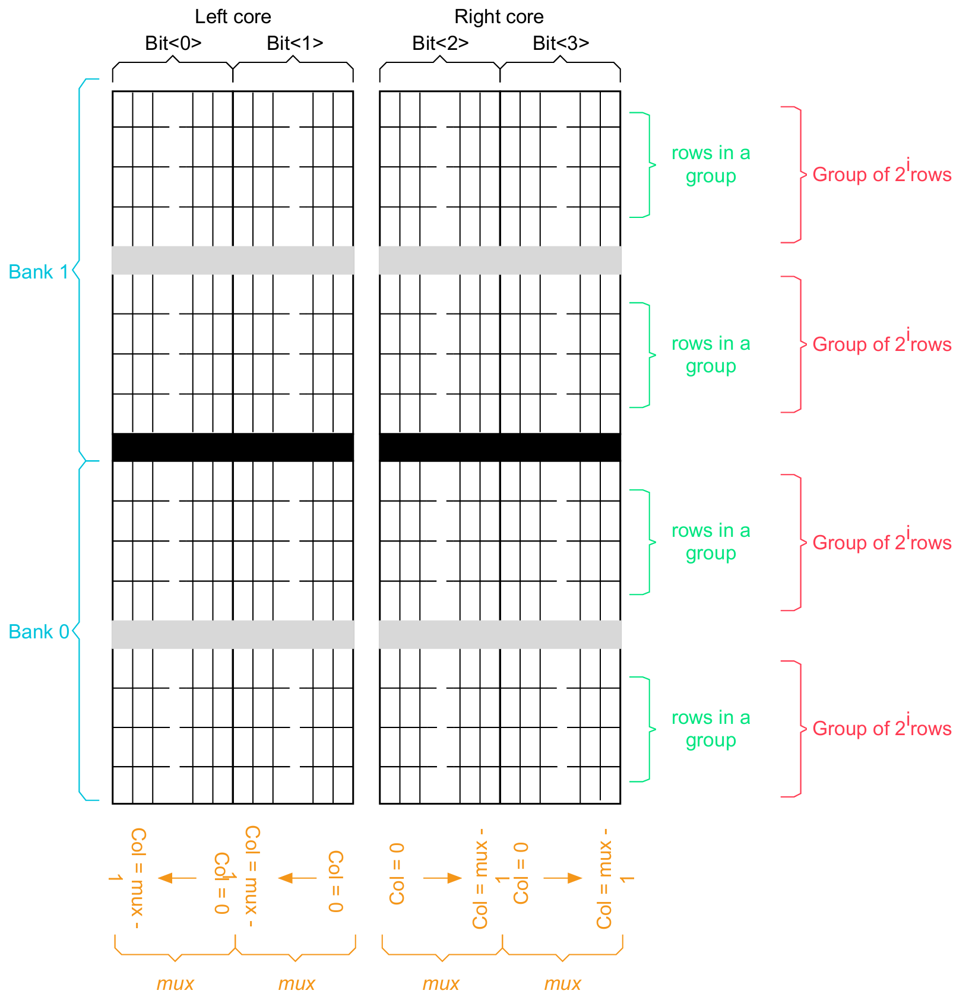
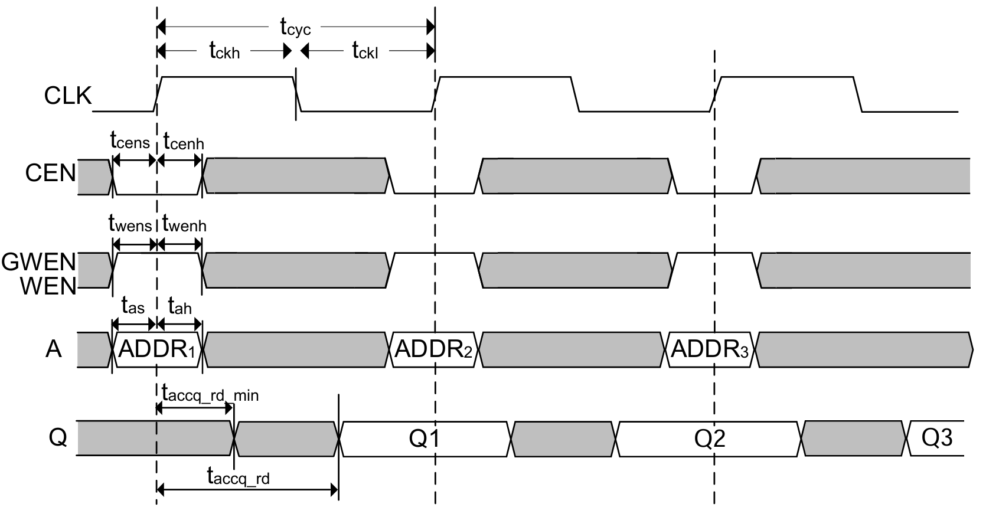
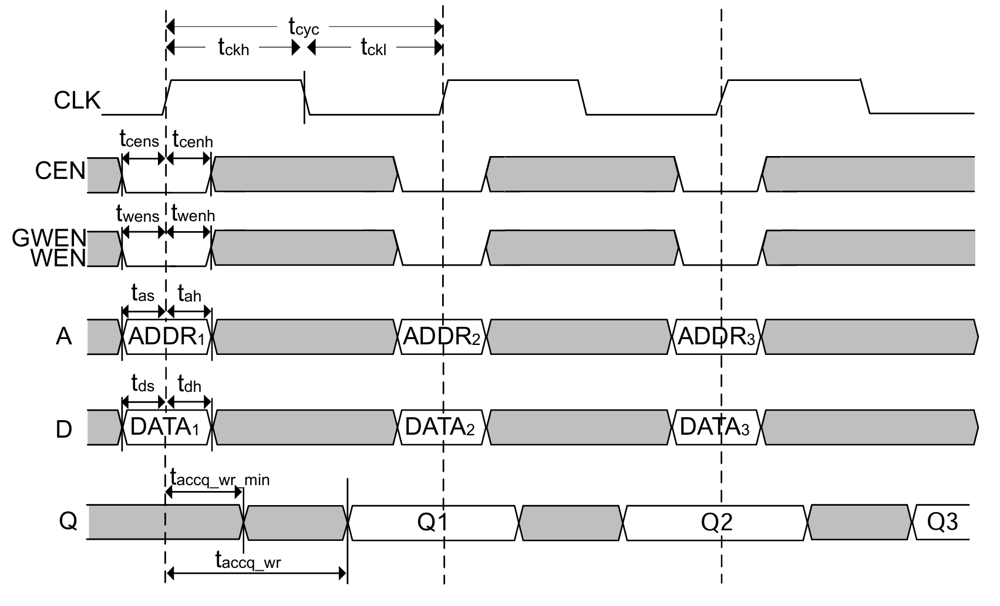

# SRAM IP 使用规范

## 尺寸

SRAM 的尺寸是由 `Number of Words`、`Number of Bits`、`Multiplexer Width` `Number of banks` 所决定的，对应能生成的 SRAM 尺寸如下表所示。

<table style="border-collapse: collapse;">
    <thead>
        <tr style="border: 2px solid black; background-color: #9a0000; color: white;">
            <th style="border: 1px solid black; padding: 8px; text-align: center; vertical-align: middle;">Mux</th>
            <th style="border: 1px solid black; padding: 8px; text-align: center; vertical-align: middle;">Flexible_banking</th>
            <th style="border: 1px solid black; padding: 8px; text-align: center; vertical-align: middle;">Words (min:max:step)</th>
            <th style="border: 1px solid black; padding: 8px; text-align: center; vertical-align: middle;">Bits (min:max:step)</th>
        </tr>
    </thead>
    <tbody>
        <tr style="border: 2px solid black; background-color: white; color: black;">
            <td style="border: 1px solid black; padding: 8px; text-align: center; vertical-align: middle;">4</td>
            <td style="border: 1px solid black; padding: 8px; text-align: center; vertical-align: middle;">2</td>
            <td style="border: 1px solid black; padding: 8px; text-align: center; vertical-align: middle;">512:2048:32</td>
            <td style="border: 1px solid black; padding: 8px; text-align: center; vertical-align: middle;">4:160:1</td>
        </tr>
        <tr style="border: 2px solid black; background-color: #eeeeee; color: black;">
            <td style="border: 1px solid black; padding: 8px; text-align: center; vertical-align: middle;">4</td>
            <td style="border: 1px solid black; padding: 8px; text-align: center; vertical-align: middle;">4</td>
            <td style="border: 1px solid black; padding: 8px; text-align: center; vertical-align: middle;">1024:4096:64</td>
            <td style="border: 1px solid black; padding: 8px; text-align: center; vertical-align: middle;">4:160:1</td>
        </tr>
        <tr style="border: 2px solid black; background-color: white; color: black;">
            <td style="border: 1px solid black; padding: 8px; text-align: center; vertical-align: middle;">4</td>
            <td style="border: 1px solid black; padding: 8px; text-align: center; vertical-align: middle;">8</td>
            <td style="border: 1px solid black; padding: 8px; text-align: center; vertical-align: middle;">2048:8192:128</td>
            <td style="border: 1px solid black; padding: 8px; text-align: center; vertical-align: middle;">4:160:1</td>
        </tr>
        <tr style="border: 2px solid black; background-color: #eeeeee; color: black;">
            <td style="border: 1px solid black; padding: 8px; text-align: center; vertical-align: middle;">8</td>
            <td style="border: 1px solid black; padding: 8px; text-align: center; vertical-align: middle;">2</td>
            <td style="border: 1px solid black; padding: 8px; text-align: center; vertical-align: middle;">1024:4096:64</td>
            <td style="border: 1px solid black; padding: 8px; text-align: center; vertical-align: middle;">4:160:1</td>
        </tr>
        <tr style="border: 2px solid black; background-color: white; color: black;">
            <td style="border: 1px solid black; padding: 8px; text-align: center; vertical-align: middle;">8</td>
            <td style="border: 1px solid black; padding: 8px; text-align: center; vertical-align: middle;">4</td>
            <td style="border: 1px solid black; padding: 8px; text-align: center; vertical-align: middle;">20048:8192:128</td>
            <td style="border: 1px solid black; padding: 8px; text-align: center; vertical-align: middle;">4:160:1</td>
        </tr>
        <tr style="border: 2px solid black; background-color: #eeeeee; color: black;">
            <td style="border: 1px solid black; padding: 8px; text-align: center; vertical-align: middle;">8</td>
            <td style="border: 1px solid black; padding: 8px; text-align: center; vertical-align: middle;">8</td>
            <td style="border: 1px solid black; padding: 8px; text-align: center; vertical-align: middle;">4096:16384:256</td>
            <td style="border: 1px solid black; padding: 8px; text-align: center; vertical-align: middle;">4:160:1</td>
        </tr>
        <tr style="border: 2px solid black; background-color: white; color: black;">
            <td style="border: 1px solid black; padding: 8px; text-align: center; vertical-align: middle;">16</td>
            <td style="border: 1px solid black; padding: 8px; text-align: center; vertical-align: middle;">2</td>
            <td style="border: 1px solid black; padding: 8px; text-align: center; vertical-align: middle;">2048:8192:128</td>
            <td style="border: 1px solid black; padding: 8px; text-align: center; vertical-align: middle;">4:80:1</td>
        </tr>
        <tr style="border: 2px solid black; background-color: #eeeeee; color: black;">
            <td style="border: 1px solid black; padding: 8px; text-align: center; vertical-align: middle;">16</td>
            <td style="border: 1px solid black; padding: 8px; text-align: center; vertical-align: middle;">4</td>
            <td style="border: 1px solid black; padding: 8px; text-align: center; vertical-align: middle;">4096:16384:256</td>
            <td style="border: 1px solid black; padding: 8px; text-align: center; vertical-align: middle;">4:80:1</td>
        </tr>
        <tr style="border: 2px solid black; background-color: white; color: black;">
            <td style="border: 1px solid black; padding: 8px; text-align: center; vertical-align: middle;">16</td>
            <td style="border: 1px solid black; padding: 8px; text-align: center; vertical-align: middle;">8</td>
            <td style="border: 1px solid black; padding: 8px; text-align: center; vertical-align: middle;">8192:32768:512</td>
            <td style="border: 1px solid black; padding: 8px; text-align: center; vertical-align: middle;">4:80:1</td>
        </tr>
    </tbody>
</table>

<figure>
  
  <figcaption>SRAM Array Architecture</figcaption>
</figure>

对于逻辑尺寸相同的 SRAM，Bank 的数量并**不会**显著影响面积。
Mux **越多**，SRAM 的 Wordline **越长**，Bitline **越短**。

## 端口

SRAM IP 的端口定义如下表所示。

<table style="border-collapse: collapse;">
    <thead>
        <tr style="border: 2px solid black; background-color: #9a0000; color: white;">
            <th style="border: 1px solid black; padding: 8px; text-align: center; vertical-align: middle;">端口</th>
            <th style="border: 1px solid black; padding: 8px; text-align: center; vertical-align: middle;">方向</th>
            <th style="border: 1px solid black; padding: 8px; text-align: center; vertical-align: middle;">描述</th>
        </tr>
    </thead>
    <tbody>
        <tr style="border: 2px solid black; background-color: white; color: black;">
            <td style="border: 1px solid black; padding: 8px; text-align: center; vertical-align: middle;">VSSE</td>
            <td style="border: 1px solid black; padding: 8px; text-align: center; vertical-align: middle;">input</td>
            <td style="border: 1px solid black; padding: 8px; text-align: center; vertical-align: middle;">接地</td>
        </tr>
        <tr style="border: 2px solid black; background-color: #eeeeee; color: black;">
            <td style="border: 1px solid black; padding: 8px; text-align: center; vertical-align: middle;">VDDPE</td>
            <td style="border: 1px solid black; padding: 8px; text-align: center; vertical-align: middle;">input</td>
            <td style="border: 1px solid black; padding: 8px; text-align: center; vertical-align: middle;">I/O 以及外围电路供电</td>
        </tr>
        <tr style="border: 2px solid black; background-color: white; color: black;">
            <td style="border: 1px solid black; padding: 8px; text-align: center; vertical-align: middle;">VDDCE</td>
            <td style="border: 1px solid black; padding: 8px; text-align: center; vertical-align: middle;">input</td>
            <td style="border: 1px solid black; padding: 8px; text-align: center; vertical-align: middle;">SRAM 阵列供电</td>
        </tr>
        <tr style="border: 2px solid black; background-color: #eeeeee; color: black;">
            <td style="border: 1px solid black; padding: 8px; text-align: center; vertical-align: middle;">CLK</td>
            <td style="border: 1px solid black; padding: 8px; text-align: center; vertical-align: middle;">input</td>
            <td style="border: 1px solid black; padding: 8px; text-align: center; vertical-align: middle;">时钟</td>
        </tr>
        <tr style="border: 2px solid black; background-color: white; color: black;">
            <td style="border: 1px solid black; padding: 8px; text-align: center; vertical-align: middle;">A[m-1:0]</td>
            <td style="border: 1px solid black; padding: 8px; text-align: center; vertical-align: middle;">input</td>
            <td style="border: 1px solid black; padding: 8px; text-align: center; vertical-align: middle;">地址</td>
        </tr>
        <tr style="border: 2px solid black; background-color: #eeeeee; color: black;">
            <td style="border: 1px solid black; padding: 8px; text-align: center; vertical-align: middle;">D[n-1:0]</td>
            <td style="border: 1px solid black; padding: 8px; text-align: center; vertical-align: middle;">input</td>
            <td style="border: 1px solid black; padding: 8px; text-align: center; vertical-align: middle;">写数据</td>
        </tr>
        <tr style="border: 2px solid black; background-color: white; color: black;">
            <td style="border: 1px solid black; padding: 8px; text-align: center; vertical-align: middle;">Q[n-1:0]</td>
            <td style="border: 1px solid black; padding: 8px; text-align: center; vertical-align: middle;">output</td>
            <td style="border: 1px solid black; padding: 8px; text-align: center; vertical-align: middle;">读数据</td>
        </tr>
        <tr style="border: 2px solid black; background-color: #eeeeee; color: black;">
            <td style="border: 1px solid black; padding: 8px; text-align: center; vertical-align: middle;">CEN</td>
            <td style="border: 1px solid black; padding: 8px; text-align: center; vertical-align: middle;">input</td>
            <td style="border: 1px solid black; padding: 8px; text-align: center; vertical-align: middle;">片选，低电平有效</td>
        </tr>
        <tr style="border: 2px solid black; background-color: white; color: black;">
            <td style="border: 1px solid black; padding: 8px; text-align: center; vertical-align: middle;">WEN</td>
            <td style="border: 1px solid black; padding: 8px; text-align: center; vertical-align: middle;">input</td>
            <td style="border: 1px solid black; padding: 8px; text-align: center; vertical-align: middle;">写使能，低电平有效</td>
        </tr>
        <tr style="border: 2px solid black; background-color: #eeeeee; color: black;">
            <td style="border: 1px solid black; padding: 8px; text-align: center; vertical-align: middle;">RET1N</td>
            <td style="border: 1px solid black; padding: 8px; text-align: center; vertical-align: middle;">input</td>
            <td style="border: 1px solid black; padding: 8px; text-align: center; vertical-align: middle;">保留模式，低电平有效</td>
        </tr>
        <tr style="border: 2px solid black; background-color: white; color: black;">
            <td style="border: 1px solid black; padding: 8px;text-align: center; vertical-align: middle;">EMA[2:0]</td>
            <td style="border: 1px solid black; padding: 8px; text-align: center; vertical-align: middle;">input</td>
            <td style="border: 1px solid black; padding: 8px; text-align: center; vertical-align: middle;">裕量调整</td>
        </tr>
        <tr style="border: 2px solid black; background-color: #eeeeee; color: black;">
            <td style="border: 1px solid black; padding: 8px; text-align: center; vertical-align: middle;">EMAW[1:0]</td>
            <td style="border: 1px solid black; padding: 8px; text-align: center; vertical-align: middle;">input</td>
            <td style="border: 1px solid black; padding: 8px; text-align: center; vertical-align: middle;">写裕量调整</td>
        </tr>
        <tr style="border: 2px solid black; background-color: white; color: black;">
            <td style="border: 1px solid black; padding: 8px; text-align: center; vertical-align: middle;">EMAS</td>
            <td style="border: 1px solid black; padding: 8px; text-align: center; vertical-align: middle;">input</td>
            <td style="border: 1px solid black; padding: 8px; text-align: center; vertical-align: middle;">灵敏放大器裕量调整</td>
        </tr>
    </tbody>
</table>

!!! warning "Bit Mask"

    如果加入了 Bit Mask 功能，则 `WEN` 信号会被替换为两个信号 `GWEN`，`WEN[n-1:0]`。
    前者表示全局写使能（低电平有效），后者表示每个 Bit 的写使能（低电平有效）。

### Extra Margin Adjustment (EMA)

EMA 允许 SRAM 添加**内部时序延迟**，以提高制造良率。
这些延迟**减慢**内存访问速度，为成功的内存读写操作提供了**额外的时间**。

`EMA[2:0]` 从 3'b000-3'b111 变化时，访问时间、周期时间和裕量分别**增加**。
即 3'b000 是**最快**设置，3'b111 **最慢**。

`EMAW[1:0]` 通过延长内部**写脉冲**来控制**写操作**的延迟。
随着 EMAW[1:0] 从 2'b00-2'b11 依次递增，裕量也依次**增大**。
**最快**的设置是 2'b00，**最慢**的设置是 2'b11。
`EMAW[1:0]` 的设置**不会**影响读操作期间的访问时间。

`EMAS` 扩展了检测放大器使能信号的**脉冲宽度**。
当驱动为**高电平**时，脉冲宽度会**延长**。
`EMAS` **不会**影响访问时间。

`EMA[2:0]` 和 `EMAW[1:0]` 都会**影响**总周期时间。
Liberty 文件中的时间是读写时间的最坏情况。

!!! danger "EMA 配置"

    建议通过使用**寄存器**或**复用外部引脚**来控制 EMA 引脚。
    如果 EMA 设置与默认设置**不同**，则必须能够在操作期间**动态更改** EMA 设置。
    不得将 EMA 引脚**硬编码**为默认值以外的任何值，否则**后果自负**！

### Retention

保留模式允许降低 SRAM 供电电压。
这种低功耗模式会**保留**存储器阵列内容。
在此模式下**无法**进行读或写操作。

### Vmin Assist (Read Assist)

读辅助添加了逻辑以改善位单元的**读干扰裕度**，确保读/写操作期间不会发生意外写入。

!!! danger "RAWL 配置"

    建议通过使用**寄存器**或**复用外部引脚**来控制 RAWL 引脚。
    如果 RAWL 设置与默认设置**不同**，则必须能够在操作期间**动态更改** RAWL 设置。
    不得将 RAWL 引脚**硬编码**为默认值以外的任何值，否则**后果自负**！

### Vmin Assist (Write Assist)

写入辅助添加了逻辑，以在低于典型值的电压下**提高**位单元的**写入能力**，从而确保写入操作期间的正确功能。

!!! danger "WABL 配置"

    建议通过使用**寄存器**或**复用外部引脚**来控制 WABL 引脚。
    如果 WABL 设置与默认设置**不同**，则必须能够在操作期间**动态更改** WABL 设置。
    不得将 WABL 引脚**硬编码**为默认值以外的任何值，否则**后果自负**！

### Self-time Overide (STOV)

STOV 功能允许**覆盖**存储器内部时钟脉冲的**自定时生成**。
该覆盖允许您使用非内部时钟脉冲进行芯片**调试**，因此可以在 SoC 中将该引脚实现为可编程。

!!! danger "STOV 配置"

    STOV 信号为**高电平有效**。
    STOV 引脚仅用于**测试目的**，在正常操作期间**不得置位**，否则**后果自负**！

## 时序

<figure>
  
  <figcaption>SRAM Read-cycle Timing</figcaption>
</figure>

<figure>
  
  <figcaption>SRAM Write-cycle Timing</figcaption>
</figure>