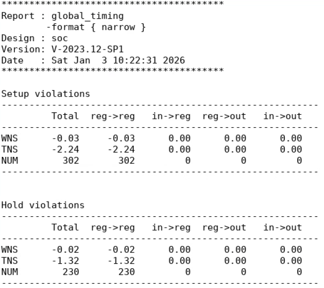
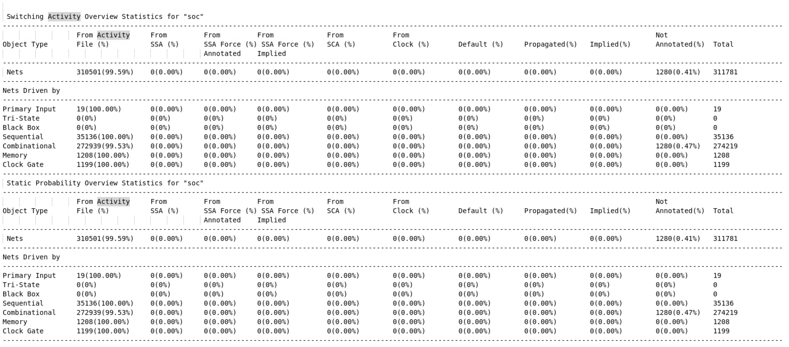
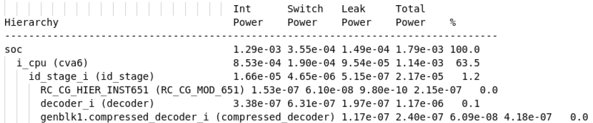
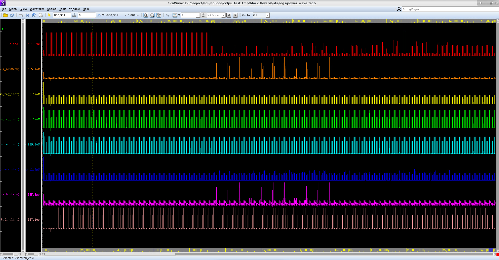

# STA 与功耗分析指南 (PrimeTime & PTPX)

在完成物理实现（PNR）后，我们需要进行静态时序分析（Static Timing Analysis, STA）以确保设计在所有工艺角（Corner）下都满足时序要求。同时，我们也需要进行功耗分析，评估设计的功耗是否在可接受的范围内。

我们使用 Synopsys **PrimeTime (PT)** 工具进行 STA，并利用其 **PrimeTime PX (PTPX)** 插件进行功耗分析。该流程将两者集成在一起，一次运行即可同时产出时序和功耗报告。

!!! tip "TLDR"
    1.  **分析脚本**: `sta/Makefile`、`sta/scripts/run_*.tcl`
    2.  **运行命令**: `make ptpx MODE=<mode>`
    3.  **分析模式**: `Averaged`, `VectorFree`, `Time_Based`

## 1. 整体工作流程

分析流程由 `sta/` 目录下的 `Makefile` 驱动。

```bash
# 运行 PTPX 分析，并指定模式
make ptpx MODE=<Averaged|VectorFree|Time_Based>
```

该命令会执行以下两个主要步骤：

### 1.1 库文件准备

由于 SRAM Compiler 通常只生成 `.lib` 格式的库文件，而 Synopsys 工具链对 `.db` 格式库支持更好，因此脚本会首先自动执行 `lib` 任务。

该任务调用 `lib_compiler` 和 `sta/scripts/lib_gen.tcl` 脚本，将所有 SRAM 和 Macro 的 `.lib` 文件编译成对应的 `.db` 文件，并存放在原路径下。这是一个一次性的预处理步骤，如果 `.db` 文件已存在，脚本会自动跳过。

### 1.2 运行 PT/PTPX 分析

根据指定的 `MODE`，脚本会调用 `pt_shell` 并执行对应的分析脚本 (`run_Averaged.tcl`, `run_VectorFree.tcl` 或 `run_Time_Based.tcl`)。

- **输入文件**: 脚本会自动从 `pnr/` 目录加载 PNR 后的**网表**、**SPEF 寄生参数文件**和**SDF 时序文件**。
- **输出文件**: 所有生成的日志和报告都存放在 `sta/logs/` 和 `sta/reports/` 目录下。

## 2. 三种分析模式

你可以根据拥有的数据和分析目标选择不同的模式。

### 2.1 `Averaged` 模式

- **适用场景**: 当你已经完成了 PNR 后仿真，并拥有了 `waveform.fsdb` 波形文件时，希望得到整个仿真时间段内的**平均功耗**。
- **运行命令**: `make ptpx MODE=Averaged`
- **核心逻辑**: 读取后仿波形文件中的信号翻转活动（switching activity），并基于此计算平均的内部功耗、开关功耗和泄漏功耗。
- **输出**: 脚本运行结束后自动退出，功耗结果在 `sta/reports/report_power_avg.rpt` 中查看。

### 2.2 `VectorFree` 模式

- **适用场景**: 当你完成了后端实现，但**暂时没有后仿波形**时，希望快速得到一个**粗略的功耗估计**。
- **运行命令**: `make ptpx MODE=VectorFree`
- **核心逻辑**: 不依赖外部波形文件。它使用设计中定义的时钟频率和默认的翻转率（toggle rate）在设计中进行传播，从而估算功耗。结果通常没有基于波形的模式准确，但可作为早期参考。
- **输出**: 脚本运行结束后自动退出，功耗结果在 `sta/reports/report_power_avg.rpt` 中查看。

### 2.3 `Time_Based` 模式

- **适用场景**: 当你拥有后仿波形，并且希望分析**功耗随时间变化的具体情况**，找出功耗峰值。
- **运行命令**: `make ptpx MODE=Time_Based`
- **核心逻辑**: 同样读取 `waveform.fsdb` 文件，但它会计算每个时间点的瞬时功耗，并生成一个功耗波形。
- **输出**: 脚本运行结束后，会自动打开 **nWave (Verdi)** 窗口，并加载生成的功耗波形文件 `logs/power_wave.fsdb`。

## 3. 关键检查点与结果分析

无论使用哪种模式，成功运行后都需要检查以下几个关键点：

### 3.1 检查输入文件加载

首先检查 `sta/logs/ptpx.log` 文件，确保网表、SPEF 和 SDF 文件都被成功加载。任何关于文件找不到或格式错误的 "Error" 或 "Warning" 都需要被解决。

### 3.2 检查时序违例 (STA 结果)

PrimeTime 会首先进行静态时序分析。你需要检查 `sta/reports/report_global_timing.rpt` 文件中是否存在时序违例，以及 `sta/reports/report_timing.rpt` 文件中的最差时序路径。

<figure>
  
  <figcaption>Global Timing Report Example</figcaption>
</figure>

报告的关键指标：
- **WNS (Worst Negative Slack)**: 最差路径的时序余量。如果为负数，代表存在建立时间（Setup）或保持时间（Hold）违例。
- **TNS (Total Negative Slack)**: 所有违例路径的时序余量总和。
- **NUM**: 违例路径的总数量。

### 3.3 检查翻转活动标注率 (针对 Averaged/Time_Based 模式)

如果使用了基于波形的分析模式，必须确认波形中的信号翻转信息被成功地标注到了设计的网络（net）上。检查 `sta/reports/report_activity_coverage.rpt` 文件。

<figure>
  
  <figcaption>Switching Activity Coverage Report</figcaption>
</figure>

关注 `Nets` 这一行。`From Activity File (%)` 列的数值代表了从 FSDB 波形文件中成功标注的信号网的百分比，这个值应该非常高（如 99.59%）。`Not Annotated (%)` 列应该非常低。如果标注率过低，功耗分析结果将不准确。

### 3.4 分析功耗结果

- **Averaged/VectorFree 模式**: 打开 `sta/reports/report_power_avg.rpt` 或 `report_power_verbose.rpt` 查看功耗 breakdown，包括内部功耗 (Internal Power，寄生参数充放电的功耗如 CMOS 短路电流)、开关功耗 (Switching Power，晶体管负载充放电的功耗) 和泄漏功耗 (Leakage Power，非理想漏电流的功耗) 的分布。

    <figure>
    
    <figcaption>Averaged Power Report Example</figcaption>
    </figure>

    上图展示了平均功耗的 hierarchical 分布。

- **Time_Based 模式**:
    在自动打开的 nWave 窗口中默认没有信号。你需要通过菜单栏 **Signal -> Get Signals** 或 **Get All Signals** 来加载功耗信号。你可以按层级查看不同模块的功耗波形，从而定位功耗热点。

    <figure>
    
    <figcaption>Time-Based Power Waveform in nWave</figcaption>
    </figure>
    
    上图展示了不同模块（`soc`、`i_axi2rom` 等）的功耗波形。可以看到，当时钟翻转且 CPU 正在执行任务（如 AXI 总线读写）时，总功耗会出现明显的峰值。