# 5. 模块级 LVS/DRC/Antenna 物理验证

!!! tip "TLDR（太长不看）"
    1. 验证脚本：`pv/Makefile`。
    2. 查看 LVS 验证结果：`make lvs` 后查看 `pv/reports/lvs.summary`。
    3. 查看 DRC 验证结果：`make drc` 后查看 `pv/reports/drc.summary`。
    4. 查看天线验证结果：`make ant` 后查看 `pv/reports/antenna.summary`。
    5. 一键运行所有验证：`make all`。

## 5.1 模板文件

在 Cadence Innovus 中完成数字子系统的物理设计或者顶层系统的物理设计之后，需要在 Siemens Calibre 中进行 LVS 和 DRC 物理验证。

??? info "什么是 LVS 与 DRC 物理验证"
    LVS（Layout Versus Schematic）物理验证用于确保集成电路的版图（Layout）与其原理图（Schematic）一致。LVS 检查的内容包括：电路网络一致性、器件匹配。
    在逻辑综合、物理实现的流程正确的情况下，数字子系统的 LVS 的准确性基本是由 EDA 工具保障的；而手动绘制的版图正确性则有更大概率出现人为的错误。

    DRC（Design Rule Check）用于确保集成电路的版图符合代工厂（例如 TSMC、SMIC）制造工艺的设计规则。DRC 检查内容包括：最小间距、最小宽度、重叠与对准等。
    在 Innovus 物理设计过程中，有可能因为布局布线的密度过高，导致走线距离小于最小距离，从而导致 DRC 错误。

验证所使用的文件夹结构为：

```
$ROOT
├── pv
│   ├── Makefile
│   ├── runset                                   # Configuration of the verification tools (i.e., Calibre)
│   │   ├── antenna.runset
│   │   ├── drc.runset
│   │   └── lvs.runset
│   ├── workspace                                # Main folder for storing Virtuoso-generated files
│   │   ├── .cdsinit                             # Initialization file for Calibre verfication tools
│   │   ├── cds.lib                              # Index file storing the technology library paths
│   │   ├── drc                                  # DRC reports generated by Virtuoso
│   │   │   └── ...
│   │   ├── lvs                                  # LVS reports generated by Virtuoso
│   │   │   └── ...
│   │   └── ...
├── pnr                                          # Main folder for Innovus physical implementation
│   ├── Makefile
│   ├── logs                                     # Log files generated by Innovus
│   │   └── ...
│   ├── scripts                                  # PnR scripts for Innovus
│   │   └── ...
│   └── <top_module_name>                        # Files generated by Innovus during physical implementation
│       ├── backup
│       │   └── ...
│       ├── reports
│       │   └── ...
│       ├── <top_module_name>.gds.gz              # Top module layout
│       ├── <top_module_name>.cdl.gz              # Top module circuit description netlist
│       ├── <top_module_name>.lef                 # Top module physical layout
│       ├── <top_module_name>_flat_postpnr.v.gz   # Flattened netlist w/ P/G pins
│       ├── <top_module_name>_hier_postpnr.v.gz   # Hierarchical netlist w/o P/G pins for post-implementation simulation
│       ├── <top_module_name>_tt_0p88v_25c.lib    # Top module timing library
│       └── <top_module_name>_tt_0p88v_25c.sdf.gz # Top module standard delay format
└── ...
```

## 5.2 使用脚本进行 LVS/DRC/Antenna 物理验证

### 5.2.1 LVS

在 `$ROOT/pv` 路径下运行以下命令：

```
make lvs
```

LVS 会在 `pv/reports/lvs.summary` 生成 LVS 报告文件。
看到如下内容则表示 LVS 物理验证通过：

<figure>
  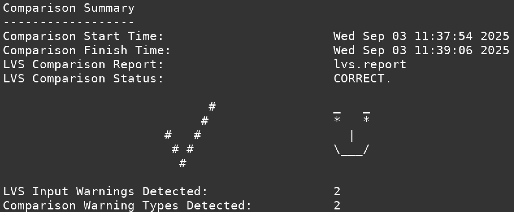
  <figcaption>LVS Pass Report</figcaption>
</figure>

如果 LVS 没有通过，证明在后端物理实现的时候某些步骤出现了问题，需要根据 LVS 报告中的错误信息进行排查和修正。

### 5.2.2 DRC

在 `$ROOT/pv` 路径下运行以下命令：

```
make drc
```

DRC 会在 `pv/reports/drc.summary` 生成 DRC 报告文件。
看到如下内容则表示 DRC 物理验证通过：

<figure>
  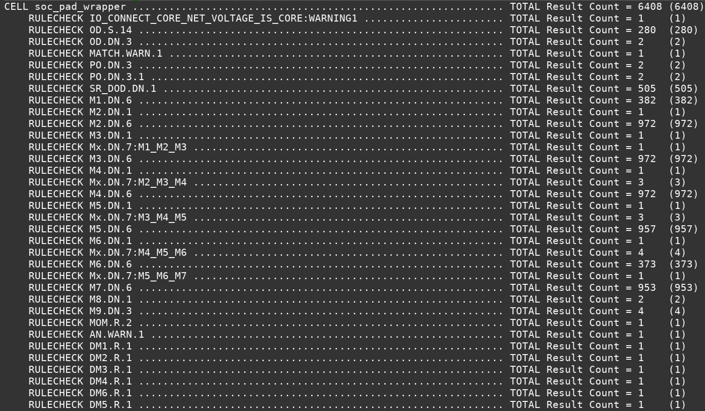
  <figcaption>Block-Level DRC Pass Report</figcaption>
</figure>

!!! tip "可忽略的 DRC"
    Block-level DRC 物理验证中，如下 DRC 是**可忽略**的：

    - IO_CONNECT_CORE_NET_VOLTAGE_ID_CORE:WARNING1
    - AN.WARN.1
    - MATCH.WARN.1
    - MOM.R.2
    - OD.S.14
    - \*.DN.\*
    - DM\*.R.1

### 5.2.3 天线效应

在 `$ROOT/pv` 路径下运行以下命令：

```
make ant
```

天线效应会在 `pv/reports/antenna.summary` 生成天线效应报告文件。
看到如下内容则表示天线效应物理验证通过：

<figure>
  
  <figcaption>Antenna Pass Report</figcaption>
</figure>

!!! tip "天线效应与 DRC"
    狭义上的 DRC 指的是普通的设计规则检查，而天线效应是特殊的设计规则检查。
    在此文档中所提及的 DRC 都指的是狭义上的 DRC，即不包括天线效应的规则检查。


### 5.2.4 一键运行所有验证

在 `$ROOT/pv` 路径下运行以下命令：

```
make all
```

## 5.3 使用 GUI 进行 LVS/DRC/Antenna 物理验证

### 5.3.1 LVS

在 `$ROOT/pv` 路径下运行以下命令：

```
make lvs GUI=1
```

会弹出如下窗口，点击 `Run LVS` 即可开始 LVS 物理验证。

<figure>
  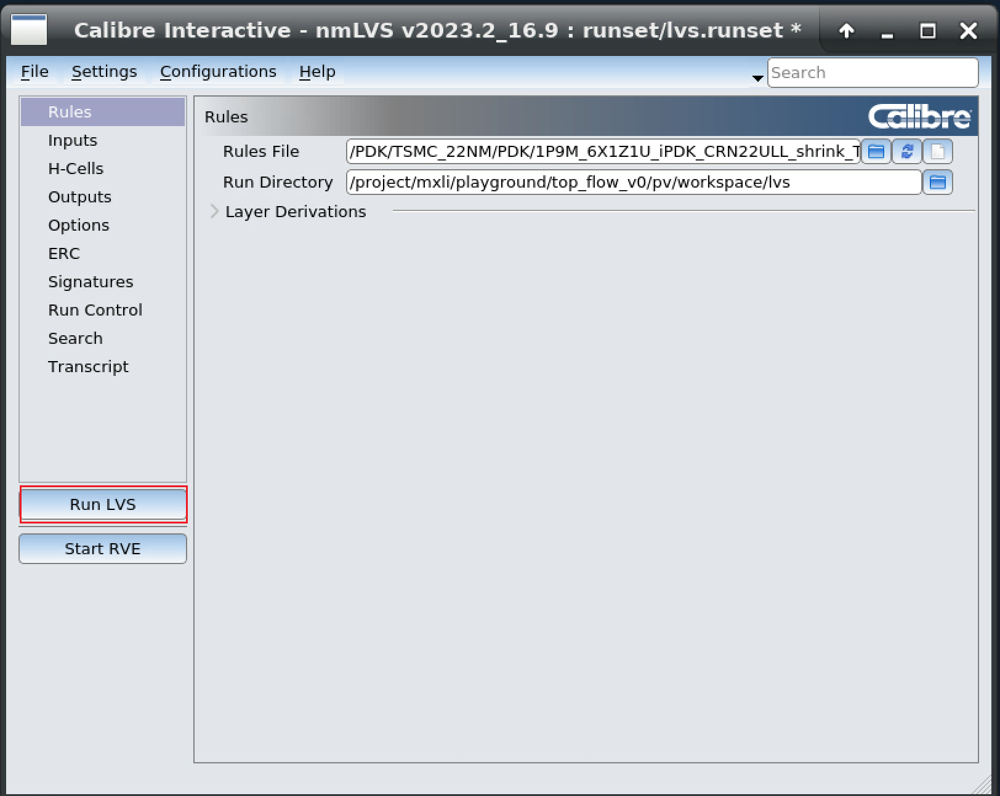
  <figcaption>LVS GUI</figcaption>
</figure>

运行结束后会弹出如下窗口。

<figure>
  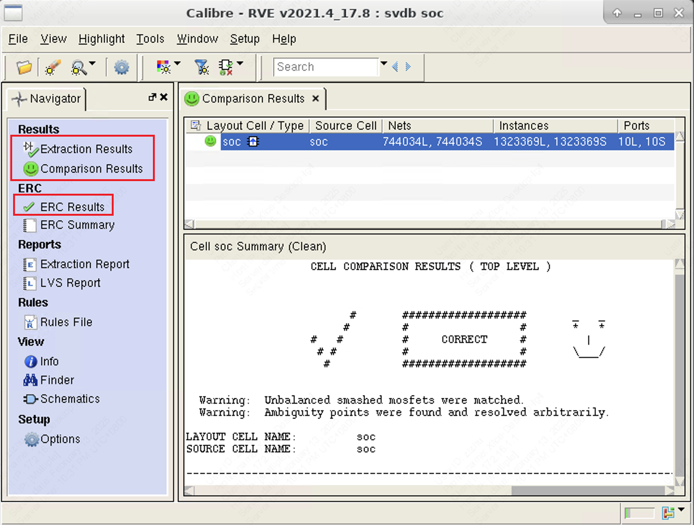
  <figcaption>Demo of a successful LVS verification</figcaption>
</figure>

看到笑脸则表示 LVS 物理验证通过。

### 5.3.2 DRC

在 `$ROOT/pv` 路径下运行以下命令：

```
make drc GUI=1
```

会弹出如下窗口，点击 `Run DRC` 即可开始 DRC 物理验证。

<figure>
  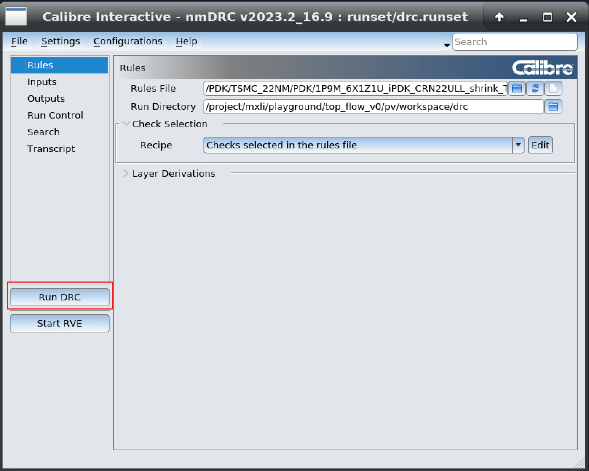
  <figcaption>DRC GUI</figcaption>
</figure>

运行结束后会弹出如下窗口。

<figure>
  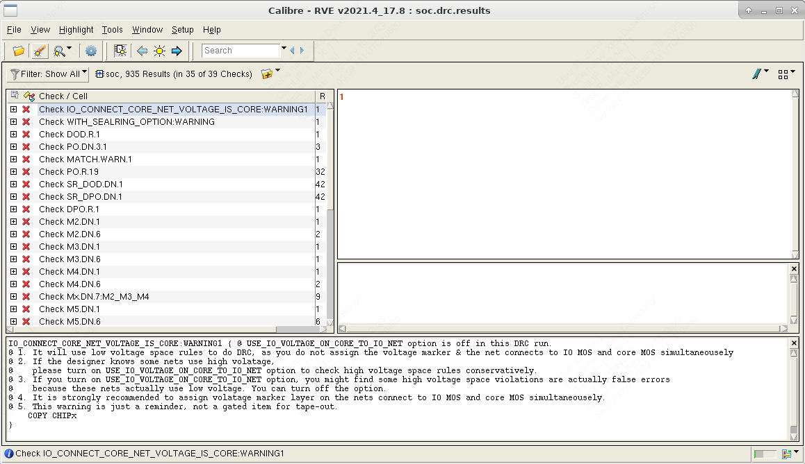
  <figcaption>Demo of DRC verification</figcaption>
</figure>

图中所示的 DRC 错误都是**可忽略**的。

!!! tip "可忽略的 DRC"
    Block-level DRC 物理验证中，如下 DRC 是**可忽略**的：

    - IO_CONNECT_CORE_NET_VOLTAGE_ID_CORE:WARNING1
    - AN.WARN.1
    - MATCH.WARN.1
    - MOM.R.2
    - OD.S.14
    - \*.DN.\*
    - DM\*.R.1

### 5.3.3 天线效应

在 `$ROOT/pv` 路径下运行以下命令：

```
make ant GUI=1
```

会弹出和 DRC 验证一致窗口，点击 `Run DRC` 即可开始天线效应物理验证。

<figure>
  
  <figcaption>DRC GUI</figcaption>
</figure>

运行结束后会弹出如下窗口。

<figure>
  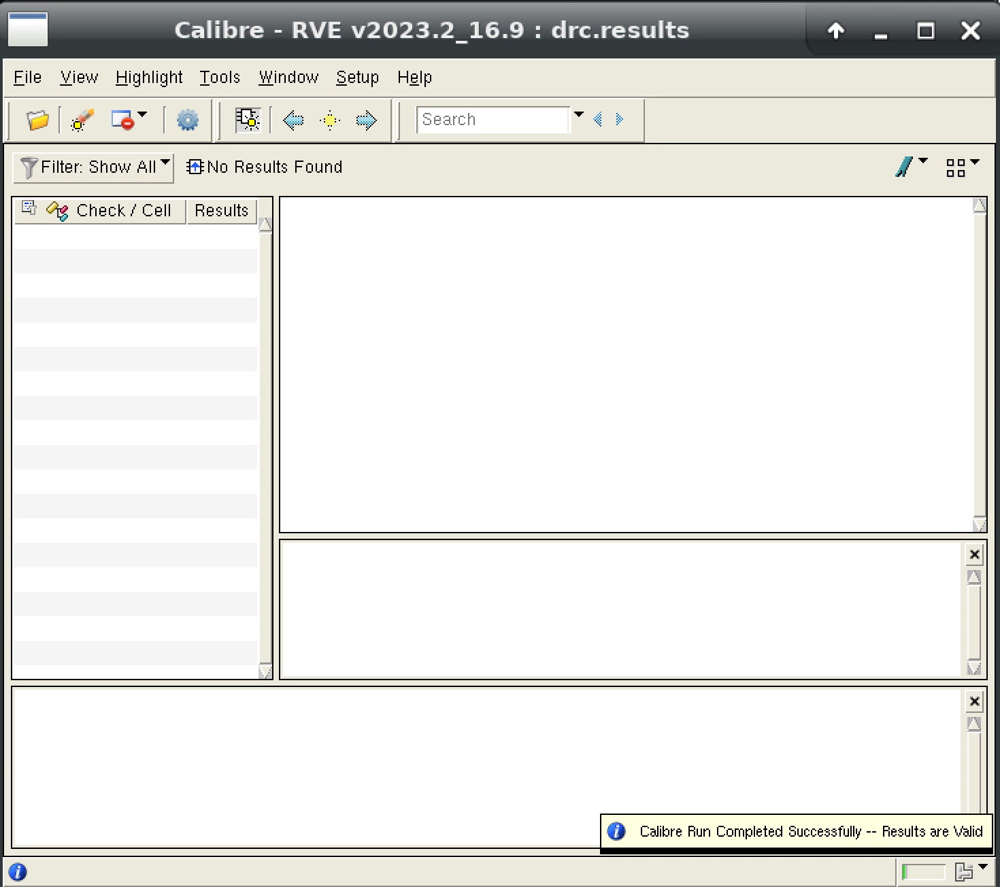
  <figcaption>Demo of a successful Antenna verification</figcaption>
</figure>

**没有任何**错误则表示天线效应物理验证通过。

!!! tip "天线效应与 DRC"
    狭义上的 DRC 指的是普通的设计规则检查，而天线效应是特殊的设计规则检查。
    在此文档中所提及的 DRC 都指的是狭义上的 DRC，即不包括天线效应的规则检查。


## 5.4 使用 Virtuoso 查看版图并进行 LVS/DRC/Antenna 物理验证

在 `$ROOT` 路径下，运行如下命令启动 Virtuoso。

```shell
make virtuoso
```

### 5.4.1 导入设计（初次使用）

若**首次打开** Virtuoso，需要将 Innovus 完成的设计导入到 Virtuoso 中。

首先，在 Virtuoso 中新建一个 Library 用于存放我们的设计。在弹出的 Virtuoso Terminal 中选择 `File -> New -> Library`，如下所示。

<figure>
  
  <figcaption>Create new library in Virtuoso</figcaption>
</figure>

随后，输入该 Library 的名字，并选择 `Attach to an existing technology library`。对于 TSMC 22nm 的流片，选择 `tsmcN22`，如下所示。

<figure>
  
  <figcaption>Attach to an existing technology library</figcaption>
</figure>

新建一个 Library 之后，回到 Virtuoso Terminal，并选择 `File -> Import -> Stream`，如下所示。

<figure>
  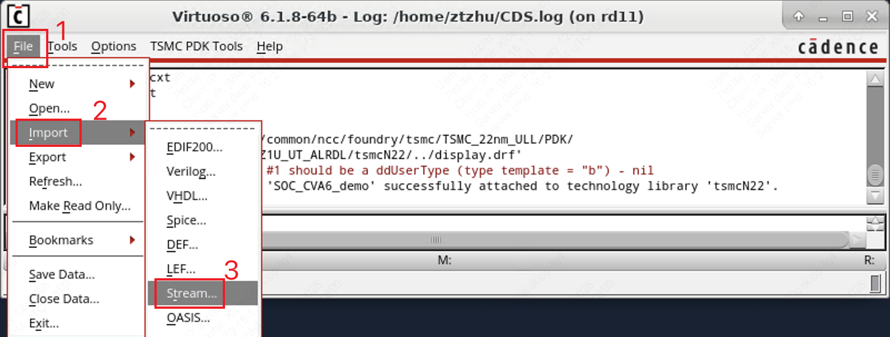
  <figcaption>Import existing design to Virtuoso (1)</figcaption>
</figure>

随后，在弹出的 `XStream In` 窗口中导入我们设计的 `<top_module_name>.gds2` 文件。文件在 `pnr/<top_module_name>` 文件夹下生成。之后，选择将设计导入到之前新建的 Library 中，最后点击 `Translate`。

<figure>
  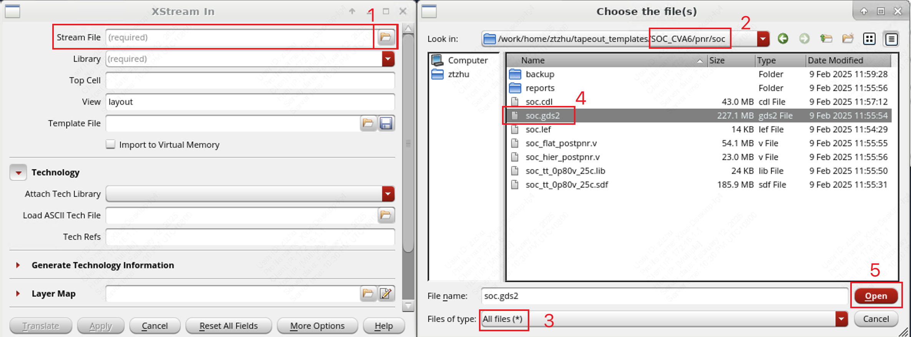
  <figcaption>Import existing design to Virtuoso (2)</figcaption>
</figure>

<figure>
  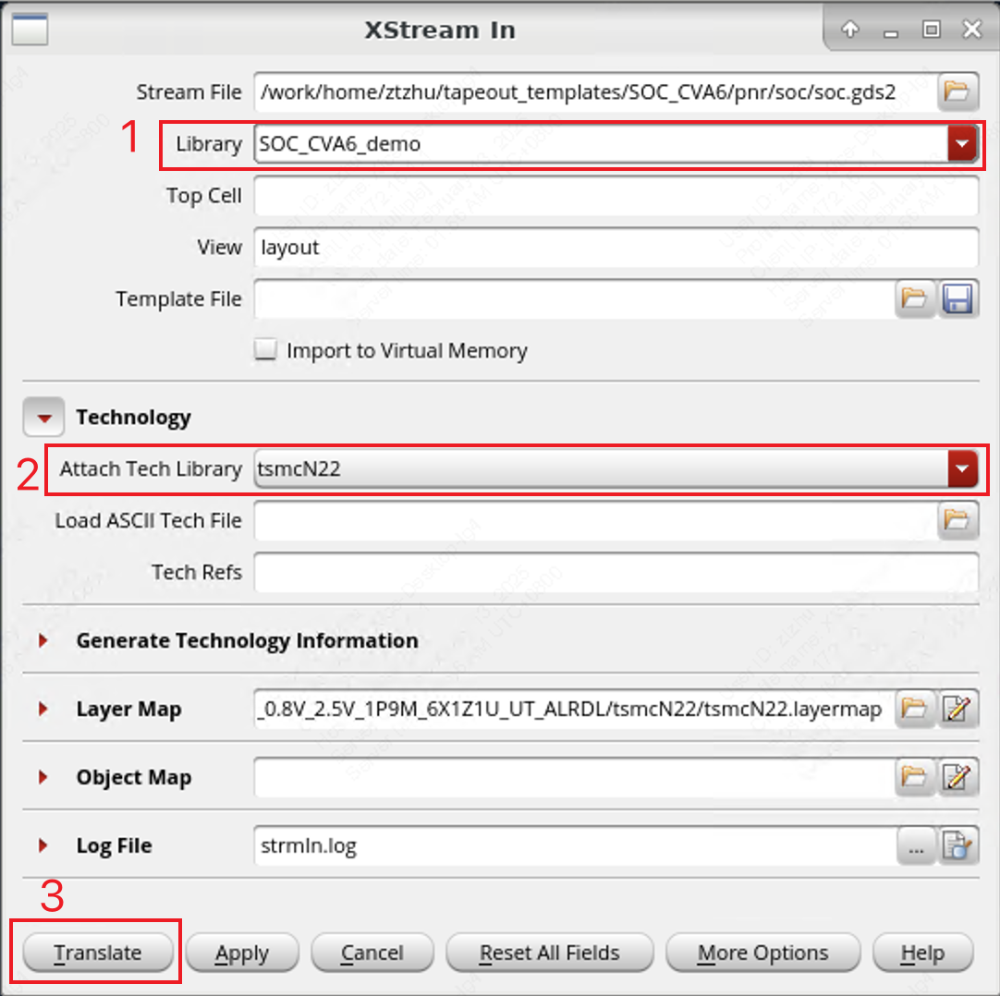
  <figcaption>Import existing design to Virtuoso (3)</figcaption>
</figure>

??? tip "StreamIn 报错"
    在 Virtuoso 导入设计之后，可能会出现类似下面这样的报错，可以不予理会。
    <figure>
      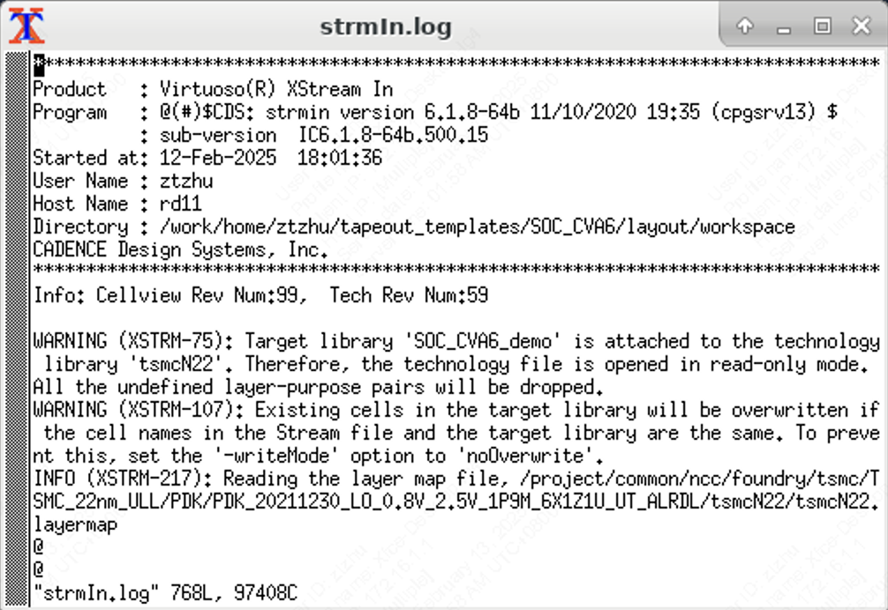
      <figcaption>Virtuoso StreamIn Warning</figcaption>
    </figure>

### 5.4.2 打开设计

如果之前已经把设计导入到 Virtuoso 中，则可以在 Virtuoso Terminal 中选择 `Open` 打开设计，具体步骤如下所示。

<figure>
  
  <figcaption>Open design layout in Virtuoso</figcaption>
</figure>

??? tip "调整 Virtuoso Display Settings"
    Virtuoso 的熟练使用涉及到很多快捷键和高阶功能，值得单独开辟一个章节详述，但是调整显示设置对于基本使用有还是有必要的。

    设置最小格点：在 Virtuoso Layout Suite L 上方菜单栏中选择 `Options -> Display`，把 `X Snap Spacing` 和 `Y Snap Spacing` 改成 0.005

## 5.4.3 LVS 物理验证

### 导入 LVS Rule 与 CDL 网表文件

在 Virtuoso Layout Suite L 上方菜单栏中选择 `Calibre -> Run nmLVS`，如下所示。

<figure>
  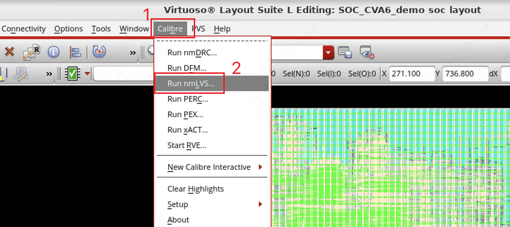
  <figcaption>Open Calibre options in Virtuoso</figcaption>
</figure>

??? bug "菜单栏中没有 `Calibre` 选项"
    如果使用文档提供的模板文件，原则上应该不会出现这个情况。这是因为在启动 Virtuoso 的时候缺少一个初始化文件。
    可以将 `/project/common/[block|top]_flow_tsmc_n[12|22]/pv/workspace/.cdsinit` 复制到自己项目下的 `pv/workspace/` 路径下面。
    或者也可以将上述 `.cdsinit` 复制到 `/home/<your_name>` 目录下，这样在任何位置打开 Virtuoso 都可以使用 Calibre 工具了 :)

随后，按照如下操作步骤导入 LVS Rules，文件位于 `/PDK/TSMC_22NM/PDK/1P9M_6X1Z1U_iPDK_CRN22ULL_shrink_T-N22-CR-SP-004-W1_v1.3_1p1a_20211230/Calibre/lvs/calibre.lvs` 路径。

<figure>
  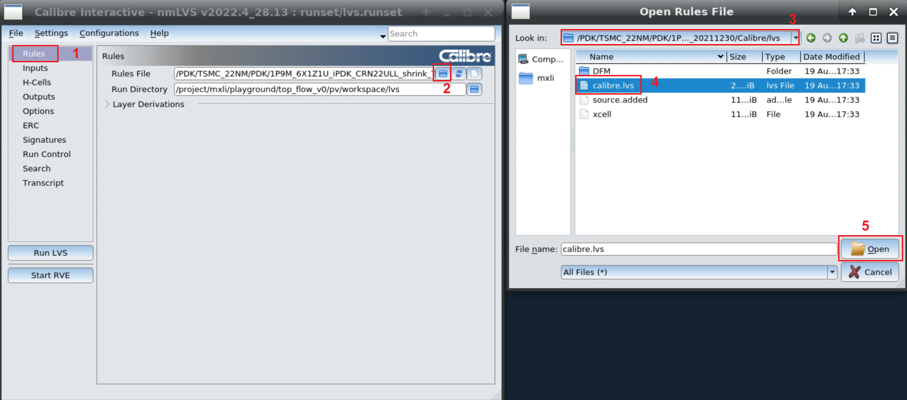
  <figcaption>Import LVS rules in Calibre</figcaption>
</figure>

为了保持工作目录规整，我们指定将 LVS 输出文件放在 `pv/workspace/lvs` 路径下，如下所示。

<figure>
  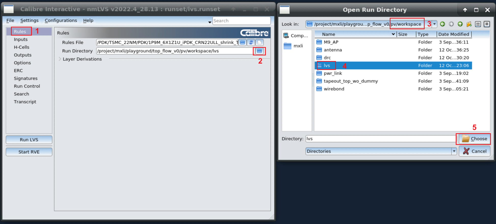
  <figcaption>Choose LVS directory in Calibre</figcaption>
</figure>

随后，在 Calibre Interactive 窗口中选择 `Inputs`，并在 `Netlist` 中导入 Innovus 生成的 CDL 网表文件，步骤如下。

<figure>
  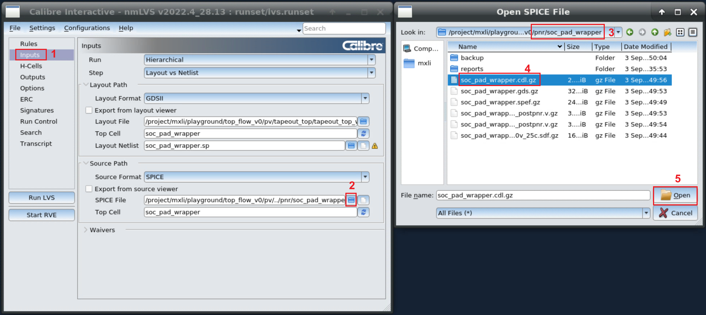
  <figcaption>Import CDL netlist in Calibre</figcaption>
</figure>

此外，可以在 `Inputs` 界面选择 `Hierarchical（层次化）` 或者 `Flat（扁平化）` 选项。这是两种不同的验证方式，但是原则上来讲，两种验证方法对于 LVS 正确性没有影响。

* 层次化验证保留了设计的层次结构，每个模块在验证过程中都作为一个独立的单元进行检查。层次化验证速度更快，可以减少相同子模块的重复验证计算。
* 扁平化验证将设计的所有模块展开为一个平面结构，即所有模块的内部细节都被展开并作为一个整体进行检查。检查会更加全面，但是速度较慢、内存占用更高。

### 设置 LVS 运行选项

导入了 LVS 所需的输入文件之后，在 `LVS Options` 设置 LVS 物理验证的运行选项，以下对 `Supply`, `Connect`, `Gates`, `LVS Box` 四个选项进行简要说明。

!!! tip "Calibre Interactive 中没有 `LVS Options` 选项"
    在 Calibre Interactive 上方菜单点击 `Setup`（如下图 `1` 所示），并勾选 `LVS Options`，然后就可以看到具体的选项了 :)

* 在 `Supply` 中添加 `Power nets` 与 `Ground nets`，与 Innovus 物理实现的设置保持一致。

<figure>
  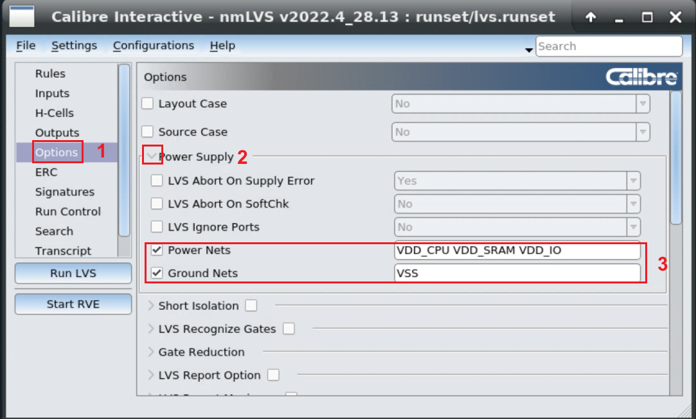
  <figcaption>Configure P/G nets in LVS options</figcaption>
</figure>

* 在 `Connect` 中勾选 `Connect nets with colon`，以及 `Don't connect nets by name`，如下所示。

<figure>
  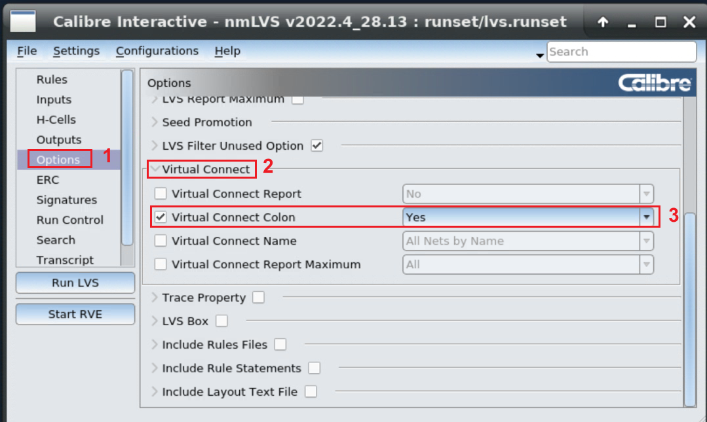
  <figcaption>Configure connections in LVS options</figcaption>
</figure>

* 在 `Filter Unused Device Options` 中可以设置 LVS 物理验证中用于识别和匹配设计中逻辑门的方法。对于常规的数字流程来说，不需要在这里做特殊的设置。

??? info "一种可能的解决 LVS 报错的方式"
    在此展示一种通过 `Filter Unused Device Options` 中的设置解决 LVS 报错的例子。对于我们的 CVA6 CPU 进行层次化 LVS 物理验证，并将 SRAM IP 设置 LVS Box，只对逻辑综合出来的标准单元进行物理验证，最终 LVS 报告如下，显示有许多的 Instances 和 Nets 在网标中缺失。

    <figure>
      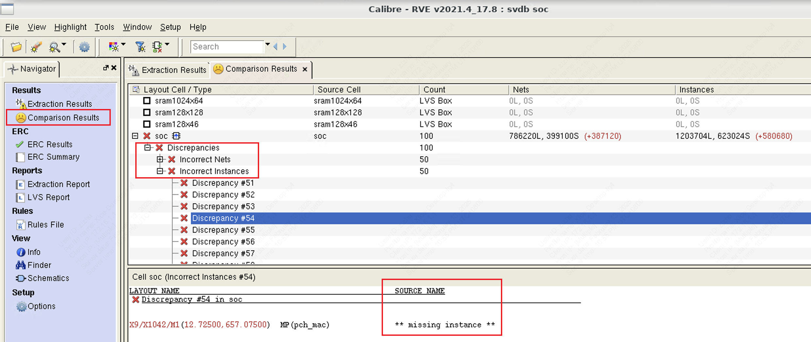
      <figcaption>Demo of LVS verification failure</figcaption>
    </figure>

    此时我们设置 `Filter Unused Device Options`，勾选其中的 `Q` 选项，即 `MOS, bipolar, resistor, capacitor, and diode devices with no general paths to any non-power/ground pads`，如下图中 `3*` 所示，此时重新进行 LVS 物理验证，会发现 LVS 验证通过。

    出现这个 LVS 报错的原因，是我们此前 Innovus 中进行物理实现时，[添加了许多 Physical-only cells](../legacy/submodule_implementation_new.md#摆放-physical-only-cellpnrscriptsplacementphysical_cell_inserttcl)，而且在 Finish 阶段[生成门级网表](../legacy/submodule_implementation_new.md#结果文件导出pnrscriptssignofffile_gentcl)时设置了 `saveNetlist -excludeCellInst` 选项，因此在 CDL 网表中没有这些特殊的标准单元，例如 End-Cap，Well-Tap 等单元，而版图中却实际包含它们，因此 LVS 物理验证会报错。

    另一种解决 LVS 报错的方法，则是在导出网表文件时去掉 `-excludeCellInst` 选项，那么在生成的 Verilog（以及后续生成的 CDL）门级网表中就会包含这些标准单元，它们没有逻辑功能，只有 P/G Pin 连接。

<figure>
  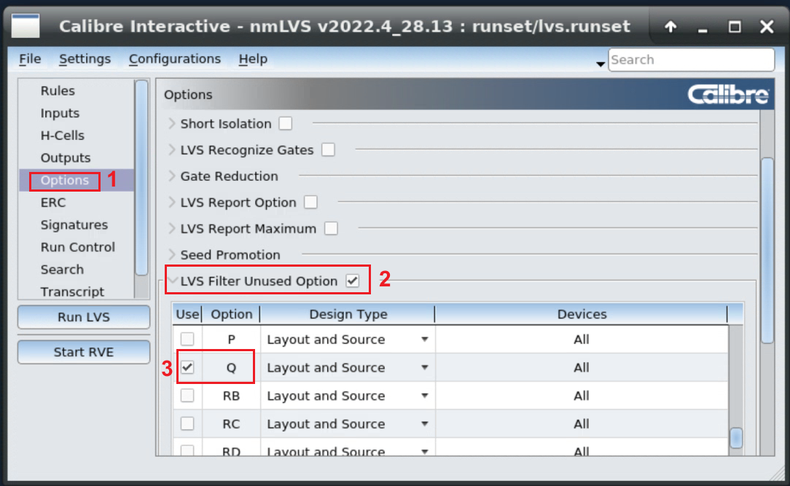
  <figcaption>Configure unused device in LVS options</figcaption>
</figure>

* 在 `LVS Box` 可以选择 (a) 不处理特定的模块或者子电路，进行常规的 LVS 流程；(b) 根据设计的情况选择添加 LVS Box，需要在 GUI 界面中手动添加想添加 Box 的**子模块名称**，名称需要和 Virtuoso 设计中 Cell 名称保持一致。如下图所示，我们给 CVA6 CPU 中的 2 种 SRAM IP 添加了 LVS Box。

<figure>
  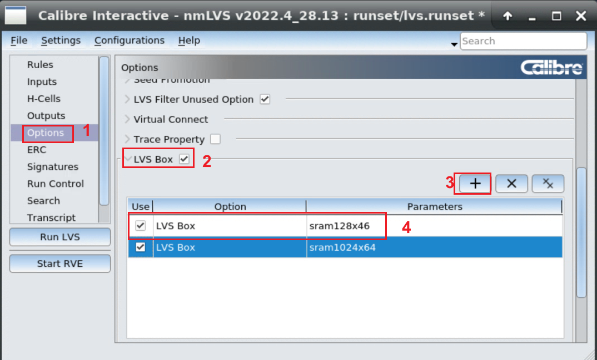
  <figcaption>Configure LVS box in LVS options</figcaption>
</figure>

??? info "什么是 LVS Box"
    LVS Box 可以帮助用户在进行版图与原理图对比时，将某些模块视为一个“黑盒子”，即**不展开其内部结构**进行详细检查，而是只检查其**外部连接**是否正确。使用 LVS Box 可以简化和加速 LVS 检查过程，特别是在处理复杂设计时，但是同时可以确保这些模块的外部连接是正确的。

### 保存 LVS 相关设置

在 Calibre Interactive 上方菜单栏选择 `File -> Save Runset As` 可以将 以上对于 LVS 物理验证的配置（包括输入读取文件路径、LVS Options 选项等）统一写入到一个 Runset 文件中。
为了保持工作目录规整，建议将 Runset 保存至 `pv/runset/lvs.runset` 路径。
在之后进行相同设计的版本迭代时，可以直接选择 `File -> Load Runset` 读取之前保存的 Runset 文件，加速工作流。

### 查看 LVS 物理验证结果

在 Calibre Interactive 左侧选择 `Run LVS`，即可开始 LVS 物理验证。按照此前的设置，LVS 输出文件在 `pv/workspace/lvs` 路径下。同样地，我们可以在 GUI 界面中查看 LVS 物理验证的结果，例如报错的 Instance 与 Net 名称、在版图中的位置，等等。

一个通过 LVS 物理验证的 GUI 界面如下。

<figure>
  
  <figcaption>Demo of a successful LVS verification</figcaption>
</figure>

!!! Warning "注意"
    需要保证 `Extraction Results`, `Comparison Results`，以及 `ERC Results` 都没有报错。

### 常见的 LVS 报错

!!! Bug "Under development!"

## 5.4.4 DRC 物理验证

### 设置 DRC 运行选项

因为 DRC 物理验证流程与 LVS 类似，都是适用 Calibre Interactive 窗口进行操作，也可以保存/读取 DRC Runset，主要有以下几个步骤：

* 在 Virtuoso Layout Suite L 上方菜单栏中选择 `Calibre -> Run nmDRC`，配置 DRC 运行选项；
* 在 Calibre Interactive 左侧选择 `Rules` 导入 DRC Rules，位于`/PDK/TSMC_22NM/PDK/1P9M_6X1Z1U_iPDK_CRN22ULL_shrink_T-N22-CR-SP-004-W1_v1.3_1p1a_20211230/Calibre/drc/calibre_block.drc`，并设置 DRC 输出文件路径为 `pv/workspace/drc`；
* 在 Calibre Interactive 左侧选择 `Inputs`，设置 `Hierarchical（层次化）` 或者 `Flat（扁平化）` 选项。层次化的验证速度更优，而扁平化的物理验证更加完善；
* **保存 DRC Runset**：在 Calibre Interactive 上方菜单栏选择 `File -> Save Runset As`，并保存至 `pv/workspace/runset/drc.runset` 路径；
* **读取 DRC Runset**：在 Calibre Interactive 上方菜单栏选择 `File -> Load Runset` 读取之前保存的 Runset 文件。

### 数字子系统的 DRC 流程

在 Calibre Interactive 左侧选择 `Run DRC`。可以在 `pv/workspace/drc/` 中查看 DRC 报告，或者在 GUI 界面中查看更多的版图信息，包括报错的 Cell、Net 位置等。

对于数字子系统来说，有些 DRC 报错不需要考虑（即可以 Waive），例如 Seal Ring 和 IO Pad 相关的报错。

一个 DRC 物理验证报告的 GUI 界面如下。

<figure>
  
  <figcaption>Demo of DRC verification</figcaption>
</figure>

## 5.4.5 天线效应物理验证

天线效应的物理验证流程除了规则文件，其他与 DRC 完全一致。
天线效应的规则文件位于 `/PDK/TSMC_22NM/PDK/1P9M_6X1Z1U_iPDK_CRN22ULL_shrink_T-N22-CR-SP-004-W1_v1.3_1p1a_20211230/Calibre/drc/calibre.ant`。
