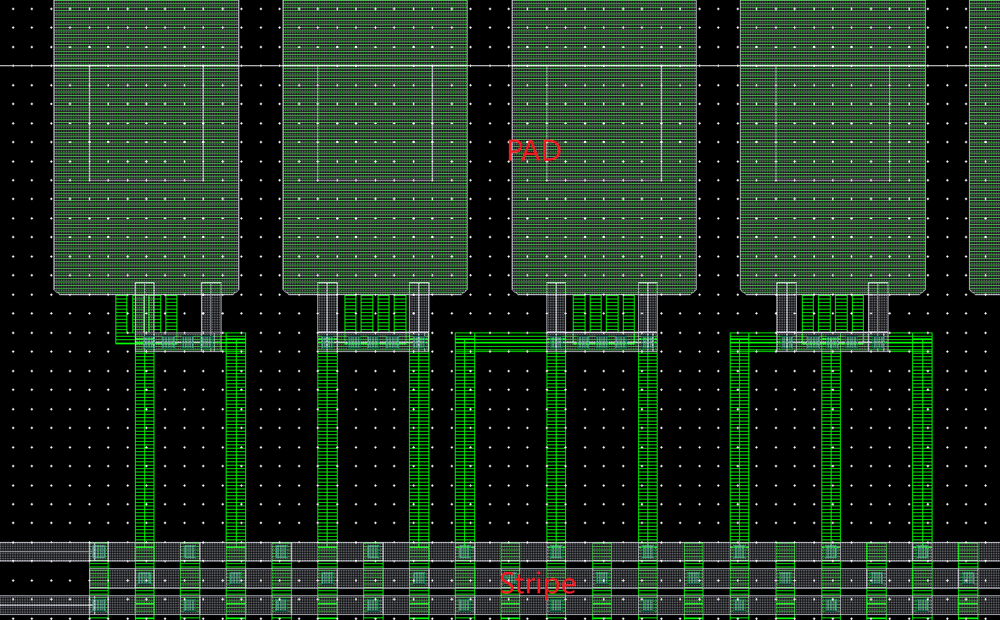

# 顶层 IO 模块的后端流程 (TSMC N22)

!!! tip "TLDR（太长不看）"
    1. 模板文件路径：`/project/common/top_flow_n22_wirebond/`
    2. 修改配置文件：`config/user_define.tcl`
    3. 编写时序约束：`config/constraints_<top_module_name>.sdc`
    4. 源文件（或综合网表）顶层添加信号 PAD
    5. 启动逻辑综合：`make genus`
    6. 启动物理实现：`make innovus`
    7. 修改并运行脚本：`pnr/scripts/innovus_implementation.tcl`
        - 添加电源 PAD；
        - 规划 I/O Ring；
    8. 启动 Virtuoso：`make virtuoso`
        - 连接电源 PAD 和 Power Stripe；
        - 添加 Seal Ring 和 Dummy；

在进行模块层级的综合和后端之后，我们需要将不同的模块打包为一个完整的芯片，即进行芯片的**顶层设计**。
芯片的顶层需要将之前已经完成的各个模块版图整合为一个完整的矩形，添加芯片级别的**输入输出端口**（I/O Ring）和 **Seal Ring** 以提供电气和物理的保护，并进行 **Dummy Fill** 以清除所有会影响到 Tape-Out 的 density DRC 违例。

## 1. 添加 I/O PAD

在芯片的顶层模块中，我们需要实例化对应的 I/O PAD 来提供芯片的输入输出接口。
我们使用的 I/O PAD 标准单元为**双向 PAD**，器件名称为 PRWDWUWHWSWDGE_H_G（_H 代表放置在芯片的左右两侧，若需要在上下放置则需将_H 改为_V），每个 PAD 都有一个对应的控制信号来控制其输入输出属性，我们需要根据每个信号的输入输出属性来设置对应的控制信号。

一个完整的 I/O PAD 实例化示例如下：

```verilog
// DS0, DS1, ST0, ST1, SL control timing, no need to modify
// PE, PS, HE control pull-up, pull-down or hold behavior during PAD = Z, no need to modify
// Dataflow(IE=0, OEN=0): I -> PAD
// Dataflow(IE=1, OEN=0): I -> PAD
// Dataflow(IE=0, OEN=1): C = 0
// Dataflow(IE=1, OEN=1): PAD -> C
PRWDWUWHWSWDGE_H_G ext_clk_pad_inst (
    .DS0    (1'b1),
    .DS1    (1'b1),
    .ST0    (1'b0),
    .ST1    (1'b0),
    .SL     (1'b0),
    .PE     (1'b0),
    .PS     (1'b0),
    .HE     (1'b1),
    .IE     (OEN),
    .OEN    (OEN),
    .C      (OUT),
    .I      (IN),
    .PAD    (PAD)
);
```
其中，`I` 和 `C` 端口分别是芯片内部的输入输出信号，`PAD` 是连接到封装管壳的引脚，`OEN` 是一个控制信号，当 `OEN=0` 时该 PAD 输出芯片内部 `I` 端口的信号，当 `OEN=1` 时该 PAD 输入到芯片内部 `C` 端口。

完整的 I/O PAD 实例化示例可以参考 `src/soc_pad_wrapper.sv`，`src/tech_specific/signal_io_pad.v`。

## 2. Floorplan

在这个阶段，我们需要**额外**规划整个芯片所有输入输出信号和电源连接所在的位置，实例化并摆放对应的 IO PAD。
对应的脚本为 `/script/floorplan/pad_preplace.tcl`，需要根据实际设计需求进行修改。

我们有如下几种 I/O PAD 需要摆放：

1. **Corner PAD** PCORNERE_G：位于芯片四个角落的电源 PAD，确保 I/O 成环，**必须放置**。
2. **电源 PAD**：提供芯片的电源接口。
    - PVDD1CDE_V_G, PVDD1CDE_H_G：提供 0.8V 的 core 电压。
    - PVDD1ANAE_V_G, PVDD1ANAE_H_G：提供 0.8V 的 core 电压，和 I/O Ring 的电压分离，可以作为单独测量的电源域。
    - PVDD2CDE_V_G, PVDD2CDE_H_G：提供 1.8V 的 I/O 电压，**每个数字域必须放置至少一个**。
    - PVSS3CDE_V_G, PVSS3CDE_H_G：提供芯片的地电压。
    - PVDD2POC_V_G, PVDD2POC_H_G：功能同 PVDD2CDE ，并提供电压波动保护（Power-On Control），**每个数字域必须放置一个，且只能放一个**。
    - PRCUT_V_G, PRCUT_H_G：切断电源域之间的连接以实现单独供电，两个 PRCUT 所围成的区域为一个电源域，**可以不放置**。
3. **信号 PAD**：连接芯片内部的信号，提供芯片的输入输出接口。
4. **Wire Bond PAD** PAD52D6GU：**必须放置** 在上述 **所有的电源、信号 PAD** 之上，用于将金属层连接到最顶层，提供 Wire Bond 的焊盘。
5. **FILLER PAD** PFILLER*_G：用于填充电源 PAD 之间的空白区域，确保 I/O 成环。

对于不同芯片设计，所需的 I/O PAD 的种类和数量会有所不同，需要根据实际设计需求进行规划和摆放。
如下是对 PAD 摆放的说明。

### 2.1 整体布局

在布局顶层 PAD 时，主要需要考虑如下因素：

1. 划分出的芯片单独供电区域是否都至少有一边达到了芯片的边缘 IO Ring
2. 电源 PAD 的数量是否充足，能否相对均匀的覆盖所有的重要器件
3. 信号 PIN 的分布是否过于集中，导致某一侧 Wire Bond 压力过大

!!! question "在 Wire Bond 时，每一个信号 PIN 需要占用封装管壳的一个输出管脚，同名的 VDD 信号可以公用一个管脚，而 VSS 则是 Down-Bond 到管壳底，不需占用管脚。由于封装管壳的管脚分布是均匀的（以 QFN64 为例，每边各有 16 管脚），如果信号 PIN 分布过于集中，可能导致一侧的管脚压力过大，使芯片 Wire Bond 的位置偏离中心甚至不能正常在管壳中放置。"

#### 2.1.1 电源域的划分

最终芯片测试时我们希望能够单独测量各个关键部分的能耗（如 CIM Macro），因此需要单独对其供电，将其他器件的电流排除。实现单独供电有两种方式：

1. 将希望单独供电的电源接到模拟电源 PAD 上（PVDD1ANAE_*_G）
2. 将 IO Ring 用 PRCUT 切断，使不同的数字电源域物理隔离

#### 2.1.2 PAD 的种类及数量要求

在物理划分出的每一个电源域上均需要至少有一组 VDD_IO（PVDD2CDE）以给 IO 供电，一个 POC PAD（PVDD2POC）进行电压波动保护。除此之外，还需要若干给芯片内部 Core 区域供电的 VDD，VSS PAD（PVDD1DGZ， PVDD1ANAE，PVSS3CDE 等），考虑到 IR drop 等因素，Core 电源 PAD 通常越多越好。

#### 2.1.3 PAD 的间距要求

我们所采用的 Wire Bond PAD 为 PAD52D6GU，这意味着两个相邻的信号/电源 PAD 的 PITCH**不能低于 52μm**，通常情况下我们选择 60μm 作为一个较为合适的间距。

## 3. 布局布线

顶层的布局布线流程与脚本与模块层级无明显区别，在此仅列出需要额外修改的部分：

1. 在 `pnr/script/powerplan/global_net_connect.tcl` 中需要额外连接 Signal Pad 和 Power Pad 的 VDDPST (VDD_IO), VSSPST (VSS), POC (对应电源域的 POC), VDD (对应电源域的数字 VDD)，AVDD (仅用于模拟 PAD，连接到希望单独测量的 VDD)
2. 在 `pnr/script/powerplan/power_stripe.tcl` 中需要将 stripe 根据所划分的供电区域分别向上打到 AP 层

## 4. Virtuoso 中的电源连线

布局布线完成后，信号 PAD 所需的连线已经完成，但是电源 PAD 仍旧没有和 Power Stripe 相连，这需要我们在 Virtuoso 中手动完成电源连接，完成的示例如下图。

<figure>
  
  <figcaption>Power Connection between PAD & Stripe</figcaption>
</figure>

在 virtuoso 中**新建**单独的 cell 用于添加连接线。
完成之后，导出为 `pwr_link.gds.gz` 放置在 `pv/merge` 目录下，以便脚本自动将该 GDS 文件合并到最终的版图中。

## 5. SealRing

Seal Ring 的尺寸相比于 die box，长宽均增加了 150 um，依照该规则绘制 Seal Ring，并将 GDS 文件命名为 `sealring.gds.gz`，放置在 `pv/merge` 目录下，以便脚本自动将该 GDS 文件合并到最终的版图中。

Seal Ring 的绘制可以参考 `/project/common/T22_1P9M_6X1Z1U_SealRing_1450x1250.gds.gz`。

## 6. Dummy

Dummy Fill 是在芯片版图中添加一些不连接电路的填充结构，以满足制造工艺对于金属密度的要求，避免因密度过低而导致的制造缺陷。
在添加 Dummy 之前，我们需要将之前两步中添加的电源连线和 Seal Ring 合并到最终的版图中。

在 `config/user_define.tcl` 中设置好变量 `project` 并运行如下指令：

```
make merge
```

该指令会将 `pv/merge` 目录下的 GDS 文件（包括电源连线和 Seal Ring）合并到后端物理实现导出的版图中，将 GDS 文件存储到 `pv/<project_name>/<project_name>_wo_dummy.gds.gz`。

然后运行如下指令：

```
make dummy
```

该指令会在 `pv/<project_name>/<project_name>_wo_dummy.gds.gz` 的基础上添加 Dummy，生成最终的版图文件 `pv/<project_name>/<project_name>.gds.gz`。
