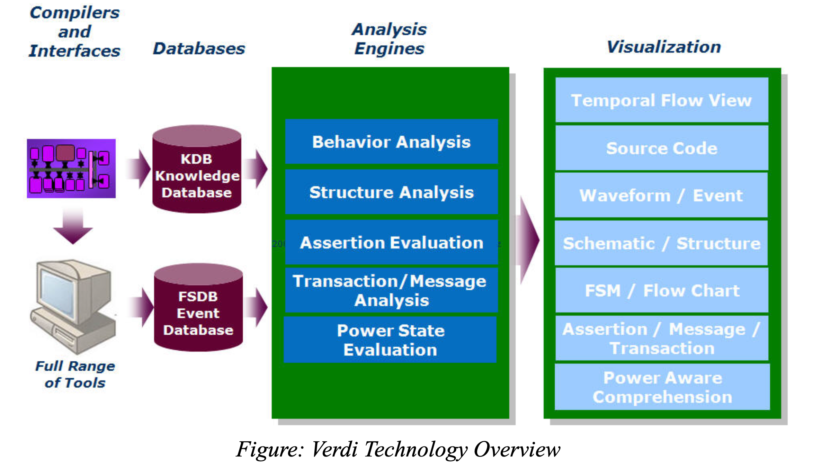

# EDA 工具与工程环境介绍

主流 EDA 工具均依赖于 Linux 操作系统。
如果你不熟悉 Linux 环境或常用工具，请先阅读 [Linux 环境与常用工具](../appendix/linux_environment.md)。

该流片模板主要依赖于以下的 EDA 工具：

## 1. Cadence Genus 22.1

在该流片模板文件中，我们主要依赖于 `Makefile` 和 `TCL` 自动化脚本文件进行逻辑综合，一般情况下不需要单独启动 Genus 综合工具。如需进行较为细致的调试，在终端输入 `genus` 启动 Genus 综合工具。
默认情况下在当前目录下生成 `genus.log` 和 `genus.cmd` 日志文件，分别记录了 Genus 的终端输出和用户输入的命令。

为了更加全面了解 Genus 综合工具，可以查看 Cadence 的官方说明手册和文件：

* **Genus Synthesis Flow Guide**: `/EDA/cadence/DDIEXPORT22/GENUS221/doc/genus_start/genus_start.pdf`
* **Genus User Guide**: `/EDA/cadence/DDIEXPORT22/GENUS221/doc/genus_user/genus_user.pdf`
* **Genus Command Reference**: `/EDA/cadence/DDIEXPORT22/GENUS221/doc/genus_comref/genus_comref.pdf`

---

## 2. Cadence Innovus 22.16

该流片模板文件中，将主要围绕 Innovus 工具进行数字模块的后端设计。在终端中输入 `innovus` 启动 Innovus 工具，默认情况会自动启动 GUI 界面，有助于我们观察后端版图的各类情况，方便迭代设计与优化。
使用以下命令可以打开、关闭 GUI 界面。
```tcl
# Turn on GUI
enc::gui_on 

# Turn off GUI
enc::gui_off 
```

大部分的设计流程使用 Innovus 的终端输入 `TCL` 脚本命令。
若使用 GUI 界面进行操作，相应的操作也会自动转化成 `TCL` 指令，可以打开 `innovus.cmd` 查看 GUI 界面的操作与 Innovus 指令的对应关系。

Cadence 的官方说明手册和文件：

* **Innovus User Guide**: `/EDA/cadence/DDIEXPORT22/INNOVUS221/doc/innovusUG/innovusUG.pdf`
* **Innovus Error Messege**: `/EDA/cadence/DDIEXPORT22/INNOVUS221/doc/innovuserrmsg/innovuserrmsgTOC.html`

---

<a id="arm-sram-compiler"></a>
### 2.1 ARM 22NM Register File Compiler

许多数字模块中依赖于较大规模的寄存器堆/SRAM 高速缓存，这些模块需要替换成专门的 IP 核，而不是使用 RTL 代码直接综合，从而可以显著减小模块面积。

替换 22nm SRAM 时，我们通常使用 ARM 提供的 `High Density Single Port Register File SHVT MVT Compiler`。

在命令行中输入 `rf_sp_compiler` 即可启动。

**用户手册**位于：

```
/PDK/TSMC_22NM/memory_compiler/arm/tsmc/cln22ul/rf_sp_hde_shvt_mvt/r3p1/doc/rf_sp_hde_shvt_mvt_userguide.pdf
```

---

## 3. Cadence Virtuoso 20.1

在进行数字模块的 DRC 与 LVS 检查时，会使用到 Cadence Virtuoso 工具。在终端中输入 `virtuoso` 打开 Virtuoso 工具。

---

## 4. Synopsys VCS

我们所说的 VCS，指的是全套“功能验证解决方案”（a full suite of "Functional Verification Solution"）。
另一个容易混淆的概念是 VCS-MX，它相比 VCS，增加了对 VHDL 的支持，相应地，处理 RTL 的步骤也会比 VCS 多。

!!! Bug "FIXME!!!"
    **用户手册**位于：

    ```
    /cadtools/synopsys/vcs-mx-2019.06-SP1/docs/vcs_mx.pdf
    ```


### 4.1 VCS-MX 流程

VCS-MX 通过以下三步来处理 RTL：

- 分析源文件（analyze）。
- 处理源文件（elaborate）。
- 仿真可执行文件（simulate）。

```
$ vlogan [vlogan_options] file1.v file2.v       // analyze
$ vhdlan [vhdlan_options] file3.vhd file4.vhd   // analyze
$ vcs [compile_options] design_unit             // elaborate
$ simv [run_options]                            // simulate
```

### 4.2 VCS 流程

VCS 将前两步合并，简化为了两步。

- 编译源文件（compile）。
- 仿真可执行文件（simulate）。

```
$ vcs [compile_options] Verilog_files           // compile
$ simv [run_options]                            // simulate
```

### 4.3 生成波形文件

生成 `.fsdb` 波形文件需要用到如下 4 个系统函数：

1. `$fsdbDumpfile(“<filename.fsdb>”)`
2. `$fsdbDumpvars(<levels>,<module_name>)`
3. `$fsdbDumpon`
4. `$fsdbDumpoff`

下面是一个实例：

```verilog
initial begin
    $fsdbDumpfile(“dump.fsdb”);
    $fsdbDumpvars();
    #100;
    $fsdbDumpoff;
    #700;
    $fsdbDumpon;
    #10500;
    $fsdbDumpoff;
end
```

---

## 5. Synopsys Verdi

Verdi 是一个自动调试平台（automated debug platform），用于观察波形、调试 RTL。

!!! Bug "FIXME!!!"
    **用户手册**位于：

    ```
    /cadtools/synopsys/verdi-2019.06-SP1/docs/verdi_user_guide.pdf
    ```

<figure>
  
</figure>

### 5.1 编译器和接口

- 编译器：Verdi 为大多数设计和验证环境中使用的语言提供编译器，如 Verilog、VHDL 和 SystemVerilog 以及电源代码（CPF 或 UPF）。在分析和编译代码时，会检查语法和语义错误。
- 接口：Verdi 可以导入其他仿真器生成的标准 VCD 和 SDF 数据，并将结果存储在快速信号数据库（Fast Signal Database，FSDB）中。也可以通过对象文件（object files）链接到仿真器（例如 VCS）直接生成 FSDB。

### 5.2 数据库

- 知识数据库（Knowledge Database，KDB）：在编译时，Verdi 会识别和提取设计的特定结构、逻辑和功能信息，并将由此产生的详细设计信息存储在 KDB 中。
- 快速信号数据库（Fast Signal Database，FSDB）：FSDB 以高效紧凑的格式存储仿真结果。Synopsys 提供可以链接到常见仿真器的对象文件用来直接以 FSDB 格式存储仿真结果。你也可以通过转换 VCD 文件的方式生成 FSDB。

### 5.3 分析引擎

使用来自 KDB 和 FSDB 的信息进行分析。

### 5.4 可视化

Verdi 中有如下的结构可视化和分析工具：

- nTrace：用于源代码
- nWave：用于波形
- nSchema：用于原理逻辑图
- nState：用于有限状态机（FSM）
