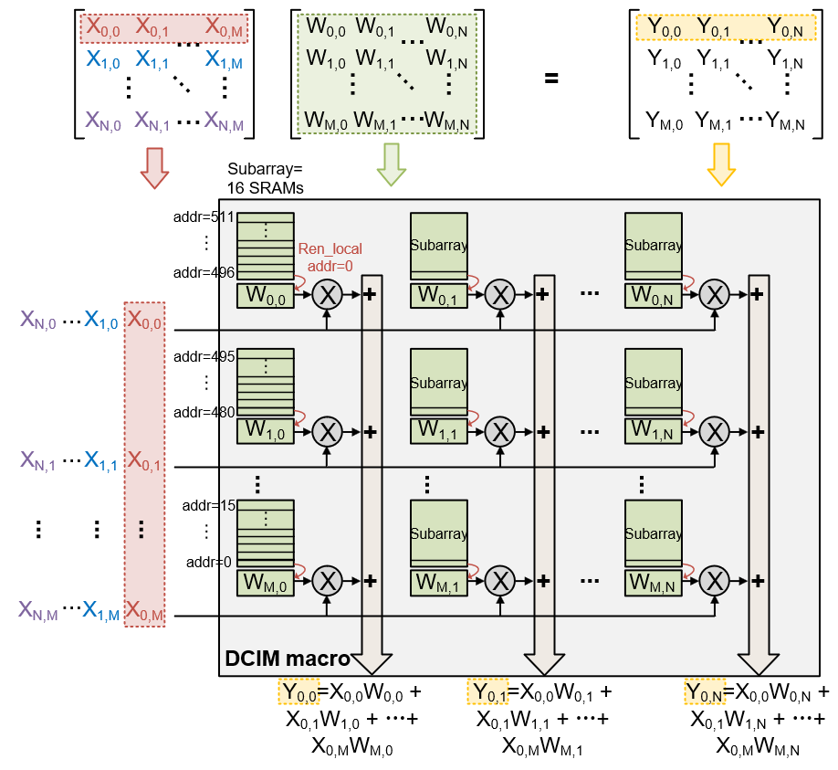
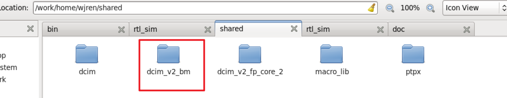

# Digital-CIM 使用规范

## 1. 概述

CIM 是 Compute-in-Memory 的缩写，即存内计算。
Digital-CIM (DCIM) 使用标准 SRAM 单元实现存储，并在 SRAM 阵列中添加或非门和加法器树实现乘累加操作。
DCIM 天然实现了 Weight Stationary，并且内存和计算单元是紧密集成在一起的，这种紧密集成的设计可以减少数据传输的时间和功耗，提高计算效率。

CIM 的功能可以大致分为三类：

- 存储：将权重存储在 CIM 的存储单元中
- 读权重：将存储的数据读出
- 计算：将输入特征和权重相乘累加


## 2. 规模

<figure>
  
  <figcaption>DCIM Scale</figcaption>
</figure>

DCIM 的规模为 512 行 x 256 列。
对于一列中的 512 个 SRAM 单元，每 16 个 SRAM 单元构成一个 subarray，一共有 32 个 subarray。

每个 SRAM 单元通过或非门完成权重与输入的 1-bit 乘法，再通过 32 个 subarray 之间的加法器树完成累加。

!!! tip "DCIM 计算实例"
    假设 CIM 规模为 1 列 512 个 SRAM 单元，每个 subarray 中 16 个 SRAM 单元（一共 32 个 subarray），需要计算无符号数 $a_0[3:0] \times w_0[3:0] + a_1[3:0] \times w_1[3:0] + ... + a_{127}[3:0] \times w_{127}[3:0]$。

    首先，CIM 会将 $w_x$ 按照如下顺序依次存储在 32 个 subarray 中：

    - subarray 0: $w_0[3:0],\ w_1[3:0],\ w_2[3:0],\ w_3[3:0]$
    - subarray 1: $w_4[3:0],\ w_5[3:0],\ w_6[3:0],\ w_7[3:0]$
    - ...
    - subarray 31: $w_{124}[3:0],\ w_{125}[3:0],\ w_{126}[3:0],\ w_{127}[3:0]$

    接下来，CIM 会按照 bit-serial 的顺序输入 4-bit 数。

    - 第一轮输入：$\{a_0[3], a_4[3], ..., a_{124}[3]\}$
    - 第二轮输入：$\{a_0[2], a_4[2], ..., a_{124}[2]\}$
    - 第三轮输入：$\{a_0[1], a_4[1], ..., a_{124}[1]\}$
    - 第四轮输入：$\{a_0[0], a_4[0], ..., a_{124}[0]\}$

    然后，DCIM 需要通过地址的最低 4 位来切换 subarray 中的权重，同时切换对应的输入。

!!! Warning "数据流"
    上述实例只是 DCIM 的一种数据流，可以有多种不同的映射方式。

## 3. 端口列表

<div style="display: flex; justify-content: center;">

<table style="border-collapse: collapse;">
    <thead>
        <tr style="border: 2px solid black; background-color: #9a0000; color: white;">
            <th style="border: 1px solid black; padding: 8px; text-align: center; vertical-align: middle;">端口</th>
            <th style="border: 1px solid black; padding: 8px; text-align: center; vertical-align: middle;">方向</th>
            <th style="border: 1px solid black; padding: 8px; text-align: center; vertical-align: middle;">描述</th>
        </tr>
    </thead>
    <tbody>
        <tr style="border: 2px solid black; background-color: white; color: black;">
            <td style="border: 1px solid black; padding: 8px; text-align: center; vertical-align: middle;">CLK</td>
            <td style="border: 1px solid black; padding: 8px; text-align: center; vertical-align: middle;">input</td>
            <td style="border: 1px solid black; padding: 8px; text-align: center; vertical-align: middle;">时钟</td>
        </tr>
        <tr style="border: 2px solid black; background-color: #eeeeee; color: black;">
            <td style="border: 1px solid black; padding: 8px; text-align: center; vertical-align: middle;">WEN</td>
            <td style="border: 1px solid black; padding: 8px; text-align: center; vertical-align: middle;">input</td>
            <td style="border: 1px solid black; padding: 8px; text-align: center; vertical-align: middle;">写使能，高电平触发</td>
        </tr>
        <tr style="border: 2px solid black; background-color: white; color: black;">
            <td style="border: 1px solid black; padding: 8px; text-align: center; vertical-align: middle;">REN_GLOBAL</td>
            <td style="border: 1px solid black; padding: 8px; text-align: center; vertical-align: middle;">input</td>
            <td style="border: 1px solid black; padding: 8px; text-align: center; vertical-align: middle;">读使能，高电平触发，读一整行</td>
        </tr>
        <tr style="border: 2px solid black; background-color: #eeeeee; color: black;">
            <td style="border: 1px solid black; padding: 8px; text-align: center; vertical-align: middle;">REN_LOCAL</td>
            <td style="border: 1px solid black; padding: 8px; text-align: center; vertical-align: middle;">input</td>
            <td style="border: 1px solid black; padding: 8px; text-align: center; vertical-align: middle;">读使能，高电平触发，读 local buffer</td>
        </tr>
        <tr style="border: 2px solid black; background-color: white; color: black;">
            <td style="border: 1px solid black; padding: 8px; text-align: center; vertical-align: middle;">ADDR[9:0]</td>
            <td style="border: 1px solid black; padding: 8px; text-align: center; vertical-align: middle;">input</td>
            <td style="border: 1px solid black; padding: 8px; text-align: center; vertical-align: middle;">地址</td>
        </tr>
        <tr style="border: 2px solid black; background-color: #eeeeee; color: black;">
            <td style="border: 1px solid black; padding: 8px; text-align: center; vertical-align: middle;">EMA_RSA[1:0]</td>
            <td style="border: 1px solid black; padding: 8px; text-align: center; vertical-align: middle;">input</td>
            <td style="border: 1px solid black; padding: 8px; text-align: center; vertical-align: middle;">trim，默认全 1</td>
        </tr>
        <tr style="border: 2px solid black; background-color: white; color: black;">
            <td style="border: 1px solid black; padding: 8px; text-align: center; vertical-align: middle;">EMA_RWL[1:0]</td>
            <td style="border: 1px solid black; padding: 8px; text-align: center; vertical-align: middle;">input</td>
            <td style="border: 1px solid black; padding: 8px; text-align: center; vertical-align: middle;">trim，默认全 1</td>
        </tr>
        <tr style="border: 2px solid black; background-color: #eeeeee; color: black;">
            <td style="border: 1px solid black; padding: 8px; text-align: center; vertical-align: middle;">MASK[63:0]</td>
            <td style="border: 1px solid black; padding: 8px; text-align: center; vertical-align: middle;">input</td>
            <td style="border: 1px solid black; padding: 8px; text-align: center; vertical-align: middle;">写入掩码，1 为写入，粒度为 4-bit</td>
        </tr>
        <tr style="border: 2px solid black; background-color: white; color: black;">
            <td style="border: 1px solid black; padding: 8px; text-align: center; vertical-align: middle;">SIGN[3:0]</td>
            <td style="border: 1px solid black; padding: 8px; text-align: center; vertical-align: middle;">input</td>
            <td style="border: 1px solid black; padding: 8px; text-align: center; vertical-align: middle;">INT4: 1111, INT8: 1010, INT16: 1000</td>
        </tr>
        <tr style="border: 2px solid black; background-color: #eeeeee; color: black;">
            <td style="border: 1px solid black; padding: 8px; text-align: center; vertical-align: middle;">D[255:0]</td>
            <td style="border: 1px solid black; padding: 8px; text-align: center; vertical-align: middle;">input</td>
            <td style="border: 1px solid black; padding: 8px; text-align: center; vertical-align: middle;">写权重数据</td>
        </tr>
        <tr style="border: 2px solid black; background-color: white; color: black;">
            <td style="border: 1px solid black; padding: 8px; text-align: center; vertical-align: middle;">Q[255:0]</td>
            <td style="border: 1px solid black; padding: 8px; text-align: center; vertical-align: middle;">output</td>
            <td style="border: 1px solid black; padding: 8px; text-align: center; vertical-align: middle;">读权重数据</td>
        </tr>
        <tr style="border: 2px solid black; background-color: #eeeeee; color: black;">
            <td style="border: 1px solid black; padding: 8px; text-align: center; vertical-align: middle;">IFN[31:0]</td>
            <td style="border: 1px solid black; padding: 8px; text-align: center; vertical-align: middle;">input</td>
            <td style="border: 1px solid black; padding: 8px; text-align: center; vertical-align: middle;">计算输入（取反）</td>
        </tr>
        <tr style="border: 2px solid black; background-color: white; color: black;">
            <td style="border: 1px solid black; padding: 8px; text-align: center; vertical-align: middle;">PSUM[575:0]</td>
            <td style="border: 1px solid black; padding: 8px; text-align: center; vertical-align: middle;">output</td>
            <td style="border: 1px solid black; padding: 8px; text-align: center; vertical-align: middle;">计算输出</td>
        </tr>
    </tbody>
</table>

</div>

!!! tip "trim 信号"
    "Trim"信号通常与工艺补偿和性能优化有关。
    它用于在制造过程中或之后对芯片的电气特性进行微调。
    这可以包括调整电压、电流或其他参数，以确保芯片在各种条件下都能正常工作。
    Trim信号的使用有助于提高芯片的良率和性能一致性。

## 4. DCIM IP 路径

服务器上经过流片验证的 DCIM IP 路径为：

```
/work/home/wjren/shared/dcim_v2_bm/dcim_ip_bm.v
```

<figure>
  
  <figcaption>DCIM Path</figcaption>
</figure>

!!! success ""
    特别感谢 [Wenjie Ren](https://ieeexplore.ieee.org/author/37089774513)，Yifan Ding 对本页内容的贡献和校对！
