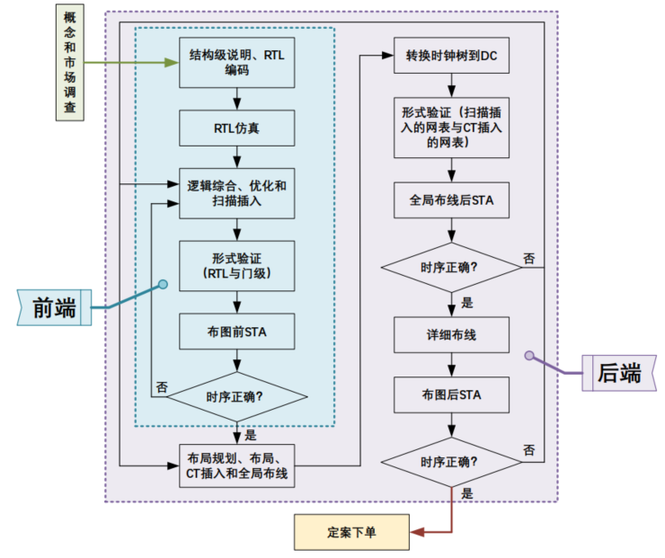

# Tape-out模板说明文档

因为流片流程较为繁杂，涉及到多个 EDA 工具以及相应的脚本文件，本文档中整理了一份**适用于 TSMC 12/22nm** 的数字芯片前端和后端设计流程文件模板，并对相关命令和脚本文件进行了简要说明和解释。

我们希望通过模板文件和说明文档，帮助后续接触该模板的朋友们快速熟悉数字前端和后端设计流程。然而，一份说明文档不可能做到面面俱到，要更加深入地了解数字前端和后端设计流程，还需要阅读 EDA 工具的用户手册和其他官方文档，并通过实践和不断试错来积累经验。

!!! info "22nm vs. 28nm vs. 32nm"
    22nm、28nm 和 32nm 属于同一个工艺节点，这意味着三者的区别**仅限于尺寸**，其他的例如 DRC、LVS 规则**完全相同**。EDA 工具中，无论是22nm、28nm 还是 32nm 工艺，其坐标或者其他尺寸均为 32nm 下的尺寸。22nm 工艺只会在流片的时候进行尺寸缩放（长宽均 $\times0.855$）。

!!! info "12nm vs. 16nm"
    12nm、16nm 属于同一个工艺节点，不同于 22nm 的平面结构，其物理结构为 **FinFet**。EDA 工具中，无论是 12nm 还是 16nm 工艺，其坐标或者其他尺寸均为 16nm 下的尺寸。12nm 工艺只会在流片的时候进行尺寸缩放（长宽均 $\times0.98$）。

<!-- <figure>
  
  <figcaption>数字芯片设计流程</figcaption>
</figure> -->

!!! question "关于文档"
    该文档还在持续开发更新之中，若出现错误或纰漏，还请在 GitHub 仓库中提出 Issue！
    如果有改进意见，欢迎提交 Pull Request！

## 设计流程

EDA 的设计流程主要包含了**逻辑综合**和**后端实现**两个部分。
逻辑综合把 Verilog/SystemVerilog 设计文件中的电路结构映射到工艺库的**标准单元**，形成一个和原电路逻辑等价的**网表（Netlist）**。
后端实现部分更加复杂，包括了**布局规划（Floorplan）**、**电源规划（Powerplan）**、
**布局（Placement）**、**时钟树综合（Clock Tree Synthesis, CTS）**和**布线（Signal Routing）**这些主要
部分。
后端实现工具读入综合阶段生成的网表，运行后获得芯片的**几何信息文件（GDSII）**，该文件可以交付代工厂进行实际的生产。

<figure>
  
  <figcaption>EDA 设计流程</figcaption>
</figure>

图（a）∼（h）展示了EDA工具的流程和中间结果的简单描述（注：为了便与显示，e∼g 中Powerplan 的结果被暂时隐藏）。
在该流程当中，综合阶段的步骤（a∼b）较少且**自动化程度较高**，用户只需要设置好输入的文件和参数即可运行工具得到综合结果。
后端实现部分（b∼h）的步骤较多，为追求芯片极致的性能，工程师们往往需要分析各个阶段的结果
并且必要时进行**手动设计**，例如手动实现布局规划和手动解决设计规则约束（Design Rule Constraint）违例的问题。

## 模板文件结构

因为学术流片大多是 [MPW](https://en.wikipedia.org/wiki/Multi-project_wafer_service)（多项目晶圆服务），每个流片项目最起码是一个数字子系统，甚至可能由多个层级的数字子系统嵌套而成，而多个流片项目共用一个顶层模块，从而给顶层模块的设计与规划带来了新的挑战。

??? info "扩展：全掩膜"
    与 MPW 相对的流片模式为 Full-Mask（全掩膜），即一整块晶圆只有一个项目，通常用于大规模生产。

因此，在此整理归纳出**两份不同**的流片模板文件，一份用于**数字子系统**的后端设计，一份用于**顶层模块**的后端设计。

* **数字子系统**的流片模板位于：`/project/common/block_flow_[12|22]nm/`
* **顶层模块**的流片模板位于：`/project/common/top_flow_[12|22]nm/`

!!! tip "路径约定"
    本教程中出现的所有**相对路径**均以 `/project/common/block_flow_[12|22]nm/` 或 `/project/common/top_flow_[12|22]nm/` 作为根目录，我们称这个根目录为 `$ROOT`。

!!! question "关于模板"
    模板文件会持续更新和完善，可以查看 `CHANGELOG` 了解版本间的差异。
    旧版本的模板文件会被保留在 `/project/common/archive` 目录下。

在该文档后续章节中，将会先介绍**数字子系统**的流片模板，这是任何流片项目后端设计的基础，再介绍**顶层模块**的流片模板。
最后介绍流片之后的**封装测试**。

## 目录

* [一、Linux 环境下 EDA 工具介绍](background/eda_tools_environment.md)
* 二、前端设计
    * [1. 数字子系统的仿真](frontend/simulation.md)
    * [2a. 数字子系统的逻辑综合（TSMC N22）](frontend/submodule_synthesis_22nm.md)
    * [2b. 数字子系统的逻辑综合（TSMC N12）](frontend/submodule_synthesis_12nm.md)
* 三、后端实现
    * [3a. 数字子系统的后端设计（TSMC N22）](backend/submodule_implementation_22nm.md)
    * [3b. 数字子系统的后端设计（TSMC N12）](backend/submodule_implementation_12nm.md)
    * [4a. 顶层模块的后端设计（TSMC N22）](backend/top_io_implementation_22nm.md)
    * [4b. 顶层模块的后端设计（TSMC N12）](backend/top_io_implementation_12nm.md)
    * [5a. 模块物理验证](backend/lvs_drc_block.md)
    * [5b. 顶层物理验证](backend/lvs_drc_top.md)
    * [6. 拼版](backend/final_layout.md)
* 四、回片测试
    * [7. PCB绘制](post_tapeout/pcb.md)
    * [8. 封装](post_tapeout/package.md)
    * [9. 测试](post_tapeout/testing.md)
* 五、附录
    * [10. RISC-V CPU 调试](appendix/cpu_debug.md)
    * [11. C 代码编译](appendix/c_compiling.md)
    * [12. WSL](appendix/wsl.md)
    * [13. FPGA 验证](appendix/fpga_verification.md)
    * [14. PDK 设置](appendix/pdk_setup.md)
    * [15. Digital-CIM 使用规范](appendix/dcim_ip.md)
    * [16. SRAM IP 使用规范](appendix/sram_ip.md)
    * [17. 系统集成](appendix/system_integration.md)
    * [18. FPU 使用规范](appendix/fpu_spec.md)
    * [19. 通过FPGA使用DRAM](appendix/fpga_dram.md)
    * [20. 静态时序分析与功耗分析](appendix/sta_power.md)
* [六、如何贡献](contribute.md)

## 更新日志

### 当前版本

!!! Bug "当前版本尚未公测"
    开发中，尚未公测，敬请期待！

### 历史版本

## 致谢

感谢所有为该文档提供帮助的朋友们以及 AI (Gemini, ChatGPT, Claude Code, DeepSeek, etc.)！

{{ git_site_authors }}
