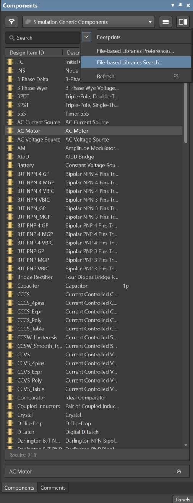
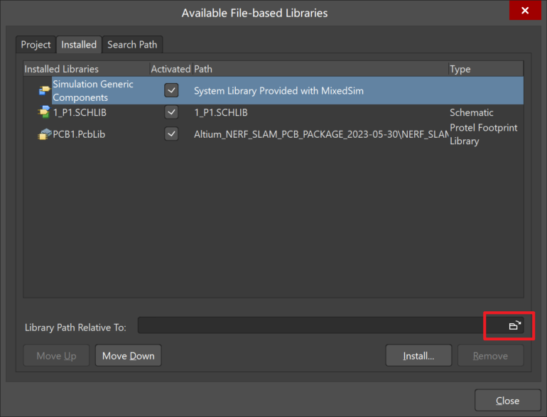
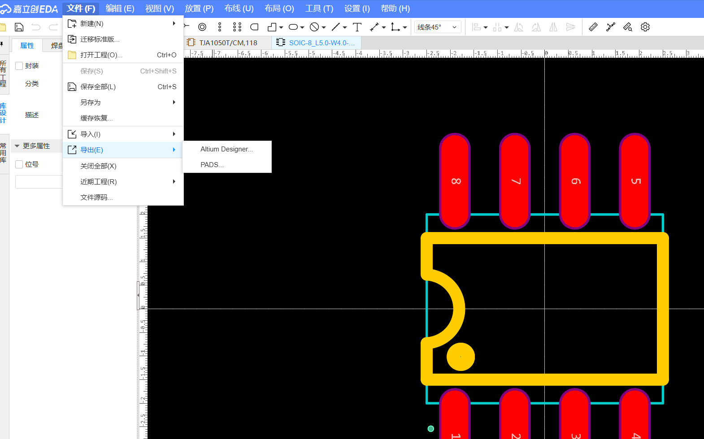
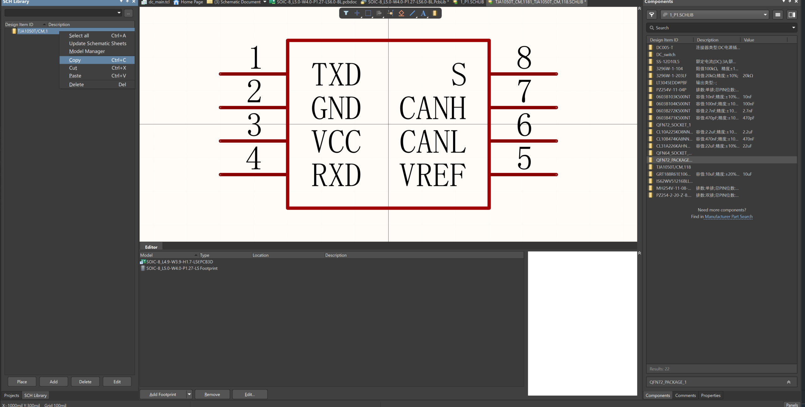
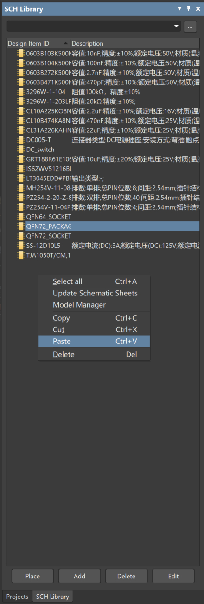
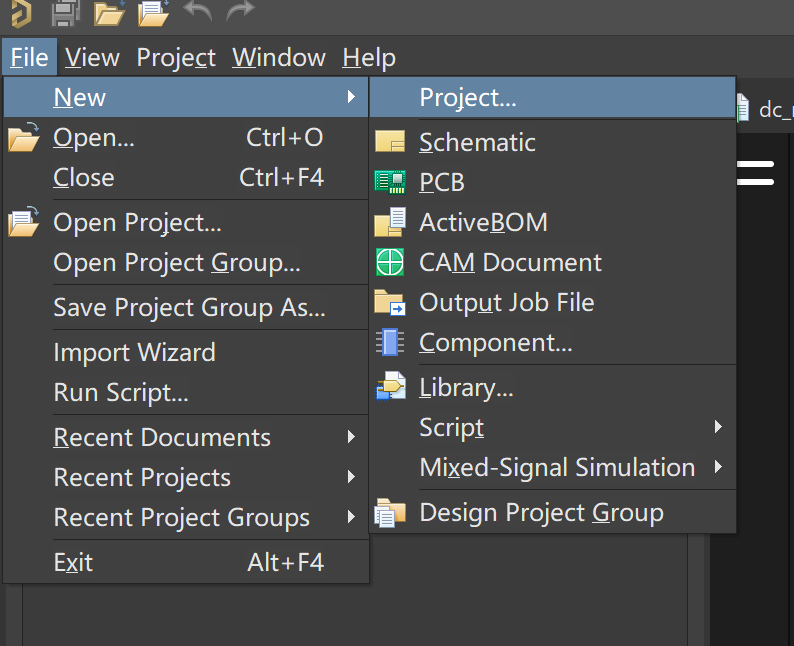
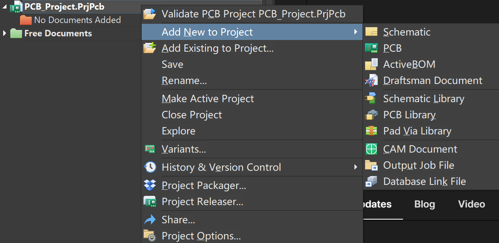
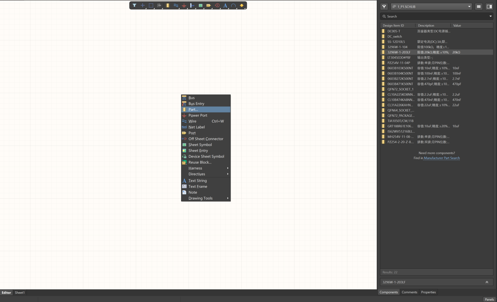
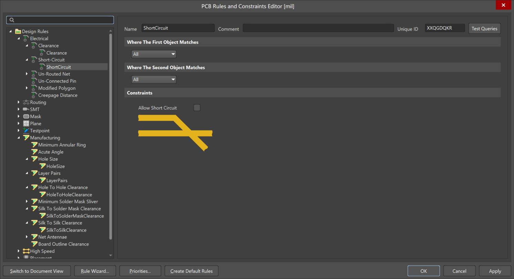
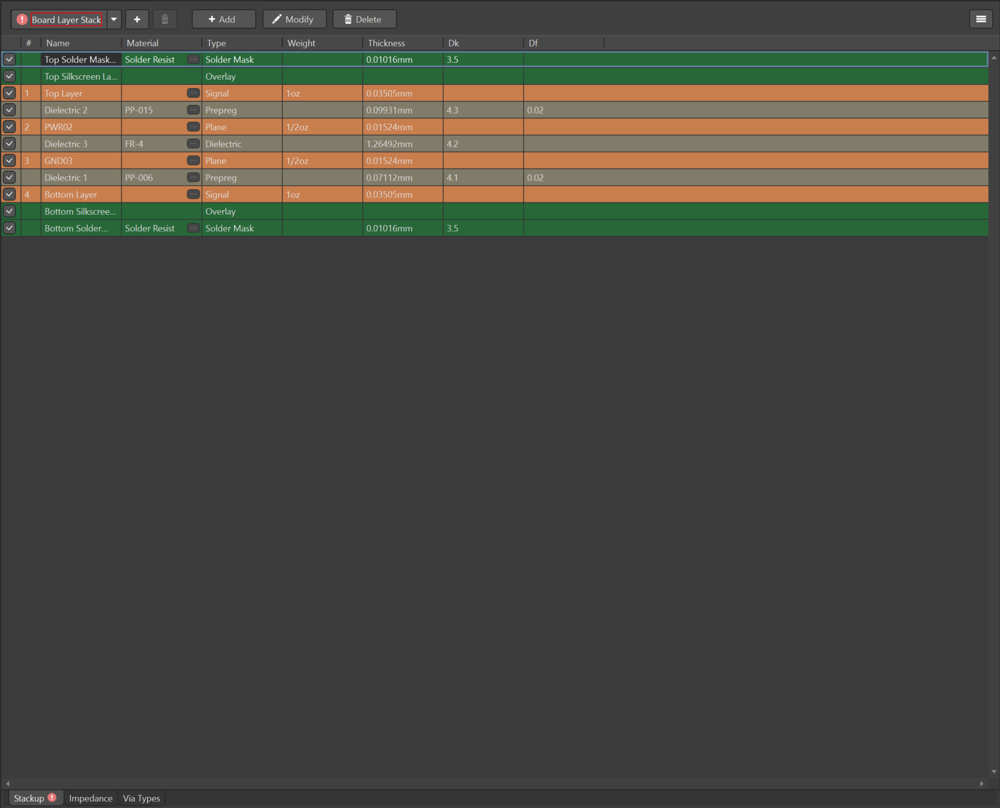

# PCB 绘制

板级电路在测试过程中为芯片提供电源、时钟、GPIO 配置接口等。

## 1. 整体流程

??? tip "TLDR"
    1.  新建 project。
    2.  新建 library，并导入 socket 以及其他常用元器件（电阻、电容、排针等）对应的原理图库（.SCHLIB）和封装库（.PCBLIB）。
    3.  新建原理图（.SCHDOC），绘制电路图。
    4.  绘制 PCB。
        -  新建 PCB（.PCBDOC），导入原理图。
        -  修改 PCB 设计规则（Designs -> Rules）。
        -  定义 PCB 尺寸（KeepOut Layer）。
        -  修改 PCB 层数（Design -> Layer Stack Manager）。
        -  摆放元器件。
        -  走线（电源 + 信号）。
        -  划分电源和地平面。
        -  整体铺铜（Tools -> Polygon Pour）。
        -  添加地信号的缝合孔（Tools -> Via Stitching/Shielding）。
        -  滴泪（Tools -> Teardrops）。
    5.  检查 DRC。
    6.  打包 PCB 文件（.PCBDOC）为压缩包，使用嘉立创下单助手下单安排生产。

**原理图设计 —— PCB 绘制 —— DRC 检查 —— PCB 下单 ——（SMT 下单）**

原理图设计：设计电路板的原理图，这个过程中需要对调用的元器件进行选型。
PCB 绘制：电路板真实的物理实现，包括电路板的大小边界、元器件位置摆放、走线链接。
DRC: 检查设计的 PCB 是否符合 Design Rule、PCB 是否与原理图一致。
PCB 下单：完成原理图 PCB 设计后，将设计好的 PCB 压缩可以通过嘉立创下单助手下单安排生产。 （空 PCB 无元器件）
SMT 下单：SMT 是 PCB 厂家根据提供的 PCB 信息将所需要的元器件通过回流焊方式焊接。（PCB+元器件）

### 1.1 元器件与 EDA 工具

#### 1.1.1 元器件分类

为测试芯片绘制的 PCB 所用到的元器件通常可以分为三类：有源器件、无源器件、连接器。

有源器件：芯片、二极管、LED 等需要供电的器件。
无源器件：R、C、开关等无需供电的器件。
连接器：排针，电源接口等传递电源和信号的接口。

!!! tip "提示"
    对于数字芯片测试来说，如果使用外部稳压源来供电的话，通常无需使用板级 LDO/BUCK 来产生电源，因此只需要用到无源器件和连接器。

#### 1.1.2 元器件封装

封装从结构上可以分为插件与贴片两种，插件是通过通孔焊接在 PCB 上，贴片则是通过 PCB 的焊盘进行焊接。插件的机械稳定性更好，贴片的寄生参数更小。

- 有源器件的封装种类繁多，不一一赘述，可以在立创商城自行选型。

- 无源器件封装
RC 通常使用贴片封装 0402、0603、0805、1206。器件的尺寸与数字大小成正相关
<figure>
  
  <figcaption>RC Package</figcaption>
</figure>

- 连接器封装
    - 2.54 - 1(2) - 2/3/4/8P 排针, 常用为 GPIO 配置引脚，低频低电流下也可以作为信号 IO 和电源输入。
        - 2.54：排针 pin 间距为 2.54mm
        - 1(2)：单排(双排)
        - 2/3/4/8P：2/3/4/8 个 pin

    - 5557 - 2P 电源接口
    - SMA，可用作高频信号传输，例如时钟

#### 1.1.3 EDA 工具

常用的 PCB 设计 EDA 工具主要是 Altimu Designer，嘉立创 EDA。Altimu Designer 在北大软件中心中没有提供，需要从其他途径下载，嘉立创 EDA 可以免费试用。下面教程主要是基于 Altimu Designer，但两者的操作是很类似的。

### 1.2 元件库添加
在进行原理图与 PCB 绘制前，我们需要添加元件库（R，C，芯片， 接口等等）。一个元器件主要包括 Schematic 与 Footprint 两部分。元器件引脚在 schematic 中的标号与 Footprint 的焊盘是一一对应的。元器件可以自行绘制或者通过嘉立创下载进行添加。

#### 1.2.1 元件库导入
元件库分为.SCHLIB, .PCBLIB, .INTLIB，其中.SCHLIB 只有元件的 schematic，.PCBLIB 只有元件的 pcb，.INTLIB 则是两者都有。

1. 在右下角的 **Panels** 中把 **Components**选中，选择 **File-based Libraries Preferences**

<figure>
  
  <figcaption>Open Lib</figcaption>
</figure>

2. 选择 Lib 所在的路径然后 install

<figure>
  
  <figcaption>Install Lib</figcaption>
</figure>

#### 1.2.2 添加元器件至元件库
如果元件库中没有想要的元件，需要自行添加，常用的方法是通过立创商城添中找到它，点击数据手册，在网页版嘉立创中打开它的封装，导出他的 Schematic 与 Footprint 为 Altimu Designer。

<figure>
  
  <figcaption>Add new component</figcaption>
</figure>

对于导出的 Schematic/Footprint，在 Altimu designer 中打开它后在 **Tools-Make Schematic/PCB Library**

打开对应的 Library，copy 对应的 component，然后在右侧的**Components**中选择对应的库，随便找一个元件右键选择**Edit**来打开这个库，再将刚刚复制的 component 粘贴进去即可。

<figure>
  
  <figcaption>Copy component</figcaption>
</figure>

<figure>
  
  <figcaption>Paste Component</figcaption>
</figure>

### 1.3 原理图绘制
**下面操作基于 Altium Designer 软件进行（嘉立创的操作也是类似的，可能快捷键有所差别）**

1. File-New-Project 创建一个 project
<figure>
  
  <figcaption>Creat project</figcaption>
</figure>

2. 在创建的 project 下添加新的 schematic 与 PCB
<figure>
  
  <figcaption>creat new schematic and PCB</figcaption>
</figure>

3. 现在可以在 schematic 绘制电路图，P 键可以弹出绘制的选择面板，**Place Part**会在右侧现实 component 的 SCHLIB，将想要的器件拖到 schematic 中，然后进行连接。

4. 连接可以通过**Wire**或者**Net Label**进行，**Power Port**用来识别电源端口作用与 Label 相同
*选中器件后空格键可以对器件进行旋转*

<figure>
  
  <figcaption>Place Part</figcaption>
</figure>

5. 对于元器件，右键可以查看其 Properties，修改 Comment（PCB 的丝印）以及 Footprint

### 1.4 PCB 绘制

1. 在进行 PCB 设计前我们需要先修改一下 Design rule 来满足我们的需求，通过**Design-Rules**打开面板，主要是修改间距与连接方式，因为默认设置很保守且适用面也较窄。（后续设计过程中也可以进一步继续调整满足需求）
    - 修改**Electrical-Clearance**，调整 clearance，PCB 中的间距不太重要，可以尽可能往小设，不会出错。
    - 修改**Electrical-Short Circuits**，勾掉 Allow Short Circuit。
    - 修改**Routing-Width/Routing Via Style**，调整 minimum（6）与 maximum（100）范围。
    - 修改**Plane-Power Plane Connect Style/Polygon Connect Style**，修改 connect style 为 Direct Connect。
    - 修改**Manufacturing-Hole Size/Silk To Solder Mask Clearance/Silk To Silk Clearance**，修改 clearance，其中 silk 的 clearance 无所谓，即使重合也没事。

<figure>
  
  <figcaption>PCB Rules</figcaption>
</figure>

2. 设置 PCB 层数：PCB 我们可能用到 2 层板或者 4 层板，2 层板组合为 signal-signal，4 层板组合常用 signal-power-ground-signal。其中 signal layer 是正铜层所绘制的为真正的线路，plane layer 是负铜层所绘制的是没有线路的地方。
在**Design-Layer Stack Manager**中可以添加层。推荐使用 4 层板。

<figure>
  
  <figcaption>PCB Layer</figcaption>
</figure>

3. 定义 PCB 形状：选中 KeepOut Layer 或者 Mechanical Layer，用 wire 画出想要的形状后，选中所有，**Design-Board Shape-Define Board Shape from Selected Objects**

!!! tip "提示"
    COB 对 PCB 尺寸有要求，10 cm x 15 cm

4. 导入 Schematic 的器件至 PCB **Design-Import Changes from xxx**，同时也可以反向将 PCB 中的修改同步至 Schematic **Design-Update Schematics in xxx**。

5. 现在可以进行 PCB 绘制了，主要就是器件摆放，连线，以及给电源平面铺铜。下面是一些常用的快捷键：
    - 1 2 3 切换视图
    - q 切换公制/英制
    - ctrl + F 翻面
    - ctrl + M 尺子
    - shift + s 切换多层还是单层显示, ctrl + shift + 鼠标滑轮切换层/键盘"-", "+"
    - ctrl + w 走线
    - shift + w 切换线宽
    - P + R 铺铜
    - shift + 空格 切换走线模式（45°/45°圆角/90°）

6. 铺铜设置，调整为**Pour Over All Same Net Objects**并且勾选去除死铜。然后对铺铜进行平滑倒角，按住角 拖动（shift + 空格调整形状）。
完成设计后最后在 Top 与 Bottom layer 空余地方上都铺上 GND，即拉一个很大的铺铜罩住整个板子。
（**右键-Polygon Actions-Polygon Manager**可以设置不同网络铺铜的优先级）

<figure>
  
  <figcaption>Polygon Smooth</figcaption>
</figure>

7. 缝合孔：在 TOP/BOTTOM 的 signal layer 以及 Power/Ground plane layer 中都会存在 power/gnd 的铺铜，同一网络在不同 layer 的铺铜层需要用缝合孔进行连接。
**Tools-Via Stitching/Shielding-Add Stitching to Net...**

8. 滴泪：在 TOP/BOTTOM 的 signal layer 以及 Power/Ground plane layer 中都会存在 power/gnd 的铺铜，同一网络在不同 layer 的铺铜层需要用缝合孔进行连接。
**Tools-Via Stitching/Shielding-Add Stitching to Net...**
